# 用于机器学习的线性代数:求解线性方程组

> 原文：<https://towardsdatascience.com/linear-algebra-for-machine-learning-solve-a-system-of-linear-equations-3ec7e882e10f?source=collection_archive---------13----------------------->

## 代数是机器学习算法的底线机制

# 什么是线性代数，为什么要关心？

先说数据科学中常见的图:散点图

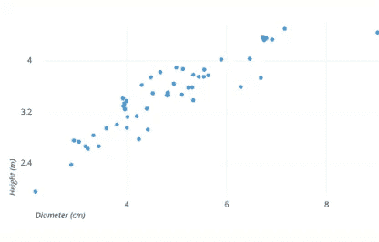

从[图表](https://chartio.com/learn/charts/what-is-a-scatter-plot/)获得

上面的图显示了树的直径和高度之间的关系。每个点都是一棵树的样本。我们的任务是找到最佳拟合线来预测提供直径的高度。

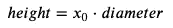

我们如何做到这一点？这时候就需要线性代数了。

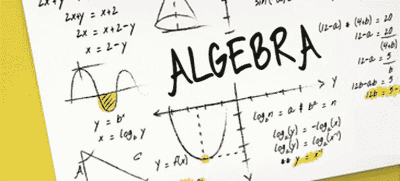

来自[教育学院](https://edutin.com/curso-de-algebra-4165)

线性回归是**线性方程组**的一个例子。线性代数是关于线性方程组的工作。我们开始使用**矩阵和**向量，而不是标量。

线性代数是理解你在机器学习中需要的微积分和统计学的关键。如果你能在向量和矩阵的层面上理解机器学习方法，你将提高对它们如何以及何时工作的直觉。更好的线性代数将全面提升你的游戏。

而理解线性代数的最好方法是什么？执行它。解线性方程组有两种方法:直接法和迭代法。在本文中，我们将使用直接方法，特别是高斯方法。

# 如何解一个线性方程组？

因为大多数情况下，我们会处理具有许多特征(或变量)的数据。我们将通过处理三维数据来使我们的线性方程组更通用。

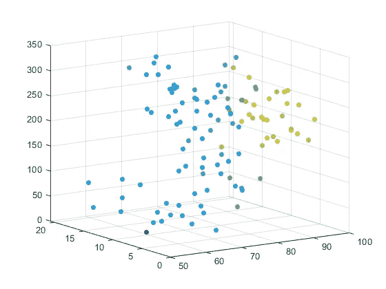

让我们为上面的图生成一个示例:

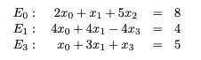

其中，系数 x_0、x_1 和 x_2 以及相应的值 8、4、5 是图中点的样本。这些方程可以分解成矩阵 A、x 和 b

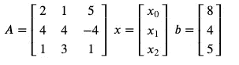

其中 A 和 b 是已知常数的矩阵，x 是未知变量的向量。

```
A = np.array([[2, 1, 5],
            [4, 4, -4],
            [1, 3, 1]])
b= np.array([8,4,5])
```

连接矩阵 A 和 b 得到

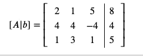

```
n = A.shape[0]

C=np.c_[A,b.reshape(-1,1)]
```

现在，我们准备用两个步骤来解决我们的问题:

1.  应用高斯消去法将上述矩阵化为三角矩阵

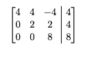

这可以用下面的等式来表示:

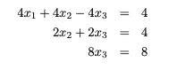

2.应用向后替换来获得结果

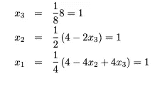

让我们从第一步开始

# 部分旋转高斯消去法

要获得该矩阵:

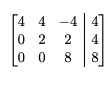

这个想法很简单:

*   我们从第一行第一列的透视值开始:行=0，列= 0
*   求主元列的最大绝对值。如果该列中的所有值都是 0，我们就停止。
*   否则，我们交换 E0 和 E1

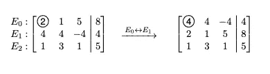

接下来，应用等效转换，通过以下方式将透视下的所有条目转换为 0:

1.  求元素 j，I 和 pivot i，I 的比值(即 2/4 = 1/2)。
2.  将 E0 中的所有元素乘以 1/2。将第 1 行中的所有元素减去 1/2 E0(即 2-(4 * 1/2)= 2–2 = 0)

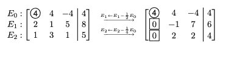

```
#row
for j in range(i+1, n):

    c = C[j,i]/C[i,i]
    C[j,:] = C[j,:] - c*C[i,:]
```

每列简化后，我们继续右边的下一列。

重复该过程:

透视:行= 1，列= 1。最大绝对值:第 2 行中的 2。然后，置换 E1 和 E2

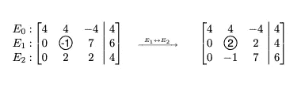

应用等效变换将透视下的所有条目转换为 0

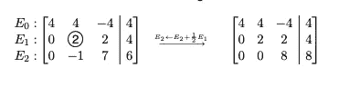

把所有东西放在一起

不错！现在我们有了一个方程组:

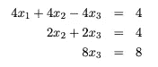

一旦我们到了这里，这个方程组就很容易用回代法求解了

# 反向置换

从高斯消去法，我们得到一个三角矩阵

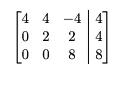

这个想法是通过自底向上求解来求解上面的方程组。使用从上一个等式获得的值来查找其他值

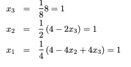

从第三排开始。除以 8 得到 x_3 的值。

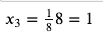

```
X[n-1] = T[n-1,n]/T[n-1,n-1]
```

现在在第二行，我们有:

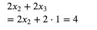

x_2 可以很容易地通过下式求解

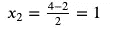

用 x1 重复

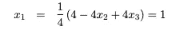

因此，一般来说，反替换可以表示为:

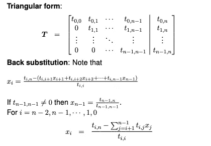

# 获得结果

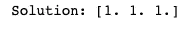

厉害！正如我们预测的那样，我们得到了一个解。为了确保在处理更大的矩阵时这是正确的，我们可以使用 NumPy 中的内置函数

```
>>> np.linalg.solve(A,b)array([1., 1., 1.])
```

我们得到的是解的向量，其中每个元素对应于 x_0，x_1，x_2

# 结论

祝贺你走到这一步！希望这篇文章能帮助你理解什么是线性代数，以及解线性方程组的机制之一。我尽量让这篇文章容易理解。但是我知道，如果你不熟悉线性代数，这可能是一个挑战。没关系。一步一步来。你接触线性代数越多，你就越能理解它。

你可以在我的 [Github](https://github.com/khuyentran1401/Linear-Algebra) 中玩和试验上面的代码。

我喜欢写一些基本的数据科学概念，并尝试不同的算法和数据科学工具。你可以通过 [LinkedIn](https://www.linkedin.com/in/khuyen-tran-1401/) 和 [Twitter](https://twitter.com/KhuyenTran16) 与我联系。

如果你想查看我写的所有文章的代码，请点击这里。在 Medium 上关注我，了解我的最新数据科学文章，例如:

[](/how-to-build-a-matrix-module-from-scratch-a4f35ec28b56) [## 如何从头开始构建矩阵模块

### 如果您一直在为矩阵运算导入 Numpy，但不知道该模块是如何构建的，本文将展示…

towardsdatascience.com](/how-to-build-a-matrix-module-from-scratch-a4f35ec28b56) [](/timing-the-performance-to-choose-the-right-python-object-for-your-data-science-project-670db6f11b8e) [## 高效 Python 代码的计时

### 如何比较列表、集合和其他方法的性能

towardsdatascience.com](/timing-the-performance-to-choose-the-right-python-object-for-your-data-science-project-670db6f11b8e) [](/how-to-learn-data-science-when-life-does-not-give-you-a-break-a26a6ea328fd) [## 当生活不给你喘息的机会，如何学习数据科学

### 我努力为数据科学贡献时间。但是发现新的策略使我能够提高我的学习速度和…

towardsdatascience.com](/how-to-learn-data-science-when-life-does-not-give-you-a-break-a26a6ea328fd) [](/dictionary-as-an-alternative-to-if-else-76fe57a1e4af) [## 字典作为 If-Else 的替代

### 使用字典创建一个更清晰的 If-Else 函数代码

towardsdatascience.com](/dictionary-as-an-alternative-to-if-else-76fe57a1e4af) [](/dictionary-as-an-alternative-to-if-else-76fe57a1e4af) [## 字典作为 If-Else 的替代

### 使用字典创建一个更清晰的 If-Else 函数代码

towardsdatascience.com](/dictionary-as-an-alternative-to-if-else-76fe57a1e4af)