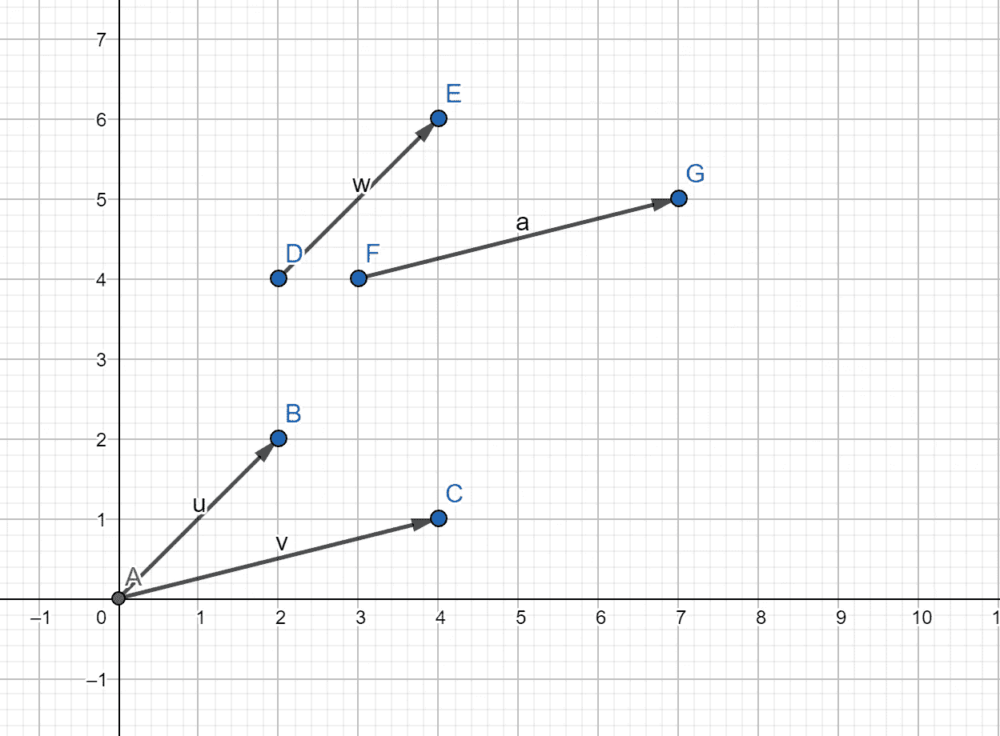
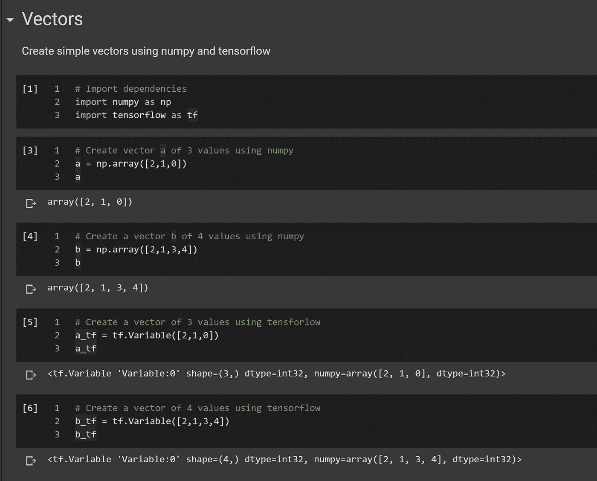
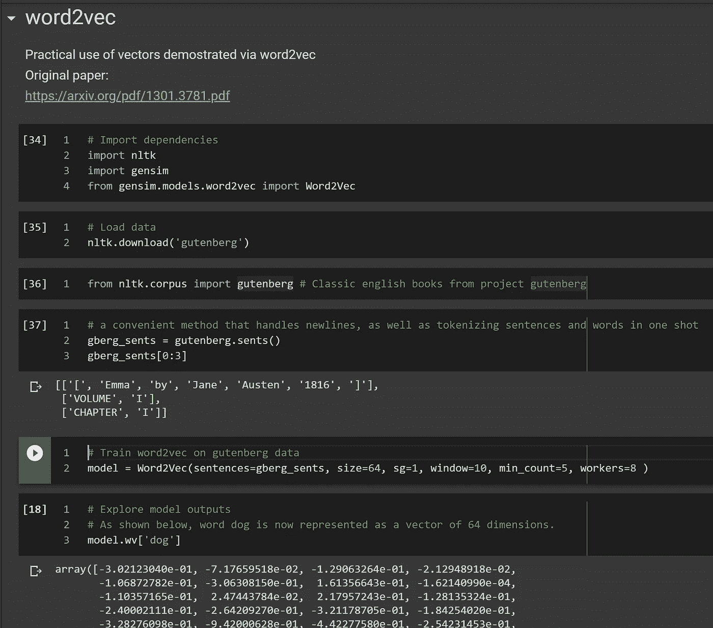
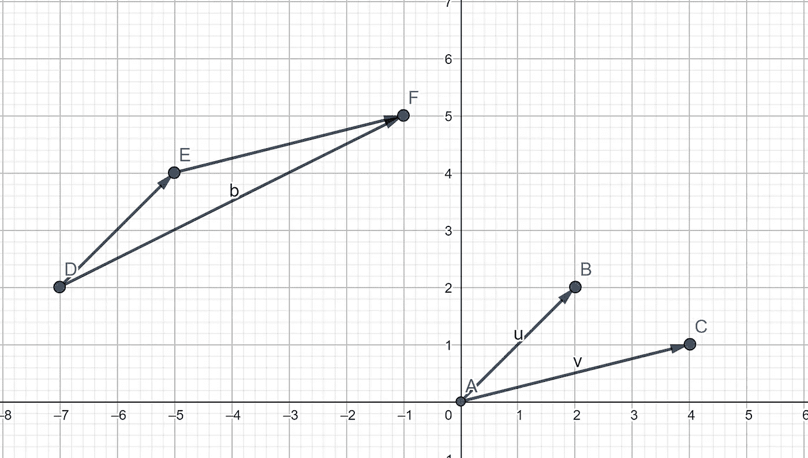
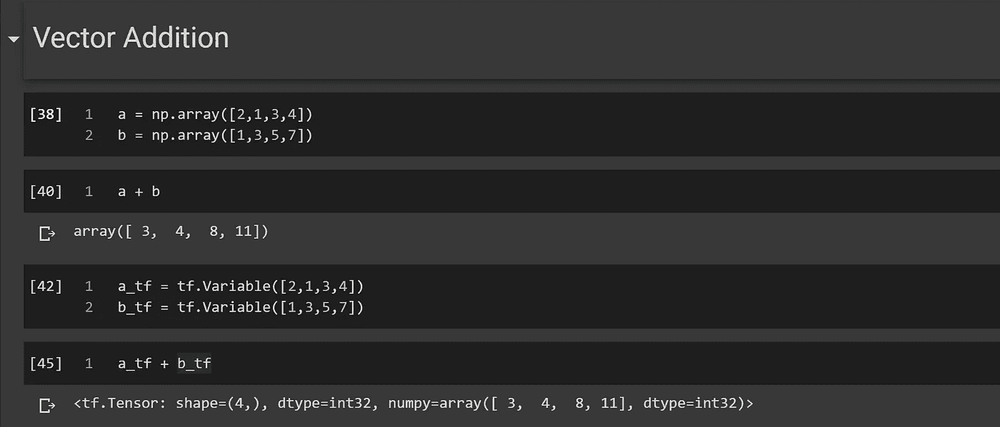
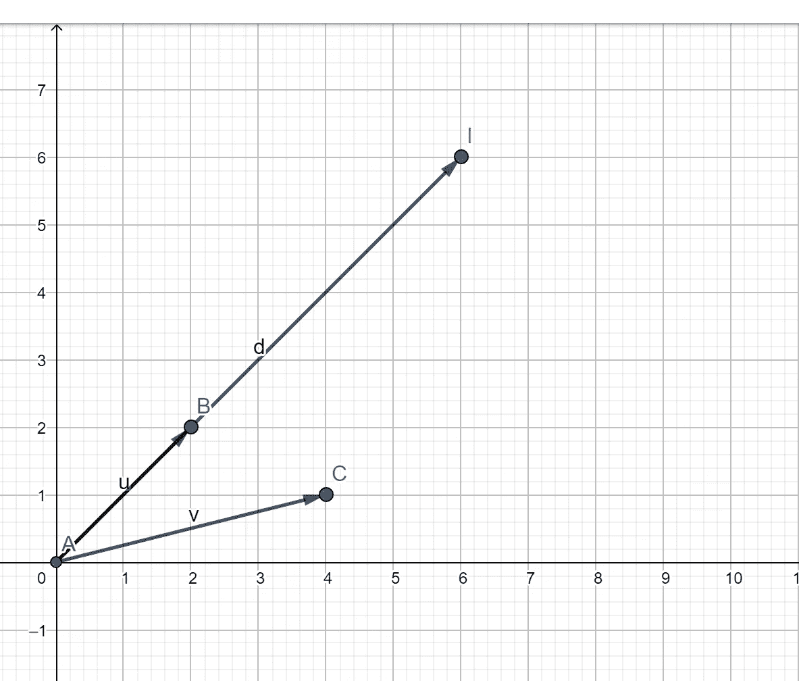
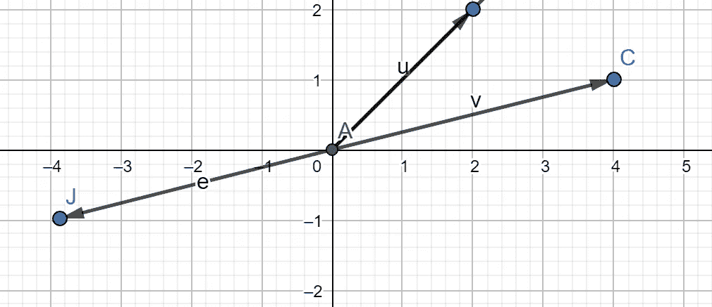
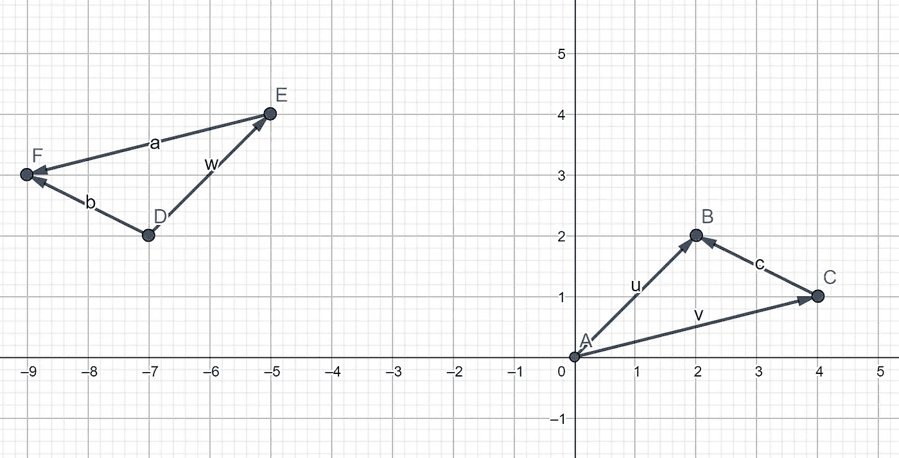
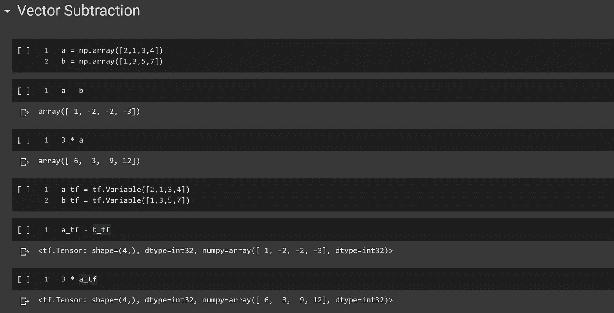

# 数据科学的线性代数向量

> 原文：<https://towardsdatascience.com/linear-algebra-i-vectors-for-data-science-part-i-7fe1cc5e5935?source=collection_archive---------60----------------------->

## 线性代数 I —数据科学中的向量介绍第一部分

[ev](https://unsplash.com/@ev?utm_source=unsplash&utm_medium=referral&utm_content=creditCopyText) 在 [Unsplash](https://unsplash.com/s/photos/data-science?utm_source=unsplash&utm_medium=referral&utm_content=creditCopyText) 上的照片

随着 AI/ML 的民主化和像 Keras、scikit-learn 等开源库的出现，任何具有基本 python 知识的人都可以在不到 5 分钟的时间内建立一个工作的 ML 分类器。虽然这对于开始来说已经足够了，但如果你想了解不同的最大似然算法是如何工作的，或者将最新的 SOTA(最先进的)论文应用到你的特定领域，缺乏数学专业知识很快就会成为一个瓶颈，正如我亲身经历的那样。

在这组文章中，我将尝试为非数学读者一次介绍一个基本的数学概念，并展示它在人工智能领域的实际应用。

我们从最简单的向量开始。

矢量只是有方向的量。向量一些相关的真实世界的例子是力、速度、位移等。

要移动购物车，你需要向你想要移动购物车的方向推(施加力)。你在推车时所用的力可以用两个值来充分描述，推的强度(幅度)和你推车的方向。任何需要大小和方向来完整描述的量叫做矢量。

向量通常用粗体小写字符表示，如 **v，w** 等。由于用纸笔书写粗体字比较困难，所以在用纸笔书写时，小写字的上方也会出现一个箭头。对于本文，我们将坚持使用粗体表示。

在图形上，矢量用箭头表示，箭头的长度表示矢量的大小(强度),箭头的角度(相对于参照系；在这种情况下是水平的)表示向量的方向，如下所示。

作者图片

请注意，并不要求向量应该从原点(0，0)开始。他们可以从任何一点开始。例如上图中的 **u** = **w** 和 **v** = **a** ，因为它们大小相同，方向相同。

用数学方法表示矢量有很多种方法。作为数据科学家，我们感兴趣的是将它们表示为一组数字。因此，向量 **u** 可以表示为(2，2 ),而向量 **v** 可以表示为(4，1)。矢量 **w** 和 **a** 也是如此。

虽然我们很容易在二维和三维空间中看到向量，但是向量的概念并不局限于二维和三维空间。它可以推广到任何数量的维度，这就是向量在机器学习中如此有用的原因。

例如， **c** = (2，1，0)表示三维空间中的向量，而 **d** = (2，1，3，4)表示四维空间中的向量。作为人类，虽然我们无法想象高于 3 的维度，但表示向量的数学方式让我们有能力在更高维度的向量空间上执行操作。

到现在为止，你一定很无聊，想知道为什么作为一个 ML 爱好者，你需要学习基础物理和向量。事实证明，向量在机器学习中有多种应用，从构建推荐引擎到自然语言处理的单词的数字表示等，并形成了 NLP 的所有深度学习模型的基础。

让我们从 numpy 和 tensorlfow 中如何实现 vectors 的代码示例开始。

请注意:完整的代码可作为最后一节的要点。为便于说明，插入了相关小节的图片。

作者图片

下面你可以看到一个简单的 word2vec 实现来展示向量在自然语言处理中的实际应用

作者图片

如你所见，以高维向量格式存储单词是向量在自然语言处理中的主要应用之一。这种类型的嵌入保留了单词的上下文。

在下一节中，我们将学习基本的运算，如加法和减法，以及它如何应用于向量。

# 向量加法

现在我们已经定义了什么是向量，让我们看看如何对它们进行基本的算术运算。

让我们用同样的两个向量 u 和 v，对它们进行向量加法。

作者图片

为了以图形方式添加两个向量 **u** 和 **v** ，我们移动向量 **v** ，使其尾部从向量 **u** 的头部开始，如上所示(DE 和 EF 行)。两个矢量之和就是始于 **u** 尾部，止于 **v** 头部的矢量 **b** (直线 DF)。

为了更好的直觉，让我们举一个开车去杂货店的真实例子。在路上，你在加油站停下来加油。让我们假设向量 **u** 代表加油站(点 E)离你家(点 D)有多远。如果矢量 **u** 代表从加油站到杂货店的距离(位移)，那么从 **u** 的尾部画到 **v** 的头部的矢量 **b** 代表总和 **u + v.** It 代表杂货店(F 点)离你家(初始起点 D)有多远。

数学上 **b** 可以通过看图表示为(6，3)。

还有其他计算矢量加法的图形方法，如平行四边形法，你可以自己探索。

现在不可能每次我们想做向量算术的时候都画一个图，特别是当涉及到高维向量的时候。幸运的是，向量的数学表示为我们做向量加法提供了一种简单的方法。

由于每个向量都是一组数字，让我们看看如果我们将每个向量的相应数字相加，会得到什么。

在上面的例子中，
**=(2，2)
**v** = (4，1)
**b** = (2+4，2+1) = (6，3)，这与图解得到的解相同。**

**因此，矢量相加可以通过简单地将每个矢量的相应元素相加来完成，正如你可能已经推断出的那样，只有具有相同维数的矢量才能相加在一起。让我们看一个代码实现**

****

**作者图片**

# **向量减法**

**在我们继续学习向量减法之前，让我们快速看一下向量的另一个有用的性质——标量乘法。**

**标量只不过是一个只有大小没有方向的量。例如，任何整数都是标量。标量的一个真实世界的例子是质量(体重)，一个人的身高等。**

**让我们看看当我们把一个矢量乘以一个标量时会发生什么。**

****u** = (2，2)
v=(4，1)**

**如果我们想用标量 C = 3 乘以 u，一种直观的方法是将向量 **u** (2，2)中的单个数字乘以 3。让我们看看那看起来怎么样**

****d**= C x**u =**3 x**u**=(3 x 2，3 x 2) = (6，6)**

**让我们在图上画出向量。**

****

**作者图片**

**如你所见，将向量 **u** 乘以一个正标量值会产生一个方向相同的新向量 **d** ,但是其大小按系数 C = 3 缩放**

**让我们试着用负值 C = -1 乘以一个向量**

****e**= C x**v**=-1 x**v**=(-1 x 4，-1 x 1) = (-4，-1)。**

**让我们画出图来，看看是什么样子。**

****

**作者图片**

**如您所见，将向量 **v** 乘以-1 会产生一个大小相同但方向相反的向量，可表示为**

****e = -v** 或 **e + v = 0** (空矢量)**

**向量减法在图形上可以被认为是向量加法的特殊情况，其中 **u -v = u + -v****

**图解求解**

****

**作者图片**

****w = u
a =-v
b = w+a = u+-v = u-v =**(-2，1)**

**从图中可以看出， **b = c** 或矢量减法 **u -v** 等于从 **v** 的头部到 **u** 的头部(头部之间的距离)所画出的矢量 **c****

**直观上，这是有道理的，也是符合传统数制的。**

**7 -5 = 2(其中 2 是加 5 等于 7 的数量)
5 + 2 = 7**

**类似地，如果你看这个图， **c** 是一个矢量，当它加到 **v** 上时，得到矢量 **v**
**u = v + c****

**现在让我们用数学方法来做，在两个向量中减去各个分量。
**c**=**u-v**=(2，2) -(4，1) = (2 -4，2–1)=(-2，1)**

**其结果与图解法相同。下面给出一个代码示例供参考。**

****

**作者图片**

**在下一节中，让我们看一个代码示例，看看如何在单词向量中使用向量算法来查找单词之间的关系。**

**由于这是我的第一篇关于媒体的文章，我期待着反馈和建议。请在评论区告诉我如何更好地展示这些内容，如果你觉得有用的话。**

**完整的笔记本可以在我的 GitHub 库下找到**

** [## Kishore 145/数学

github.com](https://github.com/kishore145/Mathematics)** 

## **参考**

**[1] JonKrohn，[L](/post-for-writers-2-ebd32d1fac21)ML 基础课程-线性代数(2020)，O'Riley**