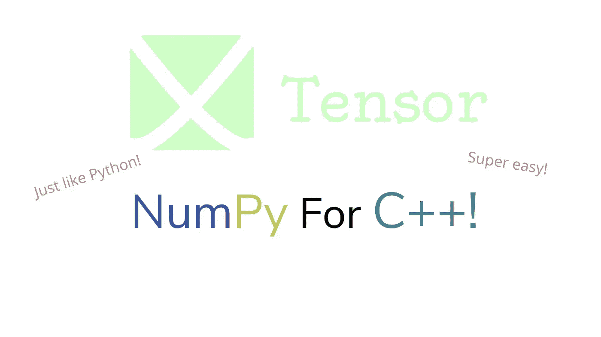
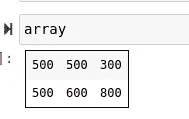
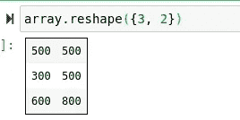
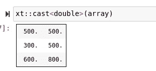
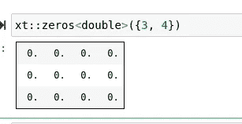
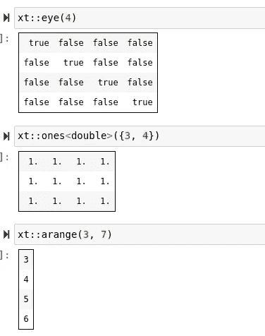
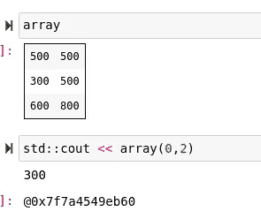
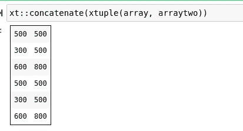
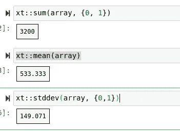

# 带有 XTensor 的 C++中的线性代数就像 Numpy

> 原文：<https://towardsdatascience.com/linear-algebra-in-c-with-xtensor-is-just-like-numpy-1a6b1ee00736?source=collection_archive---------18----------------------->

## 使用张量库快速浏览 C++中的代数运算



(图片由作者提供)

# 介绍

> [笔记本](https://github.com/emmettgb/Emmetts-DS-NoteBooks/blob/master/C++/Introduction%20To%20Tensor.ipynb)

对科学计算和数据科学非常重要的一个概念是在给定的编程语言中操作、创建和利用矩阵作为类型的能力。对于 Python，数据科学家使用 Numpy 库，它提供了一种奇妙且易于理解的方法来在 Python 内部创建和操作矩阵。对于 Julia 来说，矩阵和向量的概念从语言一开始就包含在内。对于 C++，有一个很棒的新兴库叫做 XTensor。

XTensor 是一个 C++库，它允许程序员使用与 Numpy 语法相似的矩阵和数组。与 Numpy 的相似之处是 XTensor 的真正优势，因为两者之间的转换可以相对容易地完成。为了使用 XTensor，您当然需要安装它。幸运的是，对于数据科学家来说，这可以在您的环境中通过 Conda 包管理器轻松完成

```
conda install -c conda-forge xtensor
```

或者，如果您使用的是 Debian 或基于 Debian 的 Linux 发行版，可以通过 Apt 软件包管理器获得 XTensor:

```
sudo apt-get install xtensor-dev
```

最后但同样重要的是，如果您在 FreeBSD 或另一个类似 Unix 的操作系统上，并且有适当的基本构建头文件，您总是可以从源代码构建:

```
cmake -DCMAKE_INSTALL_PREFIX=path_to_prefix ..
make install
```

或者，对于 Windows 用户:

```
mkdir build
cd build
cmake -G "NMake Makefiles" -DCMAKE_INSTALL_PREFIX=path_to_prefix ..
nmake
nmake install
```

# 基本矩阵

如果您是 Python 和 Numpy 用户，那么您很幸运使用了 XTensor。这里有一个绝对无价的 XTensor 数字备忘单的链接，你可以用它来应用你的数字熟悉度:

 [## 从 numpy 到 xtensor - xtensor 文档

### 惰性辅助函数返回张量表达式。返回类型不包含任何值，而是在访问或…

xtensor.readthedocs.io](https://xtensor.readthedocs.io/en/latest/numpy.html) 

对于基于 Python 的数据科学家和最终用户来说，这将使从 Numpy 到 XTensor 的过渡变得极其简单和流畅。安装 XTensor 后，您可以编译并执行以下代码，以确保头文件现在就在您的机器上:

```
#include <iostream>
// Base Arrays:
#include "xtensor/xarray.hpp"
// XTensor IO:
#include "xtensor/xio.hpp"
// XTensor View:
#include "xtensor/xview.hpp"
int main()
{
return 0;
}
```

如果编译和运行该代码时什么都没有发生，那么

> 恭喜你！

您的安装成功，XTensor 现在在您的机器上可用。如果输出是一个错误，您很可能需要尝试不同的安装方法，或者从源代码构建。当然，需要确保的另一件重要事情是，您处于安装了 XTensor 的 Conda 环境中。

接下来，我们当然会通过添加我们在那个小测试中添加的内容来开始我们的新代码。

```
#include <iostream>
// Base Arrays:
#include "xtensor/xarray.hpp"
// XTensor IO:
#include "xtensor/xio.hpp"
// XTensor View:
#include "xtensor/xview.hpp"
```

包含这些头文件将给我们一个新的名称空间 xt。首先，为了创建一个矩阵，我们将使用 xt 名称空间中的 xarray 对象模板。对于这个例子，我们将有一个充满整数的矩阵，所以每当我们创建新对象时，我们将提供“int”参数。我把它命名为 array，我们会把一些整数放进去。

```
xt::xarray<int>array
({{500, 500, 300}, {500, 600, 800}})
```

有两种不同类型的 x 传感器矩阵:

*   xarray 设置了**动态**维的矩阵。
*   x tensor——具有**静态**维度集的矩阵。

接下来，如果我们在笔记本中，那么我们可以简单地输入“array”来显示我们的新矩阵。



(图片由作者提供)

或者，如果您正在编译和执行代码，那么您将需要使用 cout 并将这些代码放入 main()函数中。在本例中，我不打算这样做，因为我是在笔记本中工作，但下面是您应该如何构建此代码，例如:

```
#include <iostream>
// Base Arrays:
#include "xtensor/xarray.hpp"
// XTensor IO:
#include "xtensor/xio.hpp"
// XTensor View:
#include "xtensor/xview.hpp"
int main()
{
    xt::xarray<int>array
({{500, 500, 300}, {500, 600, 800}});
    std::cout << array;
}
```

在某些情况下，你也可以这样做:

```
std::cout << array;
```

这就是包含 iostream off the bat 将派上用场的地方，即使您正在笔记本上工作。

我们可以使用 shape()函数重塑新数组，它是 array 对象的子对象。

```
array.reshape({3, 2})
```



(图片由作者提供)

我们也可以将一个新类型投射到数组的所有 dim 中。这是很有用的，例如，如果我们想要计算小数部分，但最初创建了一个充满整数的矩阵。我们可以使用 cast 函数来实现这一点，该函数在 xt 名称空间中。

```
xt::cast<double>(array)
```



(图片由作者提供)

我们还可以使用所有典型的 Numpy 初始化器/生成器来创建新矩阵。机器学习中常用的一个非常有用的版本是 np.zeroes()。在 xtensor 中，相当于 XT 名称空间中的零，这当然是一个从我们的常规 xarray 继承的对象。注意，它是从 xarray 而不是 xtensor 继承的，所以我们新发现的矩阵**的维度将是可变的**。

```
xt::zeros<double>({3, 4})
```



(图片由作者提供)

这也适用于 Numpy 中的其他生成器，比如 eye、ones 和其他许多生成器。



(图片由作者提供)

当然，我们也可以像使用 Numpy 一样索引数组。一个微小的区别是圆括号用于调用索引，而不是方括号。



(图片由作者提供)

# 操作

虽然能够访问生成器和创建矩阵是件好事，但是 XTensor 当然不仅仅是等同于 Numpy。我们基本上可以完成 Numpy 中任何可用的操作，比如将两个矩阵连接在一起:

```
// Our second array
xt::xarray<int>arraytwo
({{500, 500, 300}, {500, 600, 800}})// Reshape it to fit first array's dimensions
arraytwo.reshape({3, 2})// Concatenate it to the first array
xt::concatenate(xtuple(array, arraytwo))
```



(图片由作者提供)

我们也可以挤压，例如:

```
xt::squeeze(array)
```

我们还可以访问您可能需要对矩阵执行的标准运算，例如求和:

```
xt::sum(array, {0, 1})
//      ^^ Array  ^^^ Axis
```

平均:

```
xt::mean(array)
```

和标准:

```
xt::stddev(array, {0,1})
```



(图片由作者提供)

此外，我们可以访问线性代数运算，例如点。要访问这些，您需要访问 linalg 名称空间，它存储在 xt 名称空间中，如下所示:

```
xt::linalg::dot(array, arraytwo)
```

为了获得这个名称空间，您可能还需要使用 XTensor-blas。

[](https://github.com/xtensor-stack/xtensor-blas) [## xtensor-stack/xtensor-blas

### xtensor-blas 是 xtensor 库的扩展，通过 cxxblas 和…提供 blas 和 LAPACK 库的绑定。

github.com](https://github.com/xtensor-stack/xtensor-blas) 

# 结论

XTensor 是一个非常棒的工具，它将 Numpy 的易用性和标准化带到了 C++的前沿，用于科学计算和处理矩阵。一般来说，C++是一种很好的语言，因为它的可靠性——在这一点上已经有几十年的历史了，并且在它的生命周期中得到了很好的使用。

此外，我认为 XTensor 为有兴趣在数据科学和统计应用程序中使用 C++的数据科学家创造了一个很好的出口。如果没有别的，XTensor 就是一个非常酷的库，它有可能在 Python 用户和 C++用户之间架起一座桥梁。