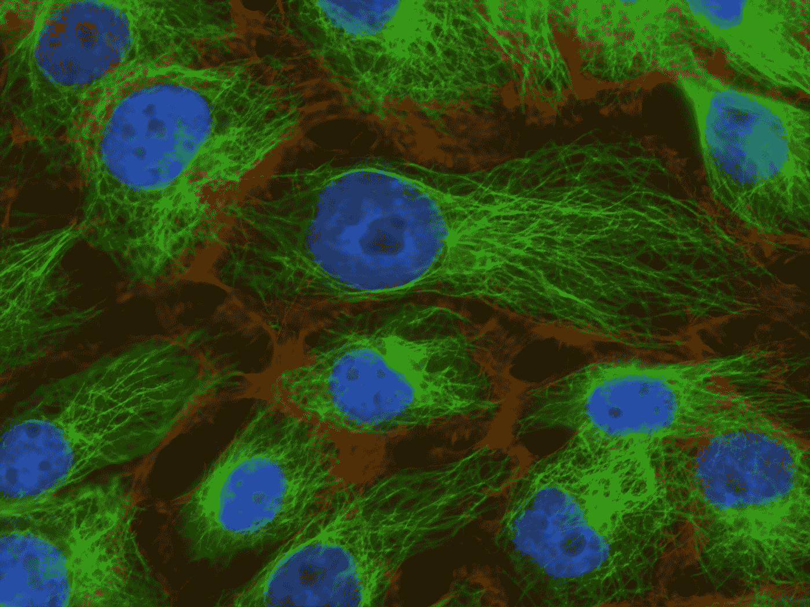

# Pytorch 中的线性分类

> 原文：<https://towardsdatascience.com/linear-classification-in-pytorch-9d8a8f8ff264?source=collection_archive---------34----------------------->

## 利用二元分类法检测乳腺癌



[国家癌症研究所](https://unsplash.com/@nci?utm_source=medium&utm_medium=referral)在 [Unsplash](https://unsplash.com?utm_source=medium&utm_medium=referral) 上拍摄的照片

这篇中型文章将探索 **Pytorch** 库以及如何实现线性分类算法。我们将在经典且易于理解的数据集上应用该算法。在本文中，您将更加熟悉 Pytorch 的基础知识。之后，你应该准备好深入更高级的问题(例如时间序列)。

文章的结构如下:

*   加载数据集
*   拆分数据
*   预处理数据
*   创建模型
*   全梯度下降
*   模型评估

## 加载数据集

将使用的数据集是乳腺癌威斯康辛数据集，它非常适合演示二元分类。

问题很简单。科学家们收集了患有(恶性)或没有(良性)乳腺癌的患者的特征。我们的工作是辨别是非。这可以帮助医生在日常工作中处理数据。乳腺癌作为一个例子的原因是因为它的相关性。2018 年，据估计全球有 627，000 名女性死于乳腺癌[ [世卫组织](https://www.who.int/cancer/prevention/diagnosis-screening/breast-cancer/en/)，2020]。

```
from sklearn.datasets import load_breast_cancerdata = load_breast_cancer()
X, Y = data.data, data.target
```

在该数据集中，有 30 个特征(例如，平均半径、平均纹理)。

```
print(data.feature_names)['mean radius' 'mean texture' 'mean perimeter' 'mean area'  'mean smoothness' 'mean compactness' 'mean concavity'  'mean concave points' 'mean symmetry' 'mean fractal dimension'  'radius error' 'texture error' 'perimeter error' 'area error'  'smoothness error' 'compactness error' 'concavity error'  'concave points error' 'symmetry error' 'fractal dimension error'  'worst radius' 'worst texture' 'worst perimeter' 'worst area'  'worst smoothness' 'worst compactness' 'worst concavity'  'worst concave points' 'worst symmetry' 'worst fractal dimension']
```

目标映射很简单。这些特征表明你患有恶性或良性肿瘤。大多数肿瘤是良性的，这意味着它们不是癌性的，不会杀死你。

```
print(data.target_names)['malignant' 'benign']
```

## 拆分数据

```
from sklearn.model_selection import train_test_splitX_train, X_test, y_train, y_test = train_test_split(X, Y, test_size=0.3)
```

首先，使用训练数据创建模型，然后使用测试数据进行测试。如果你熟悉这个领域，这应该是一个惊喜。因此，上面的代码使用 [sklearn](https://scikit-learn.org/stable/modules/generated/sklearn.model_selection.train_test_split.html) 将数据分成随机的训练和测试子集。一行代码，但是非常重要。

## 预处理数据

```
from sklearn.preprocessing import StandardScalerscaler = StandardScaler()
X_train = scaler.fit_transform(X_train)
X_test = scaler.transform(X_test)
```

为了获得更好的结果，一点缩放是很重要的。我们不希望一个特性支配另一个特性。我们能做的是确保数据被很好地分配。这里没有什么新东西，如果你不熟悉标准化功能，机器学习课程可能会有所帮助(例如 [deeplearning.ai](https://www.deeplearning.ai/) )。

你可以自己做，但为什么要重新发明轮子呢？对于这个任务，可以使用 sklearn 的 [StandardScaler](https://scikit-learn.org/stable/modules/generated/sklearn.preprocessing.StandardScaler.html) 。这是一个微妙的细节，但以与训练集相同的方式扩展测试集是很重要的。因为训练集比测试集大得多，而且两者都是随机选择的，所以它应该是对实际分布的更好估计。

## 创建模型

```
class BinaryClassification(torch.nn.Module):def __init__(self, input_dimension):
        super().__init__()
        self.linear = torch.nn.Linear(input_dimension, 1)def forward(self, input_dimension):
        return self.linear(input_dimension)_, input_dimension = X_train.shape
model = BinaryClassification(input_dimension)
```

感兴趣的模型是一个非常简单的线性模型。在示例中，它展示了如何创建自己的 Pytorch“模块”,但是您也可以使用一行程序来完成。同样的事情也可以这样做。因此，如果您更喜欢这样，请随意使用一行程序。但是，本文意在告知。在 Pytorch 中创建一个定制的神经网络就是这么容易。

```
model = torch.nn.Linear(input_dimension, 1)
```

还有一点你可能已经注意到了，我们没有使用 sigmoid 激活函数，但这是可以解释的。不使用与 sigmoid 函数结合的二进制交叉熵损失函数，这里更倾向于使用具有 logits 损失的函数的[二进制交叉熵。后者在数值上更稳定，从而导致更好的结果。](https://pytorch.org/cppdocs/api/structtorch_1_1nn_1_1_b_c_e_with_logits_loss_impl.html#structtorch_1_1nn_1_1_b_c_e_with_logits_loss_impl)

```
def configure_loss_function():
    return torch.nn.BCEWithLogitsLoss()def configure_optimizer(model):
    return torch.optim.Adam(model.parameters())
```

最后，使用了 Adam 优化器。可能有更好的优化算法，但它的表现相当好。还不需要用别人做实验。

## 模型评估

二元分类示例

剩下的代码只是一个完整的梯度下降循环以及训练和测试精度的计算。在每个时期都会发生以下步骤:

*   向前通过二进制分类模型。
*   损失函数测量 BCEWithLogits 损失。
*   损耗的梯度被重置为零。
*   损失函数向后传播(计算损失的梯度)。
*   Adam optimizer 朝着“正确”的方向前进。

此时不给出完整的代码是愚蠢的。你可以自己随意摆弄算法和数据集。

**提示**:使用谷歌 Colab，它就像类固醇上的木星笔记本——也非常容易上手。

# 结论

二进制分类算法的结果在训练集和测试集上都有大约 98%的准确率——很神奇，不是吗？这也不需要太多的努力。如果你对这篇文章有任何改进，请在下面的评论中告诉我。这将有助于我和未来的读者，提前谢谢你。