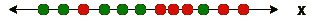
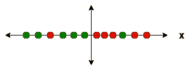
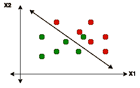
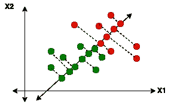
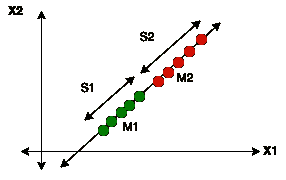
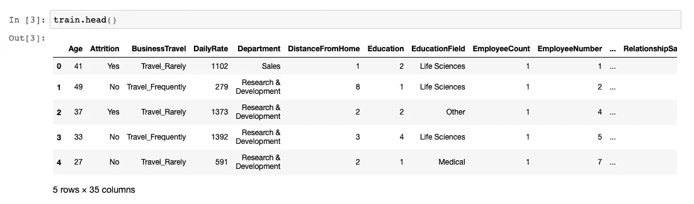
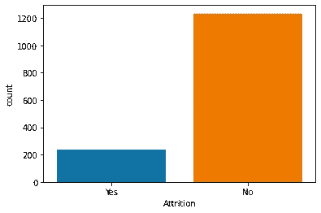
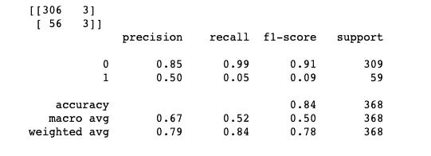
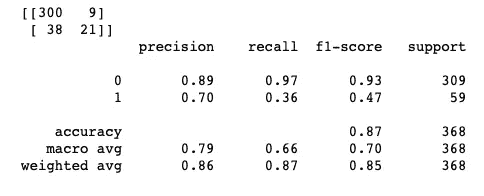
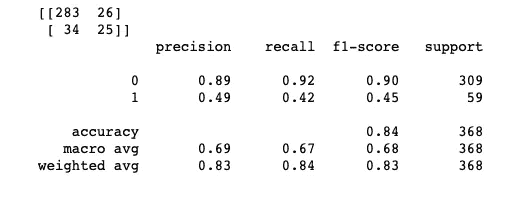

# 线性判别分析——导论

> 原文：<https://towardsdatascience.com/linear-discriminant-analysis-an-introduction-50230ba7dadb?source=collection_archive---------38----------------------->

## 探索 LDA 作为降维和分类技术

LDA 是一种降维算法，类似于 PCA。然而，虽然 PCA 是一种无监督算法，其重点在于最大化数据集中的方差，但是 LDA 是一种监督算法，其最大化类别之间的可分性。


杰米·麦卡弗里拍摄，版权所有。

在建立分类问题时，目标是确保类别的最大可分性或区分度。

假设我们有一个包含两列的数据集—一个解释变量和一个二进制目标变量(值为 1 和 0)。二进制变量的分布如下:



目标变量的分布(在 draw.io 上创建)

绿点代表 1，红点代表 0。因为只有一个解释变量，所以用一个轴(X)表示。但是，如果我们试图放置一个线性分割线来划分数据点，我们将无法成功地做到这一点，因为这些点分散在整个轴上。



划分点的分隔线(在 draw.io 上创建)

因此，似乎一个解释变量不足以预测二元结果。因此，我们将引入另一个特征 X2，并检查点在 2 维空间的分布。



二维空间中点的分布(在 draw.io 上创建)

在二维空间中，输出的分界似乎比以前更好。但是，在已经有多个要素的数据集中增加维度可能不是一个好主意。在这些情况下，LDA 通过最小化维度来拯救我们。在下图中，目标类被投影到一个新轴上:



目标值在变换轴上的投影(在 draw.io 上创建)

这些阶层现在很容易划分。LDA 将原始特征变换到一个新的轴上，称为线性判别式(LD ),从而降低维数并确保类的最大可分性。

为了将这种可分性用数字表示，我们需要一个度量可分性的标准。计算这两个等级的平均值之间的差异可以是这样一种度量。差值越大，则表明两点之间的距离越大。然而，这种方法没有将数据的扩散考虑在内。因此，即使较高的平均值也不能确保某些类不会相互重叠。

第二项措施是考虑类内的均值和方差。为了确保最大的可分性，我们将最大化均值之间的差异，同时最小化方差。



类内方差(S1 和 S2)和两个类的均值(M1 和 M2)

分数的计算方法是(M1-M2) /(S1 +S2)。

如果有三个解释变量- X1、X2、X3，LDA 将把它们转换成三个轴-LD1、LD2 和 LD3。这三个轴将根据计算出的分数排名第一、第二和第三。

因此，LDA 帮助我们降低维度和分类目标值。

我们将通过一个例子来看看 LDA 是如何实现这两个目标的。下面的数据显示了 IBM 的一个虚构数据集，它记录了员工数据和减员情况。目标是根据不同的因素，如年龄、工作年限、出差性质、教育程度等，预测员工的流失情况。



```
sns.countplot(train['Attrition'])
plt.show()
```



大约有 1470 份记录，其中 237 名员工离开了组织，1233 名员工没有离开。是被编码为 1，否被编码为 0。

如果没有正确预测，员工流失会导致失去有价值的人，导致组织效率降低，团队成员士气低落等。因此，有必要正确预测哪个员工可能会离开。换句话说，如果我们预测某个员工会留下来，但实际上该员工离开了公司，那么漏报的数量就会增加。我们的目标是最小化假阴性，从而提高召回率(TP/(TP+FN))。

我们将尝试使用 KNN 对类别进行分类:

```
knn=KNeighborsClassifier(n_neighbors=10,weights='distance',algorithm='auto', p=3)
start_time = time.time()
knn.fit(X_train_sc,y_train)
end_time = time.time()
time_knn = end_time-start_time
print(time_knn)
pred = knn.predict(X_test_sc)
print(confusion_matrix(y_test,pred))
print(classification_report(y_test,pred))
```



适应 KNN 所用的时间:0 . 46360 . 38386838661

对于 0.05 离开的员工来说，回忆是非常差的。

我们现在将使用 LDA 作为分类算法并检查结果。

```
lda_0 = LDA()
lda_0.fit(X_train_sc, y_train)
y_test_pred_0 = lda_0.predict(X_test_sc)
print(confusion_matrix(y_test, y_test_pred_0))
print(classification_report(y_test, y_test_pred_0))
```



召回率急剧上升至 0.36

最后，我们将使用 LDA 转换训练集，然后使用 KNN。

```
#Transformation by LDA
lda_1 = LDA(n_components = 1, solver='eigen', shrinkage='auto')
X_train_lda = lda_1.fit_transform(X_train_lda, y_train_lda)
X_test_lda = lda_1.transform(X_test_lda)
```

接下来是标准缩放。

```
sc3 = StandardScaler()
X_train_lda_sc = sc3.fit_transform(X_train_lda)
X_test_lda_sc = sc3.transform(X_test_lda)
```

现在我们对转换后的数据应用 KNN。

```
knn=KNeighborsClassifier(n_neighbors=8,weights='distance',algorithm='auto', p=3)
start_time = time.time()
knn.fit(X_train_lda_sc,y_train_lda)
end_time = time.time()
time_lda = end_time-start_time
print(time_lda)
print(confusion_matrix(y_test_lda,pred))
print(classification_report(y_test_lda,pred))
```



对转换后的数据运行 KNN 程序所用的时间:0 . 46866 . 46868686661

召回率现在提高了 6%。

此外，KNN 拟合 LDA 转换数据所用的时间是 KNN 一个人所用时间的 50%。

全部代码可在[这里](https://github.com/pritha21/Concepts/tree/master/LDA)获得。

希望我已经演示了 LDA 的使用，包括分类和将数据转换成不同的轴！

敬请关注更多内容！一如既往，感谢您的任何反馈。