# 线性判别分析，已解释

> 原文：<https://towardsdatascience.com/linear-discriminant-analysis-explained-f88be6c1e00b?source=collection_archive---------1----------------------->

## [**里面的艾**](https://medium.com/towards-data-science/inside-ai/home)

## 直觉、插图和数学:它如何不仅仅是一个降维工具，以及为什么它对于现实世界的应用是健壮的。

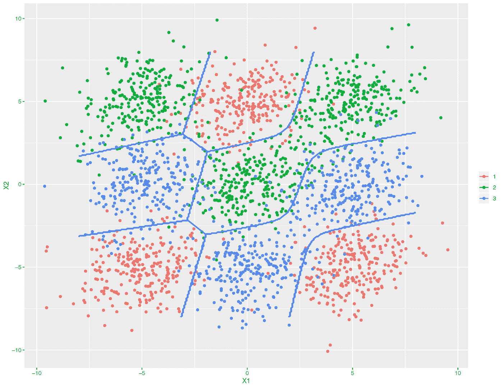

通过混合判别分析(MDA)学习的边界(蓝线)成功地分离了三个混合类。MDA 是 LDA 的强大扩展之一。

## 关键要点

1.  线性判别分析不仅是一种降维工具，也是一种稳健的分类方法。
2.  无论有没有数据正态性假设，我们都可以得到相同的 LDA 特征，这解释了它的鲁棒性。

线性判别分析被用作分类、降维和数据可视化的工具。它已经存在了一段时间了。尽管 LDA 很简单，但它经常产生健壮、体面且可解释的分类结果。在处理现实世界的分类问题时，LDA 通常是在使用其他更复杂和更灵活的方法之前的基准方法。

使用 LDA(及其变体)的两个突出例子包括:

*   **破产预测** : Edward Altman 的 [1968 年模型](https://en.wikipedia.org/wiki/Altman_Z-score)使用训练好的 LDA 系数预测公司破产的概率。根据 31 年的数据评估，准确率在 80%到 90%之间。
*   **面部识别**:虽然从主成分分析(PCA)中学习到的特征被称为特征脸，但从 LDA 中学习到的特征被称为[鱼脸](http://www.scholarpedia.org/article/Fisherfaces)，以统计学家罗纳德·费雪爵士的名字命名。我们稍后解释这种联系。

本文首先介绍了经典的 LDA，以及为什么它作为一种分类方法根深蒂固。接下来，我们看到这种方法中固有的降维，以及它如何导致降秩 LDA。在那之后，我们看到费希尔是如何熟练地得出同样的算法，而没有对数据做任何假设。一个手写数字分类问题被用来说明 LDA 的性能。最后总结了该方法的优缺点。

本文改编自我的一篇博文。如果你喜欢 LaTex 格式的数学和 HTML 风格的页面，你可以在我的博客上阅读这篇文章。此外，还有一组相应的[幻灯片](https://yangxiaozhou.github.io/assets/2019-10-02/Discriminant_Analysis.pdf)，我在其中展示了大致相同的材料，但解释较少。

## 判别分析分类

让我们看看 LDA 作为一种监督分类方法是如何导出的。考虑一个一般的分类问题:一个随机变量 **X** 来自 *K* 类中的一个，带有一些特定于类的概率密度 *f* ( **x** )。判别规则试图将数据空间划分为代表所有类别的 *K* 个不相交区域(想象棋盘上的盒子)。对于这些区域，通过判别分析进行分类仅仅意味着如果 **x** 在区域 *j* 中，我们将 **x** 分配到类别 *j* 中。问题是，我们如何知道数据 **x** 属于哪个区域？自然，我们可以遵循两个分配规则:

*   **最大似然法则**:如果我们假设每一类都以相等的概率发生，那么分配 **x** 给类 *j* 如果

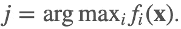

*   **贝叶斯法则**:如果我们知道类先验概率 **π** ，那么分配 **x** 给类 *j* 如果

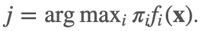

## 线性和二次判别分析

如果我们假设数据来自多元高斯分布，即 **X** 的分布可以用其均值(***【μ***)和协方差(**【σ**)来表征，就可以得到上述分配规则的显式形式。遵循贝叶斯规则，如果对于 *i* = 1，…， *K* ，数据 **x** 在所有 *K* 类中具有最高的可能性，我们将数据 *j* 分类:

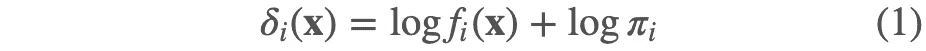

上述函数称为判别函数。注意这里对数似然的使用。换句话说，判别函数告诉我们数据 **x** 来自每个类的可能性有多大。因此，分离任意两个类的判定边界 *k* 和 *l* 是两个判别函数具有相同值的 **x** 的集合。因此，任何落在决策边界上的数据都同样可能来自这两个类(我们无法决定)。

LDA 出现在我们假设在 *K* 类中协方差相等的情况下。也就是说，不是每个类一个协方差矩阵，而是所有类都有相同的协方差矩阵。那么我们可以得到下面的判别函数:

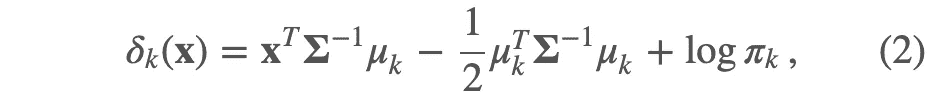

注意这是 **x** 中的线性函数。由此可见，任意一对类之间的决策边界也是 **x** 中的线性函数，其得名原因:线性判别分析。在没有相等协方差假设的情况下，似然中的二次项不会抵消，因此得到的判别函数是 **x** 中的二次函数:

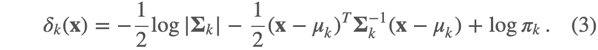

在这种情况下，判定边界在 **x** 中是二次的。这被称为二次判别分析(QDA)。

## 哪个更好？艾达还是 QDA？

在实际问题中，总体参数通常是未知的，只能通过训练数据作为样本均值和样本协方差矩阵来估计。虽然与 LDA 相比，QDA 适应更灵活的决策边界，但是需要估计的参数数量也比 LDA 增加得更快。对于 LDA，需要 *(p+1)* 个参数来构造(2)中的判别函数。对于具有 *K* 个类的问题，我们将只需要 *(K-1)* 这样的判别函数，通过任意选择一个类作为基类(从所有其他类中减去基类可能性)。因此，LDA 的估计参数的总数是 ***(K-1)(p+1)*** 。

另一方面，对于(3)中的每个 QDA 判别函数，需要估计均值向量、协方差矩阵、类先验:
-均值: *p*
-协方差: *p(p+1)/2*
-类先验: *1*
同样，对于 QDA，需要估计***(K-1){ p(p+3)/2+1 }***参数。

因此，LDA 中估计的参数数量随 *p* 线性增加，而 QDA 的参数数量随 *p* 二次增加。当问题维数较大时，我们预计 QDA 的性能会比 LDA 差。

## 两全其美？LDA 和 QDA 之间的妥协

我们可以通过正则化各个类别的协方差矩阵来找到 LDA 和 QDA 之间的折衷。正则化意味着我们对估计的参数施加一定的限制。在这种情况下，我们要求各个协方差矩阵通过惩罚参数(例如α:

公共协方差矩阵也可以通过罚参数例如β朝着单位矩阵正则化:

在输入变量的数量大大超过样本数量的情况下，协方差矩阵的估计可能很差。收缩有望提高估计和分类精度。下图说明了这一点。

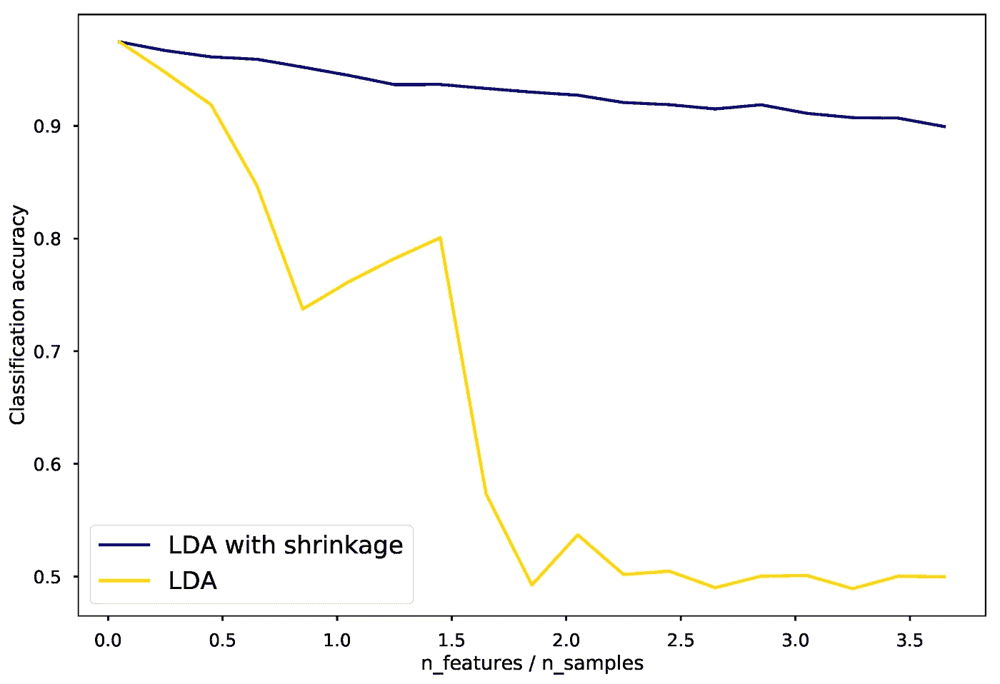

有收缩和无收缩 LDA 的性能比较。归功于 [scikit-learn](https://scikit-learn.org/stable/auto_examples/classification/plot_lda.html) 。

生成上图的脚本。

## LDA 的计算

从(2)和(3)可以看出，如果我们先对角化协方差矩阵，鉴别函数的计算可以简化。也就是说，数据被转换为具有相同的协方差矩阵(无相关性，方差为 1)。对于 LDA，我们是这样进行计算的:

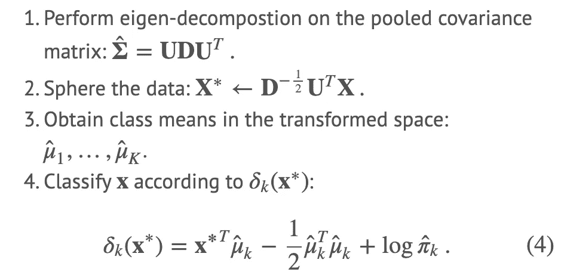

步骤 2 将数据球形化，以在变换的空间中产生单位协方差矩阵。步骤 4 是通过下面的(2)获得的。

我们举两个类的例子，看看 LDA 到底在做什么。假设有两个类， *k* 和 *l* 。我们将 **x** 归类到 *k* 类，如果

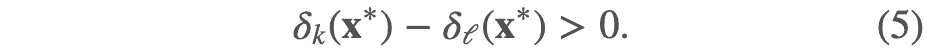

上述条件意味着类 *k* 比类 *l* 更有可能产生数据 **x** 。按照上面概述的四个步骤，我们编写

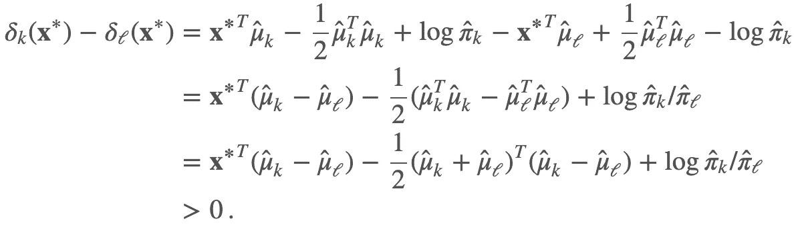

也就是说，我们将数据 **x** 分类到类别 *k* 如果

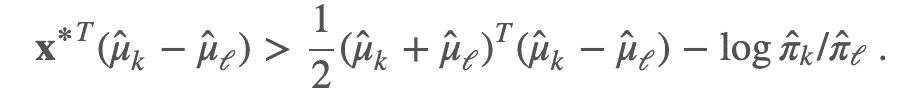

导出的分配规则揭示了 LDA 的工作原理。等式的左侧(l.h.s .)是 **x*** 在连接两类平均值的线段上的正交投影长度。右手边是由类别先验概率校正的片段的中心位置。**本质上，LDA 将球形数据分类到最接近的类均值。这里我们可以做两个观察:**

1.  当类别先验概率不相同时，判定点偏离中间点，即，边界被推向具有较小先验概率的类别。
2.  数据被投影到由类平均值(规则的 l . h . s .**x ***的乘法和平均值减法)跨越的空间上。然后在该空间中进行距离比较。

# 降秩 LDA

我刚才描述的是用于分类的 LDA。LDA 还因其能够找到少量有意义的维度而闻名，使我们能够可视化并处理高维问题。我们所说的有意义是什么意思，LDA 是如何找到这些维度的？我们将很快回答这些问题。

首先，看看下面的情节。对于具有三种不同类型的葡萄酒和 13 个输入变量的[葡萄酒分类](https://scikit-learn.org/stable/modules/generated/sklearn.datasets.load_wine.html#sklearn.datasets.load_wine)问题，该图将数据可视化在 LDA 找到的两个判别坐标中。在这个二维空间中，各个阶层可以很好地区分开来。相比之下，使用主成分分析发现的前两个主成分，类别没有被清楚地分开。

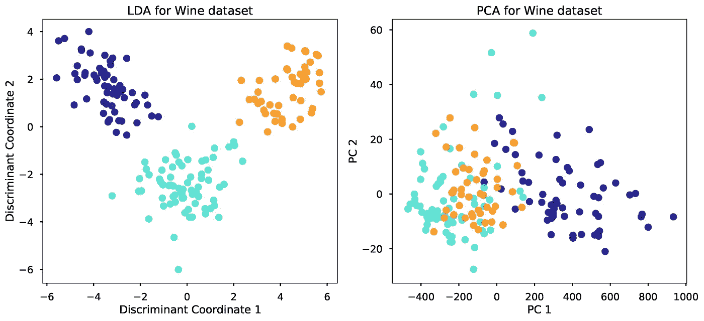

## LDA 固有的降维

在上面的葡萄酒例子中，一个 13 维的问题在 2d 空间中被可视化。为什么会这样？这是可能的，因为 LDA 有一个固有的降维。从上一节中我们已经观察到，LDA 在不同类均值所跨越的空间中进行距离比较。两个不同的点位于一维直线上；三个不同的点位于 2d 平面上。同样， *K* 类意味着位于一个维数最多为 *(K-1)* 的超平面上。特别地，该装置所跨越的子空间是

当在该空间中进行距离比较时，与该子空间正交的距离不会添加任何信息，因为它们对每个类别的贡献是相等的。因此，通过将距离比较限制到这个子空间，不会丢失任何对 LDA 分类有用的信息。这意味着，通过将数据正交投影到这个子空间上，我们可以安全地将我们的任务从一个 *p* 维问题转换为一个 *(K-1)* 维问题。当 *p* 远大于 *K* 时，这是维度数量的一个相当大的下降。

如果我们想进一步减少尺寸，从 *p* 到 *L* ，比如二维的 *L = 2* 怎么办？我们可以尝试从 *(K-1)* 维空间构造一个 *L* 维子空间，并且这个子空间在某种意义上对于 LDA 分类是最优的。

## 最佳子空间是什么？

Fisher 提出，当空间中球形数据的类均值在方差方面具有最大分离时，小得多的 *L* 维*子空间是最佳的。根据这个定义，通过对球形类均值进行 PCA，可以简单地找到最佳子空间坐标，因为 PCA 找到最大方差的方向。计算步骤总结如下:*

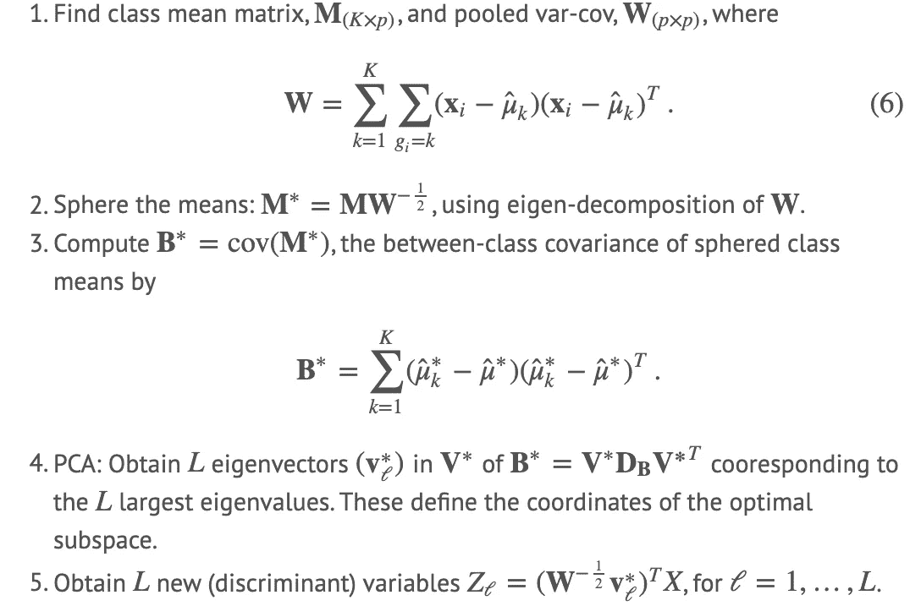

通过这个过程，我们将数据从 **X** 替换到 **Z** ，并将问题维度从 *p* 减少到 *L* 。通过设置 *L = 2* ，通过该程序找到前一葡萄酒图中的判别坐标 1 和 2。使用新数据重复先前的分类 LDA 过程被称为降秩 LDA。

# 费希尔的 LDA

如果之前降秩 LDA 的推导看起来与你之前知道的非常不同，你并不孤单！启示来了。Fisher 根据他的最优性定义以不同的方式导出了计算步骤。他执行降秩 LDA 的步骤后来被称为 Fisher 判别分析。

费希尔没有对数据的分布做任何假设。相反，他试图找到一个“合理的”规则，以便分类任务变得更容易。特别地，费希尔找到了原始数据的线性组合，其中类间方差 **B** = cov( **M** )相对于类内方差 **W** 被最大化，如(6)中所定义的。

下面的图来自 ESL，显示了为什么这个规则有直观的意义。该规则开始寻找一个方向， ***a*** ，其中，在将数据投影到该方向上之后，类意味着它们之间具有最大间隔，并且每个类在其内部具有最小方差。在这个规则下找到的投影方向，如右图所示，使得分类更加容易。

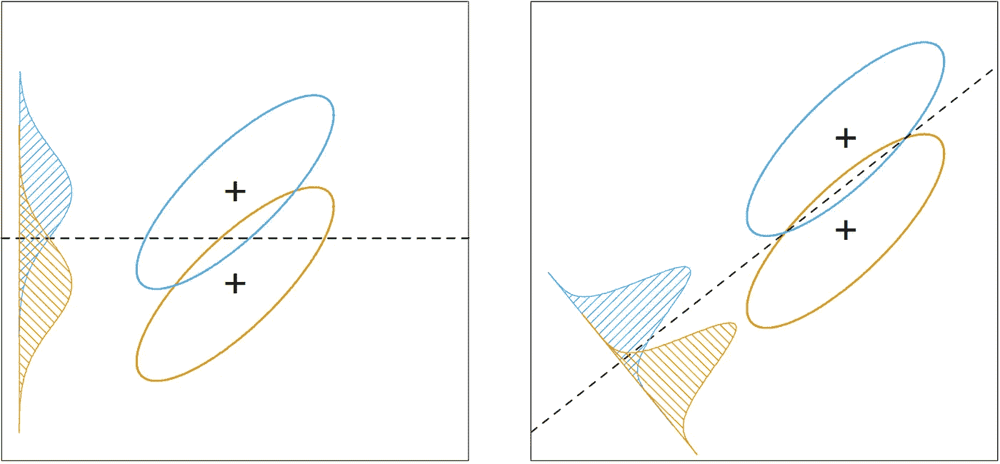

在费雪的“合理法则”下找到的投影方向如右图所示。

## 寻找方向:费希尔的方式

使用费希尔的合理规则，找到最佳投影方向相当于解决一个优化问题:

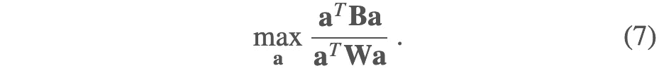

回想一下，我们希望找到一个方向，使类间方差最大化(分子)，类内方差最小化(分母)。这可以转化为广义特征值问题。对于那些感兴趣的人，你可以在我最初的[博客文章](https://yangxiaozhou.github.io/data/2019/10/02/linear-discriminant-analysis.html)中找到这个问题是如何解决的。

求解后得到最优子空间坐标，也称为判别坐标，作为 inv(**W**)∏**B**的特征向量。可以看出，这些坐标与上述降秩 LDA 公式中从 **X** 到 **Z** 的坐标相同。

令人惊讶的是，与降秩 LDA 公式不同，Fisher 在没有对总体进行任何高斯假设的情况下得出这些判别坐标。人们希望，有了这个合理的规则，即使数据不完全符合高斯分布，LDA 也能表现良好。

# 手写数字问题

下面的例子展示了 Fisher's LDA(简称 LDA)的可视化和分类能力。我们需要使用 64 个变量(来自图像的像素值)来识别 10 个不同的数字，即 0 到 9。数据集取自[这里的](https://scikit-learn.org/stable/modules/generated/sklearn.datasets.load_digits.html#sklearn.datasets.load_digits)。首先，我们可以将训练图像可视化，它们看起来像这样:

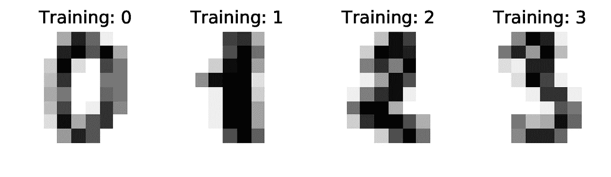

接下来，我们在前半部分数据上训练 LDA 分类器。解决前面提到的广义特征值问题给了我们一个最佳投影方向的列表。在这个问题中，我们保留了前四个坐标，转换后的数据如下所示。

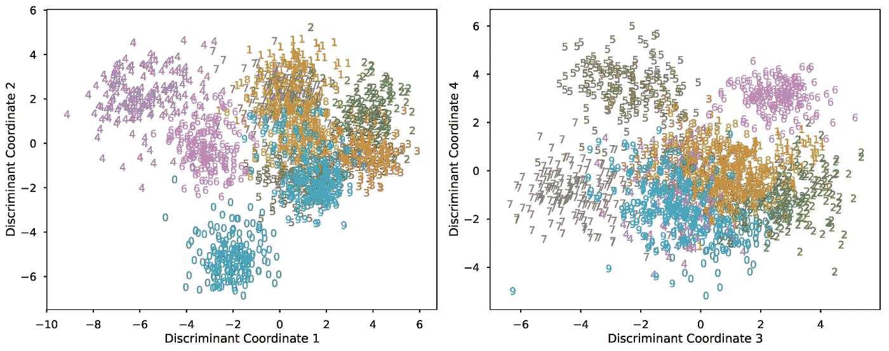

上面的图允许我们解释训练好的 LDA 分类器。例如，坐标 1 有助于对比 4 和 2/3，而坐标 2 有助于对比 0 和 1。随后，坐标 3 和 4 有助于区分坐标 1 和 2 中没有很好分开的数字。我们使用数据集的另一半来测试训练好的分类器。下面的报告总结了结果。

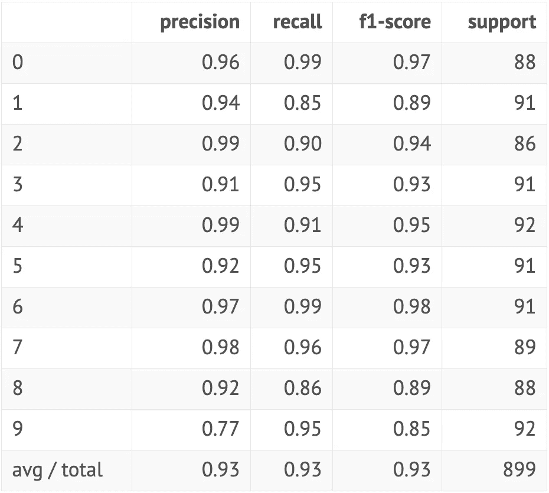

最高精度为 99%，最低精度为 77%，这是一个相当不错的结果，因为该方法是在大约 70 年前提出的。此外，我们没有做任何事情来改善这个具体问题的程序。例如，输入变量中存在共线性，收缩参数可能不是最佳的。

# LDA 概述

LDA 的优点:

1.  简单的原型分类器:使用到类均值的距离，这很容易解释。
2.  决策边界是线性的:实现简单，分类稳健。
3.  降维:它提供了关于数据的信息性低维视图，这对可视化和特征工程都很有用。

LDA 的缺点:

1.  线性决策边界可能无法充分区分类别。希望支持更通用的边界。
2.  在高维设置中，LDA 使用了太多的参数。LDA 的正则化版本是期望的。
3.  希望支持更复杂的原型分类。

谢谢你一直读到最后！在下一篇文章中，我们将介绍灵活的、惩罚的和混合判别分析来解决 LDA 的三个缺点。有了这些概括，LDA 可以处理更加困难和复杂的问题，例如特征图像中显示的问题。

**如果你对更多统计学习的东西感兴趣，可以随意看看我的其他文章:**

 [## 卷积神经网络:它与其他网络有何不同？

### CNN 有什么独特之处，卷积到底是做什么的？这是一个无数学介绍的奇迹…

towardsdatascience.com](/a-math-free-introduction-to-convolutional-neural-network-ff38fbc4fc76)  [## 引擎盖下:什么联系线性回归，岭回归，主成分分析？

### 从挽救病态回归问题，使快速计算的正则化路径，这是…

towardsdatascience.com](/under-the-hood-what-links-ols-ridge-regression-and-pca-b64fcaf37b33) 

# 参考

1.  R.a .、费希尔、[、*分类问题中多重测量的使用*、](https://onlinelibrary.wiley.com/doi/abs/10.1111/j.1469-1809.1936.tb02137.x) (1936)，《优生学年鉴》，7 卷 2 期，179–188 页。
2.  J.Friedman，T. Hastie 和 R. Tibshirani， [*统计学习的要素*](https://web.stanford.edu/~hastie/Papers/ESLII.pdf) (2001)，统计中的斯普林格系列。
3.  K.V. Mardia，J. T. Kent 和 J. M. Bibby，*多元分析* (1979)，概率与数理统计，学术出版社。