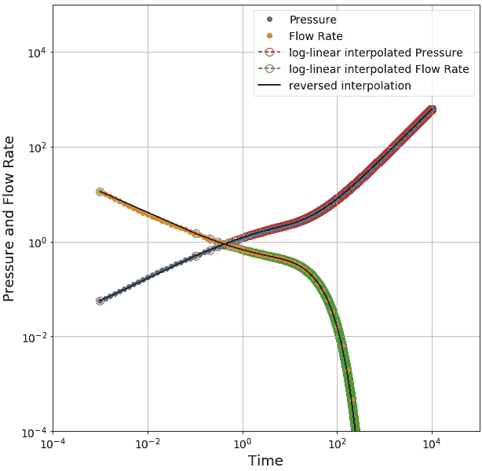
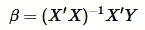
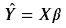
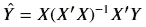
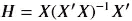
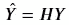
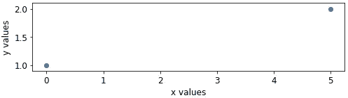
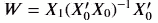
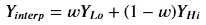
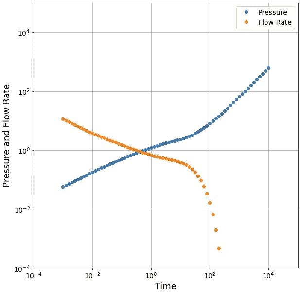

# Python 中的线性插值一行代码

> 原文：<https://towardsdatascience.com/linear-interpolation-in-python-a-single-line-of-code-25ab83b764f9?source=collection_archive---------11----------------------->

## 推导实用算法

## 利用`numpy`简化每个人工具箱中应该有的技术



插值对数线性和反转(线性对数)值

# 介绍

线性插值从离散数据中创建一个连续函数。这是梯度下降算法的基础构建块，该算法用于几乎所有机器学习技术的训练。尽管深度学习非常复杂，但没有它就无法工作。这里我们先来看看构造线性插值算法的理论基础，然后实现一个实用的算法并将其应用到一个案例中。

# 衍生物

如果你想跳过推导，向下滚动到标题为*的章节，一句话*作为笑点。不然继续看！这不会花那么长时间…

在之前的文章中，我们通过使用一些线性代数讨论了线性回归的基础。特别是，我们用这个结果来确定回归系数:



我们也有这个方程来预测这些系数:



如果我们将第一个方程代入第二个方程，我们将得到预测值的直接估计值:



所有这些 ***X*** 项形成了一个叫做[投影矩阵](https://en.wikipedia.org/wiki/Projection_matrix)的东西，也叫做帽子矩阵:



投影矩阵 ***将*** (或 ***投影*** )的观测值*转换为预测值*。为此，它必须包含对任意值 ***Y*** 进行预测所需的所有信息。**

****

**如此看来，如果我们知道了*，我们就知道了*如何预测任何值！为了说明这一点，让我们创建一个玩具示例，看看帽子矩阵是什么样子的。我们将使用位于坐标(0，1)和(5，2)的两个数据点。****

******

# ***发展***

***让我们用 Python 演示一下:***

```
***import numpy as np
np.set_printoptions(suppress=True)  # no scientific formatting# np.r_ and np.c_ are short-hands for concatenation of arrays
# np.r_ performs along the first-axis (rows)
# np.c_ performs along the second-axis (columns)# our x-values
x = np.c_[1., 1.,], [0., 5.]]# our y-values
y = np.r_[1., 2.]print(x)
array([[1., 0.],
       [1., 5.]])***
```

***到目前为止很简单。我们可以使用第一个等式求解回归系数:***

```
***# @ is the numpy operator for matrix multiplication
c = np.linalg.inv(x.T @ x) @ x.T @ Yprint(c)
array([1., 0.2])***
```

***正如我们所料，斜率为 1/5，截距为 1。下一个是投影矩阵:***

```
***# @ is the numpy operator for matrix multiplication
h = x @ np.linalg.inv(x.T @ x) @ x.Tprint(h)
array([[1., 0.],
       [0., 1.]])***
```

***回想一下，当我们将 ***H*** 乘以 ***Y*** 时，我们得到了预测值***【ŷ】***。因为我们在对角线上有 1，在其他地方有 0，在这种情况下， ***H*** 实际上是单位矩阵，所以我们简单地返回实际 y 值(1，2)的预测值(1，2)。当我们的点不像几乎所有线性回归问题那样形成一条直线时，情况就不一样了。然而，对于插值，我们总是可以做这样的假设，因为只有两个点限制了我们想要插值的点！***

# **插入文字**

**实际插值呢？如果我们回忆一下第二个方程，我们可以为*X 提供任何值以便创建一个预测值。让我们利用这个事实重写我们的投影矩阵，用 ***X₀*** 代表我们的实际值，用 ***X₁*** 代表我们要插值的值。我们将使用 ***W*** 将其表示为权重矩阵，原因我们稍后会看到:***

****

**如果我们在 0 和 5 的值*之间尝试 ***X₁*** 的各种值会发生什么？***

```
**for i in np.linspace(0, 5, 6):
    w = np.c_[1., i] @ np.linalg.inv(x.T @ x) @ x.T
    y_hat = w @ y
    print(f'x1 = {i:.1f}, w = {w}, y_hat = {y_hat}')x1 = 0.0, w = [[1.0 0.0]], y_hat = [1.0]
x1 = 1.0, w = [[0.8 0.2]], y_hat = [1.2]
x1 = 2.0, w = [[0.6 0.4]], y_hat = [1.4]x1 = 3.0, w = [[0.4 0.6]], y_hat = [1.6]
x1 = 4.0, w = [[0.2 0.8]], y_hat = [1.8]x1 = 5.0, w = [[0.0 1.0]], y_hat = [2.0]**
```

**有趣的事情发生了！在每种情况下，权重矩阵的和是 1。当我们将这个权重矩阵乘以 ***Y*** 值时，我们得到的是两个值的加权平均值。第一个权重与两个值*之间插值的*的距离成正比，第二个权重正好是第一个权重的补码。换句话说:****

******

# ***一句话***

***这给了我们一行的线性插值:***

```
***new_y = np.c_[1., new_x] @ np.linalg.inv(x.T @ x) @ x.T @ y***
```

***当然，这有点噱头。我们必须准确地知道原始 x 值数组中的两个值，新的插值 x 值位于这两个值之间。我们需要一个函数来确定这两个值的索引。值得庆幸的是，`numpy`恰恰包含了这样一个恰好的函数:`np.searchsorted`。让我们用它把线性代数变成一个矢量化的函数。我们不是为每个插值计算权重矩阵，而是存储相关信息:权重本身，以及 ***X*** 值的索引(当我们计算插值时，它们也将由 ***Y*** 值的索引决定)。***

```
**from typing import NamedTupleclass Coefficient(NamedTuple):
    lo: np.ndarray  # int  
    hi: np.ndarray  # int
    w: np.ndarray  # floatdef interp_coef(*x0:* np.ndarray, *x*: np.ndarray) -> Coefficient:
    # find the indices into the original array
    hi = np.minimum(len(x0) - 1, np.searchsorted(x0, x, 'right'))
    lo = np.maximum(0, hi - 1)

    # calculate the distance within the range
    d_left = x - x0[lo]
    d_right = x0[hi] - x
    d_total = d_left + d_right # weights are the proportional distance
    w = d_right / d_total # correction if we're outside the range of the array
    w[np.isinf(w)] = 0.0 # return the information contained by the projection matrices
    *return* Coefficient(lo, hi, w)def interp_with(*y0*: np.ndarray, *coef*: Coefficient) -> np.ndarray:
    *return* coef.w * y0[coef.lo] + (1 - coef.w) * y0[coef.hi]**
```

**这个算法的方便之处在于我们只需要计算一次我们的权重。有了权重，我们就可以对与 x 值向量对齐的任何 y 值向量进行插值。**

# **示例应用程序**

**在工程问题中，我们正在建模的物理过程通常是指数函数或幂律函数。当我们为这些过程收集数据时，我们可以以对数间隔的时间间隔进行。许多解释方法被构造成以均匀的测井间隔时间间隔工作。然而，一些数值方法更便于处理均匀的线性间距值。所以来回转换的能力很方便。线性插值是执行这种变换的一种工具。**

**事实上，我们并不局限于线性插值。我们可以首先线性化我们的值，然后进行插值。让我们来看一个径向系统中流量、 ***、q*** 、压力、 ***p* 、**的例子。这些数据是用均匀对数间隔的样本合成的，当我们将它绘制在双对数图上时，我们会看到大多数数据的不同幂律行为。在后期，流速转变为指数下降，但这不会对我们的插值产生太大影响。**

****

**径流系统的压力和流量数据**

**让我们使用一组等距值进行插值。我们将假设幂律函数作为插值的基础，首先对我们的值应用对数变换。我们还将反转插值，以验证插值是否正确执行:**

```
**# construct out linear time series
tDi = np.linspace(1e-3, 1e4, 100_001)# interpolate from log to linear
coef = interp_coef(np.log(time), np.log(time_interp))
pi = np.exp(interp_with(np.log(pressure), coef))
qi = np.exp(interp_with(np.log(rate), coef))# reverse from linear to log
coef_i = interp_coef(np.log(time_interp), np.log(time))
pr = np.exp(interp_with(np.log(pi), coef_i))
qr = np.exp(interp_with(np.log(qi), coef_i))**
```

****

**插值对数线性和反转(线性对数)值**

# **摘要**

**线性方法是处理数据的重要工具。变量的变换，例如通过使用示例中所示的`np.log`，允许我们在不期望数据是线性的情况下应用这些技术。**

**虽然我们推导并实现了自己的算法，但标准算法确实存在:`scipy.interpolated.interp1d`。然而，为了在一些包中使用，比如当使用`pymc3`时，可能需要为自己实现类似这样的东西。**

**还存在更一般的插值方法。其中之一是 B 样条，我们将在本系列的下一篇文章中讨论它。b 样条也可以执行线性插值，以及二次，三次等。b 样条通过扩展我们在这里开发的概念来工作。也就是说，将权重 ***向量*** 扩展为权重 ***矩阵*** 。我们无需编写函数来查找每个插值的索引，只需用系数和新 x 值的矩阵乘法来计算插值的 y 值即可。**