# 从零开始的线性混合模型

> 原文：<https://towardsdatascience.com/linear-mixed-model-from-scratch-f29b2e45f0a4?source=collection_archive---------5----------------------->

## [生命科学的数理统计和机器学习](https://towardsdatascience.com/tagged/stats-ml-life-sciences)

## 使用最大似然法推导和编码 LMM

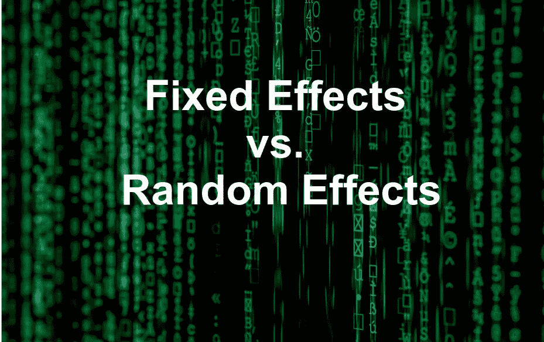

[图片来源](https://unsplash.com/photos/iar-afB0QQw)

这是来自专栏 [**生命科学的数理统计和机器学习**](https://towardsdatascience.com/tagged/stats-ml-life-sciences?source=post_page---------------------------) 的第十八篇文章，我试图以简单的方式解释生物信息学和计算生物学中使用的一些神秘的分析技术。**线性混合模型**(也称为线性混合效应模型)在生命科学中广泛使用，有许多教程显示如何在 R 中运行该模型，但是有时不清楚在**似然最大化**过程中随机效应参数是如何优化的。在我之前的文章 [**线性混合模型如何工作**](/how-linear-mixed-model-works-350950a82911) 中，我介绍了模型的概念，在本教程中，我们将应用**最大似然(ML)** 方法从头开始推导并编码线性混合模型(LMM)，即我们将使用普通 R 编码 LMM，并将输出与来自 **lmer** 和 **lme** R 函数的输出进行比较。本教程的目标是解释 LMM“喜欢我的祖母”，暗示没有数学背景的人应该能够理解 LMM 在幕后做什么。

# 玩具数据集

让我们考虑一个**玩具数据集**，它非常简单，但仍然保留了线性混合建模(LMM)的典型设置的所有必要元素。假设我们**只有 4 个数据点** **/样本** : 2 个来自**个体#1** ，另外 2 个来自**个体#2** 。此外，这 4 个点分布在两种状态之间:**未处理**和**已处理**。假设我们测量了每个个体对治疗的反应(**或**)，并且想要说明治疗是否导致研究中个体的显著反应。换句话说，我们的目标是实施类似于 [**配对 t 检验**](https://en.wikipedia.org/wiki/Student%27s_t-test) 的**，并评估治疗的意义。稍后，我们将把来自 **LMM 和配对 t 检验**的输出联系起来，并表明它们确实是****相同的**。在玩具数据集中， **Treat** 栏中的 0 表示“未处理”，1 表示“已处理”。首先，我们将使用简单的普通最小二乘法(OLS) **线性回归**，它不考虑数据点之间的相关性。****

******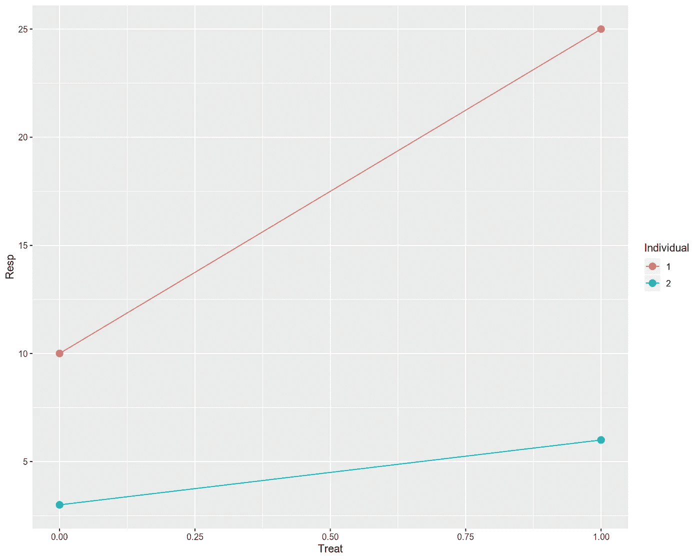**

**从技术上来说，这是可行的，但是，这不是一个很好的匹配，**我们有一个问题** **这里**。普通最小二乘(OLS)线性回归假设所有观察值(图上的数据点)都是**独立的**，这将导致不相关的，因此 [**正态分布残差**](https://www.statisticssolutions.com/assumptions-of-linear-regression/) 。然而，我们知道图上的数据点属于 2 个个体，即每个个体 2 个点。原则上，我们可以分别为每个个体**拟合一个线性模型**。然而，这也不是一个很好的契合。我们对每个人都有两点，所以太少了，无法对每个人进行合理的拟合。此外，正如我们之前在[和](/how-linear-mixed-model-works-350950a82911)中看到的，个体拟合并不能说明总体/群体概况，因为与其他个体拟合相比，其中一些拟合可能具有相反的行为。******

****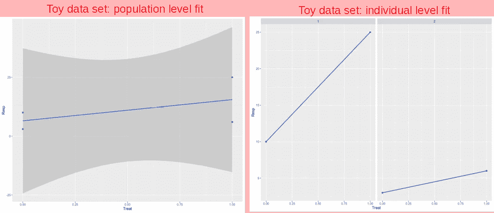****

****相比之下，如果我们想要**将所有四个数据点** **拟合在一起**，我们将需要以某种方式说明它们是**而非独立**的事实，即它们中的两个属于个体#1，两个属于个体#2。这可以在线性混合模型(LMM)或配对检验中完成，例如 [**配对 t 检验**](https://en.wikipedia.org/wiki/Student%27s_t-test) (参数)或 [Wilcoxon 符号秩检验](https://en.wikipedia.org/wiki/Wilcoxon_signed-rank_test)(非参数)。****

# ****具有 Lmer 和 Lme 的线性混合模型****

****当观测值之间存在非独立性时，我们使用 LMM。在我们的例子中，观察集中在个体内部。让我们对斜率和截距应用具有固定效应的 LMM，对截距应用**随机效应**，这将导致在 Resp～Treat 公式中增加一个 **(1 | Ind)** 项:****

****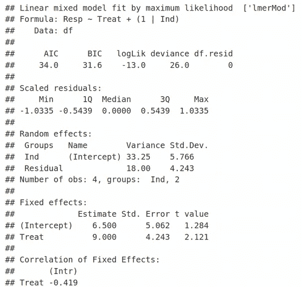****

****这里 REML=FALSE 仅仅意味着我们正在使用传统的最大似然(ML)优化，而不是**受限最大似然**(我们将在另一个时间讨论 REML)。在 lmer 输出的随机效应部分，我们看到最小化的 2 个参数的估计值:**剩余方差**对应于标准偏差(标准差)4.243，以及**随机效应(个体间共享)方差**与标准偏差为 5.766 的截距相关。类似地，在 lmer 输出的固定效果部分，我们可以看到两个估计值:1)截距等于 6.5，以及 2)斜率/ Treat 等于 9。因此，我们有 4 个优化参数，对应于 4 个数据点。如果我们查看玩具数据集部分中的第一个数字，并意识到未处理样本的两个值的平均值为(3 + 10) / 2 =6.5，则固定效应的值是有意义的，我们将其表示为 ***β* 1** ，而处理过的样本的平均值为(6 + 25) / 2 = 15.5，我们将其表示为 ***β* 2** 。后者相当于 6.5 + 9，即截距固定效应的估计值(=6.5)加上斜率固定效应的估计值(=9)。这里，我们注意随机和固定效应的**精确值**，因为我们将在以后推导和编码 LMM 时再现它们。****

****默认情况下， **lme4** R 包和 **lmer** R 函数[不提供具有统计显著性的测量](https://stats.stackexchange.com/questions/22988/how-to-obtain-the-p-value-check-significance-of-an-effect-in-a-lme4-mixed-mode)，例如 p 值，但是，如果您仍然希望您的 LMM 拟合具有 **p 值，则可以使用 **nlme** R 包中的 **lme** 函数:******

**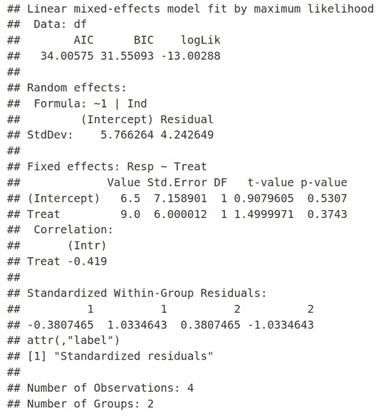**

**同样，这里我们有截距( **StdDev = 5.766264** )和残差( **StdDev = 4.242649** )的随机效果，以及截距(值= 6.5)和斜率/处理(值= 9)的固定效果。非常有趣的是，固定效应的标准误差及其 t 值(Treat 的 t 值=1.5)在 lmer 和 lme 之间并不一致。然而，如果我们在 lmer 函数中要求 REML=TRUE，则包括 t 值的固定效应统计在 lme 和 lmer 之间是**相同的**，然而随机效应统计是不同的。**

**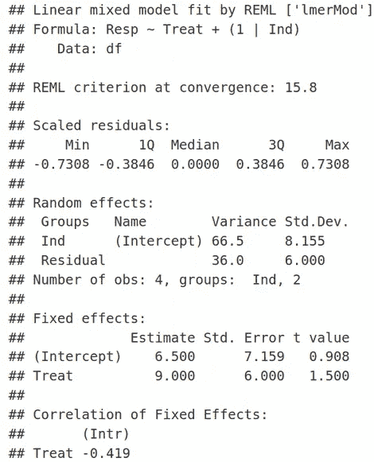**

**这就是最大似然法(ML)和**限制最大似然法(REML)** 之间的区别，我们将在下次讨论。**

# **LMM 与配对 T 检验的关系**

**之前，我们说过 LMM 是简单配对 t 检验的一种更复杂的形式。让我们证明，对于我们的玩具数据集，它们确实给出了相同的输出。在途中，我们还将了解配对 t 检验和非配对 t 检验之间的技术差异。让我们首先在处理组和未处理组样本之间进行配对 t 检验，考虑它们之间的非独立性:**

**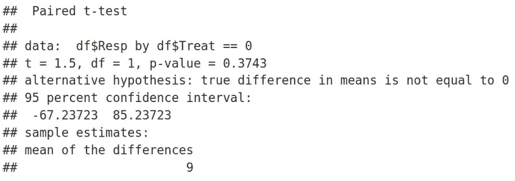**

**我们可以看到，配对 t 检验报告的 t 值=1.5 和 p 值= 0.3743 与 LMM 使用 nlme 函数或 REML = TRUE 的 lmer 获得的结果**相同。配对 t 检验统计报告的“差异均值= 9”也与来自 lmer 和 nlme 的固定效应估计值一致，记住我们有处理估计值= 9，它只是处理和未处理样本均值之间的差异。****

**现在，配对 t 检验到底在做什么？嗯，配对 t 检验的想法是使设置看起来像一个**单样本 t 检验**，其中一组中的值被检验是否与零有**显著偏差**，这是第二组的一种平均值。换句话说，我们可以查看配对 t 检验，就好像我们将单个拟合的截距(见第一个图)或未处理组**的平均值向下移动到零**。简单地说，这相当于从已处理的 Resp 值中减去未处理的 Resp 值，即如下所示，将 Resp 变量转换为 **Resp_std** (标准化响应)，然后对 Resp_std 变量而不是 Resp 执行非配对 t 检验:**

**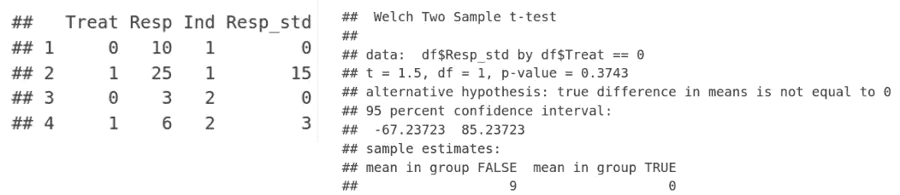**

**我们观察到，对于 Treat = 0，即未治疗组，响应值变为 0，而治疗组(Treat=1)的响应值减少了未治疗组的值。然后，我们简单地使用新的 Resp_std 变量并运行非配对 t-test，结果相当于对原始 Resp 变量运行配对 t-test。因此，我们可以总结，LMM 复制了配对 t 检验的结果，但允许更大的灵活性，例如，不仅两个(如 t 检验)，但多组比较等。**

# **线性混合模型背后的数学**

**现在让我们尝试使用我们的玩具数据集来推导几个 LMM 方程。我们将再次查看这 4 个数据点，并对治疗效果进行一些数学记法，*，这是**除了固定效果**，以及由于两个个体之间的点聚集而导致的块式结构*，**实际上是********随机效果贡献**。我们要用 ***β*** 和 ***u*** 参数来表示响应(Resp)坐标 **y** 。********

******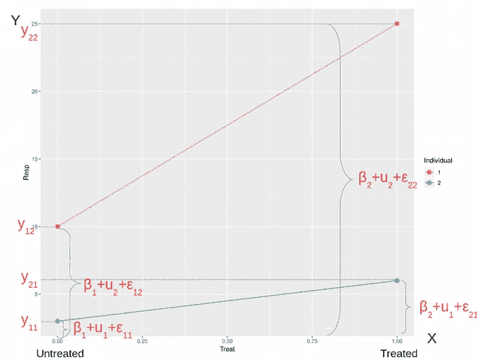******

******这里， ***β* 1** 是个体在未处理状态下的反应，而**β2**是对**处理**的**反应**。也可以说， ***β* 1** 是未处理样本的平均值，而 ***β* 2** 是处理过的样本的平均值。变量 ***u* 1** 和 ***u* 2** 是分别说明个体#1 和个体#2 特定效果的块变量。最后，***ϵij*∽*n*(0，*∑*)**是**残差**，即我们无法建模的误差，只能试图将其最小化作为**最大似然**优化问题的目标。因此，我们可以把响应变量 ***y*** 记为参数 ***β*** ， ***u*** ，即**固定**和**随机效果**，以及 ***ϵ*** 作为 Eq。(1).在一般形式下，这个代数方程组可以重写为方程。其中指数 i = 1，2 对应于治疗效果，j = 1，2 描述个体效果。我们也可以用矩阵形式 Eq 来表示这个方程组。(3).因此，我们得出以下著名的 LMM 矩阵形式，它出现在所有的教科书中，但并不总是得到正确的解释。(4).******

******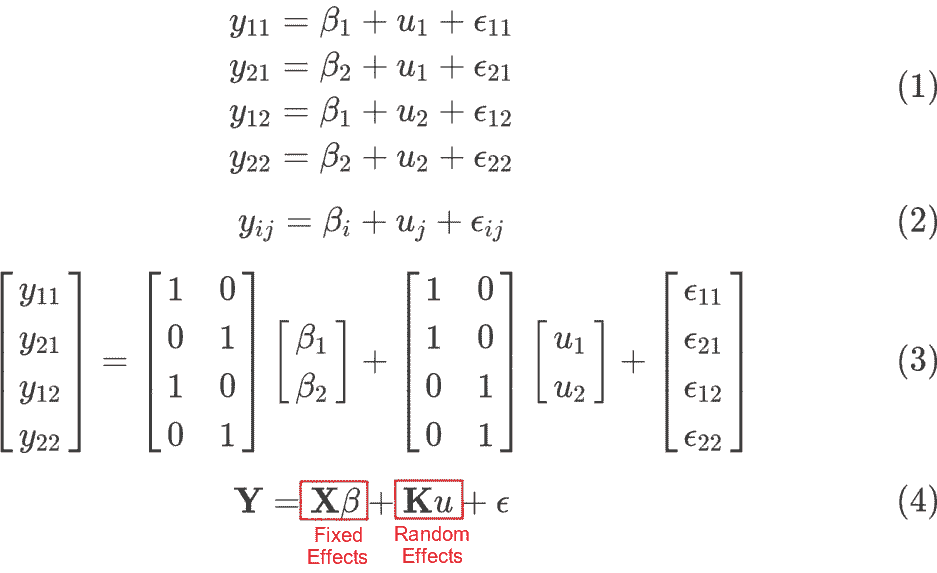******

******这里， **X** 被称为**设计矩阵**，而 **K** 被称为**块矩阵**，它编码了数据点之间的关系，即它们是否来自相关的个体，或者甚至像我们的情况一样来自同一个个体。值得注意的是，治疗被建模为固定效应，因为治疗-未治疗的水平**用尽了**所有可能的治疗结果。相比之下，数据的块式结构被建模为随机效应，因为个体是从群体中**采样的，可能无法正确代表个体的整个群体。换句话说，存在与随机效应相关联的误差，即***uj*∾*N*(0， *σs* )** ，而固定效应被假定为无误差。例如，性别通常被建模为固定效应，因为它通常被假设为只有**两个水平(男性，女性)**，而生命科学中的批量效应应被建模为随机效应，因为潜在的额外实验方案或实验室会产生更多的，即许多水平的样本之间的系统差异，从而混淆数据分析。根据经验，人们可能会认为固定效应不应该有很多水平，而随机效应通常是多水平的分类变量，其中的水平只是所有可能性的一个样本，而不是全部。********

****让我们继续推导**数据点** **Y** 的**均值**和**方差**。由于随机效应误差和残差均来自均值为零的正态分布，而 *E* [ **Y** ]中的非零分量来自于固定效应，我们可以将 **Y** 的期望值表示为等式。(5).接下来，固定效应项的方差为零，因为固定效应被假设为无误差，因此，对于 **Y** 的方差，我们获得等式。(6).****

****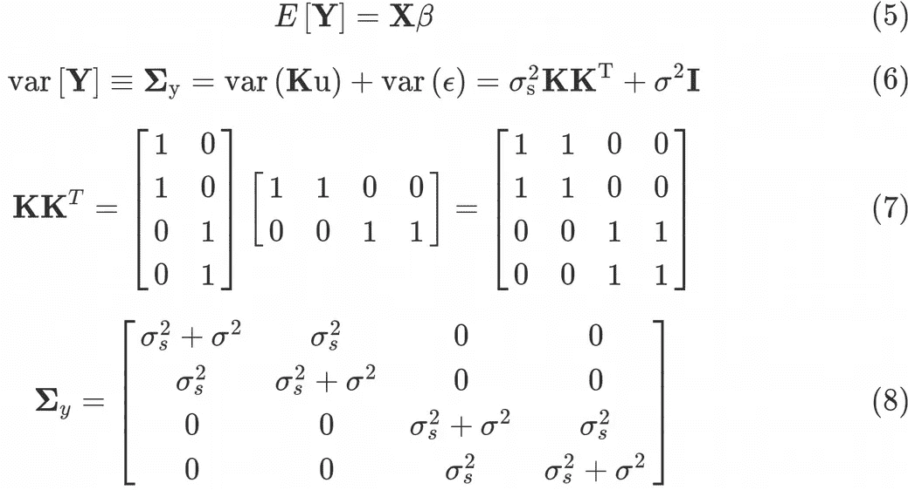****

****情商。(6)是考虑到 var(**k**u)=**k*** var(u)*** k**^t 和 var(*ϵ*)=*σ**** I**和 var(u)= *σ* s ***I** 而得到的，其中 **I** 是一个 4×4**的恒等式矩阵**。这里， ***σ*** 是**残差方差**(未建模/未缩减误差)，而 ***σ* s** 是**随机截距效应(跨数据点共享)方差**。 ***σ* s** 前面的矩阵称为**亲属矩阵**，由等式给出。(7).亲属矩阵编码了数据点之间的所有关联。例如，一些数据点可能来自基因相关的人，地理位置非常接近，一些数据点可能来自技术复制。这些关系被编码在亲属矩阵中。因此，等式中数据点的方差-协方差矩阵。(6)采用 Eq 的最终形式。(8).一旦我们获得了方差-协方差矩阵，我们就可以继续进行需要方差-协方差的最大似然函数的优化过程。****

# ****最大似然(ML)原理的 LMM****

****为什么我们花这么多时间推导方差-协方差矩阵，它与线性回归有什么关系？原来，**拟合线性模型**的整个概念，以及许多其他传统频率统计的概念，如果不是全部的话，都来自于**最大似然(ML)** **原理**。为此，我们需要最大化**多元高斯** **分布函数**关于参数 ***β* 1** 、 ***β* 2** 、 ***σs*** 和 ***σ*** 、Eq。(9).****

****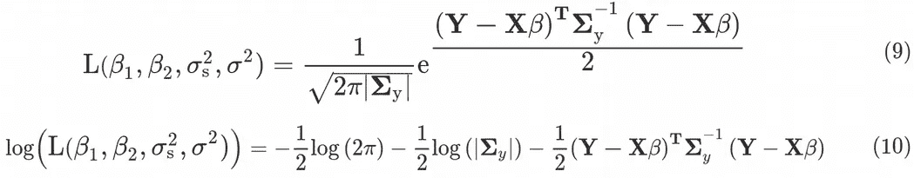****

****这里|**σ***y*|表示方差-协方差矩阵的行列式。我们看到方差-协方差矩阵的逆矩阵和行列式被明确地包含在似然函数中，这就是为什么我们必须通过**随机效应方差** ***σs*** 和**残差方差** ***σ*** 来计算其表达式。似然函数的最大化等同于对数似然函数的最小化。(10).****

****我们将需要对方差-协方差矩阵的行列式、**逆方差-协方差矩阵**和逆方差-协方差矩阵与 Y-**X*β*-**-**项**的**乘积执行冗长的**符号推导**。根据我的经验，这在 R / Python 中很难做到，但是我们可以使用****(或者类似的**[**Mathematica**](https://www.wolfram.com/mathematica/)**或者**[**Matlab**](https://www.mathworks.com/products/matlab.html)**)**进行符号计算，并推导出方差协方差矩阵的行列式和逆的表达式:********

****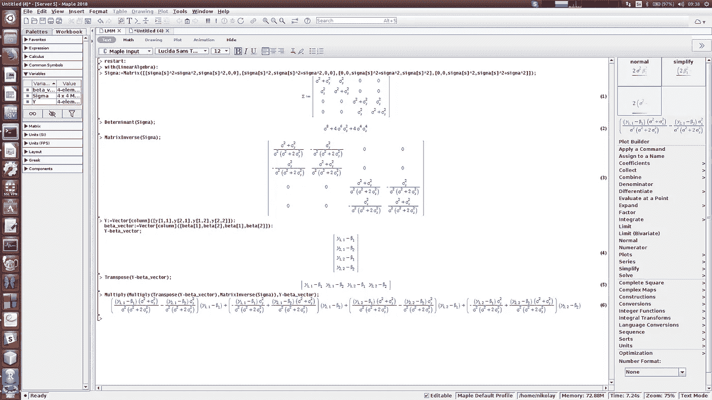****

****复杂的符号推导在 Maple / Mathematica / Matlab 环境下变得容易****

****使用 Maple，我们可以获得方差-协方差矩阵的行列式，如等式。(11).接下来，Eq 中的最后一项。对于**，对数似然**采用等式的形式。(12).****

****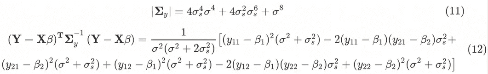****

****现在，我们准备使用 **optim** R 函数，针对 ***β* 1** 、 ***β* 2** 、 ***σs*** 和 ***σ*** 执行**对数似然**函数的数值最小化:****

****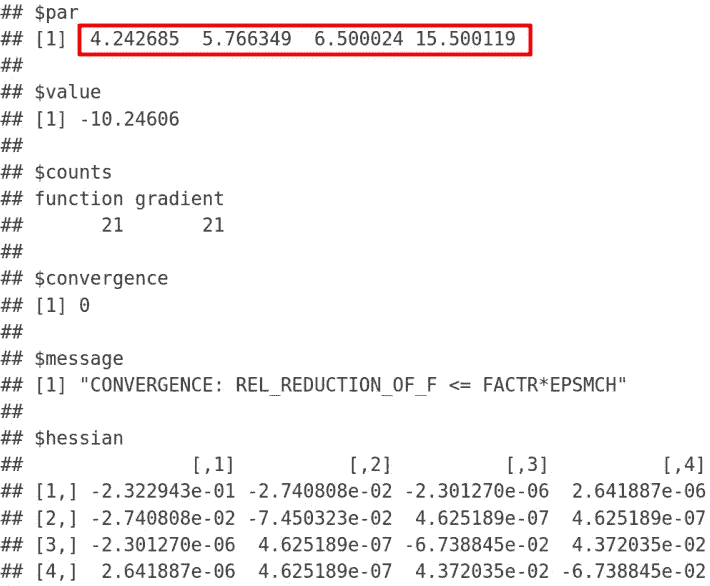****

****我们可以看到，最小化算法已经成功地**收敛**，因为我们得到了“收敛= 0”消息。在输出中，***∑*= 4.242640687**是**残差标准差**，它恰好**再现了来自 lme 和 lmer 的结果**(REML = FALSE)。以此类推，***∑s*= 5.766281297**是**共享标准差**，其再次精确地再现了来自 lme 和 lmer(REML = FALSE)函数的相应随机效应截距输出。不出所料，固定效应 ***β* 1 = 6.5** 是**协议**中未处理样本的平均值，具有来自 lmer 和 lme 的截距固定效应估计值。接下来， ***β* 2 = 15.5** 是处理样本的平均值，它是来自 lmer 和 lme R 函数的截距固定效应估计值(= 6.5)加上斜率/处理固定效应估计值(= 9)。****

****出色的工作！通过**从零开始推导和编码线性混合模型(LMM)**，我们已经成功地从 lmer / lme 函数中再现了固定效果和随机效果输出！****

# ****摘要****

****在这篇文章中，我们学习了如何在一个 **玩具数据集**上导出并编码一个**线性混合模型(LMM)********。我们介绍了 LMM 和**配对 t 检验**之间的关系，并从 **lmer** 和 **lme** R 函数中复制了固定和随机效应参数。**********

****在下面的评论中，让我知道哪些来自生命科学的分析技术对你来说是特别神秘的，我会在以后的文章中介绍它们。在我的 [Github](https://github.com/NikolayOskolkov/LMMFromScratch) 上查看帖子中的代码。请在媒体[关注我，在 Twitter @NikolayOskolkov 关注我，在 Linkedin](https://medium.com/u/8570b484f56c?source=post_page-----f29b2e45f0a4--------------------------------) 关注我。在下一篇文章中，我们将讨论最大似然法(ML)和**受限最大似然法(REML)** 的区别，敬请关注。****