# 使用 Python 进行线性编程

> 原文：<https://towardsdatascience.com/linear-programming-using-python-priyansh-22b5ee888fe0?source=collection_archive---------2----------------------->

## 一步一步的介绍使用 Python 中的纸浆库公式化和解决线性优化问题。


安托万·道特里在 [Unsplash](https://unsplash.com?utm_source=medium&utm_medium=referral) 上拍摄的照片

# **文章目的**

本文的主要目的是向读者介绍一种最简单也是最常用的工具，使用 PuLP 库在 Python 中编写线性优化问题的代码。它还对优化和线性编程进行了快速介绍，这样，即使那些对优化、规范分析或运筹学知之甚少或一无所知的读者也可以很容易地理解文章的上下文以及文章将要讨论的内容。我们也将触及如何用数学符号来表达一个 LP。


照片由[digity Marketing](https://unsplash.com/@diggitymarketing?utm_source=medium&utm_medium=referral)在 [Unsplash](https://unsplash.com?utm_source=medium&utm_medium=referral) 上拍摄

# 先决条件

***给定的前提条件有是好的，没有必要。***

1.  Python 中的基本编码知识。
2.  对线性规划、目标函数、约束和决策变量有基本的了解。


照片由[hello queue](https://unsplash.com/@helloquence?utm_source=medium&utm_medium=referral)在 [Unsplash](https://unsplash.com?utm_source=medium&utm_medium=referral) 上拍摄

# **优化简介**

> 优化是通过控制约束环境中的一组决策来寻找给定目标的最大值或最小值的过程。简而言之，[优化问题包括通过从允许的集合中系统地选择输入值并计算函数值来最大化或最小化真实函数。](https://www.igi-global.com/dictionary/cuckoo-search-for-optimization-and-computational-intelligence/21383)

真实函数(目标函数)可以是从仓库向客户交付货物的成本，在给定有限数量的驾驶员和时间(约束)的情况下，我们希望通过选择最优路线和最优车辆组(决策变量)来最小化该成本。这是运筹学和最优化领域中路线最优化的一般情况。

计算机科学领域的另一个非常著名的问题是 TSP 或旅行推销员问题，其中我们希望找到最短的路线或最便宜的路线来穿越所有城市，给定它们之间的成对距离。在这种情况下，我们的目标函数变成最小化旅行的总距离(或总成本),决策变量变成二元变量，告知旅行者是否应该从城市 I 旅行到城市 j，并且应用约束，使得旅行者覆盖所有城市并且不会两次访问一个城市。我们今天还将处理一个更简单但类似的问题。


斯蒂芬·门罗在 [Unsplash](https://unsplash.com?utm_source=medium&utm_medium=referral) 上拍摄的照片

# 线性规划导论

线性规划基本上是最优化的一个子集。线性规划或线性优化是一种优化技术，其中我们试图使用一组变化的决策变量为线性约束系统找到线性目标函数的最优值。

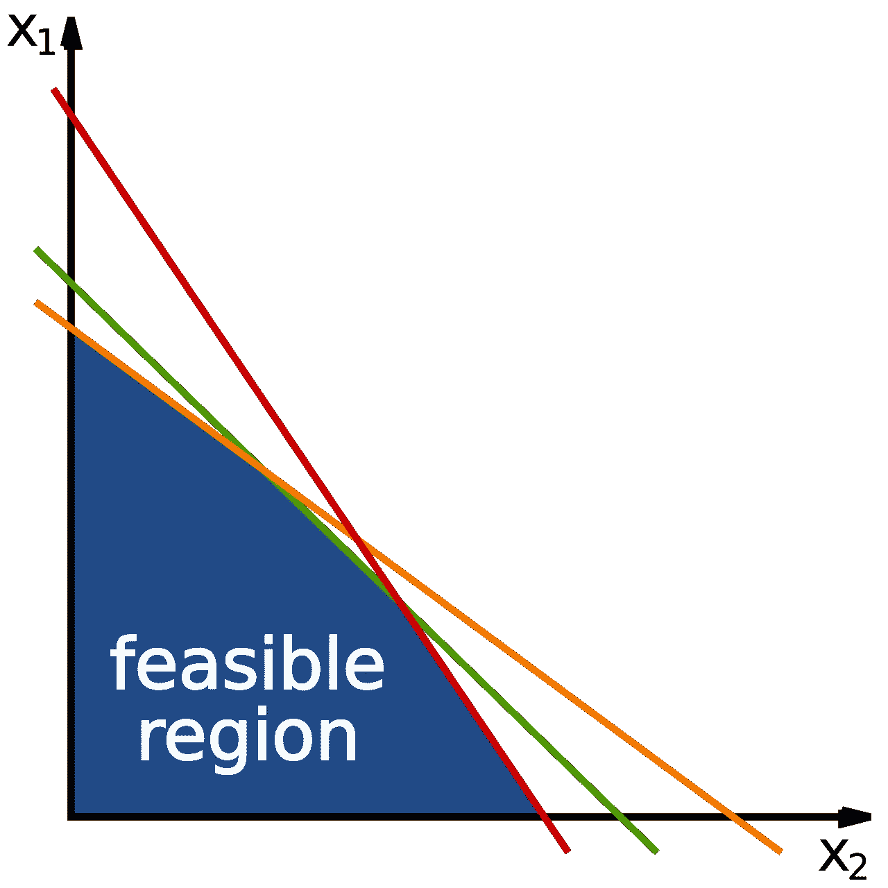

由 Inductiveload —自有作品，公共领域，【https://commons.wikimedia.org/w/index.php?curid=6666051 

# 理解手头的问题

您希望将货物从两个不同的仓库运送到四个不同的客户手中的成本降到最低。每个仓库的供应量是有限的，每个客户都有一定的需求。我们需要通过从给定的仓库装运产品来满足客户的需求，这样运输的总成本是最低的，并且我们还能够使用每个仓库可用的有限供应来满足客户的需求。

# 数据

假设这家公司是只供应鞋类的 crocs，这里的客户是它的经销商，他们需要大量的 Crocs。供应的产品在性质上是一致的。

1.  *仓库 i* 到*客户 j* 的运输矩阵成本如下。每个值也可以表示为 Cij，表示从仓库 I 运送到客户 j 的成本 C。

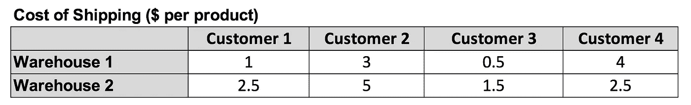

成本矩阵

2.客户需求和仓库可用性如下。

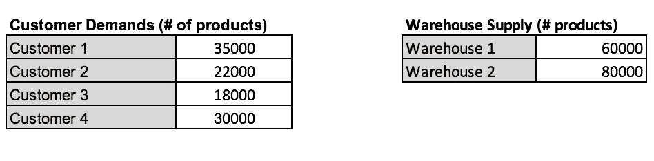

需求(必需)和供应(可用性)矩阵

# 公式化问题

让我们开始用数学方程式来表述这个问题。我们需要确定我们的 LP 的 3 个主要组成部分，即

## 1)决策变量

我们将我们的决策变量定义为 Xij，它基本上告诉我们 X 个产品应该从仓库 I 交付给客户 j。

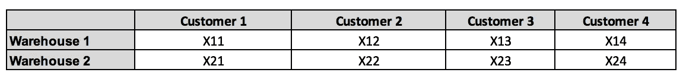

决策变量定义

## 2)目标函数

我们的目标函数被定义为运输这些产品的总成本，我们需要最小化这个总成本。因此，目标函数定义为:-

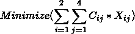

目标函数

## 3)制约因素

对于给定的问题，我们将有两种主要类型的约束:-

**3.1)仓库约束条件或供应约束条件:**这些约束条件基本上表示每个仓库在所有 4 个客户之间完成的总供应量小于或等于该仓库的最大可用性/容量。

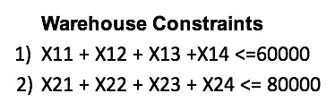

供应限制

**3.2)客户约束或需求约束:**这些约束基本上是说，对于每个客户，跨两个仓库完成的供应应该等于(或大于等于)该客户的需求。我们可以用≥代替=因为我们的目标函数总是试图最小化成本，因此永远不会提供超过需要的。这样做是因为在一些优化问题中，我们可能无法通过严格的等式约束得到可行的解决方案。虽然，这里的情况并非如此。

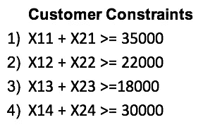

需求约束

> 问题的表述到此结束。我们现在进一步理解如何用 Python 来编码这个问题，并找到供应货物的最小成本。我们还将获得最佳答案，该答案将建议应该由哪个仓库向哪个客户供应多少货物。

# **纸浆快速入门**

> PuLP 是一个用 Python 编写的免费开源软件。它用于将优化问题描述为数学模型。然后，PuLP 可以调用众多外部 LP 解算器(CBC、GLPK、CPLEX、Gurobi 等)中的任何一个来求解该模型，然后使用 python 命令来操作和显示解决方案。请务必阅读它的文档，它非常有用。以下链接也有助于您了解如何在 Python 环境中安装库 PuLP 和任何所需的求解器。
> 
> 来源:[https://coin-or . github . io/pulp/main/installing _ pulp _ at _ home . htm](https://coin-or.github.io/pulp/main/installing_pulp_at_home.html)

# 钻研代码

你可以在下面的 Github repo 中找到将在下面解释的完整代码(Jupyter notebook)。

[](https://github.com/mnips/Linear-Programming-Python-1) [## mni PS/线性编程-Python-1

### 使用 Python (PuLP)进行线性编程的快速指南。-mni PS/线性编程-Python-1

github.com](https://github.com/mnips/Linear-Programming-Python-1) 

# 导入所需的库

```
from pulp import *
import pandas as pd
import numpy as np
```

第一条语句从 PuLP 库中导入我们将使用的所有必需的函数。Pandas 是一个数据操作库，Numpy 是一个主要用于在 Python 中处理多维数组的库。我通常只导入这些库，因为它们在几乎所有的数据分析项目中都会用到。

# 数据定义

让我们定义数据并将其分配给变量，然后这些变量可用于输入模型、目标函数和约束条件。

所有变量都是直观的，易于解释。

# 模型初始化

我们可以通过调用`LpProblem()`函数来初始化模型。函数中的第一个参数表示我们想要给模型起的名字。第二个参数告诉我们的模型，我们是否希望最小化或最大化我们的目标函数。

```
model = LpProblem("Supply-Demand-Problem", LpMinimize)
```

如果你想最大化你的目标函数，你可以使用`LpMaximize`。

# 定义决策变量

您可以在您的模型中定义变量名，以使您的模型对于稍后阅读它的人来说看起来更直观。因此，我们为我们的决策变量创建指数，这将在后面定义。

```
variable_names = [str(i)+str(j) for j in range(1, n_customers+1) for i in range(1, n_warehouses+1)]variable_names.sort()print("Variable Indices:", variable_names)
```

输出如下所示:-

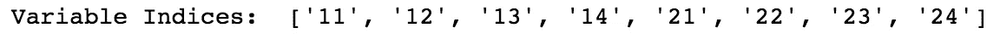

此外，我们使用`LpVariables.matrix`来定义变量。在定义决策变量时，我们也可以使用字典或单例变量，但在这种情况下，这似乎是最好的方法，因为对于更大的问题，仓库或客户的数量可能会增加。我们将决策变量命名为`X`，并使用上面定义的索引作为第二个参数，这有助于 PuLP 理解我们想要一个 2*4 的矩阵。第三个参数是一个类别，它告诉我们决策变量只能取`Integer`值。默认为`Continuous`。这也告诉我们，我们的**线性规划**问题其实是一个**整数 LP** 。如果我们还有可以取连续值的决策变量，我们称之为 **MILP** 或**混合整数 LP** 。在第四个也是最后一个参数中，我们设置了一个`0`的`lower bound`，表示我们的决策变量≥ 0。为了利用 Numpy 数组操作，我们可以将决策变量转换为 Numpy 数组。

```
DV_variables = LpVariable.matrix("X", variable_names, cat = "Integer", lowBound= 0 )allocation = np.array(DV_variables).reshape(2,4)print("Decision Variable/Allocation Matrix: ")print(allocation)
```

输出如下所示:-

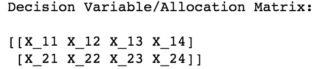

# 目标函数

现在让我们定义我们的目标函数，它基本上是提供产品的总成本。换句话说，它是成本矩阵和上面定义的分配矩阵的和积。我们可以如下定义我们的目标函数。`lpSum`在 Python 中与`sum`函数交替使用，因为它在执行与 PuLP 变量相关的操作时速度更快，并且还能很好地汇总变量。我们使用`+=`速记操作符进一步将目标函数添加到模型中。

```
obj_func = lpSum(allocation*cost_matrix)print(obj_func)model +=  obj_funcprint(model)
```

让我们看看我们的模型现在是什么样子。

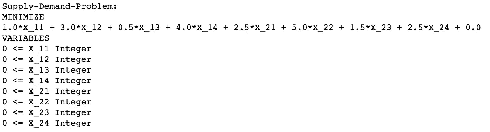

正如我们所看到的，我们已经给我们的问题起了一个名字。在目标函数中，我们试图最小化成本，并且我们所有的决策变量都就位了。最好在创建模型时打印出来，以便了解我们是否遗漏了什么。现在我们继续向我们的模型添加约束。

# 限制

我们需要添加两种主要类型的约束:-

## 1)仓库或供应限制

如前所述，这些约束表明，对于一个给定的仓库或`i-th`仓库，在所有客户之间完成的总分配或供应的产品应该不违反该仓库的可用性。

此约束的输出:

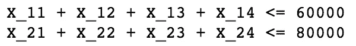

## 2)客户或需求约束

这些约束表明，为每个客户或`j-th`客户完成的分配应该满足该客户的需求。

此约束的输出:

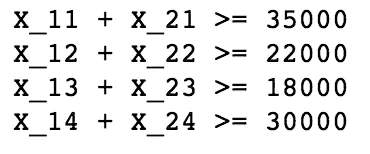

# 检查模型

现在我们已经完成了所有需要的公式，让我们检查模型看起来怎么样。这可以通过打印模型来实现:`print(model)`。

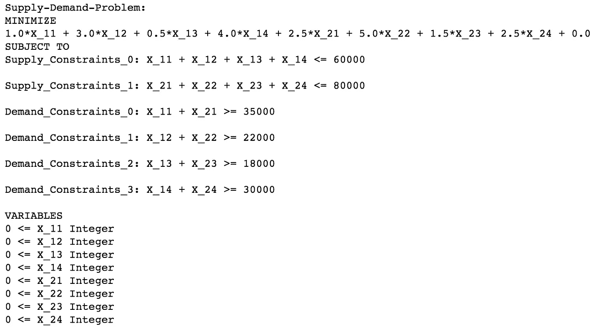

完全优化模型

我们还可以将这个模型保存在一个`.lp`文件中，任何不熟悉我们模型的人都可以参考这个文件。它基本上就像一个文本文件，包含上面打印的优化模型的确切细节。

```
model.writeLP(“Supply_demand_prob.lp”)
```

# 运行模型并检查状态

既然我们已经检查了模型看起来很好，我们现在应该运行模型并检查我们是否得到了问题的可行/最优解决方案。默认情况下，纸浆使用 CBC 解算器，但我们也可以启动其他解算器，如 GLPK，古罗比等。我已经明确地在这里调用了 CBC。类似地，我们可以调用任何其他求解器来代替 CBC。

上面代码的输出是`Optimal`，它告诉我们我们的模型已经能够找到问题的最优解。

# 输出目标函数值和决策变量值

现在让我们看看公司通过打印出我们的问题的最优解(即目标函数值)而必须承担的最小成本，并看看将产品从仓库运送到客户的最优安排。

输出是:

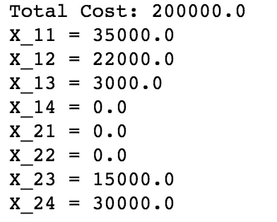

此外，我们可以检查每个仓库需要供应多少产品，以及每个仓库需要多少容量。

输出:

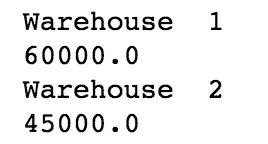

因此，我们在 2 号仓库只需要 45000 件，而不是 80000 件。虽然在这种情况下非常幼稚，但是我们可以从优化问题的输出中做很多类似的分析，做出相关的商业决策。比如，如果每个仓库都有运营成本。这个供求问题可以有许多不同的形式。探索！

# 摘要

我们简要地看了最优化和线性规划。我们还学习了如何用数学方程来表述一个问题。此外，我们通过利用 Python 和 PuLP 库并分析其结果，深入研究了编码 LP 问题。就这样，我们到了这篇文章的结尾。希望你觉得这有用！

我还要感谢我亲爱的朋友 Karan Bhanot，他通过他的文章激励了我，也激励我与世界分享我的知识！

***注:*** *我用过 Python 3 . 7 . 6 版和纸浆 2.1 版。您没有必要使用相同的版本，但有时由于 PuLP 库中的一些更新，可能会有微小的差异导致错误(主要是由于语法变化)，因此将此作为快速注释添加进来。*