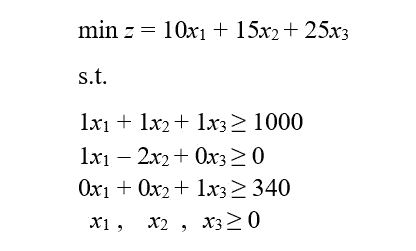
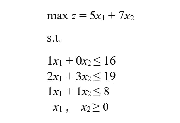

# 用 Python 进行线性编程

> 原文：<https://towardsdatascience.com/linear-programming-with-python-db7742b91cb?source=collection_archive---------16----------------------->

## 面向工业工程师的 Python

## 探索 SciPy 的“linprog”功能

由 Kim 拍摄的图片可在 [Unsplash](https://unsplash.com/photos/MAgPyHRO0AA) 获得

# 运筹学

运筹学是一种科学的决策方法，通常在需要分配稀缺资源的条件下，寻求系统的最佳设计和操作。制定决策的科学方法需要使用一个或多个数学/优化模型(即实际情况的表示)来做出最佳决策。

优化模型寻求在满足给定 ***约束*** 的决策变量的所有值的集合中找到优化(最大化或最小化) ***目标函数*** 的 ***决策变量*** 的值。它的三个主要组成部分是:

*   目标函数:要优化的函数(最大化或最小化)
*   决策变量:影响系统性能的可控变量
*   约束:决策变量的一组限制(即线性不等式或等式)。非负约束限制决策变量取正值(例如，您不能产生负的项目数 *x* 1、 *x* 2 和 *x* 3)。

优化模型的解称为**最优可行解**。

# 建模步骤

精确地模拟一个运筹学问题是最重要的——有时也是最困难的——任务。一个错误的模型将导致一个错误的解决方案，因此，不会解决原来的问题。以下步骤应该由具有不同专业领域的不同团队成员执行，以获得模型的准确和更好的视图:

1.  **问题定义**:定义项目的范围，确定结果是三个要素的确定:决策变量的描述、目标的确定和限制条件(即约束条件)的确定。
2.  **模型构建**:将问题定义转化为数学关系。
3.  **模型求解**:使用标准优化算法。在获得解决方案后，应进行敏感性分析，以找出由于某些参数的变化而导致的解决方案的行为。
4.  **模型有效性**:检查模型是否如预期的那样工作。
5.  **实施**:将模型和结果转化为解决方案的建议。

# 线性规划

线性规划(也称为 LP)是一种运筹学技术，当所有目标和约束都是线性的(在变量中)并且所有决策变量都是**连续的**时使用。在层次结构中，线性规划可以被认为是最简单的运筹学技术。

Python 的 [SciPy](https://www.scipy.org/) 库包含了 [*linprog*](https://docs.scipy.org/doc/scipy/reference/generated/scipy.optimize.linprog.html) 函数来解决线性编程问题。使用 *linprog* 时，在编写代码时需要考虑两个因素:

*   该问题必须被公式化为最小化问题
*   不等式必须表示为≤

## 最小化问题

让我们考虑下面要解决的最小化问题:

让我们来看看 Python 代码:

**结果**

## 最大化问题

由于 Python 的 SciPy 库中的 *linprog* 函数被编程为解决最小化问题，因此有必要对原始目标函数进行转换。通过将目标函数的系数乘以-1(即通过改变它们的符号)，可以将每个最小化问题转化为最大化问题。

让我们考虑下面要解决的最大化问题:

让我们来看看 Python 代码:

**结果**

# 总结想法

线性规划代表了一个更好的决策制定的伟大的优化技术。Python 的 [SciPy](https://www.scipy.org/) 库中的[*linprog*](https://docs.scipy.org/doc/scipy/reference/generated/scipy.optimize.linprog.html)*函数允许用几行代码解决线性编程问题。虽然有其他免费优化软件(如 GAMS、AMPL、TORA、LINDO)，但使用 *linprog* 函数可以节省大量时间，因为您不必从头开始编写单纯形算法，也不必检查每个操作直到达到最优值。*

**— —**

**如果你觉得这篇文章有用，欢迎在* [*GitHub*](https://github.com/rsalaza4/Python-for-Industrial-Engineering/tree/master/Linear%20Programming) *上下载我的个人代码。你也可以直接在 rsalaza4@binghamton.edu 给我发邮件，在*[*LinkedIn*](https://www.linkedin.com/in/roberto-salazar-reyna/)*上找到我。有兴趣了解工程领域的数据分析、数据科学和机器学习应用的更多信息吗？通过访问我的媒体* [*个人资料*](https://robertosalazarr.medium.com/) *来探索我以前的文章。感谢阅读。**

*罗伯特*