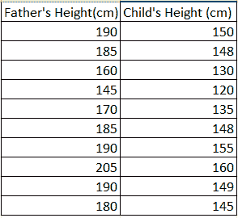
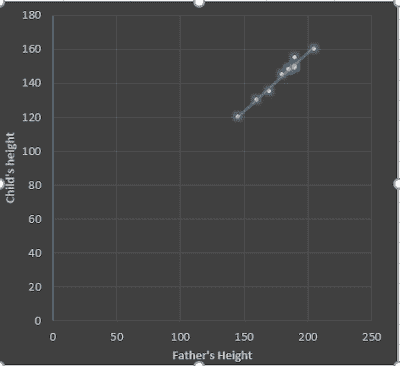
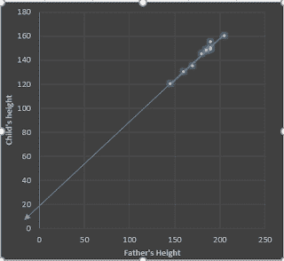

# 线性回归 101

> 原文：<https://towardsdatascience.com/linear-regression-101-2fe898297b3?source=collection_archive---------19----------------------->

## 学习线性回归的外行指南

Alexander Schimmeck 在 [Unsplash](https://unsplash.com/s/photos/height?utm_source=unsplash&utm_medium=referral&utm_content=creditCopyText) 上的照片

在这篇文章中，我想谈谈最简单的机器学习算法之一——线性回归。我将尝试使用一个真实的例子，用简单的术语解释这个模型。

让我们深入研究一下。

## 介绍

让我们假设你在学校参加一个高中家长会。你看到学校里的孩子们都和他们的父母一起来，坐在一个巨大的大厅里。

当孩子们和他们的父母一起起床时，你会注意到一些奇怪的事情。*孩子们的身高和他们父母的身高直接相关。*
即如果孩子的父母是高个子，那么孩子就是高个子，如果父母是矮个子，那么孩子也是矮个子。

你决定深入研究这个问题，从收集一些关于父亲和孩子身高的数据开始。

您将获得以下信息。

## 形象化

现在，您开始考虑以图表形式显示这些数据的最佳方式。

首先绘制一个散点图，以了解这两组身高之间的关系，Y 轴表示孩子的身高，X 轴表示父亲的身高

描述孩子和父亲身高之间关系的情节

画出图后，你可以直观地看到父亲的身高和孩子的身高之间有明确的关系。

> 随着父亲身高的增加，孩子的身高也会增加。

接下来，我们将尝试通过散点图拟合一条线，使点和线之间的距离最小化。直线和每个点之间的距离称为误差。

你现在考虑如何用方程的形式表达这条线。我们可以这样写一个方程。

> 孩子的身高=常数+直线的斜率*(父亲的身高)+误差项

上述方程被称为简单线性回归方程。

我们可以通过延长这条线，并查看它与 Y 轴相交的位置，来获得常数的值。

常数项和直线斜率也称为该方程的参数，称为β0 和β1。

所以我们可以把上面的等式写成

> y = β0 + β1 * x + e

其中 y 是孩子的身高，x 是父亲的身高，β0 是常数，β1 是斜率，e 是误差项。

如果您有足够的关于父亲身高和孩子身高的数据(训练数据),我们可以使用它来创建一个简单的线性模型，如果我们知道父亲的身高，就可以用它来预测孩子的身高。

## **模型解释**

任何建模活动的一个重要部分是如何解释模型参数。

我们可以这样解释这个模型。

β1 —该参数告诉我们，如果父亲的身高增加 1 个单位，孩子的身高会增加多少，反之亦然。

β0 —这可以解释为当父亲的身高为零时孩子的身高，这在现实世界中不可能发生，因为父亲的身高永远不会为零。

## **总结**

简单线性回归虽然是一个非常幼稚的模型，因为它只假设线性关系，但仍然非常重要，因为它有助于我们理解因变量和自变量之间的关系。

我们现在还可以在这个模型的基础上添加更多的特征，比如母亲的身高、孩子的性别等等。

这个添加了多个独立特征的模型被称为多元线性回归，我将在以后的帖子中讨论。