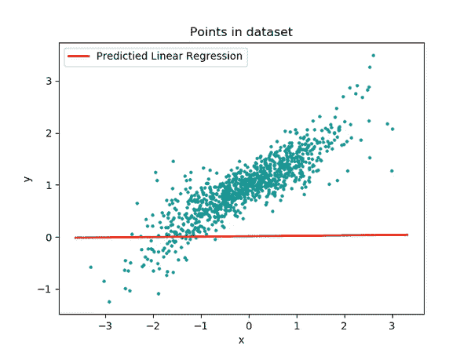
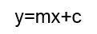
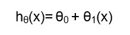
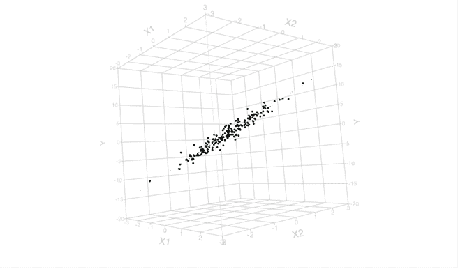
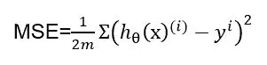
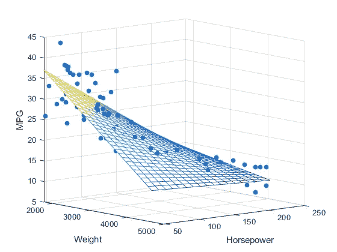
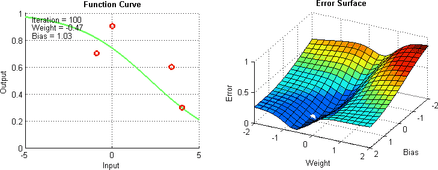

# 机器学习中线性回归的一种实用方法

> 原文：<https://towardsdatascience.com/linear-regression-5100fe32993a?source=collection_archive---------7----------------------->


图片由[皮克斯拜](https://pixabay.com/?utm_source=link-attribution&amp;utm_medium=referral&amp;utm_campaign=image&amp;utm_content=3502288)的[米尔科·格里森迪](https://pixabay.com/users/Hurca-8968775/?utm_source=link-attribution&amp;utm_medium=referral&amp;utm_campaign=image&amp;utm_content=3502288)拍摄

## 线性回归初学者实践指南

在之前的博客文章中，我试图给你一些关于机器学习基础的直觉。在本文中，我们将从我们的第一个机器学习算法开始，那就是线性回归。

首先，我们将学习线性回归的数学方面，然后我将尝试阐明一些重要的回归术语，如假设和成本函数，最后我们将通过构建我们自己的回归模型来实施我们所学的内容。

# **什么是线性回归？**

回归模型是监督学习模型，通常在要预测的值具有离散或定量性质时使用。使用回归模型的一个最常见的例子是通过训练该地区的房屋销售数据来预测房屋价格。



图片来自 [CDOT 维基](https://wiki.cdot.senecacollege.ca/wiki/DPS921/Franky)

线性回归模型背后的思想是获得最适合数据的直线。所谓最佳拟合，意思是所有点离回归线的总距离应该是最小的。通常这些点离我们回归线的距离被称为**误差**，尽管从技术上来说并不是。我们知道直线方程的形式是:



其中 y 是**因变量**，x 是**自变量**，m 是直线的**斜率**，c 是**系数**(或 y 截距)。这里，y 被认为是因变量，因为它的值取决于自变量和其他参数的值。

该方程是任何线性回归问题的基础，并被称为线性回归的**假设函数**。大多数机器学习算法的目标是构建一个模型，即一个假设，以根据我们的自变量估计因变量。

这个假设将我们的输入映射到输出*。*线性回归的**假设通常表示为:**



在上面提到的表达式中， **hθ(x)** 是我们的**假设，θ0** 是**截距**，而 **θ1** 是模型的**系数**。

# **了解成本函数**

**成本函数**用于计算模型的执行情况。通俗地说，代价函数就是所有误差的总和。在构建我们的 ML 模型时，我们的目标是**最小化**成本函数。



图片来自[JMP.com](https://www.google.com/url?sa=i&url=https%3A%2F%2Fwww.jmp.com%2Fen_us%2Fstatistics-knowledge-portal%2Fwhat-is-multiple-regression%2Ffitting-multiple-regression-model.html&psig=AOvVaw2uLZfXPongP6_iuZEKxaUh&ust=1605340763037000&source=images&cd=vfe&ved=0CAMQjB1qFwoTCLiE5M2G_-wCFQAAAAAdAAAAABAg)

回归问题中经常使用的一个常见函数是**均方误差**或 **MSE** ，它测量已知值和预测值之间的差异。



事实证明，取上述方程的根是更好的选择，因为这些值不太复杂，因此通常使用**均方根误差**或 **RMSE** 。我们还可以使用平均绝对误差等其他参数来评估回归模型。

RMSE 告诉我们数据点离回归线有多近。现在，我们将通过构建我们自己的线性回归模型来预测房子的价格，从而实现我们到目前为止所学到的知识。



来自[介质](https://medium.com/datadriveninvestor/basics-of-linear-regression-9b529aeaa0a5)的图像

在这里，我将使用 Google Colab 来构建这个模型。您还可以使用 Jupyter 笔记本之类的其他 ide 来玩这个模型。

> *用于这个线性回归项目的代码可以在* [*这里*](https://colab.research.google.com/drive/1ikNigGGw8AXEiUM6XUpxgrxkccjHNXX3?usp=sharing) *找到。*

## **第一步:导入库并加载数据**

我们的第一步是导入构建模型可能需要的库。没有必要在一个地方导入所有的库。为了开始，我们将进口**熊猫**， **Numpy** ， **Matplotlib** 等。

```
*#Import Required Libraries* import pandas as pd
import numpy as np
import matplotlib.pyplot as plt
import seaborn as sns*#Read the Dataset*df=pd.read_csv('kc_house_data.csv')
```

一旦这些库被导入，我们的下一步将是获取数据集和加载我们的数据。在加载数据时，需要注意的是文件名应该有它的格式(。csv/。xls)在末尾指定。

> *我用于这个模型的数据可以直接从* [*这里*](https://drive.google.com/open?id=1GNa5JHDzl16Vk20Zbfz55f7wWqOCCqBO) *下载。*


**CSV 文件**最常用于此目的，尽管 excel 表格也可以使用。唯一的区别是，在使用 excel 表作为数据集时，我们将不得不使用 **read_excel()** ，而不是 **read_csv()** 。

## **第二步:可视化数据**

成功加载数据后，我们的下一步是可视化这些数据。数据可视化是数据科学家角色的重要组成部分。建议将数据可视化，以便找出不同参数之间的相关性。

```
*#Visualising the data using heatmap* plt.figure()
sns.heatmap(df.corr(),cmap='coolwarm')
plt.show()
```

Matplotlib 和**search**是优秀的库，可以用来可视化我们在各种不同地块上的数据。

## 第三步:特征工程

在可视化我们的数据的同时，我们发现两个参数之间有很强的相关性: **sqft_living** 和 **price** 。因此，我们将使用这些参数来构建我们的模型。

```
*#Selecting the required parameters* area = df[‘sqft_living’]
price = df['price']x = np.array(area).reshape(-1,1)
y = np.array(price)
```

更多的参数也可以添加到模型中，尽管这可能会影响其准确性。使用各种特征来预测响应变量结果的模型被称为**多元回归模型**。

## **第四步:拟合线性回归模型**

选择所需参数后，下一步是从 **sklearn** 库中导入方法 **train_test_split** 。这用于将我们的数据分为训练和测试数据。通常 70–80%的数据作为训练数据集，而剩余的数据构成测试数据集。

```
*#Import LinearRegression and split the data into training and testing dataset* from sklearn.model_selection import train_test_split
X_train, X_test, y_train, y_test = train_test_split(x,y,test_size=0.2,random_state = 0)y_train = y_train.reshape(-1,1)
y_test = y_test.reshape(-1,1)*#Fit the model over the training dataset* from sklearn.linear_model import LinearRegression
model = LinearRegression()
model.fit(X_train,y_train)
```

在此之后，从**sk learn . model _ selection**导入**线性回归**，并且模型适合训练数据集。我们模型的**截距**和**系数**可以计算如下:

```
*#Calculate intercept and coefficient* print(model.intercept_)
print(model.coef_)pred=model.predict(X_test)
predictions = pred.reshape(-1,1)*#Calculate root mean squared error to evaluate model performance* from sklearn.metrics import mean_squared_error
print('MSE : ', mean_squared_error(y_test,predictions)
print('RMSE : ', np.sqrt(mean_squared_error(y_test,predictions)))
```

可以通过找到模型的均方根误差来评估模型的性能。**RMSE 越小，模型越好。**

# **使用梯度下降的线性回归**

梯度下降是一种**迭代优化算法**寻找一个函数的最小值。为了理解这个算法，想象一个没有方向感的人想要到达谷底。



图片由[达里亚·库马尔](https://medium.com/@dhairyakumar10?source=post_page-----63c618cdddaf--------------------------------)在[媒体](https://medium.com/@dhairyakumar10/linear-regression-with-gradient-descent-63c618cdddaf)上拍摄

他走下斜坡，在斜坡陡的时候迈大步，在斜坡不那么陡的时候迈小步。他根据当前位置决定下一个位置，当他到达他的目标山谷底部时停下来。梯度下降也是如此。

```
*#Initializing the variables* m = 0
c = 0
L = 0.001
epochs = 100n = float(len(x))
```

梯度下降法逐步应用于我们的 m 和 c。最初让 m = 0，c = 0。设 L 为我们的**学习率**。这控制了 m 值随每步变化的程度。

```
for i in range(epochs):
    Y_pred=m*x+c
    Dm = (-2/n)*sum(x*(y-Y_pred))
    Dc = (-2/n)*sum(y-Y_pred)
    m = m-L*Dm
    c = c-L*Dc
print(m,c)*#Predicting the values* y_pred = df['sqft_living'].apply(lambda a:c+m*a)
y_pred.head()
```

优选地，L 被赋予一个小的值，以便提高精度。我们的下一步是计算损失函数相对于 m 和 c 的偏导数。一旦完成，我们**更新 c 和 m** 的值，并重复该过程，直到我们的损失函数非常小。

至此，我们已经到了这篇文章的结尾。我希望这篇文章能帮助你了解线性回归算法背后的思想。如果你有任何问题，或者如果你认为我犯了任何错误，请联系我！可以通过:[邮箱](http://rajashwin812@gmail.com/)或 [LinkedIn](http://linkedin.com/in/rajashwin/) 与我联系。