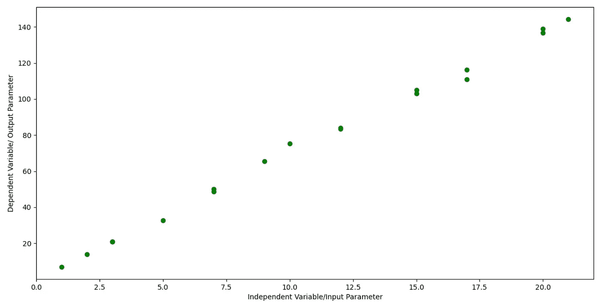
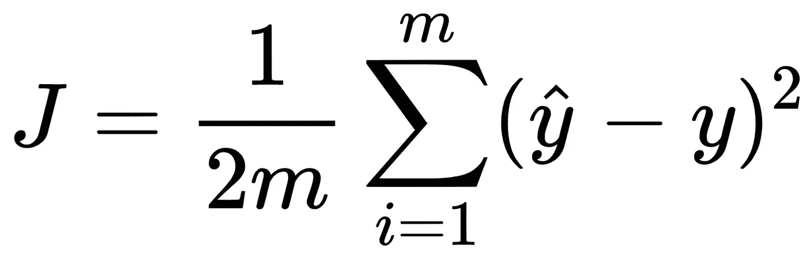
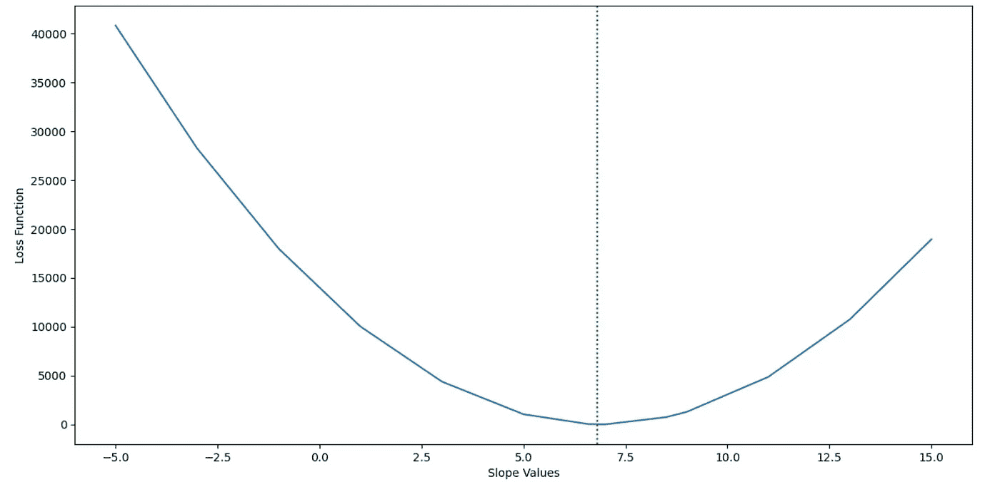
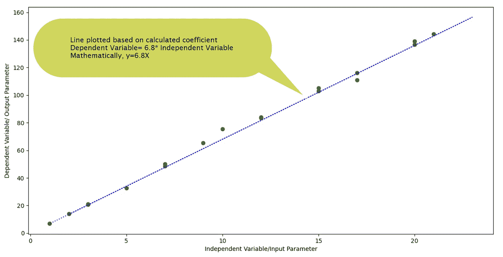
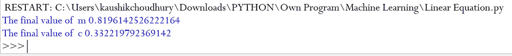
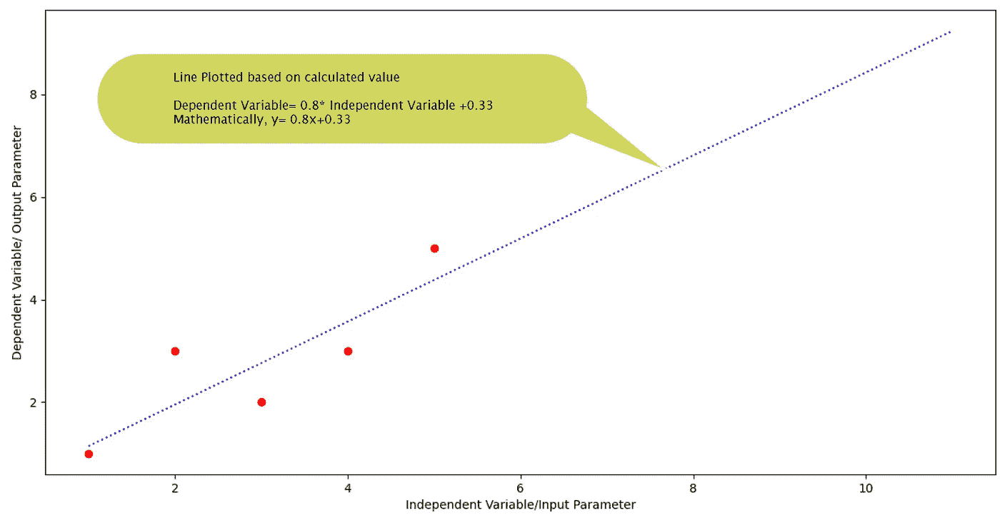
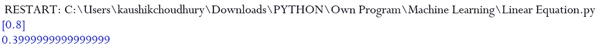

# 线性回归算法——面向非数学家的隐蔽数学

> 原文：<https://towardsdatascience.com/linear-regression-algorithm-under-the-hood-math-for-non-mathematicians-c228d244e3f3?source=collection_archive---------59----------------------->

## [内部 AI](https://towardsdatascience.com/machine-learning/home)

## 它是机器学习中借用的数学和统计学领域最古老的算法之一。


由[安托万·道特里](https://unsplash.com/@antoine1003?utm_source=medium&utm_medium=referral)在 [Unsplash](https://unsplash.com?utm_source=medium&utm_medium=referral) 上拍摄的照片

在计算机出现之前，线性回归是在不同领域中使用的最流行的算法之一。今天有了强大的计算机，我们可以解决多维线性回归，这在以前是不可能的。在一元或多维线性回归中，基本的数学概念是相同的。

今天有了机器学习库，像 ***Scikit* -learn** ，就可以在建模中使用线性回归，而不需要理解它背后的数学概念。在我看来，对于一个数据科学家和机器学习专业人士来说，在使用算法之前，了解算法背后的数学概念和逻辑是非常必要的。

我们大多数人可能没有学习过高等数学和统计学，看到算法背后的数学符号和术语时，我们会感到害怕。在本文中，我将用简化的 python 代码和简单的数学来解释线性回归背后的数学和逻辑，以帮助您理解

***概述***

我们将从一个简单的一元线性方程开始，没有任何截距/偏差。首先，我们将学习像 ***Scikit-learn*** 这样的包所采取的逐步解决线性回归的方法。在本演练中，我们将理解梯度下降的重要概念。此外，我们将看到一个带有一个变量和截距/偏差的简单线性方程的示例。

*步骤 1:* 我们将使用 python 包 NumPy 来处理样本数据集，并使用 Matplotlib 来绘制各种可视化图形。

```
import numpy as np
import pandas as pd
import matplotlib.pyplot as plt
```

第二步:让我们考虑一个简单的场景，其中单个输入/自变量控制结果/因变量的值。在下面的代码中，我们声明了两个 NumPy 数组来保存自变量和因变量的值。

```
Independent_Variable=np.array([1,2,3,12,15,17,20,21,5,7,9,10,3,12,15,17,20,7])
Dependent_Variable=np.array([7,14,21,84,105,116.1,139,144.15,32.6,50.1,65.4,75.4,20.8,83.4,103.15,110.9,136.6,48.7])
```

*第三步:*让我们快速画一个散点图来了解数据点。

```
plt.scatter(Independent_Variable, Dependent_Variable,  color='green')
plt.xlabel('Independent Variable/Input Parameter')
plt.ylabel('Dependent Variable/ Output Parameter')
plt.show()
```



我们的目标是制定一个线性方程，它可以预测自变量/输入变量的因变量值，误差最小。

因变量=常数*自变量

用数学术语来说，Y =常数*X

就可视化而言，我们需要找到最佳拟合线，以使点的误差最小。

在机器学习领域，最小误差也被称为损失函数。



损失函数公式(作者用 word 写的然后截图)

我们可以用所有独立的数据点计算方程 Y =常数*X 中每个假定常数值的迭代损失。目标是找到损耗最小的常数，并建立方程。请注意，在损失函数等式中,“m”代表点数。在当前示例中，我们有 18 个点，因此 1/2m 转化为 1/36。不要被损失函数公式吓到。我们将损失计算为每个数据点的计算值和实际值之差的平方和，然后除以两倍的点数。我们将在下面的文章中借助 python 中的代码一步一步地破译它。

*步骤 4:* 为了理解识别方程背后的核心思想和数学，我们将考虑下面代码中提到的有限的一组常数值，并计算损失函数。

在实际的线性回归算法中，特别是间隙，常数被考虑用于损失函数计算。最初，考虑用于损失函数计算的两个常数之间的差距较大。随着我们越来越接近实际的解决方案常数，考虑更小的差距。在机器学习的世界中，学习率是损失函数计算中常数增加/减少的差距。

```
m=[-5,-3,-1,1,3,5,6.6,7,8.5,9,11,13,15]
```

*步骤 5:* 在下面的代码中，我们计算所有输入和输出数据点的每个常量值(即在前面步骤中声明的列表 m 中的值)的损失函数。

我们将每个常数的计算损失存储在一个 Numpy 数组“errormargin”中。

```
errormargin=np.array([])
for slope in m:
    counter=0
    sumerror=0
    cost=sumerror/10
    for x in Independent_Variable:
        yhat=slope*x
        error=(yhat-Dependent_Variable[counter])*(yhat-Dependent_Variable[counter])
        sumerror=error+sumerror
        counter=counter+1  
    cost=sumerror/18
    errormargin=np.append(errormargin,cost)
```

*第六步:*我们将绘制常量的计算损失函数，以确定实际常量值。

```
plt.plot(m,errormargin)
plt.xlabel("Slope Values")
plt.ylabel("Loss Function")
plt.show()
```

曲线在最低点的常数的值是真正的常数，我们可以用它来建立直线的方程。



在我们的例子中，对于常数 6.8 的值，曲线处于最低点。

该值为 Y=6.8*X 的直线可以以最小的误差最好地拟合数据点。



这种绘制损失函数并在损失曲线的最低点识别方程中固定参数的真实值的方法被称为 ***梯度下降*** 。作为一个例子，为了简单起见，我们考虑了一个变量，因此损失函数是一个二维曲线。在多元线性回归的情况下，梯度下降曲线将是多维的。

我们已经学习了计算自变量系数的内功。接下来，让我们一步一步地学习线性回归中计算系数和截距/偏差的方法。

*第一步:*和前面一样，让我们考虑一组自变量和因变量的样本值。这些是可用的输入和输出数据点。我们的目标是制定一个线性方程，它可以预测自变量/输入变量的因变量值，误差最小。

因变量=(系数*自变量)+常数

用数学术语来说，y=(系数*x)+ c

请注意，系数也是一个常数项乘以方程中的自变量。

```
Independent_Variable=np.array([1,2,4,3,5])
Dependent_Variable=np.array([1,3,3,2,5])
```

*第二步:*我们将假设系数的初始值和常数“m”和“c”分别为零。我们将在误差计算的每一次迭代之后以 0.001 的小学习率增加 m 和 c 的值。Epoch 是我们希望在整个可用数据点上进行这种计算的次数。随着历元数量的增加，解会变得更加精确，但这会消耗时间和计算能力。基于业务案例，我们可以决定计算值中可接受的误差，以停止迭代。

```
LR=0.001
m=0
c=0
epoch=0
```

*步骤 3:* 在下面的代码中，我们在可用的数据集上运行 1100 次迭代，并计算系数和常数值。

对于每个独立的数据点，我们计算相关值(即 yhat)，然后计算计算的和实际的相关值之间的误差。

基于该误差，我们改变系数和常数的值用于下一次迭代计算。

新系数=当前系数—(学习率*误差)

新常数=当前常数-(学习率*误差*独立变量值)

```
while epoch<1100:
    epoch=epoch+1
    counter=0
    for x in Independent_Variable:
        yhat=(m*x)+c
        error=yhat-Dependent_Variable[counter]
        c=c-(LR*error)
        m=m-(LR*error*x)
        counter=counter+1
```

在对可用数据集进行 1100 次迭代后，我们检查系数和常数的值。

```
print("The final value of  m", m)
print("The final value of  c", c)
```



数学上可以表示为 y=(0.81*x)+0.33



最后，让我们将之前的输出与 ***Scikit* -learn** 线性回归算法的结果进行比较

```
from sklearn.linear_model import LinearRegression
reg = LinearRegression().fit(Independent_Variable.reshape(-1,1), Dependent_Variable)
print(reg.coef_)
print(reg.intercept_)
```



通过对可用数据集进行 1100 次迭代，系数和常数/偏差的计算值非常接近于 ***Scikit* -learn** 线性回归算法的输出。

我希望这篇文章能让你对线性回归的幕后数学计算和概念有一个明确的理解。此外，我们已经看到了梯度下降被应用于寻找最优解的方式。在多元线性回归的情况下，数学和逻辑保持不变，只是在更多的维度上进一步扩展。