# Python 中房价的线性回归分析

> 原文：<https://towardsdatascience.com/linear-regression-analysis-on-house-price-in-python-55bbe2cd3fd9?source=collection_archive---------29----------------------->

> 如今，我们都变得如此习惯于谈论深度学习、大数据、神经网络……我们似乎忘记了，即使这些大话题正在蓬勃发展，但不是每个企业都需要它们，至少现在是这样。因此，我想分享一点我在常见统计话题上的经验。在这篇和下一篇博客中，我将分别演示如何用 Python 和 R 进行线性回归分析。

# 项目摘要

这个由 Kaggle 提供的项目包括一个由 79 个解释变量组成的数据集，描述了爱荷华州 Ames 住宅的各个方面。你可以在这里找到项目[的所有数据来源和描述。](https://www.kaggle.com/c/house-prices-advanced-regression-techniques)

这项竞赛的目标是预测每所挂牌房屋的最终销售价格。我们做这个问题是因为我们希望应用我们的回归技术和数据探索性分析技巧。这个习题集允许我们使用以上所有的练习。此外，数据集包含许多缺失值，这使我们能够获得处理缺失数据的经验。

我们运行了多重回归技术，如 *XGB 回归器*、 *SGD 回归器*、 *MLP 回归器*、*决策树回归器*、*随机森林回归器*、 *CatBoost 回归器*、*轻型 GBM* 和 *SVR* 。我们把一些放在一起，实验看哪一个的均方根误差最小。

我们提交的预测有两列(图 1.1)。第一列是房子的 ID，第二列是我们预测的销售价格。根据预测值对数和观察到的销售价格日志之间的均方根误差对预测进行评分。最小的 RMSE 是最好的预测。在运行基础模型和优化模型后，我们发现我们的 tubed CatBoost 回归模型为我们获得了最低的 RMSE 分数 0.12392，在我们提交时，它在排行榜上排名第 863 位(共 4525 位)。

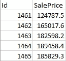

*图 1.1 —提交样本*

# 数据

## -概述

竞赛为我们提供了两个数据集。其中之一是有 1460 个观察值和 81 列的训练数据，它包含每栋房子的 ID 和销售价格。另一个数据集是维持文件，它包含 1459 个观察值。

我们首先研究了训练数据集的特征类型。图 2.1 显示整个数据集有 43 个分类特征和 36 个数字变量，包括“ID”。

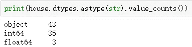

*图 2.1 —数字的数量&分类特征*

然后，我们努力检测数据集中是否有任何丢失的值。在训练数据集中，有 19 个变量缺少值。维持数据集包含 33 个缺失值的要素。有些要素缺失值的百分比非常高。例如，PoolQC(池质量)特性的缺失值高达 99.5%。像 PoolQC 这样的特性可能会损害预测模型的准确性，并导致我们得出无效的结论。因此，我们删除了至少有 80%的值丢失的特征。详情见“数据处理”部分。

在我们开始处理数据之前，我们还研究了 38 个数字特征的必要统计信息。在图 2.2 中，我们发现一些特性的范围相对较大，比如销售价格。我们将要使用的许多回归模型需要我们在处理之前对这些特征进行某种类型的转换。

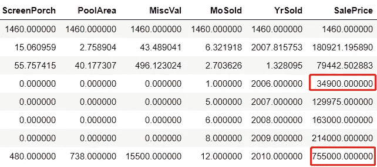

*图 2.2 —所有数字变量的统计信息*

## -数据处理

缺失值总是会损害预测模型的准确性。在进行任何转换之前，我们决定首先检查至少有 80%的值丢失的列。根据图 2.3，有四个变量有大量的缺失值，它们是“Alley”、“PoolQC”、“Fence”和“MiscFeature”。

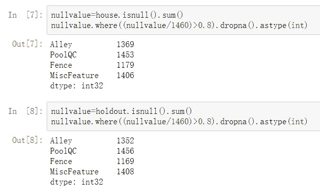

*图 2.3——至少有 80%缺失值的变量*

在处理数据时，确保对定型数据集和维持数据集进行相同的更改是至关重要的。每个数据集中列数的差异、不一致的数据格式以及分类变量中不匹配的值数目都可能给我们的模型带来麻烦。因此，为了更好地准备数据并确保任何转换都将反映在定型数据集和维持数据集上，我们使用图 2.4 中的代码将这两个数据集临时合并为标签 0 和 1，并且还提供了将数据集拆分回原始数据集的代码。

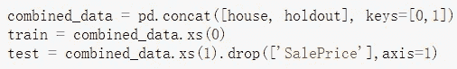

*图 2.4 —合并和取消合并数据集的代码*

对于所有的分类变量，我们将它们转换成虚拟变量来处理缺失值。我们用数字变量中所有缺失值的当前变量的平均值来填充它们。

## -特征工程

我们还在现有变量的基础上创建了一些新变量。例如，我们使用关于房子何时装修和出售的数据，生成了一个名为“AgeofHouse”的新变量，这有助于我们直观地了解房价和房子质量之间的关系。

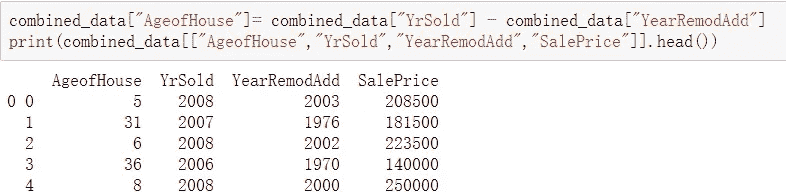

*图 2.5 —新功能“房屋时代”*

我们想知道是否需要对“销售价格”进行对数转换，因为它包含一些相对较大的值，这些值会对模型的准确性产生负面影响。对数变换前后的残差与拟合图(图 2.6 和图 2.7)证实了我们的假设，即变换使模型更加线性。

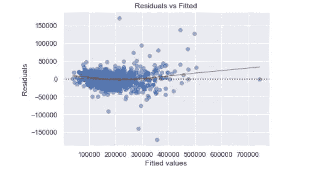

*图 2.6——对数变换前的残差与拟合值*

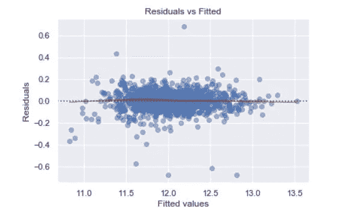

*图 2.7——对数变换后的残差与拟合值*

## -相关图

我们创建了一些图表来研究数据。我们首先查看目标变量和其余变量之间的相关性。图 2.8 显示了与房屋销售价格绝对相关的前 30 个特征。深色表示变量与销售价格负相关。

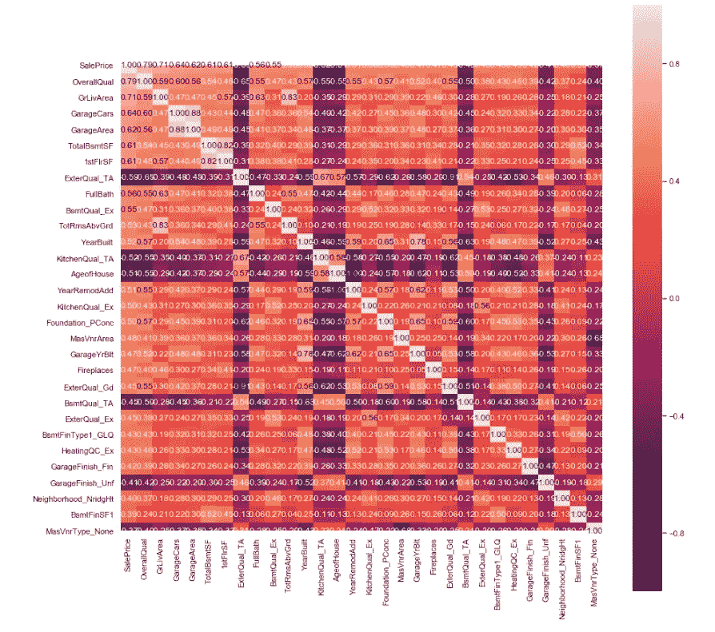

*图 2.8 —前 30 个“最”相关变量*

我们还详细研究了“销售价格”和个体变量之间的关系。我们选择了几个有趣的图表来呈现在这份报告中。例如，我们制作了一个散点图(图 2.9)关于“销售价格”和“房屋年龄”，这是我们在上一步中创建的特征。我们可以看到，房子越新，房子越有可能以更高的价格出售。因此，我们确信价格超过 50 万美元的房屋是在最近 15 年内建造或翻新的。

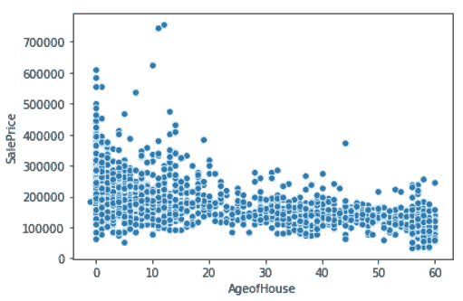

*图 2.9——房龄与销售价格*

另一个例子是“总体平等”和“销售价格”的情节。“总体质量”是与“销售价格”最正相关的变量，该图(图 2.10)清楚地表明，评级越高，价格越高。

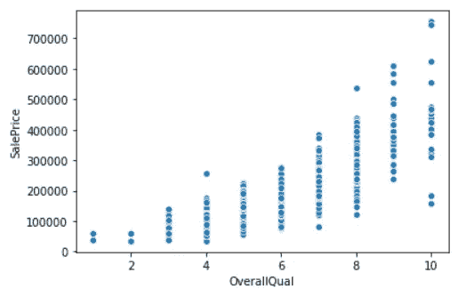

*图 2.10 —总体质量与销售价格*

我们的最终训练数据集有 1460 个观察值和 289 个变量，而维持数据集有 1459 个观察值和 289 个变量。

# 建模

## -单个型号的性能(基本型号与调整型号)

在这种情况下，选择了九个回归模型:

***OLS，XGBRegressor，SGD regressor***
***DecisionTreeRegressor，RandomForestRegressor，SVR***
***CatBoostRegressor，LightGBM，MLPRegressor*** *。*

我们使用 OLS 作为基础模型，并生成了图 3.1 中模型的回归结果:

```
#original 
#generate OLS model
sm_model = sm.OLS(y_train, sm.add_constant(X_train))
sm_model_fit = sm_model.fit()print(sm_model_fit.summary())
```

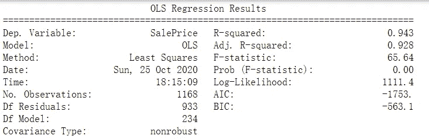

*图 3.1 — OLS 回归结果*

根据 OLS 报告，我们了解到 R 平方为 0.943，这意味着该模型可以解释 94.3%的“销售价格”。该模型的 kaggle 得分为 0.15569。

下表(图 3.2)列出了所有模型的 kaggle 分数，包括未调整和调整的参数。在所有其他模型中，具有调谐参数的 CatBoostRegressor 具有最佳性能， **0.12392** 。在我们撰写本报告时，这个分数使我们在 4525 个团队中排名第 863 位(相当于前 19%)。

```
# Example codemlp=MLPRegressor(random_state=42)#paramters for gridsearch
mlp_param = {
    'hidden_layer_sizes': [(273,230,30), (273,230,20), (273,230,50)],
    'activation': ['tanh'],
    'solver': ['sgd'],  #, 'adam'
    'alpha': [0.0001],
    'learning_rate': ['adaptive'],    #'constant',
}
----------------------#Apply GridSearchCV
mlp_grid = GridSearchCV(mlp,
                        mlp_param,
                        cv = 5,
                        n_jobs = 3,
                        verbose=True)mlp_grid.fit(X_train,y_train)
print(mlp_grid.best_score_)
print(mlp_grid.best_params_)output:
0.8218847474014372
{'activation': 'tanh', 'alpha': 0.0001, 'hidden_layer_sizes': (273, 230, 30), 'learning_rate': 'adaptive', 'solver': 'sgd'}
----------------------#Fit the model with bets paramters
mlp_best_model=MLPRegressor(activation= 'tanh',
                 alpha=0.0001, 
                 hidden_layer_sizes=(273, 230, 30),
                 learning_rate= 'adaptive', 
                 solver= 'sgd')
mlp_best_model.fit(X_train,y_train)
----------------------#Make Predictions and submit files
mlp_prediction = mlp_best_model.predict(test.drop(["Id"],1))
mlp_DATA = pd.DataFrame({"ID":holdout["Id"],
                         "SalePrice":np.exp(mlp_prediction)})
mlp_DATA.to_csv("mlpstandard1.csv",index=False)
```

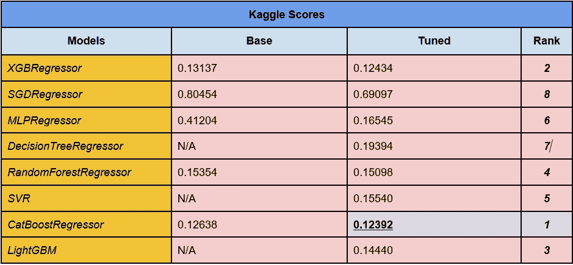

*图 3.2——卡格尔得分表*

## -堆叠模型和平均系综

我们还创建了几个堆积模型和平均系综模型。这些类型的模型通常可以通过让多个模型一起工作来帮助减少误差。然而，这些模型都不能胜过 CatboostRegressor。输出如图 3.3 所示:

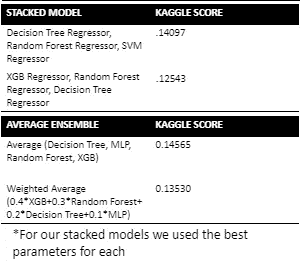

*图 3.3——叠加和平均系综模型的 Kaggle 得分*

# 结论

总的来说，我们在“房价高级回归技术”问题上的主要挑战是有大量的缺失数据。我们用多种解决方案测试了数据的缺失值，但是仍然很难找到一种方法来显著提高模型的准确性。此外，我们认为，如果我们可以有一个更大的训练数据集，它也可能有助于改进模型。

在提交了各种模型之后，我们注意到我们调整的 CatBoost 回归模型是房价的最佳预测器。我们还运行了由三个或更多调整的回归模型组成的四个堆叠和平均集成模型，但没有一个比 CatBoost 回归器得分更高。

我们发现这个项目很有趣，因为我们使用许多不同的解释变量来预测单一价格。这也很有趣，因为我们可以在其他城市或州的数据集上使用相同的方法来预测房价，并比较不同位置的平均价格。我们也可以使用这样的预测模型来帮助预测未来的房屋市场销售价格。

本博客来源于蒋金航和马人·奥尔森的班级项目报告。感谢安德鲁阿比莱斯和张子萱的贡献。最初的报告发布在我的[网站](https://jinhangjiang.github.io/Regression-Analysis-on-House-Price/)上，我写这篇博客时做了一些小改动。你可以在这里找到建模[的代码脚本。](https://github.com/jinhangjiang/ASU_CIS508_TeamProject1/tree/main/Script)

# 以前的文章:

[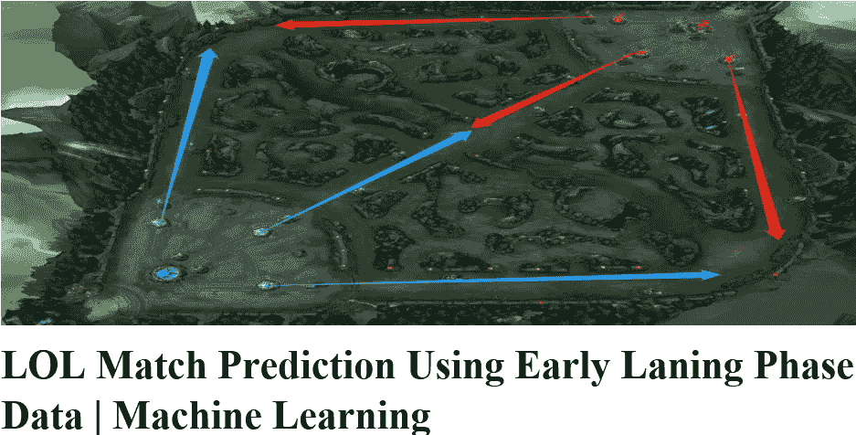](https://towardsdatascience.com/lol-match-prediction-using-early-laning-phase-data-machine-learning-4c13c12852fa)[](https://medium.com/analytics-vidhya/analyzing-disease-co-occurrence-using-networkx-gephi-and-node2vec-53941da35a0f)[](https://towardsdatascience.com/integrate-text-content-into-classification-project-eddd8e18a7e9)