# 线性回归及其假设

> 原文：<https://towardsdatascience.com/linear-regression-and-its-assumptions-ef6e8db4904d?source=collection_archive---------9----------------------->

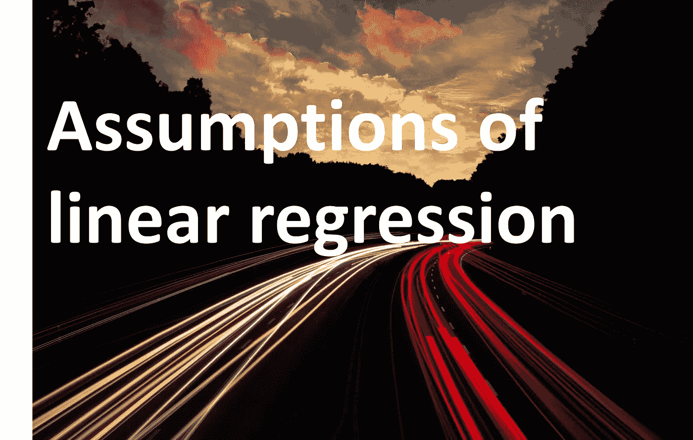

来源:stocksnap.io

## 举例说明了线性回归的假设，如共线性、多元正态性、自相关、同异方差

上周，我在帮助我的朋友准备一个数据科学家职位的面试。我在网上搜索了相关问题，发现问题“**数据科学涉及的假设有哪些？“T1”在我的搜索中出现得非常频繁。尽管大多数博客都提供了这个问题的答案，但细节仍然缺失。我研究了基本假设，并希望与您分享我的发现。首先，我会简单地告诉你这些假设，然后举例说明。**

线性回归模型的**基本假设**如下:

*   自变量(X)和因变量(y)之间存在**线性关系**
*   不同特征之间很少或没有多重共线性
*   残差应呈正态分布(**多变量正态性**)
*   残基之间很少或没有自相关
*   **误差的同方差**

现在，让我们来看看如何验证一个假设，以及在假设不成立的情况下应该做些什么。让我们逐一关注这些要点。我们将获取一个包含不同葡萄酒特征的数据集。该数据集已被数据科学家同事用于多个示例，并由 UCI 机器学习知识库公开提供( [Wine_quality data](https://archive.ics.uci.edu/ml/datasets/Wine+Quality) 或来自[此处](https://drive.google.com/file/d/195gkZ5cTZL11L308MHc7EyBbAoiB4xqf/view)的 CSV 文件)。我将使用的另一个数据集是温度数据集(可从[此处](https://drive.google.com/file/d/1fiHg5DyvQeRC4SyhsVnje5dhJNyVWpO1/view)获得)。我在纳格什·辛格·肖汉的一篇文章中偶然发现了这些数据集。我会建议你下载数据，用它来寻找行数，列数，是否有 NaN 值的行等。熊猫是一个阅读 CSV 和处理数据的非常好的工具。如果您不熟悉熊猫，请尝试使用以下方式阅读该文件:

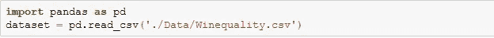

现在可以用，dataset . head()/dataset . tail()/dataset . describe 等来玩数据了。

1.  **线性关系**

自变量和因变量之间应该存在线性关系。这很容易用散点图来验证。我将使用温度数据集来显示线性关系。您可以绘制 Tmax vrs T_min(或 T_avg vrs T_min ),如图 1 所示。如果你已经处理过数据，你可能已经观察到有一个月列，因此我们甚至可以根据月份标记(颜色代码)散点图，只是为了看看不同月份的温度是否有明显的区别(图 1b)。

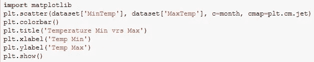

输出应该类似于:

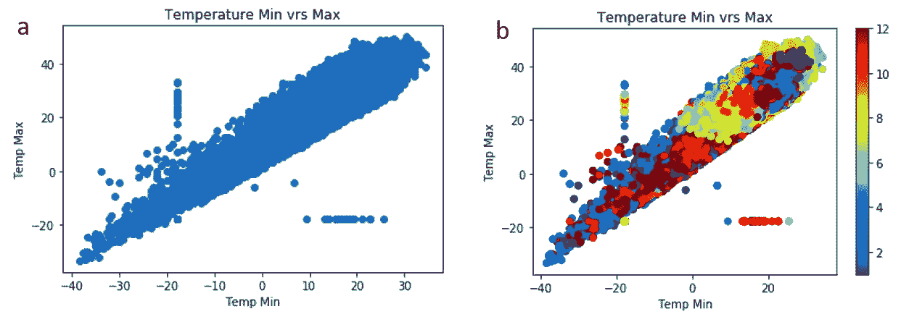

图 1

这里可以观察到 T_max 和 T_min 遵循线性趋势。你可以想象一条直线穿过数据。因此，我们已经确保我们的数据遵循第一个假设。

如果数据不是线性的呢？

*   也许用线性模型拟合数据是一个**错误的想法**。它可能更适合多项式模型(非线性回归)。
*   **数据转换**，如果 y 似乎是 x 的指数，那么在 y 和 log(x)之间画一条曲线怎么样(或者 y 对 x 的平方)。现在你可以对这些数据进行线性回归。但是你为什么要这么做呢？因为你(我也是)比非线性回归更懂线性回归。我们已经为线性回归、假设验证等建立了许多工具，这些工具对于非线性回归可能并不容易获得。此外，一旦你拟合了 y 和变换后的 x 之间的线性回归，就不难回到原来的 y 对 x 的关系。

**2。不同特征之间没有多重共线性**

**为什么‘无多重共线性’**？

当我们进行线性回归分析时，我们在寻找 y = mx + c 类型的解，其中 c 是截距，m 是斜率。“m”的值决定了将 x 改变 1 时 y 将改变多少。对于多元线性回归，同样的关系适用于以下等式:y = m1x1 +m2x2 +m3x3 … + c。理想情况下，m1 表示 y 在改变 x1 时会改变多少，但如果 x1 的改变会改变 x2 或 x3 呢？在这种情况下，y 和 m1(或 m2、m3 等)之间的关系将非常复杂。

**如何检查‘多重共线性’**？

Seaborn 提供了一个 pairplot 函数，它可以绘制变量之间的属性。这些图是散点图，我们需要看看这些属性是否呈现线性关系。这是可视化和感受不同属性的线性关系的最简单的工具，但只有当涉及的要素数量限制在 10-12 个时才是好的。在下一节中，我们将讨论如果涉及到更多的特性该怎么办。让我们先画出我们的配对图。为此，我将使用 Wine_quality 数据，因为它具有高度相关的特性(图 2)。

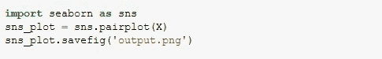

输出应该是 11x11 的图形，如下所示:

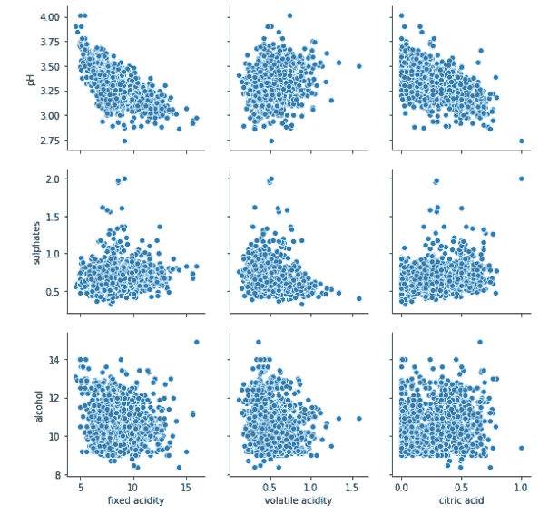

图 2

如果你观察像 *pH 值*和*固定酸度*显示线性相关性(具有负协方差)。如果你观察完整的情节，你会发现

*   *固定酸度*与*柠檬酸*、*密度*和*酸度*相关
*   *挥发性酸度*与*柠檬酸*相关

我让你去寻找其他的共线性关系。让我们**绕道了解一下这种共线性的原因**。如果你还记得你的高中化学，pH 值被定义为

> pH =-log[H+]=-log(酸的浓度)

由此很直观的得出 pH 值和柠檬酸或挥发酸度是负相关的。

本练习还提供了一个**关于数据的领域知识如何帮助更有效地处理数据的示例**。大概这就是数据科学对所有科学领域的科学家开放的原因。

不同特征的共线程度如何？

在上一节中，我们绘制了不同的要素，以检查它们是否共线。在本节中，我们将回答什么是共线性的度量？

我们可以测量相关性(**注意“相关性”**不是**“共线性”**)，如果两个特征之间的绝对相关性很高，我们可以说这两个特征是共线的。为了测量不同特征之间的相关性，我们使用相关矩阵/热图。为了绘制热图，我们可以使用 seaborn 的热图函数(图 3)。

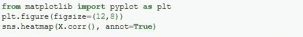

输出应为彩色编码矩阵，并在网格中标注相关性:

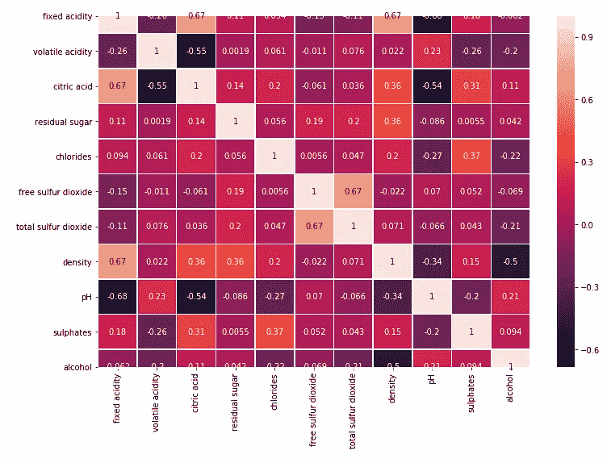

图 3

现在，根据您的统计知识，您可以决定一个阈值，如 0.4 或 0.5，如果相关性大于此阈值，则认为是一个问题。与其在这里给出一个明确的答案，我不如向你提一个问题。这个相关阈值的理想值应该是多少？现在，假设您的数据集包含 10，000 个示例(或行),如果数据集包含 100，000 个或 1000 个示例，您会改变答案吗？也许你可以在评论中给出你的答案。

**相关性高怎么办**？

假设您已经列出了不同特征之间的共线关系。现在怎么办？首先要考虑的是一个特性是否可以被删除。如果两个特征直接相关，例如酸度和 pH 值，我会毫不犹豫地删除其中一个。因为 pH 只不过是酸量的负对数。这就像在两个不同的尺度上拥有相同的信息。但更大的问题是:

*   哪个功能可以去除 pH 值或酸量？
*   接下来应该删除哪个功能？

这个我没有明确的答案。我所学的是计算方差通货膨胀系数 VIF。它被定义为公差的倒数，而公差是 1- R2。虽然我将讨论 VIF，但通常有以下方法可用于处理共线性:

a)贪婪淘汰

b)递归特征消除

c)套索正则化(L1 正则化)

d)主成分分析

我们将使用 VIF 值来查找应该首先消除的要素。然后，我们将重新计算 VIF，以检查是否有任何其他功能需要消除。如果我们在相关标度上工作，不同变量之间的相关性在消除前后不会改变。VIF 给出了这个优势来衡量淘汰的效果。我们使用 statsmodels，oulier_influence 模块来计算 VIF。此模型要求我们在模型中添加一个常量变量来计算 VIF，因此在代码中我们使用“add_constant(X)”,其中 X 是包含所有要素的数据集(质量列被删除，因为它包含目标值)。

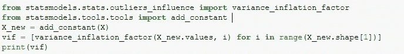

我采用的方法是消除具有最高 VIF 的要素，然后重新计算 VIF。如果 VIF 值大于 10，则移除 VIF 次高的要素，否则我们将不再处理多重共线性。

为了检验其他假设，我们需要进行线性回归。我已经使用 scikit 学习线性回归模块来做同样的事情。我们将模型分为测试和训练模型，使用训练数据拟合模型，并使用测试数据进行预测。

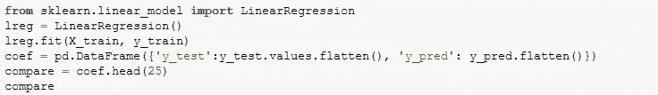

**3。** **多元常态**

残差应该是正态分布的。这一点可以通过绘制 QQ 图很容易地检查出来。我们将使用 statsmodels，qqplot 来绘制它。我们首先导入 qqplot 属性，然后向它提供残差值。我们得到的 Q-Q 图如图 4 所示。

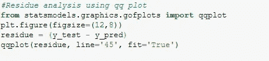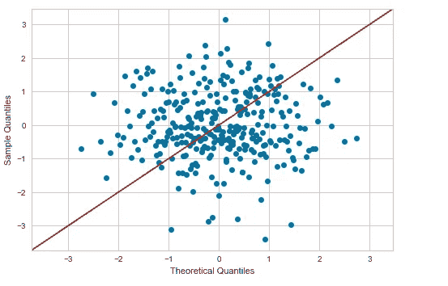

图 4

理想情况下，它应该是一条直线。这种模式表明我们的模型有严重的问题。我们不能依赖这个回归模型。让我们检查一下其他假设是否成立。

**4。无自相关**

Durbin Watson 的 d 检验可以帮助我们分析残基之间是否存在任何自相关。既然网上有很多关于这个测试的资料，我就给你提供另一种方式。在图 5 中显示了每个属性的残基图，以检查残基是否显示任何相关性。在下面的代码中，dataset2 是 X_test 的 pandas 数据帧。

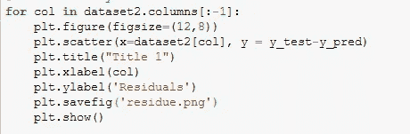

输出将是一系列图(测试数据集的 1 个图/列)

图 5

图 5 显示了数据是如何在没有任何特定模式的情况下很好地分布的，从而验证了残留物没有自相关。我们需要在所有的图中验证这一点(X 轴是特征，所以有多少个特征就有多少个图)。

**5。同质性**

用拟合线绘制误差散点图将显示残留物是否与该线形成任何模式。如果是，那么数据不是异方差的或者数据是异方差的。而如果散点图不形成任何模式，并且随机分布在拟合线周围，则残差是均方的。

为了绘制关于拟合线的残差(y _ test-y _ pred ),可以写出拟合线的方程(通过使用*。coeff_ 和*。拦截)。使用此等式获得 y 值，但将这些 y 值绘制在 X 轴上，因为我们想要绘制关于拟合线的残差(X 轴应该是拟合线)。现在可以观察到残留物的模式。下面是相同的代码:

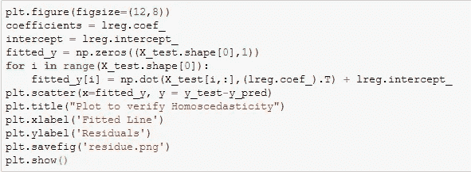

如果您是 python 新手，并且希望远离编写代码，您可以使用 *yellowbrick regressor* 的“Redidualsplot”模块来执行相同的任务。在这里，您只需要适应测试和训练数据，其余的将由模型本身完成。在这里，我使用 scikit learn 的 LinearRegression()模型，您可以选择使用不同的模型。

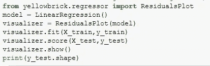

无论如何，使用上述任何一种方法都会得到相同的结果，如图 6 所示。

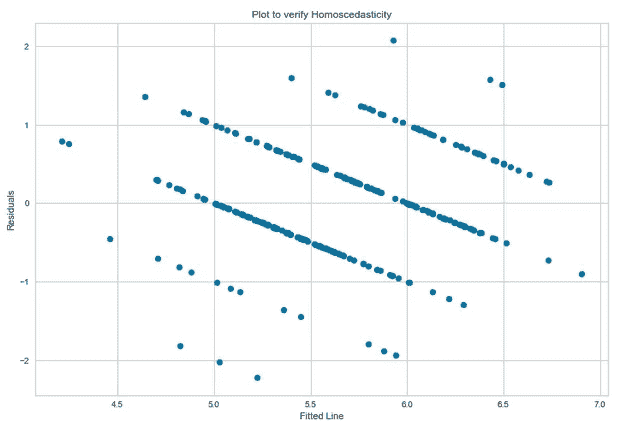

这里的残留物显示了一个清晰的模式，表明我们的模型有问题。

因此，我们的模型无法支持多元正态性和同方差假设(分别见图 4 和图 6)。这表明，要么数据不适合线性回归，要么给定的特征不能基于给定的特征真正预测葡萄酒的质量。但这是展示线性回归基本假设的一个很好的练习。如果你对这个问题有更好的解决办法，请告诉我。

欢迎建设性的批评/建议。

本主题的其他好读物:

1.  如何在 python 上检查你的线性回归模型的质量？[链接](https://github.com/tirthajyoti/Machine-Learning-with-Python/blob/master/Regression/Regression_Diagnostics.ipynb)
2.  线性回归算法的假设。[链接](/assumptions-of-linear-regression-algorithm-ed9ea32224e1)