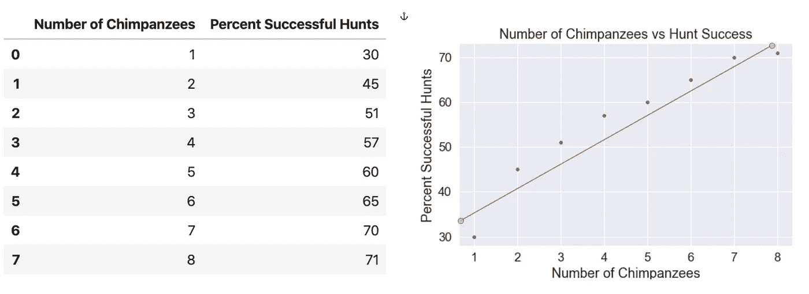
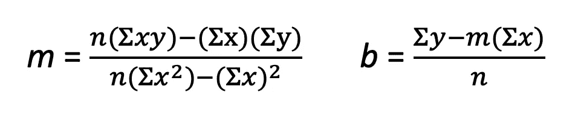
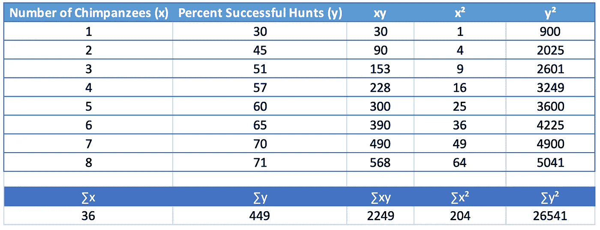
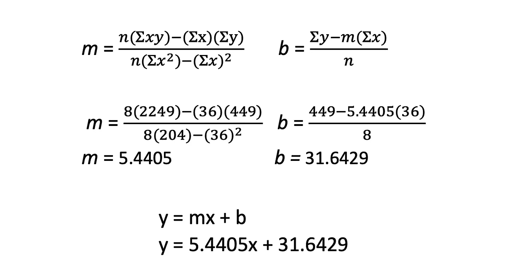
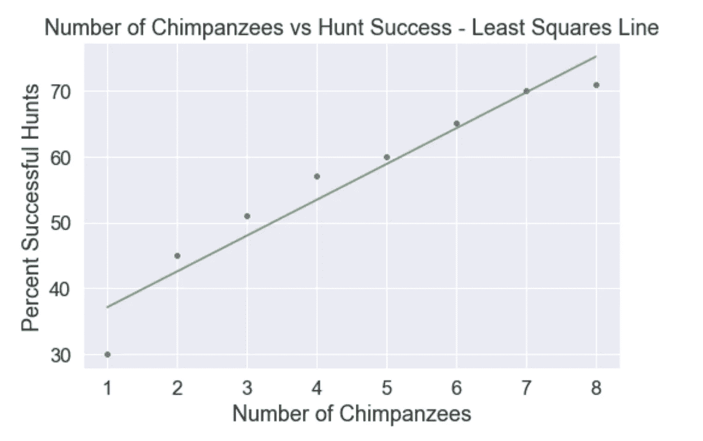
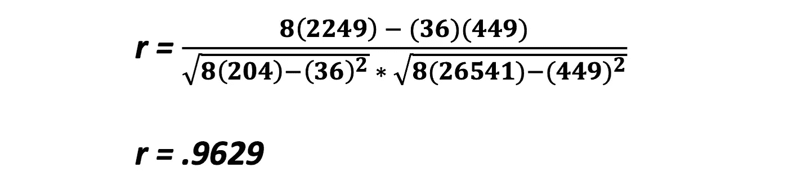

# 手工线性回归

> 原文：<https://towardsdatascience.com/linear-regression-by-hand-ee7fe5a751bf?source=collection_archive---------6----------------------->

## 线性回归是数据科学家最基本也是最强大的工具。让我们仔细看看最小二乘直线和相关系数。

# 线性回归的发明


Johannes Plenio 在 [Unsplash](https://unsplash.com/s/photos/sailing-ships?utm_source=unsplash&utm_medium=referral&utm_content=creditCopyText) 上拍摄的照片

线性回归是线性代数的一种形式，据称是由卡尔·弗里德里希·高斯(1777-1855)发明的，但最早发表在阿德里安·玛丽·勒让德(1752-1833)的一篇科学论文中。高斯用最小二乘法猜测谷神星小行星何时何地会出现在夜空中(统计回归的发现，2015)。这不是一个爱好项目，这是一个资金充足的研究项目，目的是为了海洋导航，这是一个高度竞争的领域，对技术中断非常敏感。

# 线性回归原理

线性回归是一种从 x 预测 ***y 的方法*** 在我们的例子中， ***y 是因变量，x 是自变量。*** 我们想要预测给定的**x 值的 **y** 值。现在，如果数据是完全线性的，我们可以简单地根据 ***y = mx+ b*** 计算直线的斜率截距形式。要预测 ***y*** ，我们只需插入给定的 ***x 和 b 的值。*** 在现实世界中，我们的数据不会是完全线性的。它很可能以**散点图**上的数据点簇的形式出现。从散点图中，我们将确定， ***描述数据线性质量的最佳拟合线*** 是什么，以及 ***该线与点群的拟合程度如何？*****

> **线性回归试图通过将线性方程拟合到观察到的数据来模拟两个变量之间的关系( [*线性回归*](http://www.stat.yale.edu/Courses/1997-98/101/linreg.htm) ，n.d .)。**

# **散点图**

**让我们编造一些数据作为例子。黑猩猩狩猎团体的规模和成功狩猎的百分比之间的关系已经被很好的记录了。(Busse，1978)我将从 Busse 获取一些数据点用于本文，并使用 seaborn 散点图绘制数据。注意到我在数据中画的线并不完全符合它，但是这些点近似于一个线性模式吗？我通过数据画出的线是**最小二乘法线**，用来预测给定 x 值 的 ***y 值。仅使用手工绘制的基本最小二乘法线，我们可以预测 4 只黑猩猩的狩猎队将有大约 52%的成功率。我们不是 100%准确，但随着更多的数据，我们可能会提高我们的准确性。数据与**最小二乘法直线**的拟合程度就是**相关系数**。*****

****

# **最小平方线**

**在上面的图表中，我只是通过我判断为最佳拟合的数据手工画了一条线。我们要用斜率截距形式 ***y = mx + b*** 来计算这条线，才能做出真正的预测。我们寻求的是一条直线，在这条直线上，直线和每个点之间的差异尽可能小。这是最佳拟合线。**

> **最小二乘直线被定义为从数据点到直线的垂直距离的平方和尽可能小的直线(Lial，格伦威尔和 Ritchey，2016)。**

**最小二乘法直线有两个分量:斜率 ***m、*** 和 y 截距 ***b.*** 我们将首先求解 ***m*** ，然后求解***b .******m***和 ***b*** 的方程为:**

****

**在 MS Word 公式编辑器中创建**

**那可是好多 Sigmas)！。不过不用担心，适马只是表示“的总和”，比如“x 的总和”，用∑x 来象征，也就是 x 列的总和，“黑猩猩的数量”我们需要计算∑x、∑y、∑xy、∑x 和∑y。然后，将每一个部分输入到等式中，用于计算*和***b。***根据我们的原始数据集创建下表。***

******

***现在很简单，将我们的适马值插入到 m 和 b 的公式中。n 是数据集中值的数量，在我们的例子中是 8。***

******

***你有它！你可以根据给定的 ***x*** 的值来预测 ***y*** ，使用你的等式: ***y = 5.4405x + 31.6429。*** 这意味着我们的线从 **31.6429** 开始，每有一只黑猩猩加入狩猎队，y 值就会增加 **5.4405** 个百分点。为了验证这一点，让我们来预测 4 只黑猩猩的狩猎成功率。***

```
****y = 5.4405(4)+31.6429***, which results in **y=53.4***
```

***我们刚刚预测了黑猩猩狩猎队狩猎成功的百分比，这仅仅是基于对他们群体大小的了解，这是相当惊人的！***

***让我们使用 python 在之前的散点图上绘制最小二乘直线，以展示它如何拟合数据。`Seaborn.regplot()`是在这种情况下使用的一个很好的图表，但是出于演示的目的，我将手动创建 ***y=mx+b 线*** 并将其放置在 seaborn 图表上。***

******

***然而，现在您可以进行预测了，您需要用**相关系数**来限定您的预测，相关系数描述了数据与您的计算线的吻合程度。***

# ***相关系数***

***我们使用相关系数来确定最小二乘法是否是我们数据的好模型。如果数据点不是线性的，那么直线就不是正确的预测模型。**卡尔·皮尔逊**发明了相关系数 ***r*** ，介于 1 和-1 之间，衡量两个变量之间线性关系的强度(Lial，格伦威尔和 Ritchey，2016)。如果 ***r*** 正好是-1 或 1，则表示数据正好符合*、*线，没有偏离线。 ***r=0*** 表示没有线性相关。当 ***r*** ***值*** 接近零时，意味着关联度也降低。***

***相关系数由以下公式描述***

******

***幸运的是，这些适马值已经在前面的表格中计算过了。我们简单地把它们代入我们的方程。***

******

***我们的值接近正 1，这意味着数据是高度相关的，并且是正的。你可以通过观察散点图上的最小二乘方线来确定这一点，但是相关系数给了你科学的证据！***

# ***结论***

***线性回归是数据科学家或统计学家可用的最佳机器学习方法之一。有许多方法可以使用您的编程技能来创建机器学习模型，但让您自己熟悉模型使用的数学绝对是一个好主意。***

## ***参考***

***布塞博士(1978 年)。黑猩猩会合作捕猎吗？*美国博物学家*， *112* (986)，767–770。【https://doi.org/10.1086/283318 ***

***利亚尔，格伦威尔和里奇(2016)。*有限数学与微积分及应用，第 10 版*。纽约州纽约市:皮尔森[ISBN-13 9780133981070]。***

****线性回归*。(未注明)。检索于 2020 年 4 月 11 日，来自[http://www.stat.yale.edu/Courses/1997-98/101/linreg.htm](http://www.stat.yale.edu/Courses/1997-98/101/linreg.htm)***

***统计回归的发现。(2015 年 11 月 6 日)。价格经济学。[http://priceonomics . com/the-discovery-of-statistical-regression/](http://priceonomics.com/the-discovery-of-statistical-regression/)***