# 手工线性回归

> 原文：<https://towardsdatascience.com/linear-regression-by-hand-python-and-r-79994d47f68?source=collection_archive---------32----------------------->

## 在 Python 和 R 中


由 [Unsplash](https://unsplash.com?utm_source=medium&utm_medium=referral) 上的 [CHUTTERSNAP](https://unsplash.com/@chuttersnap?utm_source=medium&utm_medium=referral) 拍摄

线性回归背后的基本思想很简单。用数学术语来说，我们希望用自变量 **X** 来预测因变量 **Y** 。假设两个变量以线性方式相关，我们可以用简单的线性公式预测 **Y** :

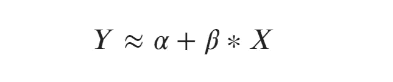

作者的线性方程

(波浪等号表示“大约”)。简单地说，一旦我们对两个系数之间的关系有所了解，即我们已经对两个系数 **α** 和 **β** 进行了近似，我们就可以(有一定把握地)预测 y。α**α**代表截距(值 **y** 与 **f(x = 0)** )，β**β**是斜率。

有了线性回归的帮助，我们可以回答很多问题；例如

*   "海平面的上升与气温上升有联系吗？",
*   "有三间卧室的房子会有多贵？"
*   "如果我们增加 20%的营销预算，我们能卖出多少产品？"

## 背后的数学原理

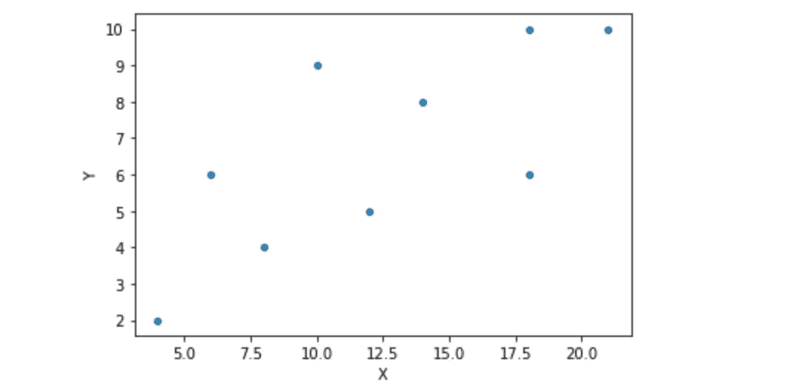

作者 10 次观察的散点图

我们来看一些数据！尽管上图中的观察结果有很大偏差，但趋势是明显可见的。这表明 **X** 和 **Y** 之间呈正相关。我们可以利用最小二乘法 的 [**方法来近似模拟两者之间关系的线性函数。让**](https://en.wikipedia.org/wiki/Least_squares)

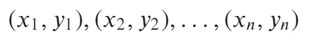

作者的一组观察结果

是一组观察值，用散点图中的点表示。现在可以应用最小二乘法来近似系数 **α** 和 **β** 。

该方法最小化线性回归线的误差平方和(用机器学习术语来说，这是线性回归的成本函数)。误差在下一个图中用橙色线表示。通过将方程微分为β，我们得到以下公式:

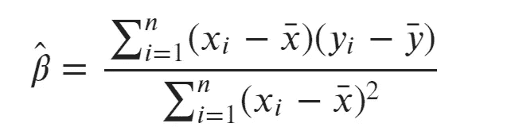

作者对β的最小二乘法

顶部带有*杆*的 **x** 和 **y** 代表 **x** 和 **y** 的样本平均值。

通过将近似的 **β** 代入线性方程，我们得到 **α** 的近似:

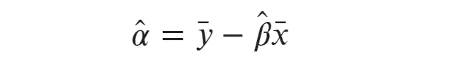

作者给出的 Alpha 近似值

或者，你可以通过[梯度下降](https://en.wikipedia.org/wiki/Gradient_descent#:~:text=Gradient%20descent%20is%20a%20first,function%20at%20the%20current%20point.)来最小化成本函数。现在我们已经知道了线性回归的近似系数，我们可以绘制方程并进行第一次目视检查。

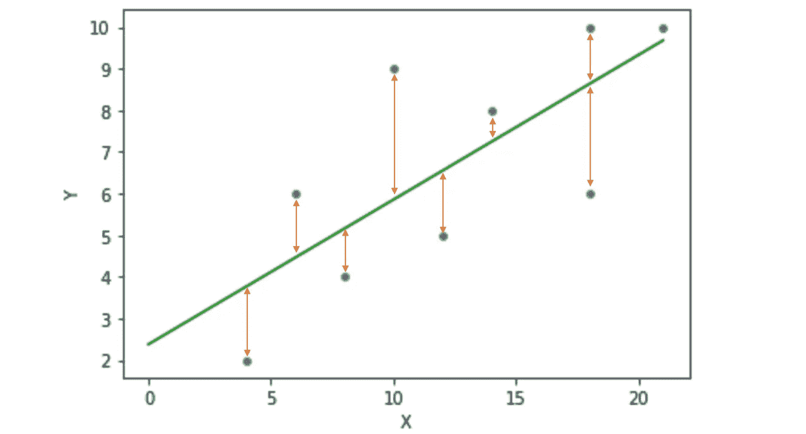

按作者列出的带回归线的散点图

图中的绿线代表线性方程，我们刚刚对其系数进行了近似。橙色箭头是误差(也称为残差)，它们告诉我们观察值与预测值的偏差。误差总和越小，回归线拟合得越好。总和为 0 将是一个完美的拟合，这意味着所有的观察都是完全线性的。

## 残留物分析

对误差/残差的解释是建立回归模型的重要步骤。通过观察残差，我们可以知道它们是如何分布的(平均值为 0 的正态分布是最好的)以及它们是否是同方差的，即残差的方差是否是常数。

**残差平方和(RSS)和残差标准差(RSE)**

残差是预测值 **y hat** (即近似值)与观察值 **y** ，之间的差值，在上图中显示为橙色线。*残差平方和* **RSS** 由以下公式定义:


作者的剩余平方和

在 **RSS、**的帮助下，我们可以计算出剩余标准误差( **RSE** )。RSE 是真实回归线标准偏差的估计值。这意味着平均而言，y 的值与真正的回归线相差一个 RSE。真回归线也叫*人口回归线*，描述的是 **X** 和 **Y** 的真实关系。我们如下计算 **RSE** :

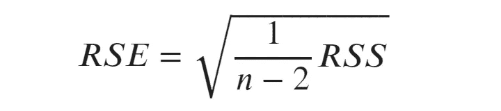

作者的剩余标准误差

## 图基-安斯科姆图

残留物的直观表示可能会有所帮助。良好拟合的残差满足三个标准:

1.  残留物的平均值为 0
2.  残基是独立的
3.  残差服从正态分布

借助 Tukey-Anscombe 图和简单的直方图，我们可以检查标准上的残留物。Tukey-Anscombe 图是一个散点图，它显示了残留物。绿线( **y=0** )代表回归线。现在我们可以看到残数是如何围绕回归线排列的:

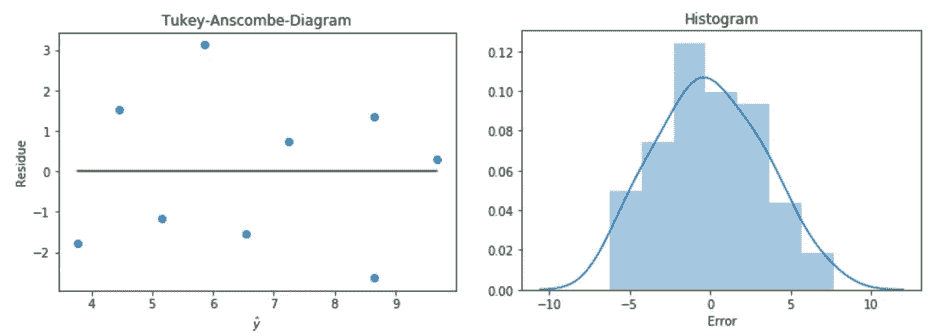

作者图片

目测表明，残差是独立的(它们不遵循一种模式，即没有系统误差)，残差的平均值为 0，并且它们遵循正态分布。

点击[这里](https://www.google.com/url?sa=i&url=https%3A%2F%2Fstudentportalen.uu.se%2Fportal%2Fauthsec%2Fportal%2Fuusp%2Fstudent%2Ffilearea%2Ffilearea-window%3Bjsessionid%3DB12D1B2482594C80E800CE07AD487EC0%3Fmode%3Dview%26webwork.portlet.portletNamespace%3D%252Ffilearea%252Fview%26webwork.portlet.action%3D%252Ffilearea%252Fview%252Fopen%26action%3Dd%26entityId%3D159813%26toolAttachmentId%3D543079%26windowstate%3Dnormal%26nodeId%3D2279919%26webwork.portlet.mode%3Dview&psig=AOvVaw2LogR2IrcVd6xnuYYDSKms&ust=1601980213820000&source=images&cd=vfe&ved=0CA0QjhxqFwoTCPCGxr-fnewCFQAAAAAdAAAAABAP)查看一些不好的图。

## r 平方

评估回归模型的另一种方法是 R 平方值。它通过测量可以用 **X** 解释的 **Y** 的变化比例，告诉我们模型与数据的拟合程度。为此，我们需要 **RSS** 和*平方和* ( **TSS)** 。

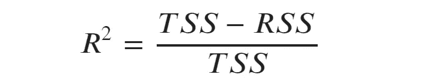

作者的 r 平方

其中 **TSS** 是*总平方和*的计算公式

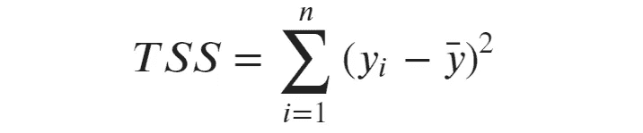

作者的平方和合计

r 的平方可以取 0 到 1 之间的值。接近 1 的结果意味着许多可变性可以通过回归来“解释”。接近 0 的结果可以表明我们的模型很差。这可能表明线性模型是错误的，或者误差的方差很高。

## 计算机编程语言

进行线性回归最简单的方法是利用 sklearn 库。

我们首先导入必要的库，然后定义我们的数据( **X** 和 **Y** )。请注意，数据可以很容易地来自数据帧。下一步是调用 *LinearRegression()来拟合我们的模型。在我们的数据上拟合(x，y)* 方法。这将返回一个包含我们的回归模型的对象，该模型现在可用于预测 **x** 的 **y** 。

```
import numpy as np
import seaborn as sns
from sklearn.linear_model import LinearRegression
import sklearn.metricsx = np.array([4, 6, 8, 10, 12, 14, 18, 18, 21]).reshape(-1,1)
y = np.array([2, 6, 4, 9, 5, 8, 6, 10, 10]).reshape(-1,1)# fitting the model
reg = LinearRegression().fit(x,y)# predicting values (x_new is an array of values you want to predict from)
x_new = x
y_new = reg.predict(x_new)# plot regression line
ax = sns.scatterplot(x[:,0],y[:,0])
sns.lineplot(x = x_new[:,0],y = y_new[:,0], color='green')
ax.set(xlabel='X', ylabel='Y')
plt.show()# R Squared
print(f'R Squared: {reg.score(x,y)}')
```

这会导致以下结果:

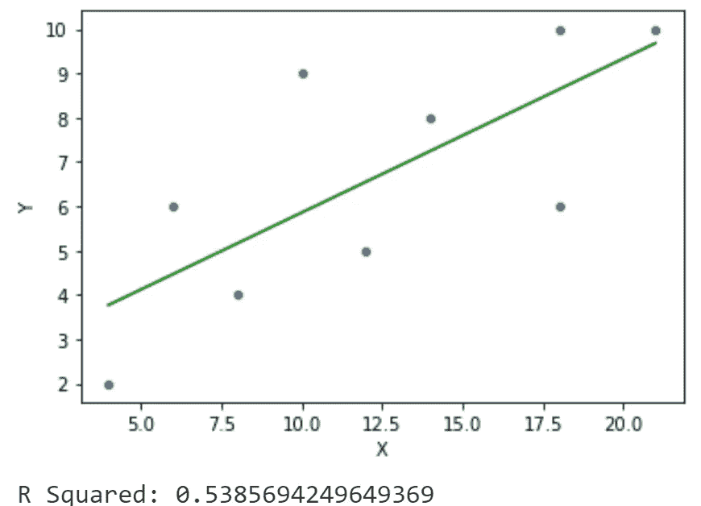

作者使用 R 平方值进行回归

有关 sk learning 线性回归如何工作的更多信息，请访问[文档](https://scikit-learn.org/stable/modules/generated/sklearn.linear_model.LinearRegression.html)。

## 稀有

r 已经有一个内置的函数来做线性回归，叫做 *lm()* (lm 代表线性模型)。我们通过插入 **X** 和 **Y** 的数据来拟合模型。summary() 返回我们模型的一个很好的概述。看那个:R 的平方和我们用 Python 计算的一样。

```
# observed data
x <- c(4, 6, 8, 10, 12, 14, 18, 18, 21)
y <- c(2, 6, 4, 9, 5, 8, 6, 10, 10)# fit model
reg <- lm(y ~ x)# get summary of model
summary(reg)# Output
Call:
lm(formula = y ~ x)Residuals:
    Min      1Q  Median      3Q     Max 
-2.6377 -1.5507  0.3188  1.3623  3.1449Coefficients:
            Estimate Std. Error t value Pr(>|t|)  
(Intercept)   2.3768     1.6452   1.445   0.1918  
x             0.3478     0.1217   2.858   0.0244 *
---
Signif. codes:  0 ‘***’ 0.001 ‘**’ 0.01 ‘*’ 0.05 ‘.’ 0.1 ‘ ’ 1Residual standard error: 2.022 on 7 degrees of freedom
Multiple R-squared:  0.5386, Adjusted R-squared:  0.4727 
F-statistic:  8.17 on 1 and 7 DF,  p-value: 0.02439# plotting the regression line
plot(x,y)
abline(reg)
```

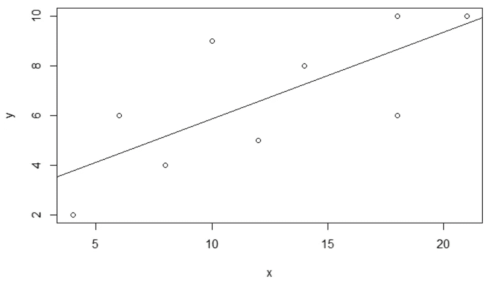

作者用 R 绘制的回归线

## 来源

詹姆斯、加雷思、丹妮拉·威滕、特雷弗·哈斯蒂和罗伯特·蒂布拉尼。2013.103 *统计学习入门*。纽约州纽约市:斯普林格纽约。[http://link.springer.com/10.1007/978-1-4614-7138-7](http://link.springer.com/10.1007/978-1-4614-7138-7)(4。2020 年啤酒节)。

“最小二乘法”。2020.*维基百科*。https://en.wikipedia.org/w/index.php?title=Least_squares&oldid = 978615667(4。2020 年啤酒节)。

sklearn.linear_model。线性回归-sci kit-学习 0.23.2 文档”。[https://sci kit-learn . org/stable/modules/generated/sk learn . linear _ model。LinearRegression.html](https://scikit-learn.org/stable/modules/generated/sklearn.linear_model.LinearRegression.html)(5。2020 年啤酒节)。