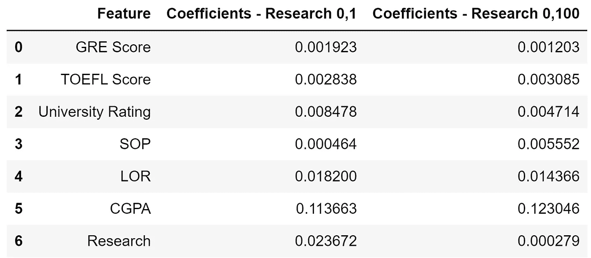

# 线性回归系数可能在骗你

> 原文：<https://towardsdatascience.com/linear-regression-coefficients-are-probably-lying-to-you-457a57aaf288?source=collection_archive---------29----------------------->

由作者创建

## 当心贝塔

解释线性回归系数很容易，因为它太简单了。训练一个模型可以用几行代码完成，结果产生的统计数据可以实事求是地说:“SAT 每增加一分，你被录取的机会就增加 0.002%”。

每当你带着这个目的训练一个线性回归(或逻辑回归)模型时，要小心:你正在危险的水域中行走。

线性回归到底在做什么？它将每个输入乘以一个值，然后将它们相加——作为额外的自由度，可以添加一个“截距”。结果应该是 *y* 变量。

让我们把线性回归放在上下文中。以下面的数据集为例，它包含学生申请研究生院的几个属性，如 GRE 或大学 GPA，以及他们的录取机会。

然后，线性回归方程变成:

当我们在数据集上训练线性回归模型时，我们发现系数为:

那么，默认情况下，我们可能倾向于作出以下声明:

*   GRE 考试每增加一分，你被录取的几率就会增加 0.2%。
*   托福考试每增加一分，你的机会就会增加 0.3%。”
*   做研究能让你的录取几率增加 2.3%。”

要是这么简单就好了。

为了给出一个真正准确和严格的解释系数的定义:“这是如果 *x* 变量增加一个单位，**保持所有其他 *x* 变量固定**时 *y* 变量的变化。”这部分通常在解释系数时省略，因为它太长了。

例如，*真正*准确的解释应该是:

> *GRE 考试每得一分，你的机会增加 0.2%，假设:
> -你的托福分数保持不变(标准分数)
> -你的大学评分保持不变(1-5 分)
> -你的 SOP 保持不变(1-5 分)
> -你的 LOR 保持不变(1-5 分)
> -你的 CGPA 保持不变(5-10 分)
> -你的研究保持不变(0 或 1)*

每个 *x* 变量的比例需要具体说明，因为线性回归严重依赖于比例。如果我们在一个数据集上训练，其中长度以英尺为单位，另一个以英里为单位，两者的性能将是相同的，但系数将是不同的。

理论上，一个变量的尺度变化不应该影响其他变量，但线性回归的实际实现并不总是像理论那样好。由于标度的较大差异会导致 *y* 变量出现缺口，系数调整算法通常会改变多个系数。

例如，当 research 列的标度为 0，100 而不是 0，1 时，考虑线性回归系数的差异。

研究系数降低，以应对规模的增加，但许多其他系数也发生了变化，特别是:

*   GRE 分数从 0.0019 到 0.0012 (63%)
*   大学评级从 0.0085 到 0.0047 (55%)
*   SOP 从 0.00046 到 0.0056(1.375%)

用 research 列在 0 到 100 的范围内训练一个模型和用另一个在 0 到 1 的范围内训练一个模型是完全有效的，但是结果是非常不同的。同样，你可能会发现长度、重量、价格、得分等不同测量值之间系数解释的差异。

确保您的系数在所有其他变量的上下文中有意义的唯一方法是指定每列的比例。

此外，添加和移除特征会对系数产生不同的影响。例如，如果我们完全删除研究列，其他系数需要增加，以解决缺少实质值加法器的问题(从线性回归的角度来看，功能仅用于增加或减少预测的*y*-值)。

所以让我们反过来想一想——如果起始数据集没有`Research`列会怎么样？如果我们扩大数据集，我们会得到不同的结果，而数据的扩大通常意味着更接近事实。因此，除非你有“所有的数据”，至少在哲学上，你的线性回归系数永远不会是完美的。

然而，实际上，这意味着如果你能控制数据收集，你应该总是努力收集尽可能多的数据，因为有限的数据可能会影响系数。

多重共线性，[或不同特征之间的高度相关性](/multicollinearity-impacts-your-data-science-project-more-than-you-know-8504efd706f)，也与系数的经验解释相抵触。例如，在所有其他因素保持不变的假设下，我们可能倾向于说“GRE 上的一分将增加 *x* %”的机会。实际上，GRE 成绩好的人很可能托福成绩也很好，并且正在申请评级更高的大学。

这意味着，由于相关因素，“GRE 上的一个点”所暗示的因果关系实际上可能会导致比 *x* %更大的增长。同样，“在 GRE 考试中失去一分”很可能会看到比 *x* %人们可以想象这在商业环境中会造成多大的破坏。

在很大程度上，所描述的大多数问题都可以追溯到多重共线性，这在每个现实世界的数据集中是不可避免的。如果您尝试变换数据集以消除多重共线性，系数将不再可解释(或者至少非常困难和有问题)。

实际上，唯一可靠的解决方案是首先不要使用线性回归。像 SHAP 这样伟大的解释方法大量存在，而且不容易受到简单线性回归容易出现的各种问题的影响。

但是，如果您坚持使用线性回归系数进行解释，请确保几乎没有多重共线性，并且为再现性和更接近事实的系数指定了比例和要素。