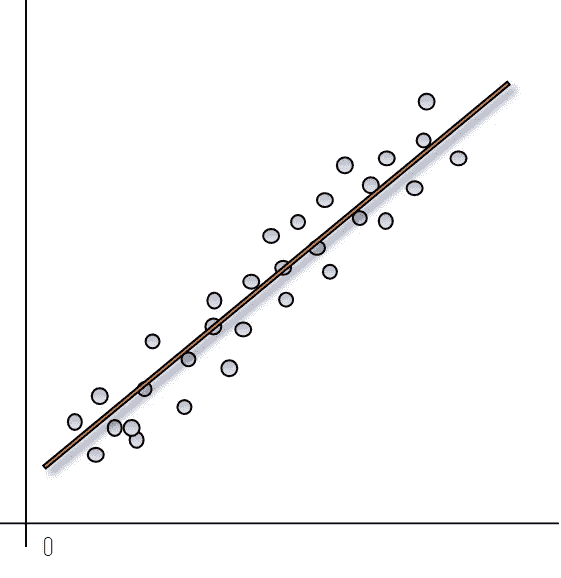
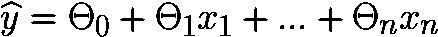
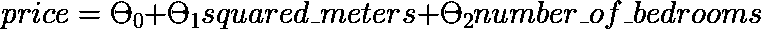
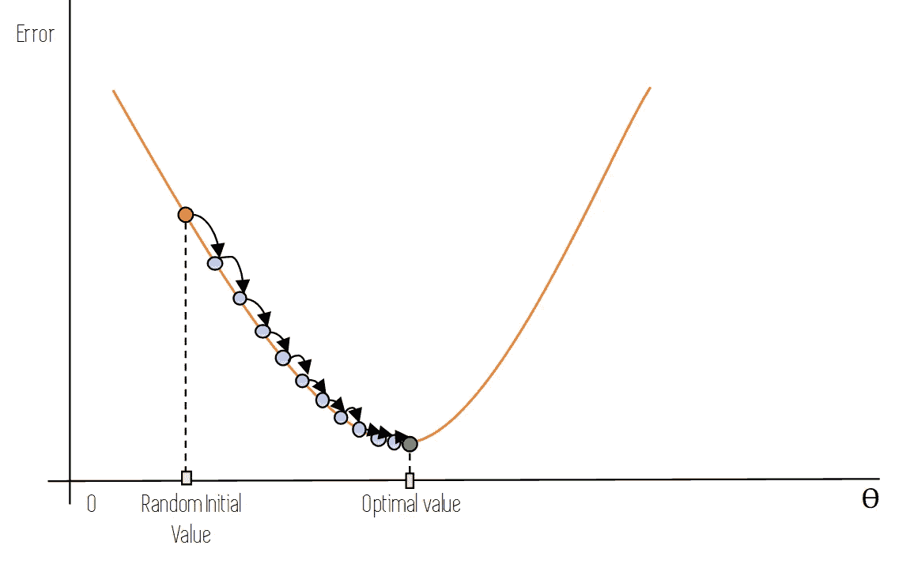
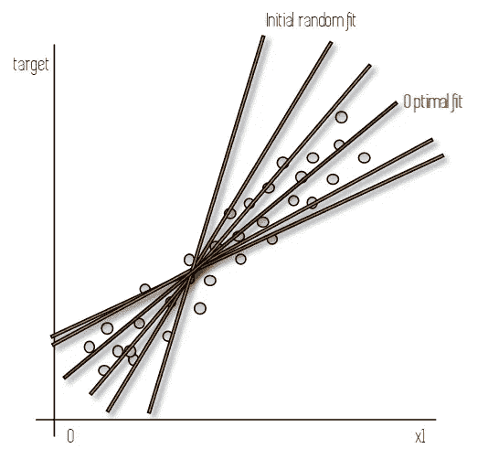
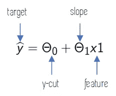
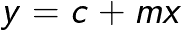
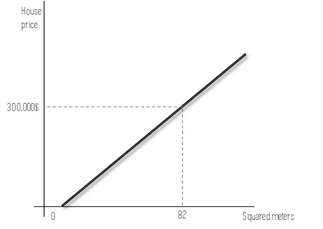

# 线性回归解释

> 原文：<https://towardsdatascience.com/linear-regression-explained-d0a1068accb9?source=collection_archive---------3----------------------->

## [ —线性回归简单解释— ]



在这篇文章中，我将简单地解释线性回归。这可以被认为是一个线性回归的假人后，然而，我从来没有真正喜欢这个表达。

*在我们开始之前，这里有一些额外的资源可以让你的机器学习事业突飞猛进:*

```
*Awesome Machine Learning Resources:**- For* ***learning resources*** *go to* [***How to Learn Machine Learning***](https://howtolearnmachinelearning.com/books/machine-learning-books/)*! 
- For* ***professional******resources*** *(jobs, events, skill tests) go to* [***AIgents.co — A career community for Data Scientists & Machine Learning Engineers***](https://aigents.co/)***.***
```

# 机器学习中的线性回归

在机器学习领域，**线性回归**是一种**参数回归模型**，它通过对一个观察值或数据点的输入特征进行加权平均，并添加一个名为*的常数，即偏差项*，来进行预测。

这意味着简单线性回归模型是具有特定固定数量的参数的模型，这些参数取决于输入要素的数量，并且它们输出数值预测，例如房屋的价格。

线性回归的一般公式如下:



线性回归公式

*   ***ŷ*** 是我们要预测的值。
*   ***n*** 是我们数据点的特征数。
*   **是第*跟*特征的值。**
*   *****θI***为模型的参数，其中**θ0**为偏差项。所有其他参数都是数据特征的权重。**

**如果我们想用线性回归来预测房子的价格，使用 2 个特征；房子的面积(平方米)和卧室的数量，自定义公式如下所示:**

****

**计算具有两个特征的房屋价格的线性回归公式:平方米和卧室数量**

**好吧，这看起来很直观。现在，我们如何计算最符合我们数据的***θI***的值呢？很简单:用我们的数据来训练线性回归模型。**

**为了确保我们都在同一点上，我们的训练数据被标记为数据:这是包含我们要为没有该值的新数据点计算的目标值的数据。在我们的房价示例中，我们的训练数据将包含大量房屋及其价格、平方米面积和卧室数量。**

**在我们训练了模型之后，我们可以用它来预测房子的价格，使用它们的平方米和卧室的数量。**

**训练模型的步骤如下:**

*   **首先，我们必须选择一个指标，通过将模型对训练集中的房屋所做的预测与实际价格进行比较，来告诉我们模型的表现如何。这些度量是像 ***均方误差*** (MSE)或 ***均方根误差*** (RMSE)这样的度量。**
*   **我们将模型的参数(***θI***)*初始化为某个值(通常是随机的)并计算整个训练数据的这个误差。***
*   ***我们迭代地修改这些参数，以便最小化这个误差。这是通过梯度下降等算法完成的，我现在将简要解释一下。***

# ***梯度下降训练***

******梯度下降*** 是一种优化算法，可用于各种各样的问题。这种方法的一般思想是反复调整模型的参数，以达到使这种模型在其预测中产生的误差最小化的一组参数值。***

**在模型的参数被随机初始化之后，梯度下降的每次迭代如下进行:利用这些参数的给定值，我们使用该模型对训练数据的每个实例进行预测，并将该预测与实际目标值进行比较。**

**一旦我们已经计算了该聚集误差(称为 ***成本函数*** )，我们就测量该误差相对于模型参数的局部梯度，并且通过在梯度下降的方向上推动这些参数来更新这些参数，从而使得成本函数降低。**

**下图以图形方式显示了这是如何完成的:我们从橙色点开始，这是模型参数的初始随机值。在梯度下降的一次迭代之后，我们移动到蓝色点，它直接在初始橙色点的右下方:我们已经在梯度下降的方向上前进了。**

****

**梯度下降**

**一次又一次的迭代，我们沿着橙色的误差曲线前进，直到到达位于曲线底部的最佳值，在图中用绿点表示。**

**假设我们有一个只有一个特征的线性模型( *x1* )，这样我们就可以很容易地绘制它。在下图中，蓝色的点代表我们的数据实例，对于这些数据实例，我们有目标的值(例如房子的价格)和一个要素的值(例如房子的平方米数)。**

****

**具有一个特征(x1)的线性回归模型的不同迭代的图形表示**

**在实践中，当我们使用梯度下降来训练模型时，我们首先用一条线来拟合我们的数据(*初始随机拟合线*)，这不是它的一个很好的表示。在梯度下降的每次迭代之后，随着参数的更新，这条线改变它的斜率和它与 y 轴相交的位置。重复这个过程，直到我们达到一组足够好的参数值(这些值并不总是最优值)，或者直到我们完成一定次数的迭代。**

**这些参数由绿色的*最佳拟合线*表示。**

**对于只有一个特征的模型来说，这很容易想象，因为线性模型的方程与我们在高中学习的直线方程是一样的。对于更多的特征，同样的机制也适用，但是这并不容易可视化。**

****

**只有一个特征的线性回归模型方程**

****

**直线方程**

**在我们完成这个过程并使用这个过程训练了我们的模型之后，我们可以使用它来进行新的预测！如下图所示，使用我们的最佳拟合线，并知道房子的平方米，我们可以使用这条线来预测它的价格。**

****

**使用线性回归进行预测**

**当然，这将是一个非常简单的模型，可能不是很准确，因为有很多因素影响着房子的价格。然而，如果我们增加相关特征的数量，线性回归可以为简单的问题提供相当好的结果。**

# **结论和其他资源**

***线性回归是最简单的机器学习模型之一。它们容易理解，可解释，并且能给出相当好的结果。这篇文章的目标是为不是机器学习从业者的人提供一种以非数学方式理解线性回归的简单方法，所以如果你想更深入，或者正在寻找更深刻的数学解释，看看下面的视频，它很好地解释了我们在这篇文章中提到的一切。***

**就这些，我希望你喜欢这个帖子。请随时在 Twitter 上关注我。还有，你可以看看我在数据科学和机器学习上的帖子[**这里**](https://medium.com/@jaimezornoza) 。好好读！**

**更多类似的帖子请关注我的 ，敬请关注！**

***此处解释的信息摘自以下文章中的书，以及一些其他资源。***

**[](/the-book-to-really-start-you-on-machine-learning-47632059fd0e) [## 让你真正开始机器学习的书

### 让你的机器学习知识更上一层楼

towardsdatascience.com](/the-book-to-really-start-you-on-machine-learning-47632059fd0e)**