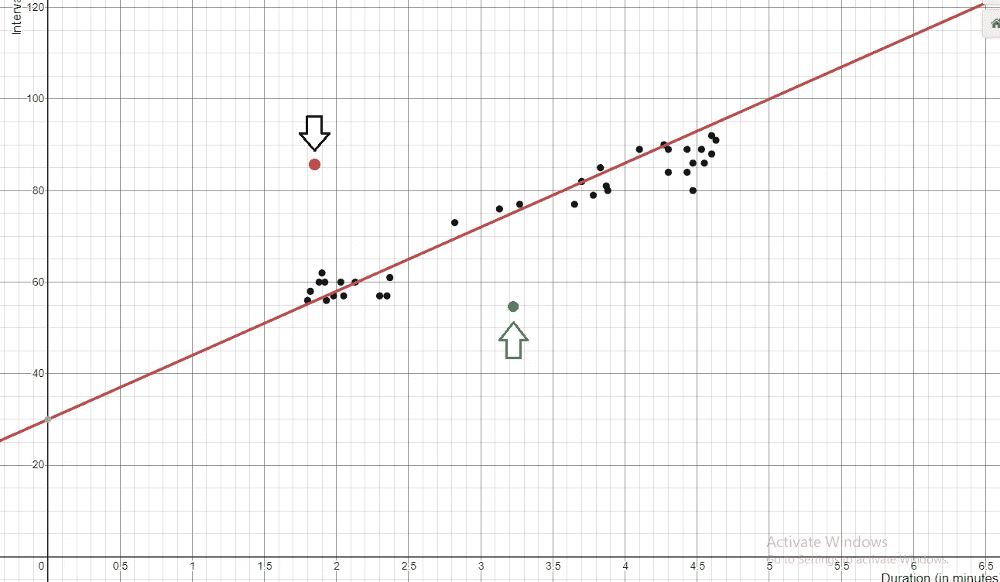
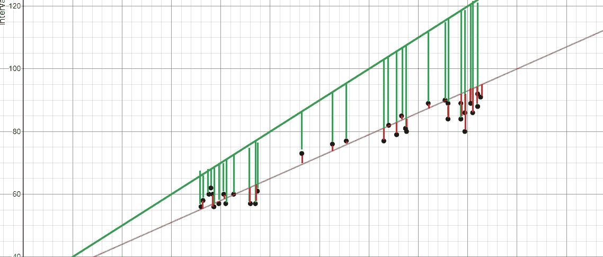
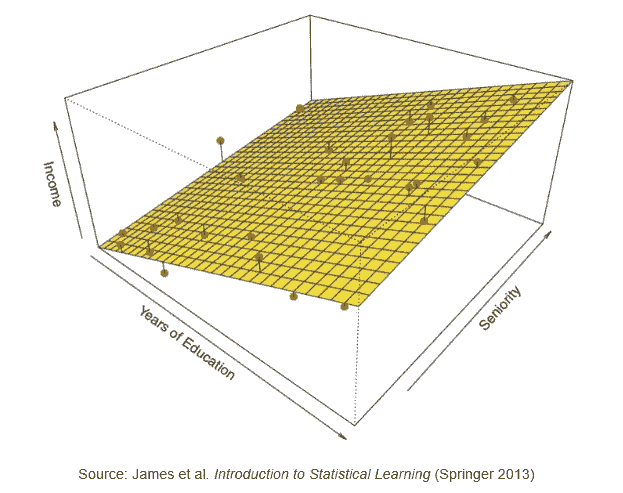
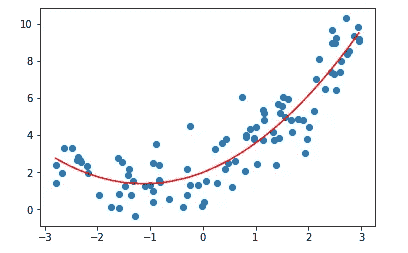
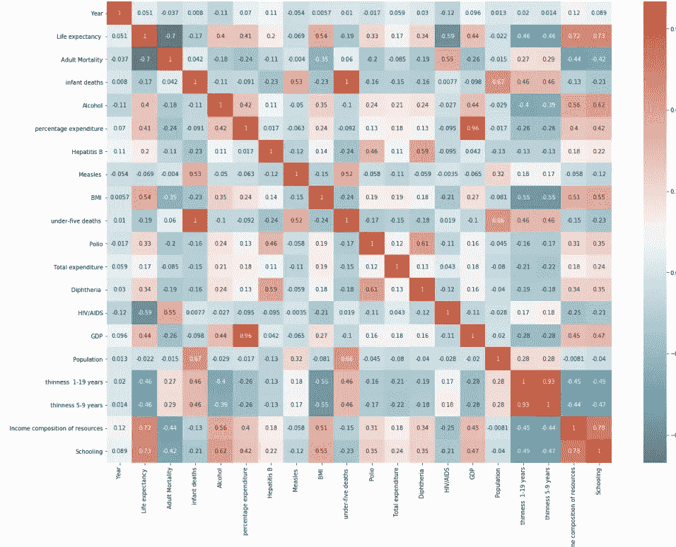

# 在 5 分钟内解释线性回归

> 原文：<https://towardsdatascience.com/linear-regression-explained-in-5-minutes-5d643ca0a662?source=collection_archive---------18----------------------->

## 可以说是最基本的机器学习模型，尽可能简单地解释。


取自 Pixabay

线性回归是最广泛使用的方法之一，用于模拟两个或多个变量之间的关系。它可以应用于任何地方，从预测库存计划的销售，以确定温室气体对全球气温的影响，到根据降雨量预测作物产量。

在这篇文章中，我们将讨论什么是线性回归，它是如何工作的，并创建一个机器学习模型来根据许多因素预测一个人的平均预期寿命。

# 什么是线性回归？

根据维基百科，线性回归是一种建模因变量和一个或多个自变量之间关系的线性方法。简而言之，它是代表数据集的“最佳拟合线”。

下面是一个最符合数据点的线条示例。通过创建最佳拟合线，您可以预测未来点的位置并识别异常值。例如，假设此图表示基于重量的钻石价格。如果我们看红点，我们可以看到这颗钻石被高估了，因为在相同重量的情况下，它的价格比其他钻石高得多。同样，绿点的价值被低估了，因为它比其他重量相近的钻石便宜得多。



那么如何找到最佳拟合线呢？让我们找出答案。

# 简单线性回归如何工作



我们将关注**简单线性回归**。最佳拟合线，或表示数据的方程，通过最小化点和最佳拟合线之间的平方距离找到，也称为**平方误差**。

举个例子，上面显示了两条“最佳拟合线”，红线和绿线。注意误差(最佳拟合线和图之间的绿线)比红线大得多。回归的目标是找到一个误差总和最小的方程。

如果你想知道背后的数学，你可以看可汗学院的视频[这里](https://www.khanacademy.org/math/statistics-probability/describing-relationships-quantitative-data/more-on-regression/v/squared-error-of-regression-line)，他们在这里找到了 m 和 b 的偏导数

如果想使用简单的线性回归，可以使用 scikit-learn 库中的 linear regression 类。

```
from sklearn.linear_model import LinearRegression
```

# 多元线性回归

当您希望找到一个表示两个变量(自变量 x 和因变量 y)的方程时，简单线性回归非常有用。但是如果你有很多自变量呢？例如，汽车的价格可能基于多种因素，如马力、汽车尺寸和品牌本身的价值。

这就是多元回归的由来。**多元回归**用于解释一个因变量和多个自变量之间的关系。

下图显示了收入(y)与资历和教育年限(x)之间的关系。当有两个独立变量时，找到最佳拟合的**平面**，而不是最佳拟合线。



# 多项式回归

如果你有一组数据，它的最佳拟合线不是线性的(如下图所示)。这就是你想要使用**多项式回归**的时候。再次使用维基百科，它被定义为回归分析的一种形式，其中自变量 x 和因变量 y 之间的关系被建模为 x 中的 n 次多项式。更简单地说，它符合 x 和 y 之间的非线性关系。



当您想要使用多项式回归时，需要几行额外的代码:

```
from sklearn.preprocessing import PolynomialFeatures
poly_reg = PolynomialFeatures(degree = n) #where n is equal to the number of degrees that you want
```

# 示例:预测平均预期寿命

为了演示如何用 Python 构建回归模型，我使用了 Kaggle 上的“预期寿命(世卫组织)”数据集。我的目标是创建一个模型，它可以根据一些变量预测某一年某一国家的人的平均预期寿命。请记住，这是一个非常基本的模型——我的下一篇文章将通过不同的方法来改进回归模型。

就准备数据而言，我或多或少遵循了我在 EDA 博客帖子中列出的步骤。

第 1 部分[此处](https://medium.com/swlh/exploratory-data-analysis-what-is-it-and-why-is-it-so-important-part-1-2-240d58a89695)。

第二部分[此处](https://medium.com/@terenceshin/exploratory-data-analysis-visualizing-variables-part-2-2-ec172d16c61e)。

我在这个模型中引入了几个新主题，比如将分类数据(国家)转换为虚拟变量，以及评估所有变量的方差膨胀因子(VIF)。同样，我将在下一篇博文中讨论所有这些新话题。



我想分享的一件事是关联热图，因为这里有一些非常有趣的关联:

*   “受教育程度”和 0.73 的“预期寿命”之间有很强的正相关关系。这可能是因为教育在较富裕的国家更为成熟和普及。这意味着腐败、基础设施、医疗保健、福利等等更少的国家。
*   与上述观点类似，在“国内生产总值”和 0.44 的“预期寿命”之间存在适度的正相关，很可能是由于同样的原因。
*   令人惊讶的是,“酒精”和“预期寿命”之间有 0.40 的适度正相关。我猜这是因为只有较富裕的国家才能买得起酒，或者酒精消费在较富裕的人群中更为普遍。

```
# Create Model
from sklearn.model_selection import train_test_split
from sklearn.linear_model import LinearRegression
from sklearn.preprocessing import PolynomialFeaturespoly_reg = PolynomialFeatures(degree = 2)
X_poly = poly_reg.fit_transform(X)
poly_reg.fit(X_poly, y)X_train, X_test, y_train, y_test = train_test_split(X_poly, y, test_size=.30, random_state=0)
regressor = LinearRegression()
regressor.fit(X_train, y_train)
y_pred = regressor.predict(X_test)
```

清理完数据后，我执行上面的代码来创建我的多项式多元回归模型，MAE 为 8.22，范围为 44.4。在我的下一篇博客文章中，我将介绍几种方法来改进回归模型(也适用于大多数机器学习模型)，使用我在这里使用的相同数据集。