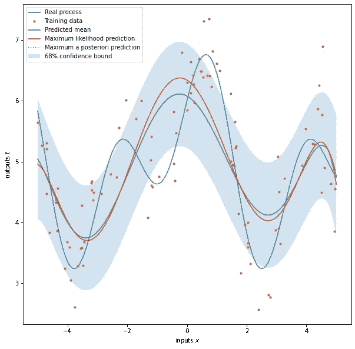
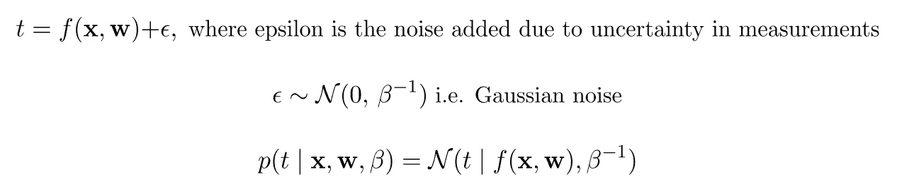
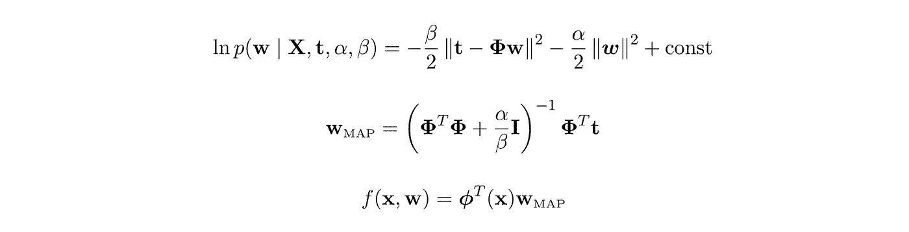
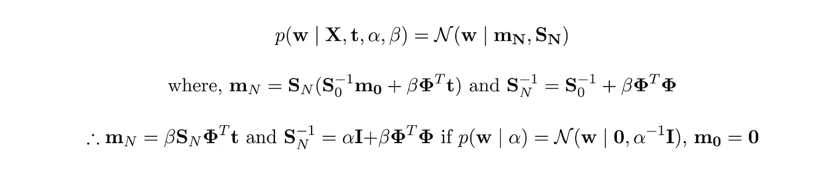
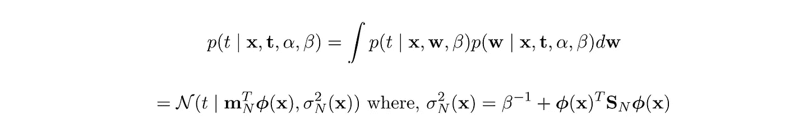

# 线性回归:从数学到代码

> 原文：<https://towardsdatascience.com/linear-regression-from-math-to-code-9659132383ec?source=collection_archive---------32----------------------->

## 使用 Python 的数学和实现指南

作者图片

## 介绍

如果你有统计学背景，甚至可能是高中水平，你可能对线性回归(LR)很熟悉。简而言之，它是统计学和机器学习(ML)中使用的核心技术之一，用于定义一个模型，该模型最好地描述由未知过程生成的一组观察数据 *D* 。虽然你可以在网上找到大量的例子来解释如何使用示例代码实现 LR，但是我的帖子试图提供贝叶斯 LR 背后的数学的逐步分解，并进一步试图解释如何使用 Python 代码实现它。**请注意，我对这个概念包括符号的理解和解释，完全是基于本书第三章**[1]。最后提供了参考资料，供您参考。对于那些熟悉该算法的人来说，这篇文章可能是对其背后概念的修正。对于那些不熟悉的人来说，我希望这篇文章能在你浏览其他作者提供的概念时起到指导作用。有一些线性代数，概率论和微积分的知识是必不可少的，以获得足够的这个职位。好了，我们开始吧！

## 数学

假设你有一组 *D* 的观察数据， *(tᵢ，* ***x*** *ᵢ)，从一个未知过程中得到的*其中**ᵢ*和 *tᵢ* 分别是输入和输出。粗体 ***x*** *ᵢ* 的意思是它是一个矢量。这个未知过程的一个输出， *tᵢ* 与其输入 ***x*** *ᵢ，*之间的关系可以用一个函数*tᵢ= f(****x****ᵢ，* ***w*** *)来描述。*几何上，从线性代数的角度来看，一旦我们有了正确的一组基向量，我们就可以表示向量空间中的任何向量/点。这里的想法是，我们的输入生活在一个 d 维空间，ℝᴰ，我们的输出生活在一个 m 维 space,ℝᴹ，我喜欢称之为输出空间。我们的建模问题现在变成寻找 M 的合适值，即合适数量的基和参数值， ***w*** ，其组合这些基。这些依据又是， ***x*** 的函数，我相信是为了调音的目的！。这些函数被称为基函数。有许多函数可以用作基函数，例如多项式、高斯函数、sigmoids 等。在本文的代码部分，我们将使用多项式。*

**

*作者根据[1]和[2]提供的图片*

*这个函数描述了这个数据中的一个模式，如果确实有一个模式，那么下次我们有一个输入***x****ᵢ，我们期望测量相同的输出 *tᵢ* ，这也可以通过我们的函数来预测。然而，实际上这并不完全准确，因为在我们的测量中总有一些噪声。因此，我们的函数应该考虑这种噪声。我们的观察将倾向于围绕我们的函数预测。由于**中心极限定理**，这些预测的分布近似于高斯分布。**

****

**图片由作者基于[1]**

**所有观测值的联合概率(假设它们是独立同分布的)是单个观测值的概率分布的乘积，如下所示。**

****

**图片由作者基于[1]**

**这个表达式叫做**似然**，如果我们在两边都应用 log，这样我们就可以处理加法而不是乘积，我们得到下面的表达式。**

****

**作者根据[1]和[2]提供的图片**

**希腊**φ**符号被称为设计矩阵，我们将在代码部分看到构建它的一种方式。 **t** 是输出观测值的列向量 *tᵢ* 和 **X** 是矩阵，其中每行是观测值 ***x*** *ᵢ.*假设我们固定 M 的值，使可能性最大化的模型的参数值具有封闭形式的解，称为**最大可能性估计**。**

****

**作者图片**

**为了获得最大可能性的直觉，让我们做一个简单的思维实验。假设我们抛一次硬币，也许会有一条尾巴。好，让我们再抛一次，*和*我们又得到一条尾巴。好吧，也许这枚硬币有瑕疵。让我们再翻转一次，这次我们仍然得到一条尾巴。基于这些观察，我们不妨得出结论，得到尾巴的机会是 100%。但是我们知道我们的硬币是公平的，即先验知识。使用 Baye 定理，我们使用这个先验知识来提出一个更好的表达式来计算我们的参数 ***w*** *。***

****

**图片由作者基于[1]**

**将 log 应用于等式的两边，并求解最佳参数 ***w*** ，如之前所做的，我们获得下面的表达式及其下面的参数估计。这叫做**最大后验估计**(图)。**

****

**作者图片**

**最大似然法和最大后验概率法都只能给我们一个模型参数的精确估计，我们以后可以用它来进行预测。然而，在做预测时，重要的是要有一定的不确定性，这样我们才能从预测中做出正确的决定。显然，如果我们在这里结束，它不足以建立一个健壮的模型。**

**贝叶斯方法(BLR)进一步采用最大后验概率来形成预测分布。根据该分布，每个未来输入将具有相应的目标均值和方差/协方差。下面是数学的高级视图。**

****

**作者图片**

**现在可以使用下面的等式获得预测分布**

****

**作者图片**

**利用高斯分布的条件分布和边缘分布性质，可以得到后验参数分布和预测分布。更多细节见[1]的第 2 章。**

**在上述所有方法中，我们假设我们的数据和参数的方差(即 ***w*** )、*和*分别是已知的。实际上，这些值是未知的，可以从数据集进行估计。完整的贝叶斯治疗，我不打算在这篇文章中讨论，提供了一种称为证据近似的技术，可以用来近似这些值。然而，有几件事值得指出，我将在这里提到它们。如果 *α⁻* 很高， ***w*** 将逼近最大似然估计。如果数据集很小， ***w*** 将逼近先验。随着数据集大小向无穷大增加，我们预测的方差变小，接近极限 *β⁻* 。****

## **密码**

**使用 Python 代码，让我们从构建设计矩阵开始。如前所述，在这种情况下，我们将使用多项式基函数。**

**让我们首先创建一个使用最大似然估计(ML)进行回归的类:**

**现在让我们创建一个使用最大后验概率(MAP)进行预测的类:**

**最后，让我们创建一个用于进行贝叶斯线性回归的类。请注意，这并不完全是贝叶斯方法，因为 *α⁻* 和 *β⁻* 被假定为已知的，并且应该在类实例化期间作为标准差传入。**

## **测试**

**现在让我们测试我们的模型。我们将使用合成数据，因此首先我们创建一个简单的函数来生成合成数据，然后设置一些参数并准备训练和测试数据。**

**现在创建模型、训练、预测和绘图，例如 ML、MAP 和 BLR:**

**最后是我们的图表:**

****

**作者图片**

## **结论**

**在这篇文章中，我试图介绍线性回归背后的核心数学，并尝试使用 python 代码实现它。然而，正如您所看到的，该模型并不是观察到的数据的最佳拟合。主要原因是模型不够复杂，无法拟合数据(即拟合不足)。模型复杂度是模型的参数数量 M，在这个例子中，我使用了随机值 7。贝叶斯方法还提供了一种可以逼近模型复杂度最优值的方法，我可能会在另一篇文章中介绍。**

## **参考**

**[1]:主教，C. M. (2006 年)。*模式识别与机器学习*。斯普林格。**

**[2]: Deisenroth，M. P .，Faisal，A. A .，& Ong，C. S. (2020)。*机器学习的数学*。剑桥大学出版社。**