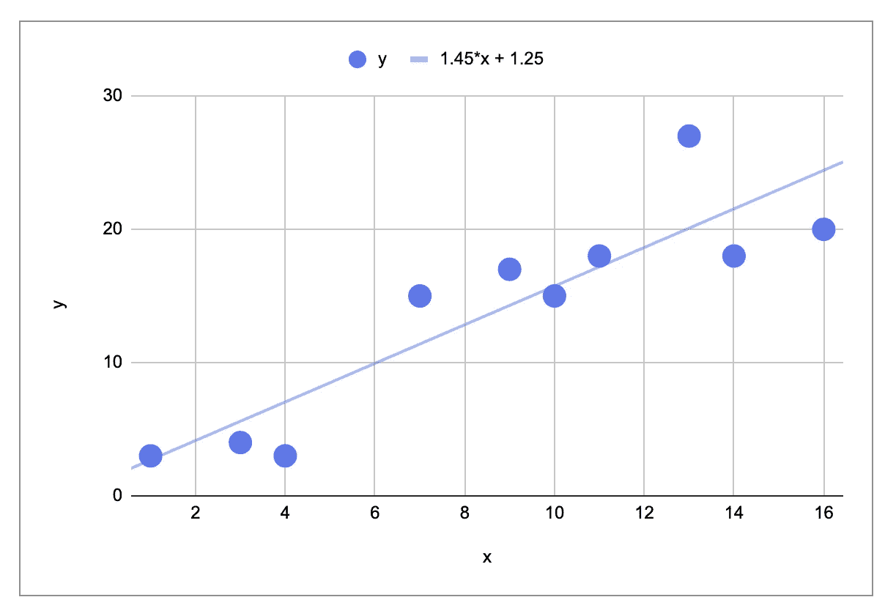
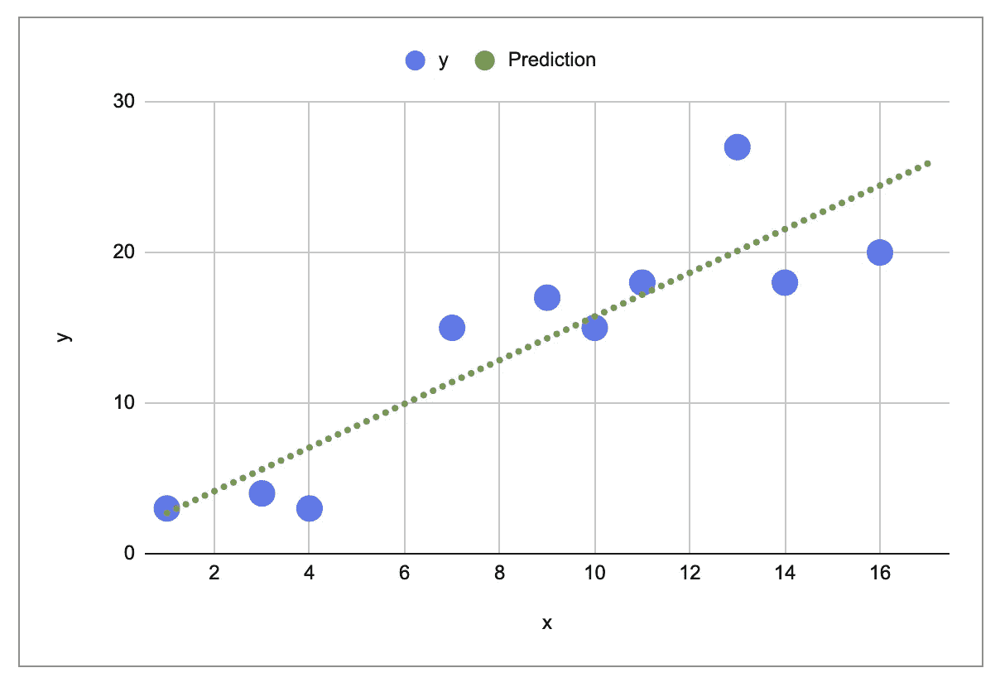
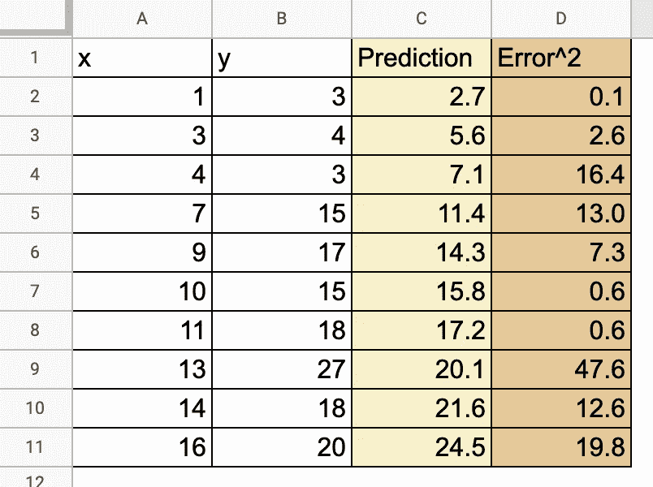
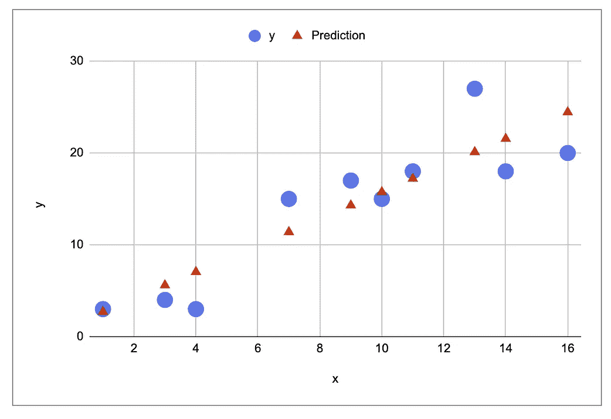
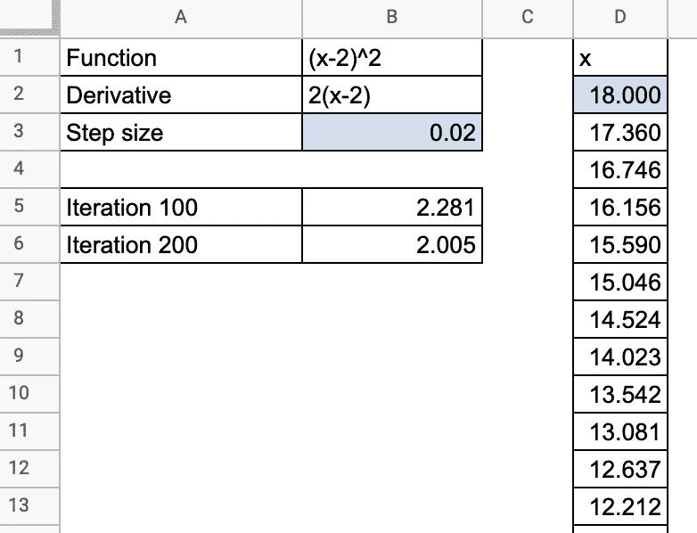
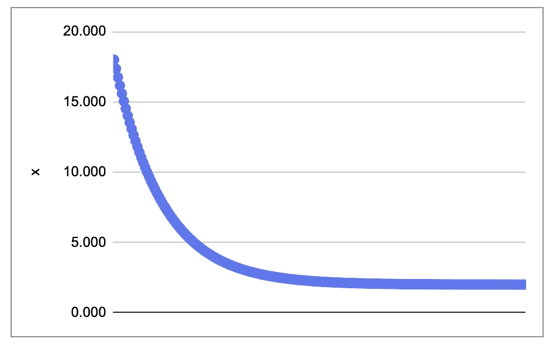
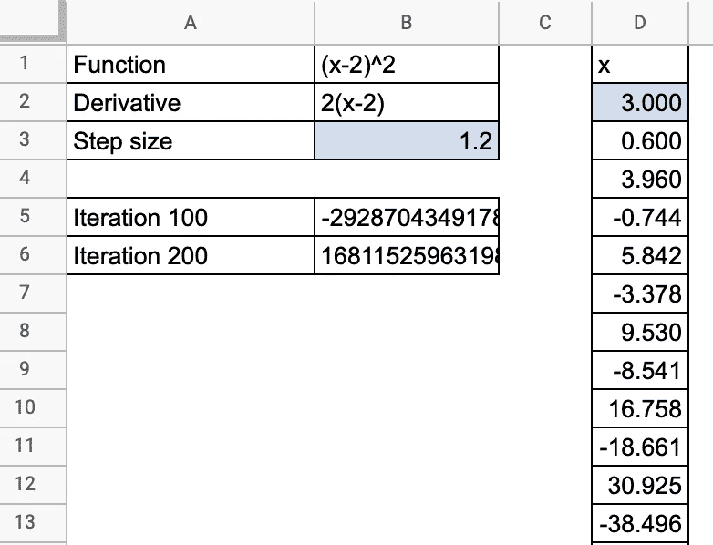
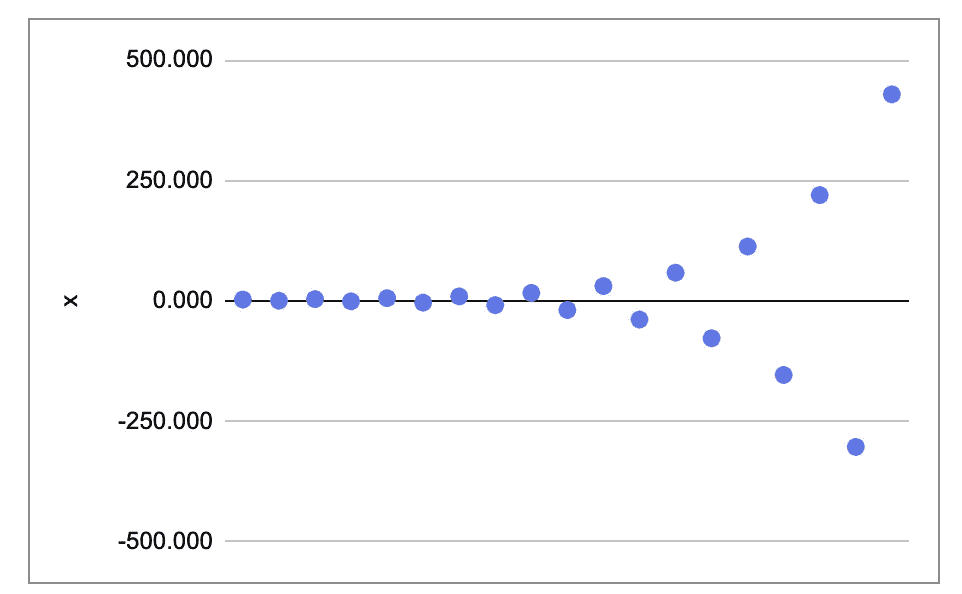
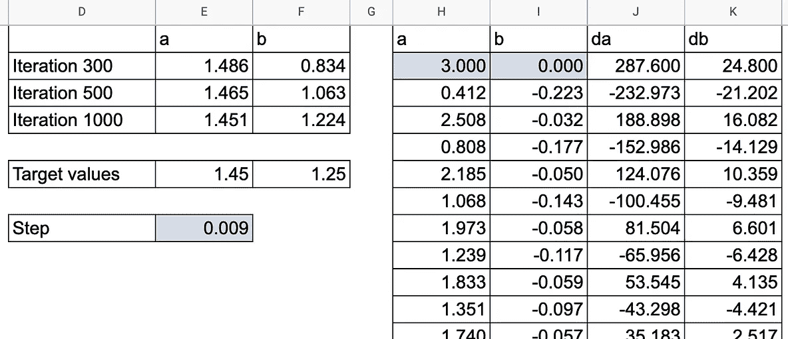
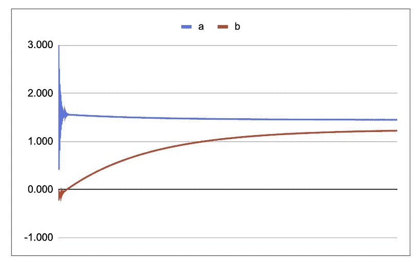

# 在 Excel 中从头开始线性回归

> 原文：<https://towardsdatascience.com/linear-regression-from-scratch-in-excel-3d8192214752?source=collection_archive---------19----------------------->

## 这样你就能更好地理解线性回归是如何工作的

虽然使用 Excel/Google Sheet 来解决机器学习算法的实际问题可能是一个坏主意，但使用**简单公式**和**简单数据集**从头实现该算法对于理解算法如何工作非常有帮助。在为几乎所有的常用算法做过之后，包括**神经网络**，它给了我很大的帮助。

在这篇文章中，我将分享我是如何用**梯度下降**实现一个**简单的** **线性回归**的。

现在让我们把手弄脏吧！

由 [Karen Maes](https://unsplash.com/@karen1974?utm_source=medium&utm_medium=referral) 在 [Unsplash](https://unsplash.com?utm_source=medium&utm_medium=referral) 上拍摄的照片

# 从零开始为 ML 的谷歌表

如果你想得到谷歌表，请在 Ko-fi 上支持我。

你可以得到我创建的所有谷歌表单(梯度下降的线性回归，逻辑回归，神经网络，KNN，k-means，等等)。)和下面的链接。

[https://ko-fi.com/s/4ddca6dff1](https://ko-fi.com/s/4ddca6dff1)

# **使用简单数据集**

首先，我使用一个非常简单的数据集和一个特征，您可以看到下图显示了目标变量 y 和特征变量 x。

# 创建线性模型

在 Google Sheet 或 Excel 中，您可以添加趋势线。所以你得到了线性回归的结果。

但如果你想用模型做预测，那么就必须实现模型，在这种情况下，模型相当简单:对于每个新的观察值 x，我们只需创建一个公式:y=a*x + b，其中 a 和 b 是模型的参数。

# 模型的成本函数

我们如何获得参数 a 和 b？a 和 b 的最佳值是最小化成本函数的值，成本函数是模型的平方误差。所以对于每个数据点，我们可以计算平方误差。

误差平方=(预测值-实际值)=(a* x+B-实际值)

为了找到代价函数的最小值，我们使用梯度下降算法。

# 简单梯度下降

在实现线性回归的梯度下降之前，我们可以先做一个简单的函数:(x-2)^2.

想法是使用以下过程找到该函数的最小值:

*   首先，我们随机选择一个初始值。
*   然后对于每一步，我们计算导函数 df 的值(对于这个 x 值): **df(x)**
*   而 x 的下一个值是通过减去导数乘以步长的值得到的: **x = x - step_size*df(x)**

您可以修改梯度下降的两个参数:x 的初始值和步长。

在某些情况下，梯度下降不起作用。例如，如果步长太大，x 值可能会爆炸。

# 线性回归的梯度下降

梯度下降算法的原理与线性回归相同:我们必须计算成本函数相对于参数 a 和 b 的偏导数。让我们将它们记为 da 和 d b。

误差平方=(预测值-实际值)=(a* x+B-实际值)

da = 2(a *x+b-实值)* x

db = 2(a* x+b-实际值)

在下图中，您可以看到 a 和 b 如何向目标值收敛。

现在在实践中，我们有许多观察结果，应该对每个数据点都这样做。这就是 Google Sheet 中事情变得疯狂的地方。所以，我们只用了 10 个数据点。

您将看到，我首先创建了一个带有长公式的工作表来计算 d a 和 db，其中包含所有观察值的导数之和。然后我创建了另一个表来显示所有的细节。

如果打开 Google Sheet，修改渐变下降的参数:a 和 b 的初始值，步长，就可以自己玩了。尽情享受吧！

现在如果你想了解其他算法，请随意复制这张谷歌表，并对**逻辑回归**甚至**神经网络**稍加修改。

为了更好地展示可视化模型，您可以阅读这篇文章:

 [## 线性回归直观且更容易理解

### 可以检查一下自己是否真的懂多元线性回归

towardsdatascience.com](/linear-regression-visualized-and-better-understood-c8f7b9c69810)