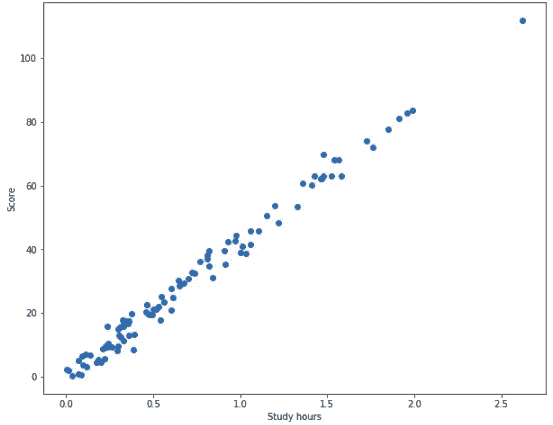
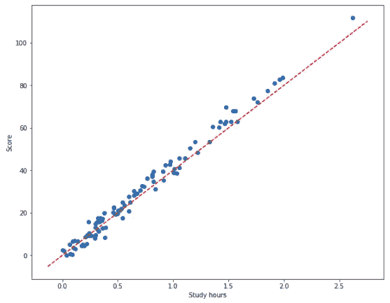
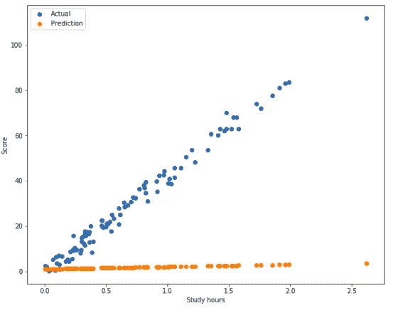
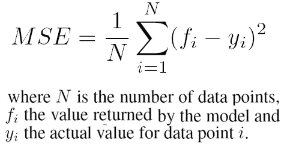
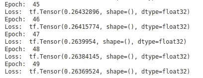
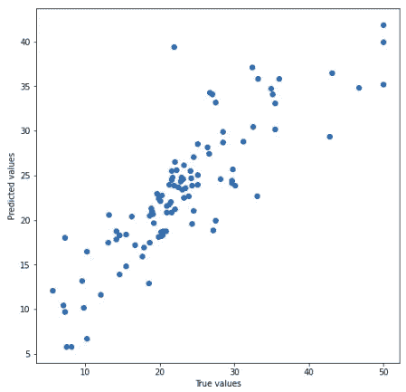

# 使用 Tensorflow 2 从头开始线性回归

> 原文：<https://towardsdatascience.com/linear-regression-from-scratch-with-tensorflow-2-part-1-3e2443804df0?source=collection_archive---------16----------------------->

## 纯用 TensorFlow 2.0 写线性回归算法


照片由 [Andrik Langfield](https://unsplash.com/@andriklangfield?utm_source=medium&utm_medium=referral) 在 [Unsplash](https://unsplash.com?utm_source=medium&utm_medium=referral) 上拍摄

线性回归是最基本的，也许是最常用的机器学习算法之一，初学者和专家都应该烂熟于心。在本文中，我将带你了解如何只用 Tensorflow 实现线性回归。讨论将分为两部分，第一部分解释线性回归的概念，第二部分是如何在 Tensorflow 中实现线性回归。

# 一.概念

线性回归试图通过拟合线性方程来模拟因变量和自变量之间的关系。假设我们有 100 名学生的测验分数和学习时间长度的数据。



100 名学生的测验分数和学习时间

通过观察散点图，我们可以很容易地用公式`y=mx+b`画一条线，其中`m`和`b`分别是斜率和 y 轴截距。从图上可以看出，`m`和`b`分别大约为 40 和 0。

让我们在`m=40`和`b=0`之间划一条线。



用公式 y=40x 拟合直线

`y=40x`线好看！然后，我们可以估计学生的分数是 40 乘以学生学习的小时数。

线性回归的工作原理与此完全相同，只是它不能从散点图中直观地检查斜率和 y 截距。相反，它首先猜测斜率和 y 轴截距，然后衡量其猜测的准确性。如果不够好，它会调整斜率和 y 轴截距，直到直线与数据吻合。

线性回归是一个三步算法:

1.  初始化线性方程的参数(斜率和 y 轴截距的第一次猜测)。
2.  基于某个函数测量拟合优度。
3.  调整参数，直到步骤 2 中的测量看起来不错。

## **1。线性方程和初始化**

现在，我们已经围绕线性回归建立了我们的直觉，让我们从数学的角度来讨论每一步。

线性回归模型的第一步是初始化一个线性方程，是的，我们将使用`y=mx+b`但是我们必须推广我们的方法。这样做的原因是，我们可能会面临多个独立变量的数据。可以把它看作是在我们的测验分数数据中增加了另一个变量，比如学习时喝的咖啡量。拥有这个`coffee`维度将使线性方程看起来像这样:`y=m1x1+m2x2+b`，其中 m1 和 m2 分别是学习时间和咖啡维度的斜率，x1 和 x2 是学习时间和咖啡变量。

我们将使用点积来表示矩阵、`m`和`x,`的乘积，而不是为每个新变量写一个更长的方程。注意，使用术语张量也是有效的，因为它是矩阵的推广。黑体字母用来表示矩阵，所以线性方程应该写成 y =**m**⋅**x**+**b**。

有许多方法可以初始化方程的参数，最常见的是使用随机值、0 或 1。你可以自由使用任何类型的初始化，这个选择将决定你的学习算法终止的速度。在算法的下一次迭代中，这些参数将基于步骤 2 中讨论的某个函数进行更新。

## 2.损失函数

现在假设你为 m 和 b 设置的初始值都是 1，那么你的方程就是`y=1x+1`。初始预测将看起来像下图中的橙色点。这显然是一个非常糟糕的预测，我们需要一个数字来量化这些预测是好是坏。



初始预测

有许多方法可以衡量我们预测的好坏，我们将使用其中一种叫做*均方误差(MSE)的方法。*在这种情况下，误差意味着差异，所以 MSE 字面意思是取实际值和预测值之差的平方，然后取平均值。它在数学上写为



图片来自[researchgate.net](https://www.researchgate.net/figure/Mean-Squared-Error-formula-used-to-evaluate-the-user-model_fig1_221515860)

像 MSE 这样的函数叫做损失函数或者目标函数。这些是算法想要最小化的函数。如果我们的线性回归模型完美地预测了测验分数，它的 MSE 将等于 0。因此，在算法的每次迭代中，它应该更新参数，以使 MSE 更接近 0，而不会过度拟合。过度拟合本身是一个完整的主题，但它的本质含义是，我们不希望我们的学习算法对训练数据如此好，却在测试集上惨败。

**3。梯度下降**

当然，我们可以继续猜测参数，直到我们足够接近零 MSE，但这将需要时间和努力— *梯度下降*将为我们做到这一点。如果你不熟悉这个术语，有大量的文章和视频解释它的概念。

梯度下降是人工智能的基石之一。就是机器学习中的学习。像梯度下降这样的算法允许学习算法在没有被如此明确地告知的情况下学习。(你需要温习一下微积分，了解梯度下降是如何工作的。)

梯度下降是一种优化算法，我们将使用它来最小化我们的损失函数(在这种情况下为 MSE)。它通过在每次迭代中用小的变化来更新参数，这个变化也可以很大，这取决于你的偏好(学习率)。

在每次新的迭代中，更新的参数将是***p _ new = p _ old-(l * dL/DP)***，其中 ***p*** 是参数，它可以是斜率、`m`或 y 轴截距、`b`。新变量， ***l*** 和****dL/DP***，是损失函数相对于参数的学习率和偏导数。*

*通过足够的迭代，斜率和 y 轴截距将更接近 40°和 0°，我们认为这些值“足够接近”以符合我们的数据。正如您可能已经观察到的，如果您恰好将参数初始化为接近 40 和 0，比如 35 和 0.5，那么算法将需要较少的迭代。*

*如果你想更深入地研究梯度下降的数学，这篇文章很有帮助。*

## *停止标准*

*以下是终止算法的一些可能方式:*

1.  *一旦达到指定的迭代次数，就终止算法。*
2.  *一旦满足指定的 MSE，就终止算法。*
3.  *如果 MSE 在下一次迭代中没有改善，则终止该算法。您可以指定一个精度，如 0.001，如果两个连续 MSEs 之间的差值小于该精度，则停止算法。*

# *II TensorFlow2 实现*

*在本演示中，我们将遵循上面讨论的线性回归算法的三步方法，并使用停止标准 1 终止算法。*

## *导入库*

*这些是我们在这个演示中需要的唯一的库。TensorFlow 用于构建算法，pyplot 用于可视化，而`boston_housing`作为我们的玩具数据集。*

```
*import tensorflow as tf
import matplotlib.pyplot as pltfrom tensorflow.keras.datasets import boston_housing*
```

## *1.初始化一个线性方程*

*让我们从创建一个带有初始化选项的`SimpleLinearRegression`类开始。*

*我指定了三个初始化选项，`ones`、`zeros`和`random`(默认)。`tf.random.uniform`将从范围`minval`和形状`shape`的`maxval`内的均匀分布中产生随机值的张量。我将`m`定义为一个没有特定形状的变量，因此它可以足够灵活地接受任意数量的独立变量，这可以通过设置`shape=tf.TensorShape(None)`来实现。*

## *2.损失函数*

*接下来是实现我们的损失函数，MSE。概括地说，MSE 在数学上写为:*

**

*图片来自 researchgate.net*

*下面是我在 TensorFlow 中实现的函数:*

*这在 Tensorflow 中写起来相当容易。首先取`true`和`predicted`值的差，用`tf.square`求差的平方，然后用`tf.reduce_mean`求差的平方的平均值。*

*该函数接受`true`和`predicted`值，前者来自数据本身，但后者必须经过计算。*

*`predict`方法是通过简化线性方程来完成的。首先我们取`m`(斜率张量)和`x`(特征张量)的点积，加上 y 轴截距`b`。我必须指定`reduction_sum`中的缩减将被计算到`1`的轴，否则它将把张量缩减为单个和。*

## *3.更新参数*

*我们需要梯度下降来更新每次迭代的参数。没有必要从头开始创建这个算法，因为 Tensorflow 已经为此建立了一个函数，`tf.GradientTape`。默认情况下，`GradientTape`将`persistent`设置为`False`，这意味着最多可以对该对象中的`gradient()`方法进行一次调用。因为我们使用它来计算每次迭代的两个梯度(一个用于`m`，另一个用于`b`，所以我们必须将其设置为`True`。然后，我们指定将要计算梯度的损失函数，在这种情况下是带有参数`y`和`self.predict(X)`的`mse`，它们分别代表`true`和`predicted`值。*

*每个参数将通过减去学习率和参数梯度的乘积来更新。*

```
****p_new = p_old - (l*dL/dp)****
```

*学习是一个超参数，应该在训练线性回归时指定。使用接受损失函数和参数的`gradient()`方法计算梯度`dL/dp`。这个操作只是求解损失函数相对于参数的偏导数。我们必须在每次迭代中计算两个梯度，一个用于`m`和`b`。*

*为了用新值更新参数，新值只是旧值减去`l*dL/dp`，我们简单地使用`tf.Variable`的`assign_sub()`方法。*

## *训练方法*

*让我们用一个`train`方法把所有的东西放在一起。*

*它做的第一件事是，检查数据是否只包含一个独立变量，如果是，那么它会把它变成一个 2D 张量。*

*`self.m.assign([self.var]*X.shape[-1])`将使用我们在初始化过程中设置的初始值初始化`m`,其形状遵循数据中独立变量的数量。*

*我们算法的停止标准是迭代次数，由`epoch`定义。对于每次迭代，它将调用`update`方法。*

## *这是线性回归的全部代码。*

## *测试我们的算法*

*是时候使用波士顿房屋数据集来测试我们的算法了。*

*使用`keras.datasets`加载数据集:*

```
*(x_train, y_train), (x_test, y_test) = boston_housing.load_data()*
```

*标准化数据:*

```
*mean_label = y_train.mean(axis=0)
std_label = y_train.std(axis=0)mean_feat = x_train.mean(axis=0)
std_feat = x_train.std(axis=0)x_train = (x_train-mean_feat)/std_feat
y_train = (y_train-mean_label)/std_label*
```

*创建并训练一个`SimpleLinearRegression`对象。*

```
*linear_model = SimpleLinearRegression('zeros')
linear_model.train(x_train_norm, y_train_norm, learning_rate=0.1, epochs=50)*
```

*这是最近五次迭代的损失:*

**

*让我们使用测试集来预测:*

```
*# standardize
x_test = (x_test-mean_feat)/std_feat# reverse standardization
pred = linear_model.predict(x_test)
pred *= std_label
pred += mean_label*
```

*我们必须首先将输入标准化，然后一旦我们有了预测，就逆转这个过程。*

**

# *结论*

*尽管简单，但线性回归是业内最常用的机器学习算法之一，一些公司会测试你对它的理解程度。虽然有更简单的方法来实现这个算法，比如使用 scikit-learn 甚至 TensorFlow 的`LinearRegressor`，但我们从头开始实现了整个算法，目的是体验 TensorFlow 的功能。当你进入神经网络时，有像`Keras`这样的高级库，它简化了使用 TensorFlow 作为后端构建神经网络的过程。但最终，特别是如果你是一名研究人员，你会想要定制你的模型，无论你想要什么，这就是 TensorFlow 的低级功能非常有用的地方。*