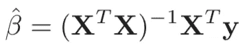

# Python 中的线性回归

> 原文：<https://towardsdatascience.com/linear-regression-in-python-a1d8c13f3242?source=collection_archive---------28----------------------->

## 线性回归简介


[来源](https://www.pexels.com/photo/green-iphone-5c-near-macbook-163143/)

线性回归是一种统计方法，用于模拟响应变量和解释变量之间的线性关系。回归函数描述了给定解释变量时响应变量的期望值，并由线性函数建模。

在本帖中，我们将回顾线性回归背后的理论，以及如何使用 python 中的机器学习库 scikit-learn 实现线性回归模型。

我们开始吧！

给定一个 *p* 维输入向量:


我们想预测一个实值响应 *Y* 。给定输入向量 *X* ，允许我们预测 *Y* 的线性回归模型具有以下形式:


该模型描述了输入特征的加权和。它假设在给定 *X* 的情况下，代表 *Y* 的期望的回归函数是线性的或近似线性的。参数β是未知系数，输入向量 *X* 可以来自定量输入、变换输入、基展开、交互项和/或代表类别的虚拟变量。给定一组训练数据，我们估计β参数的值:


这里，每个 *x* 为输入向量(特征值列表)，每个 *y* 为响应， *N* 为训练样本数。

如果我们回头看看回归模型:


我们看到，估计量 *f* 是一个常数加上具有相应 beta 值(或权重)的输入的线性组合。在求和中， *p* 是输入值或特征的数量。我们需要的是一种估计*p+*1*β参数的方法:*

**

*估计β参数最常用的方法是最小二乘法。该方法选择使残差平方和(RSS)最小的β参数值:*

**

*第一次遇到这种情况时，你可能会感到畏惧。简而言之，该方法选择描述每个特征重要性的权重。有关解释线性回归模型的更多信息，请查看 Christoph Molnar 的 [*可解释的机器学习*](https://christophm.github.io/interpretable-ml-book/index.html) 。*

*所以现在我们应该考虑如何最小化 RSS。让我们用矩阵符号重写 RSS:*

**

*在矩阵 **X** 中，每一行都是一个输入特征，RSS 是一个带有 *p* +1 个参数的二次函数。我们可以对 RSS 相对于*p*+1β参数求导:*

**

*如果我们设这个导数等于零:*

**

*我们有独特的解决方案:*

**

*我们现在有了使 RSS 最小化的β参数。给定输入向量，我们可以通过训练输入的拟合值来表示预测值:*

**

*我们现在已经讨论了足够多的理论。现在让我们讨论如何在 python 中实现线性回归模型。*

*出于我们的目的，我们将使用来自 [Kaggle](https://www.kaggle.com/mirichoi0218/insurance) 的*医疗费用个人数据集*数据。*

*首先，让我们导入 pandas 库:*

```
*import pandas as pd*
```

*接下来，让我们使用'将数据读入 Pandas 数据框。read_csv()'方法:*

```
*df = pd.read_csv("insurance.csv")*
```

*让我们打印前五行数据:*

```
*print(df.head())*
```

**

*我们将使用年龄、身体质量指数(bmi)、吸烟状况和性别建立一个线性回归模型来预测医疗费用。让我们定义我们的输入和输出:*

```
*import numpy as np df['sex_code'] = np.where(df['sex'] == 'female', 1, 0)
df['smoker_code'] = np.where(df['smoker'] == 'yes', 1, 0)X = np.array(df[['age', 'bmi', 'children', 'sex_code', 'smoker_code']])
y = np.array(df['charges'])*
```

*让我们为培训和测试拆分数据:*

```
*from sklearn.model_selection import train_test_split
X_train, X_test, y_train, y_test = train_test_split(X, y, test_size = 0.2, random_state = 42)*
```

*让我们从 scikit-learn (sklearn)导入线性回归模块，定义我们的线性回归对象，并拟合我们的模型:*

```
*reg = LinearRegression()
reg.fit(X_train, y_train)*
```

*现在，让我们打印出我们的模型表现如何。我们将使用 R 指标来衡量绩效。r 是一个统计指标，用于衡量数据与回归线的接近程度。值介于 0 和 1.0 之间，值 1.0 代表完美的模型性能:*

```
*print("Model Performance: ", reg.score(X_test, y_test))*
```

**

*我们看到我们的模型表现得相当好。0.78 的 R 意味着我们的模型解释了我们数据中 78%的方差。我就讲到这里，但是我鼓励你阅读更多关于线性回归的内容，自己动手处理数据和编写代码。以下是一些有助于您继续学习的额外资源:*

1.  *[*统计学习入门*](https://faculty.marshall.usc.edu/gareth-james/ISL/ISLR%20Seventh%20Printing.pdf)*
2.  *[*统计学习的要素*](https://web.stanford.edu/~hastie/ElemStatLearn/printings/ESLII_print12.pdf)*
3.  *[*可解释的机器学习*](https://christophm.github.io/interpretable-ml-book/index.html)*

# *结论*

*总之，在这篇文章中，我们讨论了线性回归背后的理论。线性回归使用特征的加权和来表示响应变量。使用最小二乘法计算模型中的权重。我们还展示了如何在 python 中实现一个线性回归模型，并使用它来基于患者特征预测医疗成本。我希望你觉得这篇文章有用/有趣。这篇文章中的代码可以在 [GitHub](https://github.com/spierre91/medium_code/tree/master/sklearn_tutorials) 上找到。感谢您的阅读！*