# Python 中的线性回归

> 原文：<https://towardsdatascience.com/linear-regression-in-python-a4cfbab72c17?source=collection_archive---------13----------------------->

## 线性回归背后的数学和 Python 实现方式


照片由[艾萨克·史密斯](https://unsplash.com/@isaacmsmith?utm_source=unsplash&utm_medium=referral&utm_content=creditCopyText)在 [Unsplash](https://unsplash.com/s/photos/trending-graph?utm_source=unsplash&utm_medium=referral&utm_content=creditCopyText) 拍摄

# Python 中的线性回归

线性回归是一种基于监督学习的机器学习算法。线性回归是一种预测模型，用于寻找因变量和一个或多个自变量之间的线性关系。这里，因变量/目标变量(Y)应该是连续变量。

让我们使用 ski-kit learn 来学习简单线性回归背后的数学和 Python 实现方式

## 资料组

让我们先看看我们的数据集。为了便于解释，我选取了一个简单的数据集。 `Years of Experience vs Salary`。

我们想根据一个人多年的经验来预测他的工资？

# 简单线性回归背后的数学

**数据集**

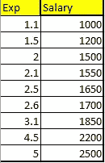

Exp vs 薪水[图片由作者提供]

在给定的数据集中，我们有 Exp vs Salary。现在，我们要预测 3.5 年经验的工资？让我们看看如何预测？

## 线性方程

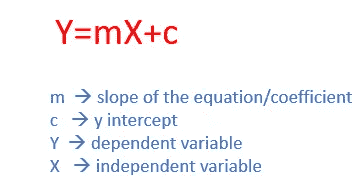

线性回归方程[图片由作者提供]

`c` →`y-intercept`→x 为零时 y 的值是多少？
回归线在 y 轴截距处切割 y 轴。

`Y` →给定 X 值的预测 Y 值

我们来计算一下 **m 和 c** 。

`m`又称**回归系数**。它表明因变量和自变量之间是否存在正相关关系。正相关意味着当自变量增加时，因变量的平均值也增加。

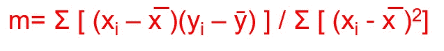

m →斜率/回归系数[图片由作者提供]

**回归系数**定义为 x 和 y 的协方差除以自变量 x 的方差。

**方差** →数据集中的每个数字离均值有多远。
x̄→x 的平均值
ȳ→y 的平均值

协方差是两个变量之间关系的量度。

我已经在 excel 表格中完成了所有的数学计算，可以从我的 [GitHub 链接](https://github.com/IndhumathyChelliah/LinearRegression/blob/master/mathcalc.xls)下载。

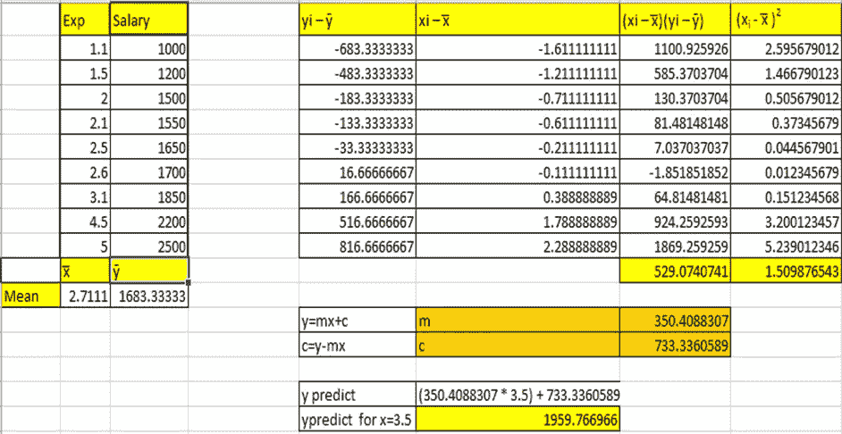

作者图片

**协方差**=(**σ[(x̅—易)])/n** =529.0740741

**方差**=(**σ[(x̅—Xi)])/n**= 1.509876543

**m=协方差/方差**= 529.0740741/1.509876543 = 350.488878657

`m=350.4088307`

现在来计算**截距**

y=mx+c
c=y-mx
应用平均 y (ȳ)和平均 x (x̅)in)等式并计算 c

`c=733.3360589`c = 1683.33333-(350.4088307 * 2.7111)

计算了 m 和 c 之后，现在我们可以做预测了。

我们来预测一个有 3.5 年经验的人的工资。

y = MX+c


y 预测=(350.4088307 * 3.5)+733.3360589 = 1959.766966

x=3.5 的预测 y 值是`**1959.766966**`

# 性能赋值

为了评估我们的回归模型有多好，我们可以使用以下指标。

## SSE-平方和误差

误差或 r **esidual** 是*实际*值和*预测*值之间的差值。所有误差的总和可以抵消，因为它可以包含负号，并给出零。所以，我们把所有的误差平方，然后求和。误差平方和最小的线是最佳拟合线。

最佳拟合线总是穿过 x̅和 ȳ.

在线性回归中，通过最小化误差(数据点和直线之间的距离)来计算最佳拟合直线。

**误差平方和**又称**残差**或残差平方和

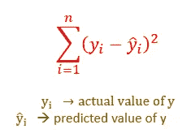

SSE 方程[图片由作者提供]

## SSR 回归的平方和

SSR 也被称为**回归误差**或解释误差。
是*预测值*与*因变量* ȳ的**均值**之差的总和


SSR 方程[图片由作者提供]

## SST 平方和合计

SST/总误差=误差平方和+回归误差。

数据集的总误差或可变性等于由**回归线**(回归误差)解释的可变性加上被称为**误差或残差**的无法解释的可变性( **SSE** )。

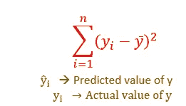

SST 方程[图片由作者提供]

已解释的错误或可变性→ SSR
未解释的错误→ SSE


作者图片

## MSE →均方误差

MSE 是数据点的实际值和预测值之间的平方差的平均值。

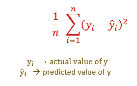

MSE ->方程[图片由作者提供]

## RMSE 均方根误差

RMSE 是衡量这些残差分布程度的指标。换句话说，它告诉你数据在最佳拟合线周围的集中程度。
RMSE 通过取 MSE 的平方根来计算。

**RMSE 解释:**
RMSE 解释为未解释方差的标准差(MSE)。
RMSE 包含与因变量相同的单位。
RMSE 值越低，表示拟合度越好。

## 相关系数

在建立模型之前，必须确定好的预测因素。相关系数(r)用于确定两个变量之间的关系强度。这将有助于确定良好的预测。

**公式:**

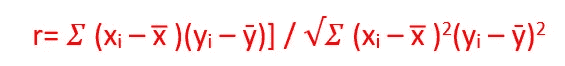

相关系数(r)[图片由作者提供]

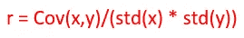

相关系数(r)[图片由作者提供]

r 值范围从-1 到 1。
`-1`表示负相关，即 x 增加，y 减少。
`+1`表示正相关，表示 x 和 y 向同一个方向移动。
`0`或接近 0 意味着没有相关性。

## **R ( R 平方)** →决定系数

**决定系数** →该指标在建立模型后用于检查模型的可靠性。

r→它等于回归解释的方差(回归误差或 SSR)除以 y 中的总方差(SST)

R →它描述了 y 中的总方差有多少是由我们的模型解释的。
如果**误差(无法解释的误差或 SSE) <方差** (SST)表示模型是好的。最佳拟合是未解释误差(SSE)最小的线。

r 值的范围从 0 到 1。

0 →表示差的型号
1 或接近 1 →表示最好的型号

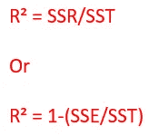

决定系数

## 计算我们数据集中的均方误差，RMSE，R

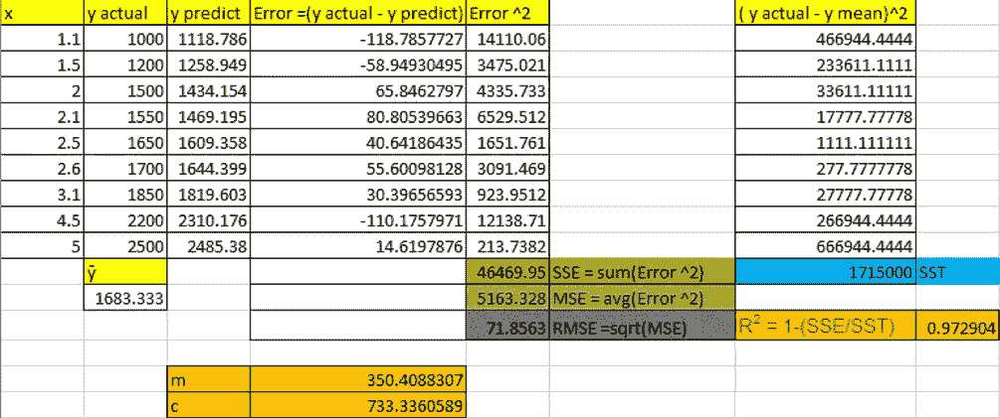

作者图片

# 让我们使用 scikit learn 在 Python 中做同样的实现。

使用的代码可以在我的 GitHub 链接中作为 [Jupyter 笔记本下载。](https://github.com/IndhumathyChelliah/LinearRegression/blob/master/LinearRegression1.ipynb)

## **1。导入所需的库**

```
**import** numpy **as** np
**import** pandas **as** pd
**import** matplotlib.pyplot **as** plt
**import** seaborn **as** sns
```

## **2。加载数据**

```
df=pd.read_csv(**"exp1.csv"**)
df
```

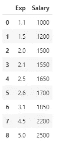

```
df.describe()
```

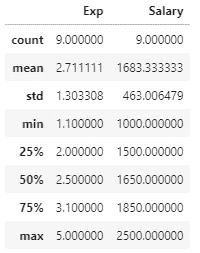

## **3。EDA —探索性数据分析**

*   **散点图**

```
plt.scatter(df.Exp,df.Salary,color=**'red'**)
```


[我们可以找到 x 和 y 之间的线性关系]

*   **直方图**

`df.hist()`

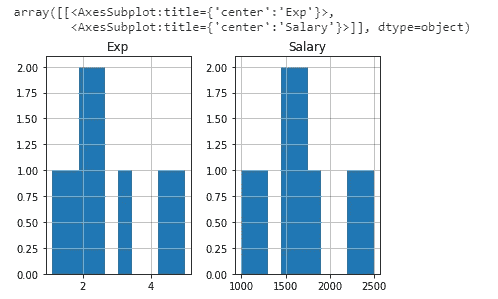

*   **求相关系数(r)**

`df.corr()`

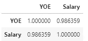

r 值 0.98 表明关系密切。

我们可以使用热图来绘制相关性

`sns.heatmap(df.corr(),annot=True,vmin=-1,vmax=-1)`

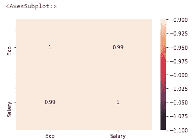

*   **查找缺失值**

`df.isna().sum()`

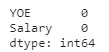

[没有丢失的值]

## 4.将特征分配给 X 和 Y

```
x=df.iloc[:,0:1]
x.head(1)

y=df.iloc[:,1:]
y.head(1
```

## 5.可视化数据集

```
plt.scatter(x, y)
plt.title(**'Experience Vs Salary'**)
plt.xlabel(**'Years of Experience'**)
plt.ylabel(**'Salary'**)
plt.show()
```

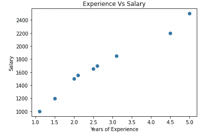

## 6.使用 sklearn 建立模型

```
**from** sklearn.linear_model **import** LinearRegression
lin_reg=LinearRegression()
lin_reg.fit(x,y)
```

**可视化模型**

```
plt.scatter(x,y)
plt.plot(x,lin_reg.predict(x),color=**'green'**)
plt.title(**"Regression Model"**)
plt.xlabel(**"YOE"**)
plt.ylabel(**"Salary"**)
```

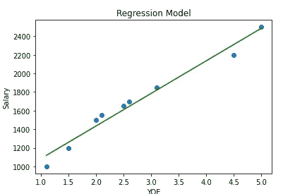

7 .**。使用模型**预测 3.5 年工作经验的工资

```
ypredict=lin_reg.predict(np.array([[3.5]]))
ypredict
*#Output:array([[1959.76696648]])*
```

**8。m(斜率)和 c(截距)值**

```
lin_reg.coef_
*#Output:array([[350.40883074]])* lin_reg.intercept_
*#Output:array([733.33605887])*
```

## 9.计算决定系数

```
ypredict=lin_reg.predict(x)
ypredict
```

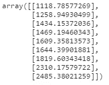

```
**from** sklearn.metrics **import** mean_squared_error,r2_score,explained_variance_score
print (**"Coefficient of determination :"**,r2_score(y,ypredict))
print (**"MSE: "**,mean_squared_error(y,ypredict))
print(**"RMSE: "**,np.sqrt(mean_squared_error(y,ypredict)))#Output:
Coefficient of determination : 0.9729038186936964
MSE:  5163.327882256747
RMSE:  71.85630022661024
```

我们使用数学计算和 python 实现得到相同的值。
如果这是一个大型数据集，我们必须分割数据进行训练和测试。

**GitHub 链接**

在我的 [GitHub 链接](https://github.com/IndhumathyChelliah/LinearRegression)中可以找到这个故事中用到的代码、数据集和 excel 表格

# 结论

在这个故事中，我们采用了简单的数据集，并使用 scikit learn 学习了简单线性回归背后的数学和 python 实现方式。
我们还可以使用 **statsmodel** 实现线性回归。

# 我关于机器学习的其他博客

[](/line-of-best-fit-in-linear-regression-13658266fbc8) [## 线性回归中的最佳拟合线

### 相关系数、决定系数、模型系数

towardsdatascience.com](/line-of-best-fit-in-linear-regression-13658266fbc8) [](/logistic-regression-in-python-2f965c355b93) [## Python 中的逻辑回归

### 详细的逻辑回归

towardsdatascience.com](/logistic-regression-in-python-2f965c355b93) [](/an-introduction-to-support-vector-machine-3f353241303b) [## 支持向量机简介

### 如何在分类问题中使用 SVM？

towardsdatascience.com](/an-introduction-to-support-vector-machine-3f353241303b) [](/an-introduction-to-k-nearest-neighbours-algorithm-3ddc99883acd) [## K-最近邻算法简介

### 什么是 KNN？

towardsdatascience.com](/an-introduction-to-k-nearest-neighbours-algorithm-3ddc99883acd) [](https://pub.towardsai.net/naive-bayes-classifier-in-machine-learning-b0201684607c) [## 机器学习中的朴素贝叶斯分类器

### 使用 sklearn 的数学解释和 python 实现

pub.towardsai.net](https://pub.towardsai.net/naive-bayes-classifier-in-machine-learning-b0201684607c) [](https://betterprogramming.pub/understanding-decision-trees-in-machine-learning-86d750e0a38f) [## 理解机器学习中的决策树

### 决策树背后的数学以及如何使用 Python 和 sklearn 实现它们

better 编程. pub](https://betterprogramming.pub/understanding-decision-trees-in-machine-learning-86d750e0a38f) 

*关注此空间，了解更多关于 Python 和数据科学的文章。如果你喜欢看我的更多教程，就关注我的* [***中***](https://medium.com/@IndhumathyChelliah)[***LinkedIn***](https://www.linkedin.com/in/indhumathy-chelliah/)*[***推特***](https://twitter.com/IndhuChelliah) ***。****

****点击这里成为中等会员:****

*[*https://indhumathychelliah.medium.com/membership*](https://indhumathychelliah.medium.com/membership)*