# Python 中的线性回归:Sklearn vs Excel

> 原文：<https://towardsdatascience.com/linear-regression-in-python-sklearn-vs-excel-6790187dc9ca?source=collection_archive---------14----------------------->

## [内部 AI](https://towardsdatascience.com/machine-learning/home)

## 对于快速和近似的线性回归预测业务案例，Microsoft excel 是一个好的替代方案吗？我认为是的，但是让我们做一个试金石来确定它。


照片由[法兰克诉](https://unsplash.com/@franckinjapan?utm_source=medium&utm_medium=referral) & [克里斯里德](https://unsplash.com/@cdr6934?utm_source=medium&utm_medium=referral)在 [Unsplash](https://unsplash.com?utm_source=medium&utm_medium=referral)

大约 13 年前， **Scikit-learn** 开发作为 David Cournapeau 的 **f** Google Summer of Code 项目的一部分开始。随着时间的推移，Scikit-learn 成为 Python 中最著名的机器学习库之一。它提供了几种分类、回归和聚类算法，在我看来，它的主要优势是与 Numpy、Pandas 和 Scipy 的无缝集成。

在本文中，我将比较 Scikit-learn 和 excel 的多元线性回归的预测精度。Scikit-learn 提供了许多参数(称为估计器的超参数)来微调模型的训练并提高预测的准确性。在 excel 中，我们没有太多的调整回归算法。为了公平比较，我将使用默认参数训练 sklearn 回归模型。

***目标***

该比较旨在了解 excel 和 Scikit-learn 中线性回归的预测准确性。此外，我将简要介绍在 excel 中执行线性回归的过程。

***样本数据文件***

为了进行比较，我们将使用 8 年来每天多次测量的 100，000 个降水、最低温度、最高温度和风速的历史读数。

我们将使用降水量、最低温度和最高温度来预测风速。因此，风速是因变量，其他数据是自变量。

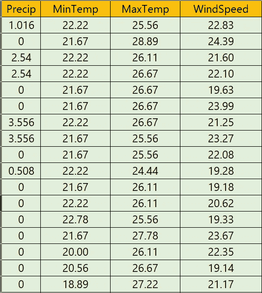

培训数据—样本

我们将首先在 excel 上建立并预测风速的线性回归模型。然后我们将使用 Scikit-learn 做同样的练习，最后，我们将比较预测的结果。

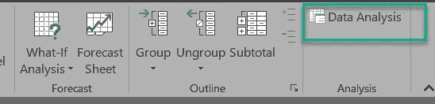

Excel 功能区截图

要在 excel 中执行线性回归，我们将打开示例数据文件，并在 excel 功能区中单击“数据”选项卡。在“数据”选项卡中，选择数据分析选项。

***提示:*** *如果看不到“数据分析”选项，那么点击文件>选项>加载项。选择“分析工具库”并点击“Go”按钮，如下图所示*

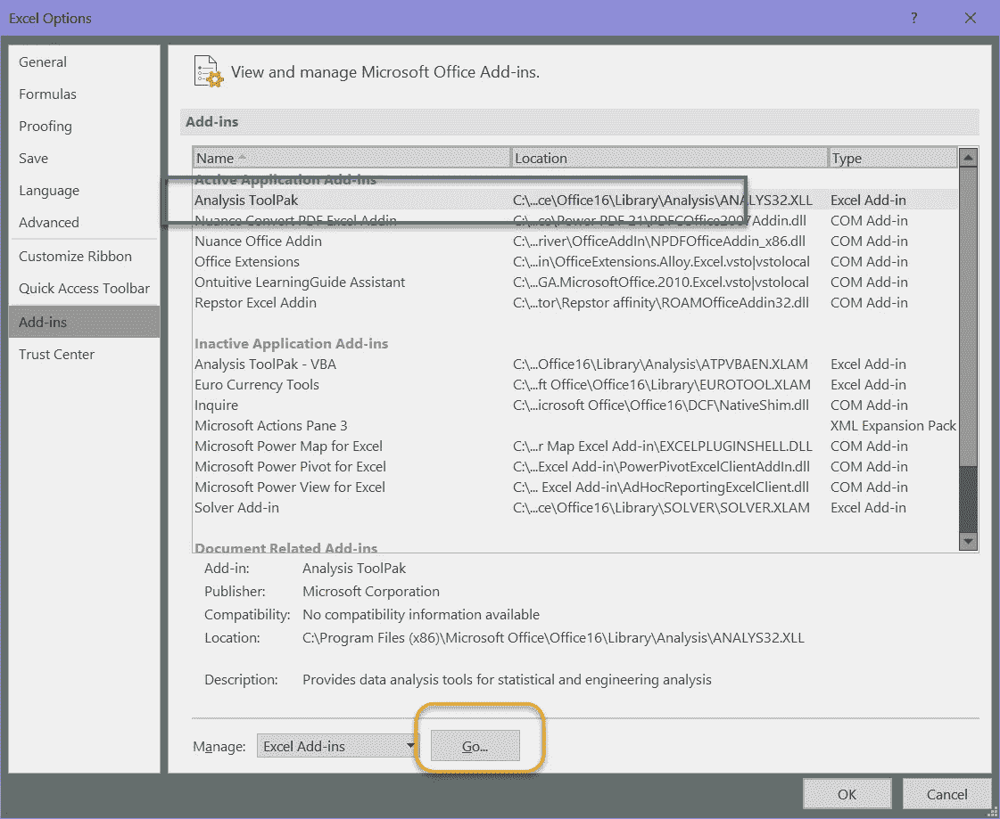

Excel 选项屏幕截图

点击“数据分析”选项，将打开一个弹出窗口，显示 excel 中可用的不同分析工具。我们将选择回归，然后单击“确定”。

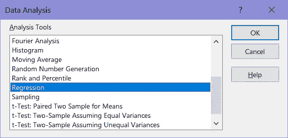

将显示另一个弹出窗口，提供独立值和从属值系列。风速(因变量)的 Excel 单元格参考在“输入 Y 范围”字段中提及。在“输入 X 范围”中，我们将提供独立变量的单元格参考，即降水量、最低温度和最高温度。

我们需要选中复选框“Label ”,因为示例数据中的第一行有变量名。

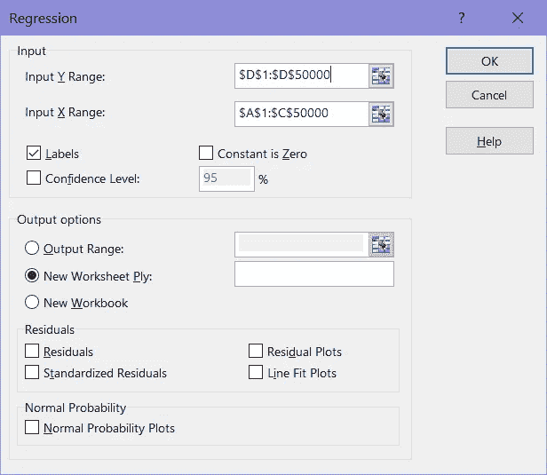

在指定数据后单击“确定”按钮，excel 将建立一个线性回归模型。你可以把它看作是 Scikit-learn 编码中的训练(fit 选项)。

Excel 进行计算，并以漂亮的格式显示信息。在我们的示例中，excel 可以拟合 R 平方为 0.953 的线性回归模型。考虑到训练数据集中有 100，000 条记录，excel 在不到 7 秒的时间内执行了线性回归。除了其他统计信息，它还显示了不同自变量的截距和系数。

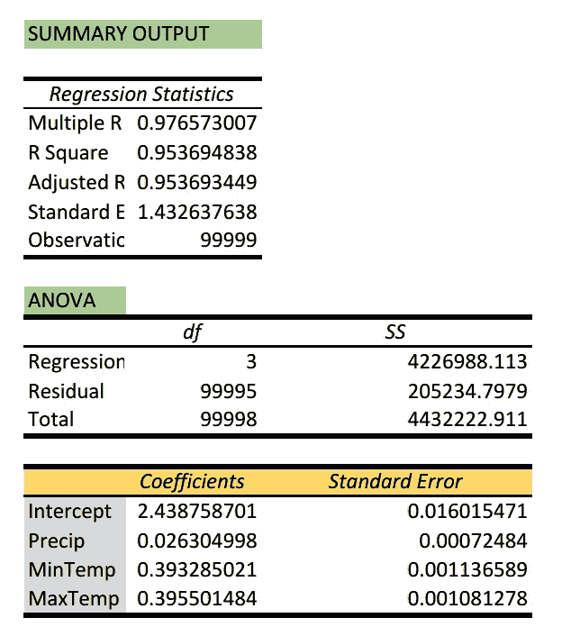

基于 excel 线性回归输出，我们可以整理出以下数学关系。

风速= 2.438 +(降水量* 0.026) +(最小温度*0.393)+(最大温度*0.395)

我们会用这个公式来预测测试数据集的风速，这是 excel 回归模型没有见过的。

例如，对于第一个测试数据集，风速= 2.438+(0.51 * 0.026)+(17.78 * 0.393)+(25.56 * 0.395)= 19.55

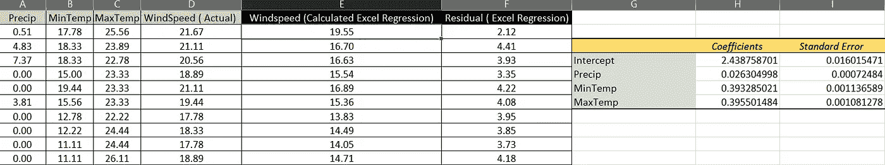

此外，我们计算了预测的残差，并绘制了它以了解其趋势。我们可以看到，在几乎所有的情况下，预测的风速都低于实际值，风速越大，预测的误差就越大。

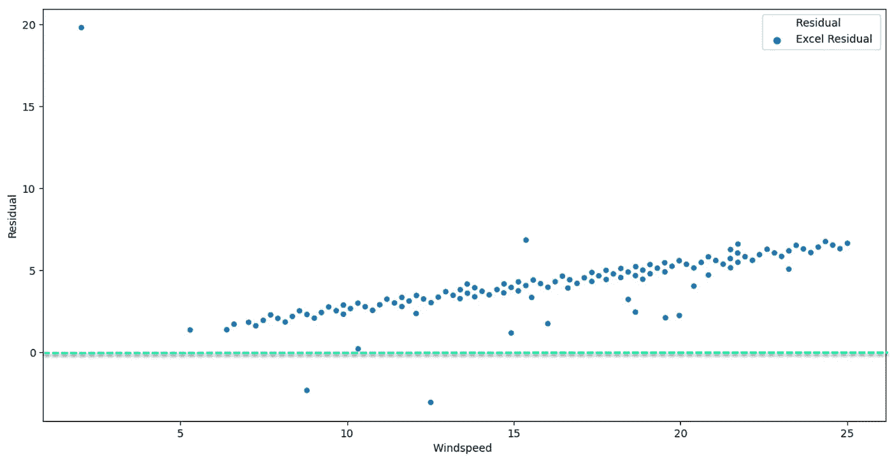

风速实际值与 Excel 线性回归残差散点图

让我们不要在 Scikit-learn 中钻研线性回归。

***步骤 1-*** 我们将导入将要用于分析的包。各个独立变量的值分布在不同的值范围内，并且不是标准的正态分布，因此我们需要 StandardScaler 来标准化独立变量。

```
from sklearn.preprocessing import StandardScaler
from sklearn.linear_model import LinearRegression
from sklearn.metrics import r2_score
import pandas as pd
import numpy as np
import matplotlib.pyplot as plt
```

***步骤 2-*** 将 excel 文件中的训练和测试数据分别读入 PandasDataframe 的 Training_data 和 Test_data 中。

```
Training_data=pd.read_excel(“Weather.xlsx”, sheet_name=”Sheet1") Test_data=pd.read_excel(“Weather Test.xlsx”, sheet_name=”Sheet1") 
```

我不会关注初步的数据质量检查，如空白值、异常值等。和各自的修正方法，并假设不存在与差异相关的数据序列。

请参考“[机器学习监督算法如何识别正确的自变量？](/how-to-identify-the-right-independent-variables-for-machine-learning-supervised-algorithms-439986562d32)"用于自变量选择标准和相关性分析。

***步骤 3-*** 在下面的代码中，我们声明了除“风速”之外的所有列数据为自变量，只有“风速”为训练和测试数据的因变量。请注意，我们不会使用“SourceData_test_dependent”进行线性回归，而是用它来比较预测值。

```
SourceData_train_independent= Training_data.drop(["WindSpeed"], axis=1) # Drop depedent variable from training datasetSourceData_train_dependent=Training_data["WindSpeed"].copy() #  New dataframe with only independent variable value for training datasetSourceData_test_independent=Test_data.drop(["WindSpeed"], axis=1)
SourceData_test_dependent=Test_data["WindSpeed"].copy()
```

**在下面的代码中，独立的训练和测试变量被缩放，并分别保存到 X-train 和 X_test。我们既不需要扩大训练规模，也不需要测试因变量的值。在 y_train 中，保存的从属训练变量不进行缩放。**

```
sc_X = StandardScaler()X_train=sc_X.fit_transform(SourceData_train_independent.values) #scale the independent variablesy_train=SourceData_train_dependent # scaling is not required for dependent variableX_test=sc_X.transform(SourceData_test_independent)
y_test=SourceData_test_dependent
```

***第 5 步-*** 现在我们将分别输入独立和非独立的训练数据，即 X_train 和 y_train，来训练线性回归模型。出于本文开头提到的原因，我们将使用默认参数执行模型拟合。

```
reg = LinearRegression().fit(X_train, y_train)
print("The Linear regression score on training data is ", round(reg.score(X_train, y_train),2))
```

训练数据的线性回归得分与我们使用 excel 观察到的得分相同。

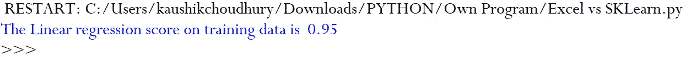

***步骤 6-*** 最后，我们将基于测试独立值数据集来预测风速。

```
predict=reg.predict(X_test)
```

基于预测的风速值和残差散点图，我们可以看到 Sklean 预测更接近实际值。

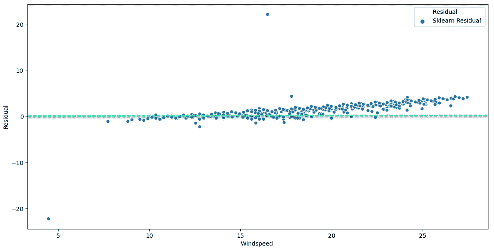

风速实际值与 Sklearn 线性回归残差散点图

在并排比较 Sklearn 和 excel 残差时，我们可以看到，随着风速的增加，这两个模型偏离实际值更多，但 sklearn 比 Excel 做得更好。

另一方面，excel 确实像 sklearn 一样预测了相似的风速值范围。如果近似线性回归模型对您的业务案例足够好，那么要快速预测值，excel 是一个非常好的选择。

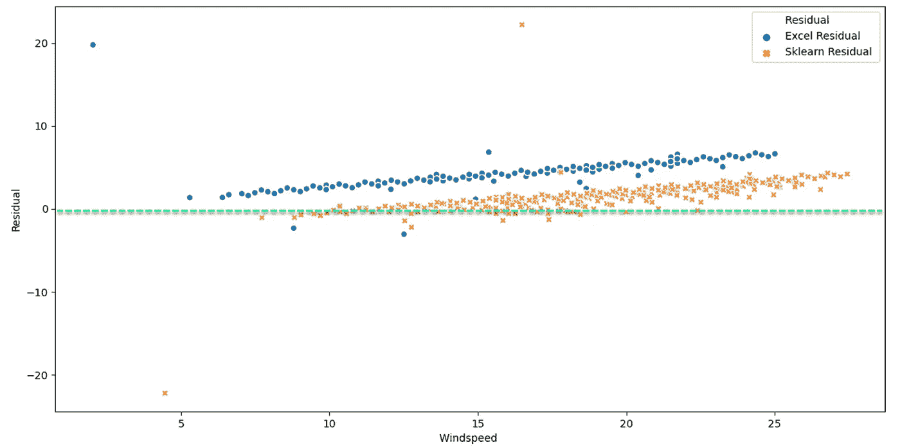

实际风速与残差散点图

Excel 可以在相同的精度水平上执行线性回归预测，因为 sklearn 不是本练习的要点。我们可以通过微调参数来大幅提高 sklearn 线性回归预测的准确性，它更适合处理复杂的模型。对于快速和近似的预测用例，excel 是一个非常好的选择，具有可接受的准确性。