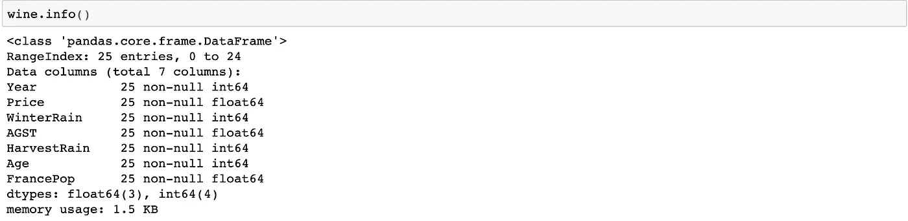
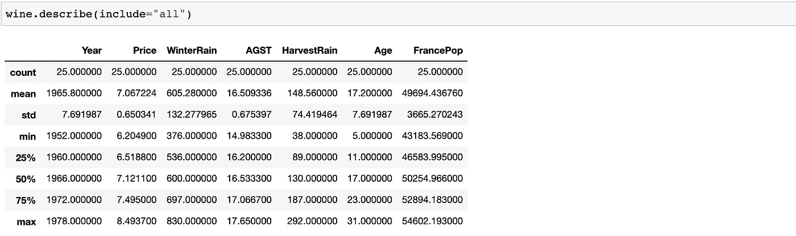
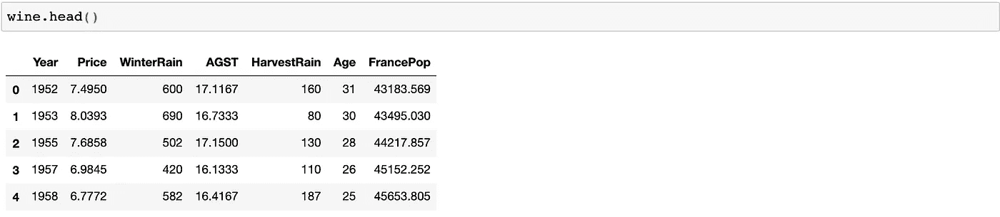
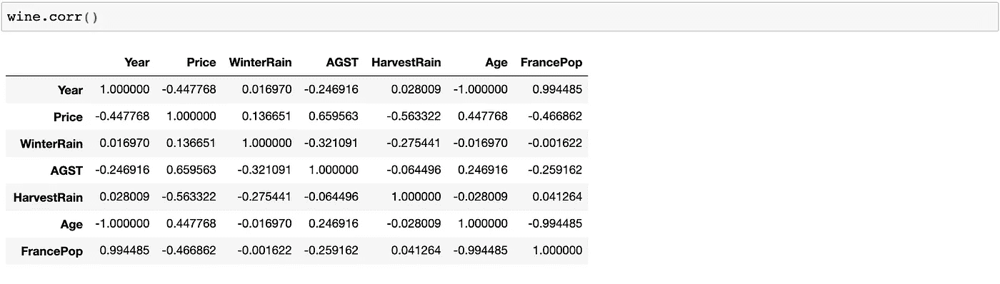
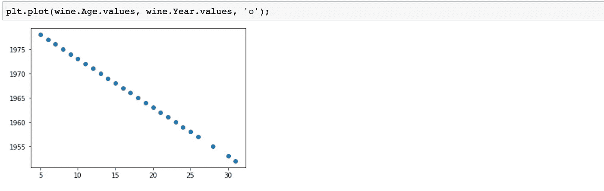
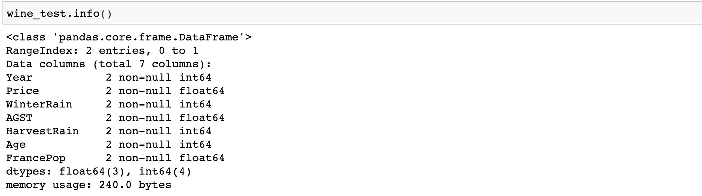

# Python 中的线性回归——波尔多方程

> 原文：<https://towardsdatascience.com/linear-regression-in-python-the-bordeaux-equation-d0e414dc5065?source=collection_archive---------45----------------------->

## 预测葡萄酒的价格


照片由[金莎·埃利斯](https://unsplash.com/@kymellis?utm_source=unsplash&utm_medium=referral&utm_content=creditCopyText)在 [Unsplash](https://unsplash.com/s/photos/wine?utm_source=unsplash&utm_medium=referral&utm_content=creditCopyText) 上拍摄

波尔多红酒在全世界都很受欢迎。Bordeaux 案例研究非常著名地用于使用 r 解释和实现一元和多元线性回归。

有关案例研究的更多信息，请参见[这里的](https://bookdown.org/egarpor/SSS2-UC3M/multlin-examps.html)。数据在[这里](https://rstudio-pubs-static.s3.amazonaws.com/326428_e7b3416aa30140e79f57b8ed70ca64e4.html)可用。

线性回归查找数据集可能的最小残差平方和。从[这里](/introducing-linear-regression-least-squares-the-easy-way-3a8b38565560)开始，让自己快速掌握线性回归基础知识。

这篇文章讲述了用一个**变量**和多个**变量**创建一个**线性回归**模型的步骤。然后，我们继续根据 **R 平方**对模型进行评分。讨论 **R 平方**的**限制**，我们探索**调整 R 平方**作为评估模型的更好分数。我们会遇到**相关性**和**自变量之间的多重共线性**以及出现这种情况时该怎么办。最后，我们**使用最适合的模型预测**值。

## 目标是:

我们希望根据天气状况等特定因素来预测波尔多葡萄酒的价格。价格本质上将量化葡萄酒的质量。

## 进口:

下面你将看到使用库组合的 Python 实现:`Pandas`、`Numpy`、`Scikit-learn`、`Matplotlib`。

```
import pandas as pd 
import numpy as np 
import matplotlib.pyplot as plt 
from sklearn.linear_model import LinearRegression wine = pd.read_csv("wine.csv")
```

## 数据:

`wine.shape`告诉我们我们正在处理 25 行 7 列。

`Year`:葡萄收获酿酒的年份；
`Price`:根据 1990-1991 年拍卖的波尔多葡萄酒平均市场价格的对数；
`WinterRain`:冬季降雨量(毫米)；
`AGST`:生长季平均温度(摄氏度)；`HarvestRain`:收获降雨量(毫米)；
`Age`:葡萄酒的年份，以在木桶中储存的年数来衡量；`FrancePop`:法国在`Year`的人口(以千计)。

`wine.info()`:



`wine.describe(include="all")`:



`wine.head()`:



`Price`是我们的因变量，其余是我们用来预测`Price`的自变量。`Price`量化葡萄酒的品质。

现在我们创建一个一元线性回归模型，根据`AGST`预测`Price`。

## 一元线性回归模型:

```
**# create an instance of the class LinearRegression**
model1 = LinearRegression() **# .values converts the pandas series to a numpy array**AGST = wine.AGST.values.reshape((-1, 1)) **# x-value**
Price = wine.Price.values **# y-value**
```

x 输入数组需要 2D，更准确地说，需要尽可能多的行数和一列数。因此我们必须`reshape`这个数组。`reshape((-1,1))`:作为第一个参数的'-1 '让`numpy`为您确定结果矩阵中未知的行数。“1”指定一列。输出是一维柱状阵列。

> 注意:未知数可以是列或行，但不能同时是列和行。

接下来，我们用 x 和 y 值拟合线性回归模型`model1`。

`model1.fit(AGST, Price)`

用`.fit()`计算直线 **y = mx+c** 的最优值，用**给定** 输入输出(x 和 y)作为自变量。它返回`self`，这是变量模型本身。

## 模型 1 结果:

计算出的回归线的属性，即模型截距和斜率提取如下:

```
**# the model attributes**intercept = model1.intercept_slope = model1.coef_
```

> y =斜率* x +截距

您会注意到`intercept`是标量，`slope`是数组。

`model1.score(AGST, Price)`输出模型的 R 平方值。r 平方是给定数据与计算出的回归线接近程度的度量。

> 假设我们的模型(回归线)的形式为 **y=mx+c** ，R-squared 是平方误差的总和(根据回归线，特定点 **x** 的实际数据点 **y** 的值与在该值 **x** 处的 **y** 的计算值之间的差值)。

还有另一个“值”可以帮助我们预测模型的质量。这是**调整后的 R 平方**。

当我们加入更多的自变量时，r 平方总是会增加。因此，R 平方并不是衡量另一个变量是否应该包含在模型中的理想方法。但是 adjusted-R-squared(根据输入变量的个数修正的 R-squared)如果对模型没有帮助的话会 ***减少*** 。因此，我们应该为我们创建的每个模型计算调整后的 R 平方，以便进行比较。

调整后的 R 平方公式:
`1 — (1-r_sq)*(len(y)-1)/(len(y)-X.shape[1]-1)`

在我们的例子中，我们用`Price`代替`y`，用`AGST`代替`X`。

```
adj_r_sq = 1 — (1-r_sq)*(len(Price)-1)/(len(Price)-AGST.shape[1]-1)
```

**我们的结果:**

```
slope = array([0.63509431])
intercept = -3.4177613134854603r_sq = 0.43502316779991984
adj_r_sq = 0.4104589577042642
```

## 多元线性回归模型:

我们再加一个自变量→ `HarvestRain`。

我们的`y-value`保持原样。同样，我们必须`reshape`我们的输入变量。一旦整形，我们使用`np.concatenate`将两个独立变量合并成一个矩阵。`axis = 1`指定它们沿着列轴连接。

```
var1 = wine.AGST.values.reshape((-1, 1))
var2 = wine.HarvestRain.values.reshape((-1, 1))X = np.concatenate((var1,var2), axis = 1)model2 = LinearRegression()model2.fit(X, Price)
```

## **模型 2 结果:**

```
r_sq2 = model2.score(X, Price)
adj_r_sq2 = 1 - (1-r_sq2)*(len(Price)-1)/(len(Price)-X.shape[1]-1)intercept2 = model2.intercept_
slope2 = model2.coef_
```

**我们的结果:**

```
slope2 = array([ 0.60261691, -0.00457006])
**#array[0] corresponds to the coefficient of AGST
#array[1] corresponds to the coefficient of HarvestRain**intercept2 = -2.202653600949956r_sq2 = 0.7073707662049418
adj_r_sq2 = 0.6807681085872093
```

正如预期的那样，R 平方值增加了。但是看看调整后的 R 平方值——从之前的 0.41 变成了 0.68。这表明将变量`HarvestRain`添加到`model2`中给了我们一个更好的模型来预测`Price`！

我们可以不断添加独立变量，并比较调整后的 R 平方值，以检查模型是变得更好还是更差。但是，在经历每次添加新变量创建新模型的漫长过程之前，我们可以使用 ***相关性*** 来计算出哪些变量不需要包含在内。

## 相互关系

相关性*是指一对变量线性相关的程度*。它的范围从-1 到+1。+1 表示完美的正线性关系；相关性为-1 表示完全负线性关系，相关性为 0 表示两个变量之间没有线性关系。

让我们找出每个变量之间的相互关系。

`wine.corr()`



***注意*** 自变量和因变量(`Price`)之间有高相关值是好事。当两个独立变量之间高度相关时，问题就出现了。这叫做**多重共线性**。

> 注意:“高相关性”指的是相关性的绝对值，因此包括正相关性和负相关性。

注意`Year`和`Age`是绝对负相关的(-1 相关系数)。这是有道理的，因为葡萄收获的年份越老，葡萄酒的年份就越老。

`plt.plot(wine.Age.values, wine.Year.values, ‘o’)`



`Year`对`Age`的曲线图

另外两对高度相关的自变量是`Year` & `FrancePop` **和** `Age` & `FrancePop`。

由于上述原因，这些相关性也是有意义的。法国的人口`FrancePop`，随着每一个`Year`而增加。同样，葡萄酒的`Age`随着`Year`的增加而减少。

由于多重共线性，我们必须去除无关紧要的变量。

> 为什么？
> 
> 如果 A 与 B 相关，那么我们不能解释 A 和 B 的系数。要知道为什么，想象一下 A=B(完全相关)的极端情况。然后，型号 **y=100 *A+50* B** 与型号 **y=5 *A+10* B** 或**y =-2000*A+4000*B**相同。
> 
> 不存在最优解。我们必须不惜一切代价避免这些情况。
> 
> [来源](https://datascience.stackexchange.com/questions/36404/when-to-remove-correlated-variables)

我们必须从`Year`、`FrancePop`和`Age`中去掉一些独立变量。`Year`与`FrancePop`和`Age`都相关，并且本质上给出与`Age`相同的信息。

移除`Year`后，我们仍然面临`Age`和`FrancePop`之间的多重共线性问题。`FrancePop`与酒的质量无关。因此，我们保留`Age`，这对于我们的模型来说直观上是有意义的，因为越老的葡萄酒通常越贵。

请注意，去掉所有三个- `Year`、`Age`和`FrancePop`将导致我们创建一个缺少一个非常重要特性的模型-`Age`。

## 最终模型:

```
model3 = LinearRegression()var1 = wine.AGST.values.reshape((-1, 1))
var2 = wine.HarvestRain.values.reshape((-1, 1))
var3 = wine.WinterRain.values.reshape((-1,1))
var4 = wine.Age.values.reshape((-1,1))X = np.concatenate((var1,var2,var3,var4), axis = 1)model3.fit(X, Price)r_sq3 = model3.score(X, Price)
adj_r_sq3 = 1 - (1-r_sq3)*(len(Price)-1)/(len(Price)-X.shape[1]-1)
intercept3 = model3.intercept_
slope3 = model3.coef_
```

**我们的结果:**

```
slope3 = array([ 0.60720935, -0.00397153,  0.00107551,  0.02393083])
intercept3 = -3.4299801869287148r_sq3 = 0.8285662193424285
adj_r_sq3 = 0.7942794632109141
```

`model3`的调整后 R 平方是从`model2`的 0.68 到 0.79 的跳跃！看起来棒极了！

> 你绝对可以尝试创建没有`Age`和`FrancePop`的模型，以及没有`Age`和有`FrancePop`的模型，看看他们得分的差异。

## 这些预测:

我们期待已久的终于来了。非常感谢您抽出时间来完成这篇文章！

我们对`model3`很满意，现在我们想使用这个模型进行预测。

将测试文件读入`wine_test`。

`wine_test = pd.read_csv(“wine_test.csv”)`

`wine_test.shape` : 2 行 X 7 列

`wine_test.info()`:



先来得到`model3`的预测回应:

`y_pred = model3.predict(X)`。我们得到了一个预测响应的数组。这是使用`AGST`、`HarvestRain`、`WinterRain`和`Age`的给定值，我们用它们创建了`model3`。

现在让我们使用`wine_test`中的新数据。

```
var1 = wine_test.AGST.values.reshape((-1, 1))
var2 = wine_test.HarvestRain.values.reshape((-1, 1))
var3 = wine_test.WinterRain.values.reshape((-1,1))
var4 = wine_test.Age.values.reshape((-1,1))X_test = np.concatenate((var1,var2,var3,var4), axis = 1)y_pred_test = model3.predict(X_test)
```

`y_pred_test`给出一个数组，第一个和第二个测试点的值分别为 6.7689 和 6.6849。

查看测试点的给定`Price`，我们看到两个测试点的实际价格分别为 6.9541 和 6.4979。这说明我们的预测还是蛮不错的！

我们的测试集非常小，因此我们应该增加测试集的大小，以便对我们的模型更有信心。

参考资料:

*   [Python 中的线性回归](https://realpython.com/linear-regression-in-python/)
*   [sklearn.linear_model。线性回归](https://scikit-learn.org/stable/modules/generated/sklearn.linear_model.LinearRegression.html)