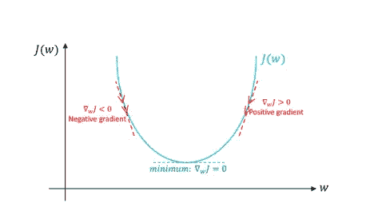
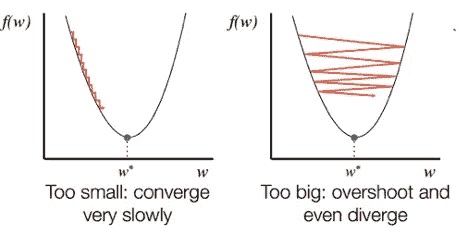

# 线性回归变得简单！

> 原文：<https://towardsdatascience.com/linear-regression-made-easy-702e5dc01f03?source=collection_archive---------22----------------------->

## 掌握线性回归及其工作原理的虚拟指南——不需要计算机科学、ML 或统计学经验！

马特·拉格兰在 [Unsplash](https://unsplash.com?utm_source=medium&utm_medium=referral) 上拍摄的照片

W 当我想学习机器学习，并开始在互联网上搜索介绍性算法的解释和实现时，我大吃一惊。我登陆的每个网站都在解释算法，就像我在阅读某种研究论文一样，一点也不适合初学者！各种各样的术语和方程式被扔来扔去，以为我应该知道它们——而我对此毫无头绪。

通过这篇文章和本系列的其他文章，我将尝试用一种实际的、外行的方法来解释算法及其背后的直觉。不需要任何先验知识！如果在任何时候，你对某个术语或过程感到困惑，不要担心，很可能其他人也有同样的情况。请留下你的回复，我或其他熟悉这个术语的人会帮助你；像往常一样，我们一起踏上学习之旅:)。现在，事不宜迟，让我们开始思考吧！

# **线性回归背后的直觉**

对许多人来说，线性回归被认为是机器学习的“hello world”。这是一个极好的起点，可以突出机器学习的能力以及统计学和计算机科学之间的交叉路口。

一般来说，线性回归用于通过**揭示输入特征和数据目标值之间的潜在关系来理解我们所拥有的数据**。一旦我们发现了这种关系，我们就有能力对我们以前从未见过的新数据做出预测。还是有点迷茫？ ***别急*** ，我们来举个例子:)

[Toa Heftiba](https://unsplash.com/@heftiba?utm_source=medium&utm_medium=referral) 在 [Unsplash](https://unsplash.com?utm_source=medium&utm_medium=referral) 上拍摄的照片

让我们跳进一个假设的情况；我和你在寻找一个全新的房子！假设我们想知道在一个特定的社区，一栋普通的房子要花多少钱，你会怎么猜呢？

你可能会权衡大量不同的因素。有些可能是:

*   这所房子有多大？(平方英尺)
*   *是哪个州/社区？*
*   *这个社区的犯罪率是多少？*
*   *离高速公路和商店有多近？*

> 这份清单还在继续，你还能想出更多吗？

在与一些房地产经纪人交谈并询问您的朋友后，我们发现价格是由三个核心因素决定的:**大小**、**犯罪**和**与商店/市场的接近度**(记住，这是假设…我对房地产一无所知:)。换句话说，使用这三个值，我们应该能够预测任何房子的价值。

既然我们知道是什么决定了房子的价格，我们想揭示这些因素和目标价值之间的潜在关系，在我们的例子中，目标价值就是房子的总价。因此，我们面临这样一个等式:

> **房价** =(？x **大小** ) +(？x **犯罪** ) +(？x **接近度**

从这个等式，我们可以推断出房子的价格是由三个属性决定的。在 ML 术语中，这些属性被称为**特征**并影响房价(**目标值**)。显然，每个特征对目标价值/房价的影响并不相同(即，面积对价格的影响可能比该地区的犯罪率更大)。因此，我们必须以某种方式发现*房价的多少百分比依赖于每个具体特征*并分配一个**权重**(用**表示？**)到每个特性。

现在，想象一下在我们发现问号的真实值后我们能做什么。只要给出三个数字，我们就能准确预测任何房子的价格:*面积*、*犯罪率*和*离商店的距离*！换句话说，我们应该已经理解了*特性和目标值之间的潜在关系。*

你猜怎么着？原来线性回归就是用来做这个的！使用该算法，我们将能够揭示**权重**，以便我们可以预测看不见的数据的目标值。

让我们快速回顾一下我们刚刚看到的关键术语:

*   **特征:**负责预测最终输出的因素
*   **目标值**:我们想要最终预测的值。这个预测来自于将我们的特征值乘以我们的权重(*上面的等式*)
*   **权重:**各因素对预测值的影响量；这些被认为是算法的**参数**

*那么，我们如何准确地计算出这些权重/参数呢？*很高兴你问了！给你介绍一下我的好朋友，**渐变下降**。

# **梯度下降**

既然我们已经对什么是线性回归有了一个坚实的理解，那么是时候深入研究*了。*具体来说，*我们如何算出线性回归的权重参数？*

随着梯度下降，模型的参数在每个“步骤”迭代地改变**，直到我们达到期望的精度。**

> ***PITSTOP:* 还记得什么参数吗？如果没有，请参考本部分上面关于关键术语的段落！**

**比方说，为了初始化我们的参数，我们使用你的母亲，一位前房地产经纪人说的随机值。**

**让我们用之前的等式代替问号:**

> ****房价** = (200 x **大小** ) + (-100 x **犯罪** ) + (1000 x **接近度**)**

**根据你妈妈的说法，离商店的远近是决定房价的最重要的因素(正如分配给邻近特征的最大权重所示)。**

**请记住，这些数字是我们凭直觉选择的初始值。我们也可以选择完全随机的数字，这样就没问题了。这些初始值将在算法的每一步发生变化，并最终收敛于它们的最优值。**

**按照我们的类比，假设我们两个和你妈妈一起去参观房子，对于我们看到的每栋房子，我们都会问这些问题:**

*   **这所房子的面积有多大？**
*   **周围社区的犯罪率是多少？**
*   **房子离商店和必需品有多近？**

**对于第一个问题，我们希望答案是实际的平方英尺，因此代表**的尺寸**。**

**对于第二个问题，让我们想象一个叫做 *VPY* (每年受害人数)的假设尺度。这将显示过去一年中相关领域犯罪的受害者人数，并代表我们等式中的**犯罪**值。**

**对于我们的第三个也是最后一个问题，让我们假设另一个客观的假设范围，从 1 ( *离商店*很远)到 100 ( *离商店*很近)。该值将代表我们的**接近度**值。**

****

**德里克·托萨尼在 [Unsplash](https://unsplash.com?utm_source=medium&utm_medium=referral) 上拍摄的照片**

**当我们看到第一栋房子并问你妈妈问题时，她给出了以下回答:**

*   **这所房子有 3000 平方英尺。ft**
*   ***犯罪率平均为 100 VPY***
*   ***这座房子实际上是在一个偏僻的地方，只有船和飞机可以到达***

**请记住，因为我们想要根据我们的参数预测房子的价格，所以我们只需要这些值和**而不是房子的实际价值**。在预测了房价之后，我们会问你妈妈房子的实际价格是多少，以便进行比较。**

**我们的预测值和实际值之间的差异决定了我们的参数/权重的最优程度。梯度下降的任务是最小化这种差异(*预测-实际*)；简单对吗？！**

> *****误差*** =预测—实际**

**在文献中，这种差异被称为**误差**，因为它表明预测与实际值相比有多不同/错误。**

**现在，让我们将答案中的数字代入我们的等式:**

> ***=(200 x***3000***)+(-100 x***100***)+(1000 x***1***)***

***经过计算，我们的预测结果是:***

> ******房价*** 预测*= 59.1 万美元****

****现在，在预测之后，我们问你妈妈，得到房子的实际价格，并计算两个值之间的误差。****

> *******房价*** 实际*= 30 万美元*****
> 
> *******误差** =预测 *—* 实际= 59.1 万–30 万= 29.1 万*****

****我们的误差结果是*291000*。从逻辑上讲，我们的目标是通过改变我们的权重/参数使这个值**尽可能小**。****

****这个**误差**值在机器学习中还有另一个名字:**代价**。该值被称为*成本*，因为*成本*会使我们与实际值相差一定的量。在这个房屋的例子中，如果我们按照我们的预测行事，如果我们决定以这个价格购买房屋，那么*实际上会多花*291，000 美元！****

> ****为了确保您理解，错误/成本为 0 意味着什么？****
> 
> ****这意味着我们的预测正是实际值，我们的参数是最优的！****

****现在的问题是，*我们究竟应该如何改变权重来最小化我们的成本？我们如何知道增加或减少哪一个？*****

****当然，在这种情况下，我们可以只是直观地增加和减少数字，直到我们达到一个低误差/成本；但是，想象一下如果我们有 100 个特征。我不知道你是怎么想的，但我肯定不想在一百个价值的权重上无所事事！应该有更简单的方法…****

****同样，我们还有另一个问题:**我们得到的误差不能只代表一个房子**。因为我们希望我们的改变世界的公式能够代表所有的房子，所以我们希望我们的参数能够在给定三个值**任何房子**——而不仅仅是一个的情况下做出准确的预测。****

****由于这个原因，我们必须得到我们想要的一大堆房子的值(大小，犯罪，接近度)，把它们代入方程，找出误差，然后分别改变参数。**我们得到的房子和数据越多，我们的公式就越能概括**！****

********

****由[马库斯·斯皮斯克](https://unsplash.com/@markusspiske?utm_source=medium&utm_medium=referral)在 [Unsplash](https://unsplash.com?utm_source=medium&utm_medium=referral) 上拍摄****

******梯度下降的核心目的是最小化成本函数**。通过最小化成本函数( *pred — actual* )，我们还确保了最低的误差和最高的精度！我们迭代地检查我们的数据集(逐值/逐屋),同时在每一步更新我们的参数。****

****回到我们的房屋参观类比，回想一下我们有三个参数:大小、犯罪和邻近性。如前所述，我们希望他们在最小化成本函数的方向上改变**。查看每个数据点就相当于对我们看到的每栋房子问同样的三个问题，插入这些值以提取误差/成本，并决定下一步应该朝哪个方向走以最小化成本函数。******

****现在，终极问题。我们如何决定我们应该朝哪个方向前进以最小化我们的成本？****

****微积分在这里扭转了局面。通过对成本函数**相对于特定变量**的**导数**，我们可以得到我们应该改变变量的方向。****

****我知道乍一看这听起来极其复杂，但是不要担心！其实挺容易的。通过对特定函数求导，我们能够得到误差的**斜率**。这个斜率代表误差的**方向，我们简单地在那个方向上采取**小步骤**，以便**减少总误差。**我们寻找前进的方向，并为我们的每个变量(本例中为三个)前进一步。方向/坡度代表**坡度**，我们的步代表我们的**下降**，因此**坡度下降！********

****假设我们有下面的抛物线，它映射了我们三个函数中每一个函数的成本和权重(总共三个抛物线)。这意味着，在每一步，我们都更接近每个重量的最佳值！****

********

****单个参数的成本(J)对权重(W)的映射****

> *****PITSTOP:* 为了确保您理解，斜率为 0 意味着什么？****
> 
> ****这意味着我们对特定变量的权重是最优的，我们不需要采取任何措施来纠正我们的错误！换句话说，我们在抛物线的顶点(看图！).这个点也被称为**局部最小值******

****概括一下，我们现在有了成本函数的导数，代表了我们需要前进的方向。现在我们要做的就是更新每个参数！这是通过以下方式实现的:****

> ******大小**更新 = **大小**旧——(学习率 x **成本函数的导数**w/大小)****
> 
> ******罪***更新* = **罪** *旧*——(学习率 x **成本函数的导数***w/罪*)****
> 
> ******接近度** *更新=* **…** (你能猜出这个吗？)****

****这被称为**更新规则**，并使用它们唯一的偏导数应用于我们所有的参数。我们对每一步(我们看到的每一个数据点)的所有参数应用这个更新规则。****

****你可能想知道**学习率**是多少。这表示每个步骤中参数更新的数量。学习率是可配置的，通常在 0 和 1 之间选择一个值；更简单地说，它决定了模型学习的速度:****

*   ****如果学习率太小，模型将花费大量的时间和步骤来收敛于局部最小值****
*   ****如果学习率太高，我们可能会错过最佳值，并且迈得太大****

********

****小学习率对大学习率****

****就像金发姑娘:不太热，不太冷，刚刚好。**调优这个超参数对机器学习非常重要！******

****回顾一下，一次迭代意味着询问关于单个房子的三个问题，并分别更新我们的参数。****

****在多次迭代我们的数据集之后，当我们到达**成本足够低的点**(即上面成本抛物线的顶点)时，我们会停下来。****

****一旦成本低了，我们知道参数是**优化的**。使用这些针对我们的特征(大小、犯罪和邻近)的优化参数，我们现在能够准确地猜测任何房子的价格，而不用看到价格本身！我们需要做的就是问这三个问题，用我们的最佳重量乘以它们——还有 viola！****

****这就是**机器在*机器学习*中学习的**:精确预测机器给出的任何东西的**最佳参数**。****

****就是这样！现在你是机器学习和线性回归方面的专家— *也许不是*，但这是朝着正确方向迈出的一大步！****

# ******结论******

********

****由[弗勒](https://unsplash.com/@yer_a_wizard?utm_source=medium&utm_medium=referral)在 [Unsplash](https://unsplash.com?utm_source=medium&utm_medium=referral) 上拍摄的照片****

****现在我们终于完成了，让我们复习一下你学过的所有术语:****

*   ******特征:** *它们是什么？*****
*   ******目标值:** *是什么？*****
*   ******权重/参数:** *它们是什么，控制什么？*****
*   ******渐变下降:** *这有助于我们完成什么？*****
*   ******误差/成本:** *这是怎么算出来的？*****
*   ******成本函数的导数:** *这提供了什么，如何用它来更新我们的参数？*****
*   ******渐变/下降:** *我们如何获得渐变？血统是什么意思？*****
*   ******局部极小值:** *如果我们在梯度下降中处于局部极小值意味着什么？*****
*   ******更新规则:** *这个什么时候应用？一般公式是什么？*****
*   ******学习率:** *学习率控制什么？如果太大了会怎么样？太小了？*****
*   ******优化:** *权重/参数最优是什么意思？*****

****如果你能回答所有这些问题，你就知道了线性回归和梯度下降背后的理论。****

****如果你不能回答其中的一个问题，继续向前**向上滚动**和**找到答案**！这些术语按照它们在文章中出现的顺序列出，出现时也用粗体显示。为了帮助你的读者更容易找到相关信息，你也可以随意**突出重要的句子**。****

****既然了解了线性回归，**就可以编码了！请继续关注如何从头开始编写完整的线性回归代码，并进行跟踪，这样您就可以准确地知道它何时发布。现在，我希望你学到了新的东西，并希望很快见到你:)******