# Python 中的模型拟合、相关性、p 值、t 统计、置信区间和可视化

> 原文：<https://towardsdatascience.com/linear-regression-model-fitting-and-visualization-4e6486497dd7?source=collection_archive---------18----------------------->

## 如何将线性回归模型拟合到数据，从模型中推断系数、标准误差、t 统计量和置信区间，以及绘制置信带、方差和单个协变量影响的可视化技术。

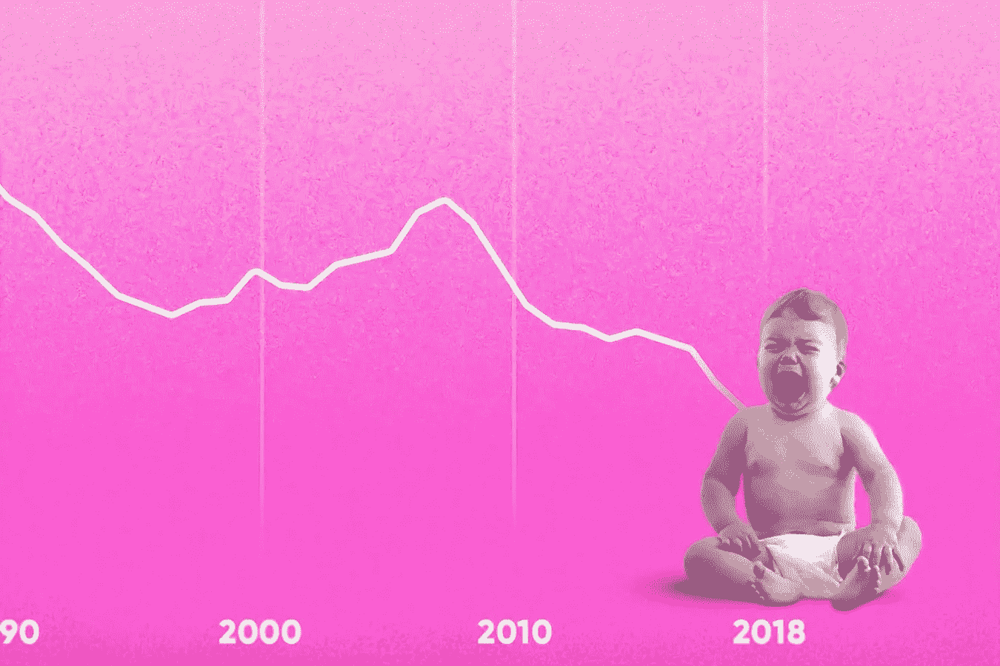

来源:Unsplash by [晨酿](https://unsplash.com/photos/MkIZ456qwPI)

线性回归是最常用的回归模型。原因是它使用简单，可以推断出好的信息，并且容易理解。在本文中，我们将讨论线性回归模型对数据的拟合，从中进行推断，以及一些有用的可视化。

# 要使用的工具:

1.  Python 编程语言及其一些流行的库。如果您不知道所有这些库，您仍然可以阅读本文并理解其概念。
2.  Jupyter 笔记本环境。

# 特征选择

以我的经验来看，最好的学习方法是通过举例。我将使用数据集，并不断解释根据数据拟合模型并推断信息的过程。我正在使用一个名为 NHANES 数据集的调查数据集。这是一个非常好的实践数据集。请随意从以下链接下载数据集:

[](https://github.com/rashida048/Datasets/blob/master/nhanes_2015_2016.csv) [## rashida 048/数据集

### 在 GitHub 上创建一个帐户，为 rashida048/Datasets 开发做出贡献。

github.com](https://github.com/rashida048/Datasets/blob/master/nhanes_2015_2016.csv) 

让我们导入包和数据集:

```
%matplotlib inline
import matplotlib.pyplot as plt
import seaborn as sns
import pandas as pd
import statsmodels.api as sm
import numpy as npdf = pd.read_csv('nhanes_2015_2016.csv')
```

这个数据集非常大，我们不需要这篇文章的所有特性。我们将着重于回归模型，其中结果变量将是腰围的大小。如果您想处理任何其他变量，请确保您选择的是定量变量，而不是分类变量。因为线性回归被设计成只预测定量变量而不是分类变量。但是你可以用分类变量作为自变量。检查所有列的名称以了解数据集。

```
df.columns#Output:
Index(['SEQN', 'ALQ101', 'ALQ110', 'ALQ130', 'SMQ020', 'RIAGENDR', 'RIDAGEYR', 'RIDRETH1', 'DMDCITZN', 'DMDEDUC2', 'DMDMARTL', 'DMDHHSIZ', 'WTINT2YR', 'SDMVPSU', 'SDMVSTRA', 'INDFMPIR', 'BPXSY1', 'BPXDI1', 'BPXSY2', 'BPXDI2', 'BMXWT', 'BMXHT', 'BMXBMI', 'BMXLEG', 'BMXARML', 'BMXARMC', 'BMXWAIST', 'HIQ210'], dtype='object')
```

所以，只要保留腰围尺寸和一些似乎与腰围尺寸相关的其他变量，并制作一个新的更小的数据框架。仅凭直觉，任何人都会猜测体重可能与腰围大小有很强的相关性。性别、身体质量指数、身高也可能发挥重要作用。因此，为了方便起见，只使用这些列创建一个新的更小的数据帧，并删除任何空值。

```
keep = ['BMXWT', 'BMXHT', 'BMXBMI', 'BMXWAIST', 'RIAGENDR']
db = df[keep].dropna()
db.head()
```

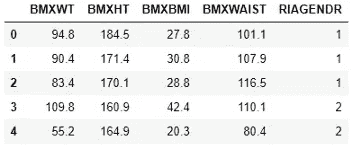

# 线性回归和解释

我们有一个包含五列的数据集:体重、身高、体重指数(身体质量指数)、腰围和性别。如前所述，腰围是输出变量，我们将尝试使用其他变量进行预测。最初，只使用一个变量或一个协变量来预测腰围。体重(BMXWT)可能是一个很好的协变量，因为体重越高，腰围越大。尽管还有其他因素，比如身高或性别。但是我们以后会考虑的。我们将拟合模型，其中腰围将被表示为体重的函数。

```
model = sm.OLS.from_formula("BMXWAIST ~ BMXWT", data=db)
result = model.fit()
result.summary()
```

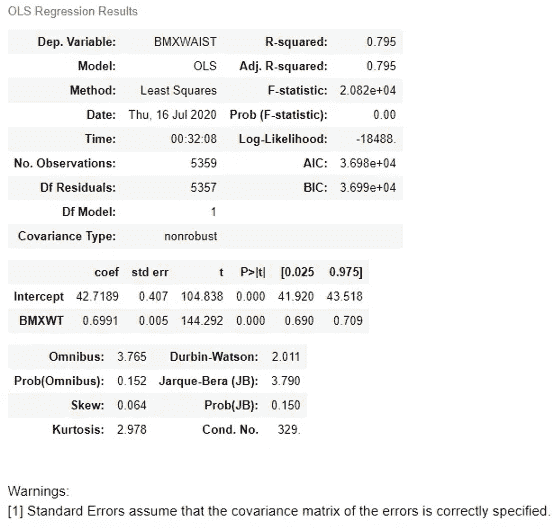

上面这张表对你来说可能看起来很吓人。但是大多数信息对我们来说并不那么重要。我们只需要表格的这一部分:

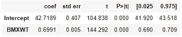

在第一列，我们有系数。记住线性回归公式:

Y = AX + B

在上表中，42.7189 是 B，0.6991 是我们的 A，我们知道 A 是斜率。所以，我们的斜率是 0.6991。这意味着，如果一个人增加一个单位的体重，他/她的腰围就会增加 0.6991 个单位，这是基于 P>|t|栏中提到的 P 值。接下来，标准误差为 0.005，这表示该估计斜率与真实斜率的距离。t-statistic 表示估计的斜率 0.6991 比零高出 144.292 个标准误差。最后两列是置信水平。默认情况下，置信度为 95%。置信区间是 0.69 和 0.709，这是一个非常窄的范围。稍后我们将绘制一个置信区间带。

```
db.BMXWAIST.std()
```

标准偏差为 16.85，似乎远高于回归斜率 0.6991。但是回归斜率是体重每单位变化时腰围的平均变化。也就是说，如果一个人比另一个人超重 10 个单位，他/她的腰围就会增加 0.6991*10 或 6.99 个单位。

# 相互关系

除了小子表中的这些值之外，结果摘要中还有一个参数很重要。这是结果摘要顶行中的 R 平方值。这里的 R 平方值是 0.795，这意味着 79.5%的腰围可以用体重来解释。现在，用皮尔逊系数的平方来检查这个回归系数。

```
cc = db[["BMXWAIST", "BMXWT"]].corr()
print(cc)BMXWAIST     BMXWT
BMXWAIST  1.000000  0.891828
BMXWT     0.891828  1.000000
```

要计算 R 平方值:

```
cc.BMXWAIST.BMXWT**2
```

这再次返回 0.795 的 R 平方值。最重要的部分，即作为体重函数的腰部尺寸的预测值，可以通过以下方式得到:

```
result.fittedvalues
```

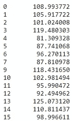

这只是结果的一部分。原来的结果要大得多。

让我们添加第二个协变量，看看它如何影响回归性能。我选择性别作为第二协变量。我想使用重新标记的性别栏:

```
db["RIAGENDRx"] = db.RIAGENDR.replace({1: "Male", 2: "Female"})
```

下面是模型和模型摘要:

```
model = sm.OLS.from_formula("BMXWAIST ~ BMXWT + RIAGENDRx", data=db)
result = model.fit()
result.summary()
```

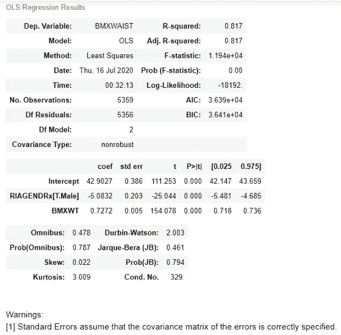

在上面的代码中，BMXWT + RIAGENDRx 并不意味着这两列是连接的或者数学上相加的。这只是表明它们都包含在模型中。在这个新模型中，腰围被表示为体重和性别的函数。从上面的结果中，我们可以发现权重系数(BMXWT)是 0.7272，比以前高了一点。这一次，该系数意味着，如果同一性别的两个人的体重相差一个单位，他们的腰围将相差 0.7272 个单位。另一方面，性别系数(RIAGENDRx) -5.0832 意味着，如果我们比较相同体重的男性和女性，男性的腰围将比女性小 5.0832 个单位。

所有系数都表示为平均值。如果我们比较一个体重 70 的男人和一个体重 50 的女人，男人的腰围大约会和女人相差-5.0832+(70–50)* 0.7272 倍。

权重回归系数(BMXWT)在模型中加入性别后变化不大。当第二个协变量和第一个协变量有些相关时，添加第二个协变量会改变第一个协变量。让我们检查两个协变量之间的相关性:

```
db[['BMXWT', 'RIAGENDR']].corr()
```

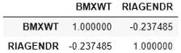

如你所见，相关性是-0.2375。所以有相关性但不太强。你可以用我之前展示的拟合值法找到腰围的预测值。我不会再演示了。

**我们再加上第三个协变量**。我选择 BMXBMI 作为第三个协变量。你也可以尝试一些其他的变量。

```
model = sm.OLS.from_formula("BMXWAIST ~ BMXWT + RIAGENDRx + BMXBMI", data=db)
result = model.fit()
result.summary()
```

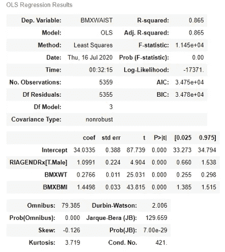

请注意，添加 BMXBMI 后，性别变量的系数发生了显著变化。我们可以说，身体质量指数正在掩盖腰围和性别变量之间的联系。另一方面，权重系数也发生了显著变化。在腰围和体重的关系中，身体质量指数也起到了掩盖作用。

您可以在模型中添加更多协变量，并查看每个协变量的效果。

# 模型的可视化

在本节中，我们将可视化回归模型的结果。我们将绘制回归线，它是拟合值或带有置信区间的预测值。如果您需要复习置信区间的概念，请查看这篇文章:

[](/confidence-interval-calculation-and-characteristics-1a60fd724e1d) [## 置信区间、计算和特征

### 什么是置信区间，如何计算它及其重要特征

towardsdatascience.com](/confidence-interval-calculation-and-characteristics-1a60fd724e1d) 

对于这个图，我们将固定性别为女性，身体质量指数为 25。同样，我们需要保留一个自变量作为焦点变量。我们会把它保持为重量(BMXWT)。因此，该图将显示所有年龄的身体质量指数 25 岁女性的预测腰围。

```
from statsmodels.sandbox.predict_functional import predict_functional
values = {"RIAGENDRx": "Female", "RIAGENDR": 1, "BMXBMI": 25}pr, cb, fv = predict_functional(result, "BMXWT",
                values=values, ci_method="simultaneous")#Here, pr is the predicted values(pr), cb is the confidence band and #the fv is the function valuesax = sns.lineplot(fv, pr, lw=4)
ax.fill_between(fv, cb[:, 0], cb[:, 1], color='grey', alpha=0.4)
ax.set_xlabel("BMXWT")
_ = ax.set_ylabel("BMXWAIST")
```

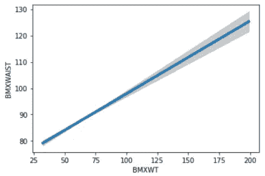

图中的灰色区域是置信带。这意味着真正的腰围尺寸会落在那个区域。灰色区域的宽度沿回归线变化。所以，置信区间随着年龄不断变化。

您可以固定重量，也可以查看特定重量的结果。让我们将体重固定在 65，并为女性人口绘制身体质量指数与腰围的关系图。我们需要为此更改“值”参数。因为我们把身体质量指数值固定为 25。现在，我们要确定重量。因此，我们需要从 values 参数中删除身体质量指数值，并在其中添加权重。

```
del values["BMXBMI"] # Delete this as it is now the focus variable
#del values['BMXWT']
values["BMXWT"] = 65
pr, cb, fv = predict_functional(result, "BMXBMI",
                values=values, ci_method="simultaneous")ax = sns.lineplot(fv, pr, lw=4)
ax.fill_between(fv, cb[:, 0], cb[:, 1], color='grey', alpha=0.4)
ax.set_xlabel("BMI")
_ = ax.set_ylabel("BMXWAIST")
```

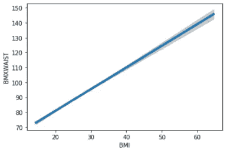

在上面的图中，我们只画了平均值。给定体重、性别或身体质量指数的平均腰围模型。使用同样的回归模型，也可以评估方差结构，这将显示观察值偏离平均值的程度。为此，我们可以绘制残差与拟合值的关系图。请记住，拟合值是预测值或观察平均值，残差是观察平均值和真实值之间的差值。

```
pp = sns.scatterplot(result.fittedvalues, result.resid)
pp.set_xlabel("Fitted values")
_ = pp.set_ylabel("Residuals")
```

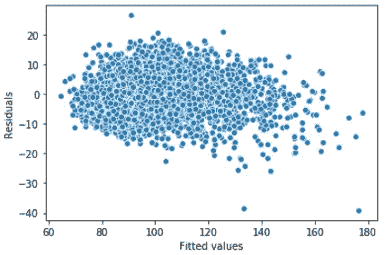

看起来，当观察值较低时，方差会稍高一些。

也可以只观察一个协变量的影响。我们可以仅使用一个协变量来查看分量加残差图或部分残差图，以了解我们是否保持其他协变量不变，以及因变量如何变化:

```
from statsmodels.graphics.regressionplots import plot_ccprax = plt.axes()
plot_ccpr(result, "BMXWT", ax)
ax.lines[0].set_alpha(0.2) # Reduce overplotting with transparency
_ = ax.lines[1].set_color('orange')
```

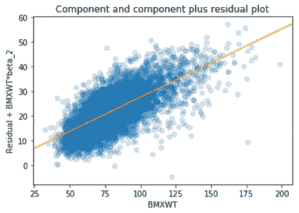

现在，当权重变量固定时，我们可以用同样的方式看到身体质量指数的影响。

```
ax = plt.axes()
plot_ccpr(result, "BMXBMI", ax)
ax.lines[0].set_alpha(0.2)
ax.lines[1].set_color("orange")
```

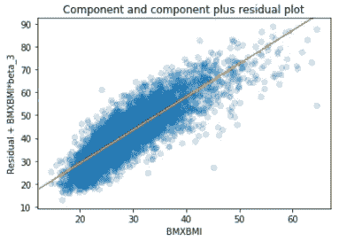

身体质量指数的影响比重量大得多。

在本文中，您学习了如何拟合线性回归模型，与线性回归相关的不同统计参数，以及一些好的可视化技术。可视化技术包括绘制回归线置信带、绘制残差和绘制单个协变量的影响。

更多阅读推荐:

[假设检验、特征和计算](/hypothesis-testing-characteristics-and-calculation-ba3bdf516ea5)

[置信区间、计算和特征](/confidence-interval-calculation-and-characteristics-1a60fd724e1d)

[如何计算均值的置信区间和均值的差](/how-to-calculate-confidence-interval-of-mean-and-the-difference-of-mean-993bfec0c968)

[如何在 Python 中执行假设检验:一个均值和两个均值的差异](/hypothesis-testing-in-python-one-mean-and-the-difference-in-two-means-87cb60b02a51)

[如何在 Python 中呈现多个变量之间的关系](/how-to-present-the-relationships-amongst-multiple-variables-in-python-fa1bdd4f368c)

[掌握熊猫的分组情况，进行高效的数据汇总和分析](/master-pandas-groupby-for-efficient-data-summarizing-and-analysis-c6808e37c1cb)

[用 Python 从零开始构建一个完整的神经网络](/build-a-complete-neural-network-from-scratch-in-python-308eaed23e06)