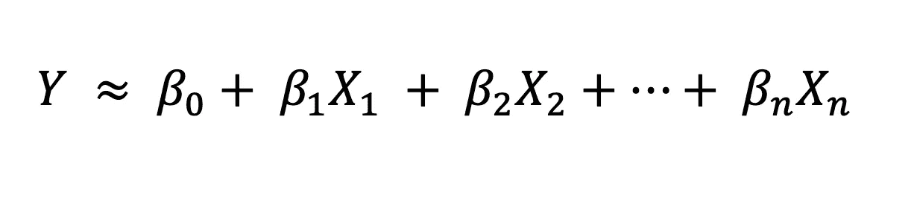
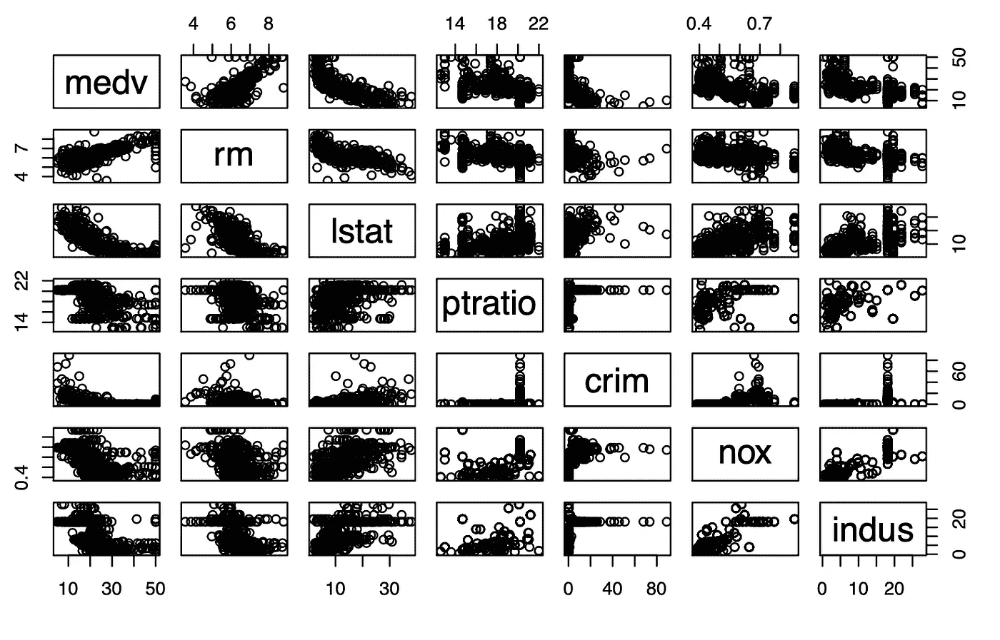
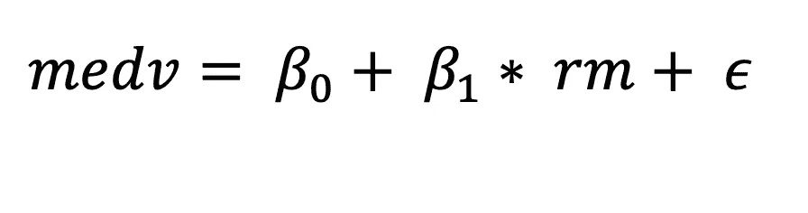
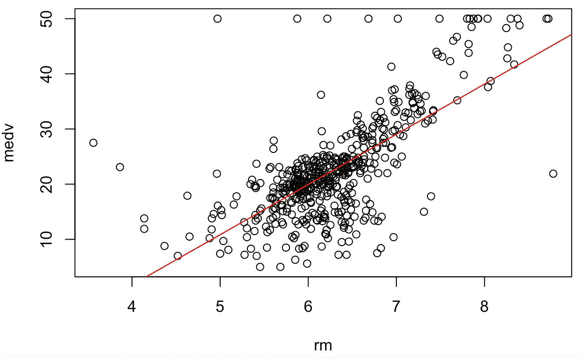
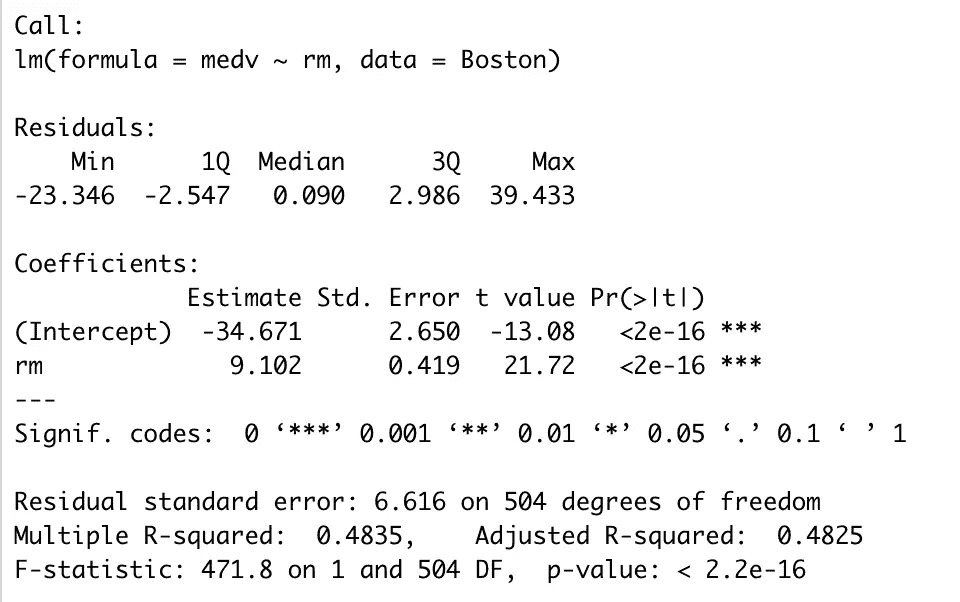
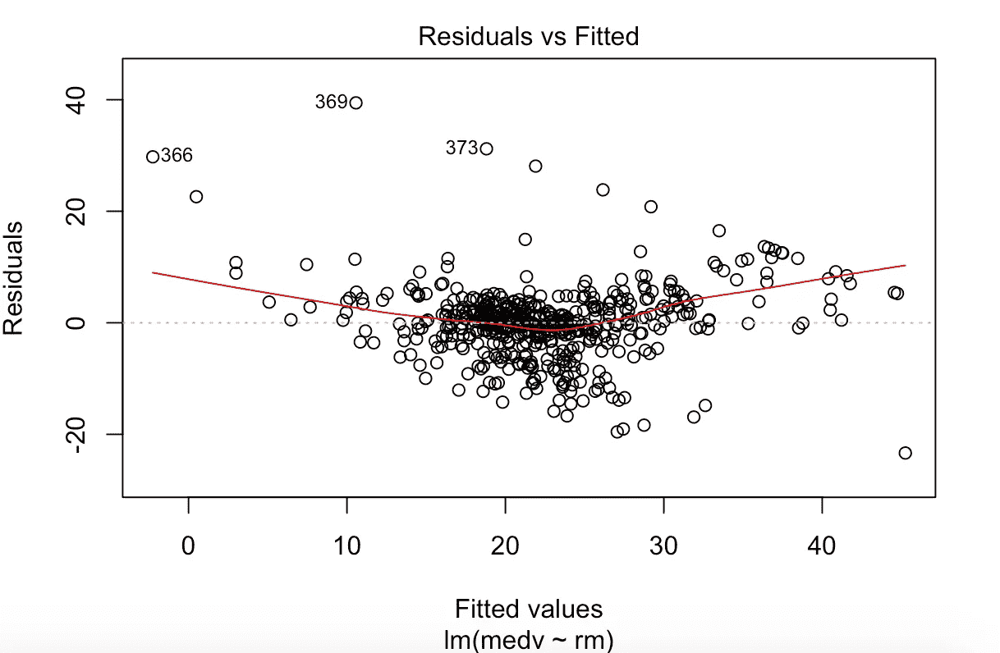
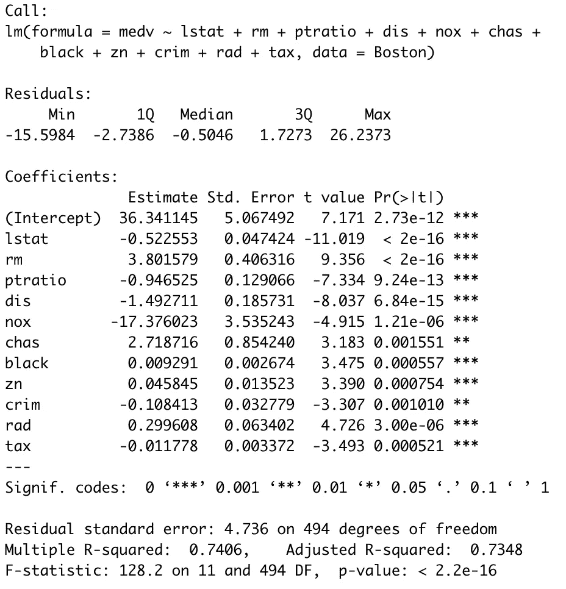

# 机器学习的线性回归模型

> 原文：<https://towardsdatascience.com/linear-regression-model-for-ml-cd18a392bd8b?source=collection_archive---------28----------------------->

## 概述最古老的监督机器学习算法，它的类型和缺点。


照片由来自[佩克斯](https://www.pexels.com/photo/summer-pattern-texture-plant-136740/?utm_content=attributionCopyText&utm_medium=referral&utm_source=pexels)的[斯科特·韦伯](https://www.pexels.com/@scottwebb?utm_content=attributionCopyText&utm_medium=referral&utm_source=pexels)拍摄

线性回归是基本的监督机器学习算法之一。虽然它相对简单，与其他机器学习算法相比可能不够花哨，但它仍然广泛应用于各个领域，如生物学、社会科学、金融、市场营销。它非常强大，可以用来预测趋势或产生洞察力。因此，在学习更复杂的 ML 技术之前，彻底了解线性回归——它的工作原理和变体——是多么重要，我怎么强调都不为过。

> 线性回归模型非常强大，可以用来预测趋势和产生洞察力。

本文的目的是提供一个线性回归模型的全面概述。它将为最后一分钟的修改或开发详细研究线性回归的思维导图提供极好的指导。

*注意:在本文中，我们将使用流行的 Boston Housing 数据集，该数据集可以使用 sklearn.datasets 直接导入到 Python 中，或者使用库 MASS(现代应用统计函数)导入到 R 中。代码块是用 r 编写的*

# 什么是线性回归？

线性回归是一种统计/机器学习技术，它试图对独立预测变量 X 和相关定量响应变量 y 之间的线性关系进行建模。预测变量和响应变量必须是数值，这一点很重要。一般的线性回归模型在数学上可以表示为



线性回归模型方程；作者图片

由于线性回归模型**通过捕捉不可约的误差项来近似 Y 和 X 之间的关系**,我们得到


带有近似值的线性回归模型方程；作者图片

这里，我们将使用线性回归来预测波士顿周围 506 个社区的中值房价(Y/响应变量= medv)。

## 线性回归揭示了哪些真知灼见？

使用线性回归预测中值房价将有助于回答以下五个问题:

1.  预测变量和响应变量之间存在线性关系吗？
2.  预测变量和反应变量之间有联系吗？有多强？
3.  每个预测变量如何影响响应变量？
4.  响应变量的预测有多准确？
5.  自变量之间有交互作用吗？

## 线性回归模型的类型

根据预测变量的数量，线性回归可分为两类:

1.  简单线性回归-一个预测变量。
2.  多元线性回归-两个或多个预测变量。

线性回归模型的简单性可以归功于它的核心假设。然而，这些假设在模型中引入了偏差，导致过度泛化/欠拟合(更多关于[偏差-方差权衡](https://medium.com/@pardeshi.vishwa25/bias-variance-tradeoff-explained-7f18ebbef020))。

> 一个容易记住的线性回归模型的假设的首字母缩略词是直线

# 线性回归模型的假设

LINE——一个简单的缩写词，包含线性回归模型的四个假设。

1.  **L** 线性关系:预测器&响应变量之间的关系是线性的。
2.  独立观测值:数据集中的观测值是相互独立的。
3.  残差的正态分布。
4.  误差/残差具有恒定的方差:也称为同方差。

# 简单线性回归

一个简单的学习回归模型使用单个预测变量 x 来预测响应变量 Y。对于波士顿住房数据集，在分析中值住房价值/ medv 列和 12 个预测列之间的相关性后，带有几个相关列的 medv 散点图如下所示:



图 1:波士顿住房数据集的散点图；作者图片

在观察散点图时，我们注意到 medv 和 rm(平均房间数)几乎成线性关系。因此，它们的关系可以表示为



中位数价格预测广义方程；作者图片

目标是通过估计尽可能接近 506 个数据点的拟合系数来拟合线性模型。预测值和观察值之间的差异是误差，需要将其最小化以找到最佳拟合。最小化误差的最小平方的一种常用方法是普通最小二乘法(OLS 法)。

要在 R 中创建一个简单的线性回归模型，运行下面的代码块:

```
simpleLinearModel <- lm(medv ~ rm, data = Boston)
```

让我们看看合身的模型，

```
plot(rm ,medv)
abline(simpleLinearModel, col = ‘red’)
```



图 2:拟合训练数据的简单线性回归线；作者图片

> ***使用 RSE，R，adjusted R，F-statistic 评估线性回归模型的准确性。***

模型摘要(下图)告诉我们有关系数的信息，并有助于使用以下指标评估模型的准确性

*   剩余标准误差
*   r 统计量
*   调整后的 R 平方
*   f 统计量

量化模型与训练数据的吻合程度。

```
print(summary(simpleLinearModel))
```



图 3:简单线性回归模型汇总；作者图片

## 如何解读简单线性回归模型？

使用简单的线性回归来预测中值房价，我们可以回答以下问题:

*   ***RM&medv 之间有关联吗？有多强？***

medv 和 rm 之间的关联及其强度可以通过观察对应于汇总表中 F 统计量的 p 值来确定(图 3)。由于 p 值非常低，medv 和 rm 之间有很强的相关性。

*   ***RM 如何影响 medv？***

根据这个简单的线性回归模型，房间数量的单位增加导致中值房价增加 9.102 万美元。

*   ***响应变量的预测有多准确？***

RSE 估计了 medv 与真实回归线的标准偏差，该值仅为 6.616，但表明误差约为 30%。另一方面，R 表明在 medv 中只有 48%的可变性是由 rm 解释的。调整后的 R & F 统计量是多元线性回归的有用度量。

*   ***房屋价值中位数(medv) &房屋的房间数(rm)之间存在线性关系吗？***

除了使用图 1 来确定 medv 和 rm 之间的几乎线性关系外，如果不存在模式，图 3 所示的残差图有助于确定线性关系。因为有一个小的模式，它表明在关系中有一个非线性成分，尽管有点弱。



图 4:用平滑线识别趋势的残差图；作者图片

# 多元线性回归

多元线性回归模型试图对两个或多个预测变量和响应变量之间的线性关系进行建模。一个人想到的最重要的问题是

> **“如何选择有用的预测变量？”**

这就是所谓的**回归变量选择**可以通过使用:

1.  最佳子集选择
2.  逐步选择—向前、向后、混合

有很多其他方法可以达到这个目的。通过使用逐步向前选择，我发现除了年龄和印度河流域以外的所有预测变量对预测 medv 都很重要。

```
#Variable selection using stepwise regression
nullmodel <- lm(medv ~ 1, data = Boston)
fullmodel <- lm(medv ~ ., data = Boston)#Forward Stepwise Selection
mulitpleLinearModel <- step(nullmodel, scope = list(lower = nullmodel, upper = fullmodel), direction = "forward")
```

## 如何解读多元线性回归模型？

使用简单的线性回归来预测中值房价，我们可以使用模型的摘要来回答以下问题:



图 5:多元线性回归模型汇总；作者图片

*   ***预测变量子集& medv 之间有关联吗？有多强？***

由于与汇总表(图 5)中的 F 统计值相对应的 p 值非常低，因此预测变量子集与 medv 之间有很强的相关性。

*   ***各种预测变量如何影响 medv？***

根据这个多元线性回归模型，每个预测变量与 medv 都有很强的相关性，可以通过使用简单的线性模型来辨别确切的贡献。

*   ***响应变量的预测有多准确？***

调整后的 R 会对添加到模型中的其他预测变量造成不利影响，而不会对其进行改善，这与 R 相反，R 会随着添加到模型中的每个变量而增加。由于两者之间的差异不大，我们可以推断该模型比简单的线性回归模型更准确，后者只能解释 48%的 medv 变异性，而多元线性回归可以解释 74%的 medv 变异性。

# 线性回归模型的潜在问题

看了线性回归模型，它的类型和评估，重要的是承认它的缺点。由于线性回归模型的假设，有几个问题困扰着线性回归模型，例如:

1.  共线性([如何处理多重共线性](https://medium.com/@pardeshi.vishwa25/handling-multi-collinearity-6579eb99fd81))
2.  残差的相关性
3.  残差的非常数方差/异方差
4.  极端值
5.  非线性关系

关于如何处理这些问题的文章正在编写中。

Github 上探索简单/多重/多项式线性回归、预测因子的非线性转换、逐步选择的项目:

1.  [波士顿房价预测](https://github.com/vishwapardeshi/Machine-Learning-Projects/tree/master/Linear_Regression/Boston_Housing_Price_Prediction)
2.  [燃油效率预测](https://github.com/vishwapardeshi/Machine-Learning-Projects/tree/master/Linear_Regression/Fuel_Efficiency_Prediction) n(自动编程)
3.  [预测工资](https://github.com/vishwapardeshi/Machine-Learning-Projects/tree/master/Polynomial_Regression)

## 参考

R 中的统计学习导论。