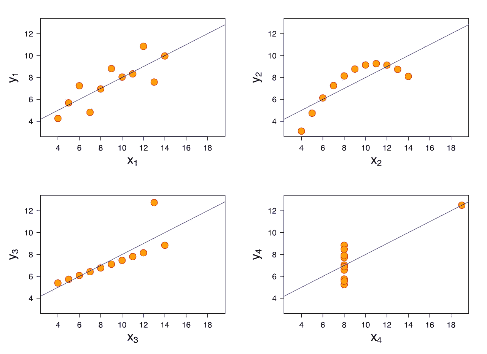
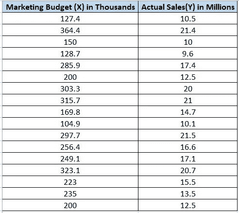
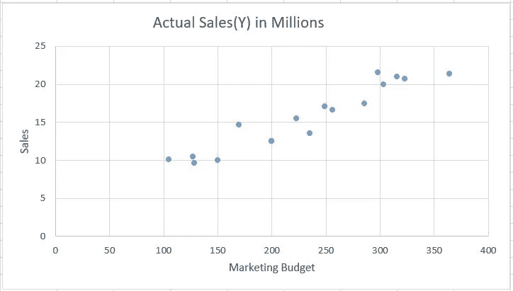
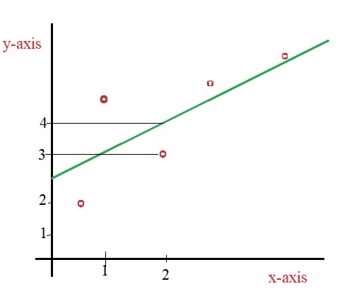
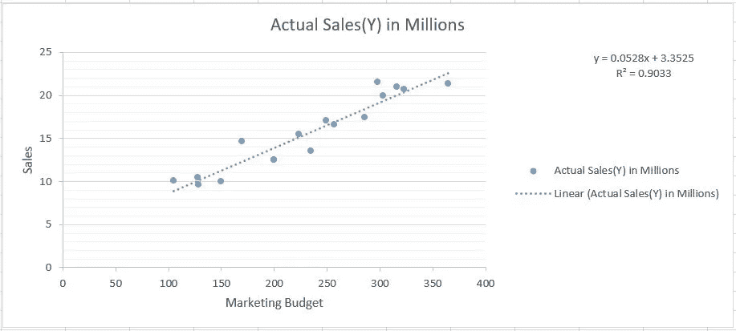
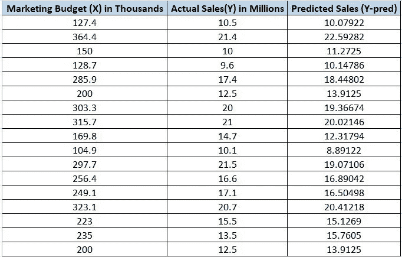
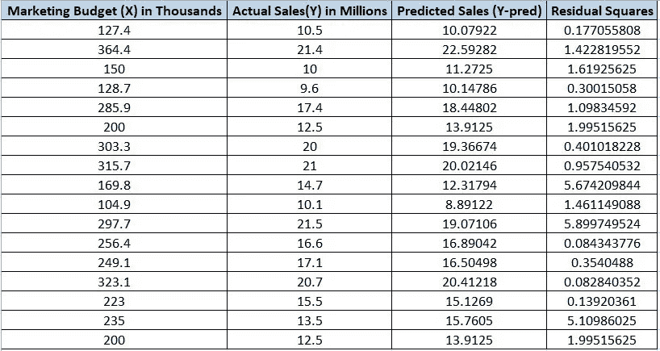

# 线性回归模型:机器学习

> 原文：<https://towardsdatascience.com/linear-regression-model-machine-learning-9853450c8bce?source=collection_archive---------24----------------------->

## 了解用于预测分析的机器学习中的线性回归模型

BY anscombe . SVG:https://commons.wikimedia.org/w/index.php?curid=9838454 史高斯(使用下标标注):Avenue — Anscombe.svg，CC BY-SA 3.0，

线性回归是机器学习中最重要的回归模型之一。在回归模型中，必须预测的输出变量应该是连续变量，例如预测一个人在一个班级中的体重。

回归模型也遵循监督学习方法，这意味着要构建模型，我们将使用带有标签的过去数据，这有助于预测未来的输出变量。

## 线性回归

使用线性回归模型，我们将预测两个因素/变量之间的关系。我们所期待的变量叫做因变量。

线性回归模型有两种类型:

*   简单线性回归:它只包含一个自变量，我们用一条直线来预测因变量。
*   多元线性回归，包括一个以上的独立变量。

> 在本文中，我们将集中讨论简单的线性回归模型。

## 简单线性回归

我们有一家公司的数据，其中包含营销支出金额以及与该营销预算相对应的销售额。

数据看起来像这样，

示例营销数据

> 从[这里](https://github.com/Kaushik-Varma/Linear_Regression)下载以上 excel 数据。

使用 Microsoft Excel 图表，我们可以为上述数据制作一个如下所示的散点图。

上述数据的散点图

上面的图表示根据给定数据的所有数据点的散点图。现在，我们必须通过数据点拟合一条直线，这有助于我们预测未来的销售。

我们知道直线被表示为:

`y = mx + c`

在这里，我们称这条线为回归线，它表示为:

`Y = β0 + β1X`

现在，可以有这么多的直线可以通过数据点。我们必须找出可以作为模型的最佳拟合线，以用于未来的预测。

为了在所有线中找到最佳拟合线，我们将引入一个称为**残差(e)的参数。**

残差是 Y 轴的实际值和基于特定 x 的直线方程的 Y 轴预测值之间的差值。

假设我们有散点图和直线，如下图所示，

作者提供的图片-使用图表计算残值

现在，使用上图，x = 2 的残值为:

`Residual(e) = Actual value of Y — the predicted value of Y using the line`

e = 3–4 =-1

所以，x = 2 的残差是-1。

类似地，我们对每个数据点都有一个残差值，它是实际 Y 值和预测 Y 值之间的差值。

`ei = yi — y^i`

所以，为了找出最佳拟合线，我们将使用一种叫做**普通最小二乘法**或**残差平方和(RSS)法的方法。**

`RSS = e1²+e2²+e3²+……+en²`

最佳拟合线的 RSS 值最小。

## 价值函数

通常，机器学习模型为特定问题定义成本函数。然后，我们试图根据我们的要求最小化或最大化成本函数。在上面的回归模型中， **RSS** 是成本函数；我们想降低成本，找出直线方程的β0 和β1。

现在，让我们回到 excel 表格中的营销数据集。对上面的散点图使用`Trendline`中的`Linear Forecast`选项，我们将直接得到散点图的最佳拟合线，无需手动计算残差值。

使用 Microsoft Excel 散点图选项的最佳拟合线

我们可以看到，
斜率(β1) = 0.0528
截距(β0) = 3.3525

让我们使用上面的直线方程计算所有数据点(X)的预测销售额(Y)。

预计销售额将会是，

使用 **(y=0.0528x+3.33525)** 公式预测销售额

之后，让我们也计算每个数据点的残差平方值。

残差平方=(实际 Y 值-预测 Y 值)

应用上述公式计算残差平方后，我们来看 excel 表。

计算残差平方后的数据集

现在，RSS 是上表中所有剩余平方值的总和。

RSS = 28.77190461

因为这是最佳拟合线，所以我们在这里得到的 RSS 值是最小值。

如果我们在这里观察 RSS 值，它是一个绝对量。在未来，如果我们改变以十亿而不是百万来衡量销售的问题设置，RSS 数量将会改变。

因此，我们需要定义一个相对的替代度量，而不是绝对的量。这种替代措施被称为**总平方和(TSS)。**使用 TSS，我们将计算 R 值，这将决定模型是否可行。

`TSS = (Y1-Ȳ)² + (Y2-Ȳ)² + (Y3-Ȳ)² + ……. + (Yn-Ȳ)²`

其中，
Y1，Y2，Y3，…..，Yn 是来自数据点的值。
ȳ是 y 轴柱的平均值

现在，在计算 TSS 之后，我们将计算 R .
`R² = 1-(RSS/TSS)`

r 值总是介于 0 和 1 之间。
如果 R 接近 1，那么我们的模型是优秀的，我们可以用模型来预测分析。如果该值接近 0，则该模型不适合于预测分析。

现在，让我们计算 excel 数据集中的 TSS。

首先，我们将找出每个数据点的(yn-ȳ)值，ȳ(平均 y 值)是 15.564705888881

现在，数据集看起来像，

使用 Y 值和所有 Y 值的平均值计算平方和

TSS =数据集中所有平方和的总和

TSS = 297.5188235

因为我们已经计算了上面的 RSS。我们来求出 R 的值，
R = 1-(RSS/TSS) = 0.903293834。

如果我们观察散点图，上面是最佳拟合线，下面是直线方程，excel 已经计算出 R 值为 0.9033，这是我们使用所有计算得到的值。

由于 R 值大于 90%，因此强烈建议使用该模型来预测未来的分析。

# 结论

回归模型是机器学习中的基本模型之一。使用这个模型，我们可以预测变量的结果。如果输出变量是分类的，我们将使用另一种称为分类模型的模型。

在下一篇文章中，我们将看到如何在 Python 中使用线性回归模型。

**感谢您阅读**和**快乐编码！！！**

# 在这里查看我以前关于 Python 的文章

*   [**联接、视图和 cte:MySQL 工作台**](/joins-views-and-ctes-mysql-workbench-c1f64d88447f)
*   [**数据分析使用基本命令:MySQL Workbench**](/database-design-and-creation-mysql-workbench-488bffa8dbc5)
*   [**探索性数据分析(EDA): Python**](/exploratory-data-analysis-eda-python-87178e35b14)
*   [**中心极限定理(CLT):数据科学**](/central-limit-theorem-clt-data-science-19c442332a32)
*   [**推断统计:数据分析**](/inferential-statistics-data-analysis-e59adc75c6eb)
*   [**Seaborn:Python**](/seaborn-python-8563c3d0ad41)
*   [**熊猫:蟒蛇**](https://levelup.gitconnected.com/pandas-python-e69f4829fee1)
*   [**Matplotlib:Python**](https://levelup.gitconnected.com/matplotlib-python-ecc7ba303848)
*   [**NumPy: Python**](https://medium.com/coderbyte/numpy-python-f8c8f2bbd13e)

# 参考

*   **用于机器学习的线性回归:**[https://machinelingmastery . com/Linear-Regression-for-Machine-Learning/](https://machinelearningmastery.com/linear-regression-for-machine-learning/)
*   **线性回归:**[https://ml-cheat sheet . readthedocs . io/en/latest/Linear _ Regression . html](https://ml-cheatsheet.readthedocs.io/en/latest/linear_regression.html)
*   **实现机器学习的线性回归:**[https://www . edu reka . co/blog/Linear-Regression-for-Machine-Learning/](https://www.edureka.co/blog/linear-regression-for-machine-learning/)
*   **什么是机器学习中的线性回归:**[https://www . knowledge hut . com/blog/data-science/Linear-Regression-for-Machine-Learning](https://www.knowledgehut.com/blog/data-science/linear-regression-for-machine-learning)