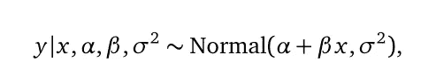
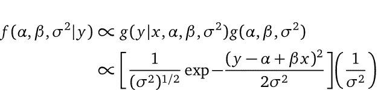
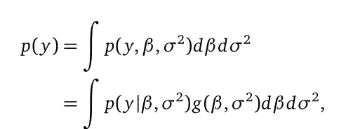
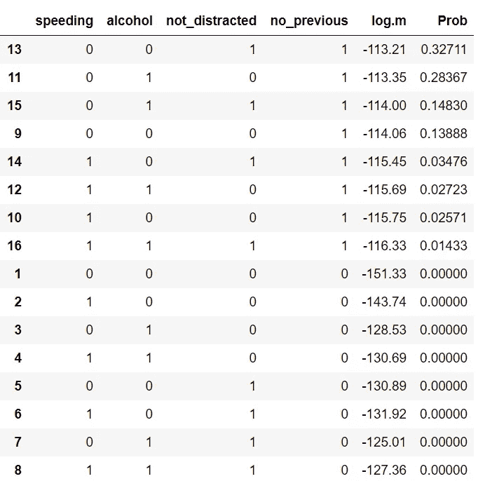

# 基于策尔纳 g 先验的线性回归模型选择

> 原文：<https://towardsdatascience.com/linear-regression-model-selection-through-zellners-g-prior-da5f74635a03?source=collection_archive---------41----------------------->


信用: [Baggeb](https://pixabay.com/es/illustrations/barco-mar-oc%C3%A9ano-remo-madera-5404195/) 上 [Pixabay](https://pixabay.com/)

线性回归是复杂模型的构建模块，由于其简单性和易解释性而被广泛使用。

通常，线性回归中模型选择的经典方法是选择具有最高 [R](https://en.wikipedia.org/wiki/Coefficient_of_determination) 的模型，或者通过 [Akaike 信息](https://en.wikipedia.org/wiki/Akaike_information_criterion)标准在复杂性和拟合优度之间找到正确的平衡。相比之下，在贝叶斯推理中，我们非常依赖于分布，因为我们在进行估计时会得到一个分布。

在本文中，我们将使用[策尔纳的 g 先验](https://en.wikipedia.org/wiki/G-prior)来执行模型选择。此外，虽然用 R 和 Python 构建 ML 模型并不常见，但我们将利用 R 包`bas`和`learnbayes`来说明计算。

# 解开贝叶斯回归模型

在[多元线性回归](https://en.wikipedia.org/wiki/Linear_regression#Simple_and_multiple_linear_regression)中，我们感兴趣的是通过一组[协变量](https://stats.stackexchange.com/questions/409843/what-is-covariate)***【x₁】、…****来描述一个目标变量 ***y*** 的可变性。*这些变量中的每一个通常都有不同的贡献，由相对于每一个变量的系数的权重给出***【β₁】、*** 也就是说，


其中α是[截距](https://statisticsbyjim.com/regression/interpret-constant-y-intercept-regression/)(当协变量为零时 *y* 的值)，我们假设[等方差](https://online.stat.psu.edu/stat500/lesson/9/9.2/9.2.3)*。如果考虑[最小二乘](https://en.wikipedia.org/wiki/Least_squares)方法(经典统计学)，人们将通过[最大似然估计](https://en.wikipedia.org/wiki/Maximum_likelihood_estimation#:~:text=In%20statistics%2C%20maximum%20likelihood%20estimation,observed%20data%20is%20most%20probable.)来估计未知参数 **( *α、*** *βᵢ* ***、σ* )** 的值。然而，贝叶斯方法让你将每一个系数视为随机变量。因此，目标是获得这些系数可能取值的概率模型，其优点是获得我们对这些系数值的不确定性的估计。*

*为了实现这一点，贝叶斯方法非常灵活。**首先**，人们对这些值可能是什么设置了一个先验信念，也就是说，在看到数据 ***y*** 之前，我们反映了我们对参数值的了解。例如，假设我们对它们一无所知，那么我们可以考虑一个[无信息先验](https://stats.stackexchange.com/questions/27813/what-is-the-point-of-non-informative-priors)*

**

*当人们把这个表达式理解为 **( *α，β，σ* )** 的[联合分布](https://en.wikipedia.org/wiki/Joint_probability_distribution)与方差***【σ】***的倒数成正比时，这叫做 **先验分布*。*** 注意，β是一个向量，其分量为β₁，…，βₙ.*

***然后是**，之后是观察数据 ***y，*** 我们设定如何描述给定的参数和协变量。因为我们持有线性回归假设*

**

*或者给定 *x* ，α，β，σ，数据似乎符合一个[正态分布](https://en.wikipedia.org/wiki/Normal_distribution)，均值为α + β *x* ，方差为σ，这叫做**似然**。请注意， *x* 是一个向量，其分量为 *x* ₁，…， *x* ₙ.*

***最后**，[贝叶斯定理](https://www.youtube.com/watch?v=XQoLVl31ZfQ)陈述****后验分布**与似然性和先验分布的乘积成正比，***

******

***了解了这些组件，您可能会注意到选择先验有点主观。出于这个原因，策尔纳介绍了一种评估一个人对先前的选择有多确定的方法。***

# ***策尔纳的方法***

***1986 年，阿诺德·策尔纳提出了一种在回归模型中引入主观信息的简单方法。想法是用户指定β系数的位置，例如，假设β系数都是酉的，***

******

***然后，一个人对这个假设的信念将由常数 ***g*** 来反映，该常数反映了先验中相对于数据的信息量。因此，为 ***g*** 选择一个较小的值，意味着一个人对这个猜想有更强的信念。相反，选择更大的值 ***g*** 具有与选择 **( *α，β，σ* )** 的无信息先验相似的效果，因为随着*g 趋于无穷大，其对先验的影响消失，更多细节参见【2】。****

# ****基于策尔纳 g 先验的模型选择****

****如果我们对响应变量 ***y*** 有 n 个预测值，那么就有 2ⁿ个可能的回归模型。泽尔纳的 g 先验可用于在 2ⁿ候选模型中选择最佳模型。****

****为此，假设模型具有相同的先验概率，即，对于每个模型，我们为β系数分配 0 的先验猜测和相同的 g 值。然后，我们可以通过计算 [***先验预测分布***](https://stats.stackexchange.com/questions/394648/differences-between-prior-distribution-and-prior-predictive-distribution) (数据 *y* 在所有可能的参数值上平均的分布)来比较回归模型。****

********

****注意，如果这个积分没有封闭形式的[或者有几个维度，那么它可能很难计算。一种近似结果的方法是拉普拉斯方法，更多细节参见[6]和[1]的第 8 章。](https://en.wikipedia.org/wiki/Closed-form_expression)****

****曾经，我们计算过每个值***【p(y)***对于每个 ***m*** 模型，我们需要一种方法来比较这些模型。例如，当只比较它们中的两个时，我们可以计算它们先前预测密度的比率，****

********

****这就是所谓的**贝叶斯因子。**比值越大，模型 *j* 对模型 *k 的支持度越大，*你可以在[1]的第八章和[5]的第六章阅读更多关于贝叶斯因子的内容。****

****由于我们正在比较 2ⁿ模型，我们可以计算每个模型的**后验概率**，****

********

****最后，我们将选择概率最高的模型。在接下来的几节中，我们将借助 R 包`BAS`和`learnbayes`来看看这个过程。****

# ****代码示例****

****为了运行 R 和 Python，我们将使用 Jupyter 的 Docker image[data science-notebook](https://hub.docker.com/r/jupyter/datascience-notebook/)。关于使用 Anaconda 的替代方法，请查看这个 [Stackoverflow 问题](https://stackoverflow.com/questions/61622624/issues-when-attempting-to-use-rpy2/62986815#62986815)。****

****在[安装 Docker](https://docs.docker.com/get-docker/) 后，运行你的终端****

```
****docker run -it -p 8888:8888 -p 4040:4040 -v D:/user/your_user_name:/home/jovyan/work jupyter/datascience-notebook****
```

****如果这是第一次运行这个命令，Docker 会自动拉图片 datascience-notebook。注意，应该启用文件共享来挂载一个本地目录作为 Docker 容器的一个卷，更多内容请参见[这里的](https://thenewstack.io/docker-basics-how-to-share-data-between-a-docker-container-and-host/)。****

****在 Jupyter 中，我们将使用 R 包`learnbayes`和`bas`来计算具有 g 先验的线性回归模型。此外，我们还使用了来自《汽车碰撞事故》的 Kaggle 数据集，这是 seaborn 默认提供的。****

****按照[1]第 9 章中的例子，我们将使用`LearnBayes`包中的函数`bayes_model_selection`来计算每个模型的后验概率。****

****我们的目标变量 ***y*** 将是 **total** “每十亿英里中涉及致命碰撞的驾驶员数量”。为简单起见，我们将前四个变量作为协变量。****

****在这种情况下，`bayes_model_selection`函数非常直观，因为我们只需提供目标变量、协变量和β的先验猜测中的置信值 ***g*** 。****

****请注意，我们选择了值`g=100`，因为我们不太确定之前的猜测。考虑到该值越高，估计值就越接近最小二乘估计值，您可以随意使用该值。****

****通过访问模型上的`mod.prob`，我们可以可视化结果。在下面的代码中，我们按照后验概率的较高值进行排序。****

********

****从表中我们看到，最可能的模型认为协变量为*未 _ 分心*和*未 _ 先前*。还有，贡献最高的个体变量是 *no_previous* 和*超速。*****

# ****如果有大量的协变量呢？****

****当处理大量的协变量，也就是大量的模型时，[贝叶斯自适应采样](https://homepage.divms.uiowa.edu/~jghsh/clyde_ghosh_littman_2010_jcgs.pdf)算法是一个很好的选择。它的工作原理是对模型进行采样，而不从可能的模型空间中进行替换。为了说明这一点，我们现在考虑数据集中的所有变量，我们有 2⁶可能的模型可供选择。****

****同样，具有较高后验概率或较高边际可能性的模型是最有可能的，即，具有协变量集**酒精**、**未分心**和**否先前**的模型。****

# ****主要发现****

****总结一下，让我们概括一些重要的发现:****

*   ****在经典统计学中，人们得到点估计，而在贝叶斯统计学中，人们得到参数可能取值的概率分布。****
*   ****先验是信念，可能性是证据，后验是最终的知识。****
*   ****策尔纳的 g 先验反映了一个人对先验信念的信心。****
*   ****当有大量模型可供选择时，可以考虑使用 BAS 算法。****

****最后，我们已经看到，模型选择的贝叶斯方法与经典方法一样直观且易于实现，同时还能让您更深入地了解模型的内部工作。****

****有什么问题吗？留下评论。感谢阅读，如果你喜欢这篇文章，请随意分享。****

# ****参考****

****[1]艾伯特，吉姆。贝叶斯计算与 R 第二版。斯普林格，2009 年。****

****[2]马林，J.M 罗伯特，Ch。回归和变量选择。网址:[https://www.ceremade.dauphine.fr/~xian/BCS/Breg.pdf](https://www.ceremade.dauphine.fr/~xian/BCS/Breg.pdf)****

****[3]克莱德，梅里斯；Ghosh，Joyee 里特曼，迈克尔。变量选择和模型平均的贝叶斯自适应抽样。网址:[https://home page . div ms . uio wa . edu/~ jghsh/Clyde _ ghosh _ littman _ 2010 _ jcgs . pdf](https://homepage.divms.uiowa.edu/~jghsh/clyde_ghosh_littman_2010_jcgs.pdf)****

****[4]阿诺德·策尔纳。用 g-先验分布评估先验分布和贝叶斯回归分析。1986****

****[5]戈什、贾扬塔；德兰帕迪、莫汉；萨曼塔，塔帕斯。贝叶斯分析导论:理论与方法。斯普林格，2006 年。****

****[6]贝叶斯模型在 R. URL 中的简易拉普拉斯近似:[https://www . r-bloggers . com/Easy-la place-approximation-of-Bayesian-models-in-r/](https://www.r-bloggers.com/easy-laplace-approximation-of-bayesian-models-in-r/)****

****[7] Rpy2 文档。网址:[https://rpy2.github.io/doc/latest/html/index.html](https://rpy2.github.io/doc/latest/html/index.html)****

****[8]机器学习中模型评估和选择的终极指南。Neptune . ai . URL:[https://Neptune . ai/blog/the-ultimate-guide-to-evaluation-and-selection-of-models-in-machine-learning](https://neptune.ai/blog/the-ultimate-guide-to-evaluation-and-selection-of-models-in-machine-learning)****