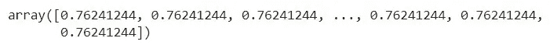

# ML 从零开始:带 NumPy 的线性回归模型

> 原文：<https://towardsdatascience.com/linear-regression-model-with-numpy-7d270feaca63?source=collection_archive---------30----------------------->


在 [Unsplash](https://unsplash.com/s/photos/line?utm_source=unsplash&utm_medium=referral&utm_content=creditCopyText) 上由 [Ridham Nagralawala](https://unsplash.com/@ridham?utm_source=unsplash&utm_medium=referral&utm_content=creditCopyText) 拍摄的照片

## 线性回归完全指南

在这个项目中，我们将看到如何创建一个使用多元线性回归算法的机器学习模型。

*这个项目的主要焦点是解释线性回归是如何工作的，以及如何使用令人敬畏的 NumPy 模块从头开始编写线性回归模型。*

当然，您可以使用 scikit-learn 创建一个线性回归模型，只需 3-4 行代码，但实际上，从头开始编写您自己的模型远比依赖一个在您坐着观看时为您做所有事情的库更棒。

不仅如此，编写定制模型意味着您可以完全控制模型做什么，以及模型如何处理您将提供给它的数据。这允许在训练过程中有更大的灵活性，并且您实际上可以调整模型，使其在将来重新训练或生产过程中根据需要更加健壮和响应真实世界的数据。

在这个项目中，我们的模型将被用来预测一辆汽车的 CO₂排放量的基础上，其特点，如发动机的大小，燃料消耗等。

让我们开始做这个项目吧。

# 进行必要的进口

首先，我们将导入必要的 PyData 模块。

```
import numpy as np
import pandas as pd
import matplotlib.pyplot as plt
import seaborn as sns
%matplotlib inline
```

现在，让我们导入数据集。该数据集包含在加拿大零售的新型轻型汽车的特定车型燃料消耗等级和估计二氧化碳排放量。

```
df = pd.read_csv("FuelConsumptionCo2.csv")
print(df.head())
```

这是数据集的链接。在这个项目的最后，我还将分享包含 Jupyter 笔记本和数据集的 Github repo 的链接。

 [## 燃料消费 Co2.csv

点击链接下载 csv 文件-drive.google.com](https://drive.google.com/file/d/13UHA0B1velyQh9fk3eBOK4i337J441Ce/view?usp=sharing) 

这是它在我的 Jupyter 笔记本上的样子:


Jupyter 笔记本中数据帧的视图

以下是我们数据集中的列。

*   **年款**，例如 2014 年款
*   **制造**例如讴歌
*   **车型**例如 ILX
*   **车辆类别**例如 SUV
*   **发动机尺寸**例如 4.7
*   **气缸**例如 6 个
*   **变速器**例如 A6
*   **城市油耗(升/百公里)**例如 9.9
*   **HWY 油耗(升/百公里)**例如 8.9
*   **油耗梳(升/百公里)**例如 9.2
*   **二氧化碳排放量(克/公里)**例如 182 →低→ 0

# 数据争论和功能选择

任何数据科学项目中最重要的步骤之一是预处理数据。这包括清理数据、根据需要对一些列进行类型转换、分类变量的转换以及根据项目要求对数据进行标准化/规范化。

对于我们的项目，预处理的第一步是检查我们是否需要对任何特性/目标变量的数据类型进行类型转换。

```
print(df.dtypes)
```

我们得到以下输出:


不同列的数据类型

正如我们所看到的，没有必要对任何列进行类型转换。

数据争论过程的第二步是分析这些特性是否需要标准化。为此，让我们看一看数据框架的描述性分析。

```
print(df.describe())
```


数据帧的描述性分析

正如我们所看到的，所有潜在的功能在规模上是相同的，所以我们不需要标准化任何功能。

对于这个项目，我们将选择的特征是**发动机尺寸、气缸** & **燃料消耗 _ 组合**，目标变量是**二氧化碳排放量**。

```
df = df[['ENGINESIZE','CYLINDERS','FUELCONSUMPTION_COMB','CO2EMISSIONS']]print(df.head())
```


我们的下一步——检查数据帧中 NaN(null)值的数量。

```
for i in df.columns:
    print(df[i].isnull().value_counts()) 
```


数据帧中的空值计数

正如我们所看到的，在我们的数据帧中没有空值。所以这些数据非常适合训练模型。

# 数据可视化和分析

首先，我们将看看特征和目标变量的相关性。

```
print(df.corr())
```


该表显示了特征和目标变量之间的强正相关性。记住，强相关性对于线性回归模型来说是一件好事。

现在，让我们将不同特征相对于目标变量的曲线可视化。这将使我们了解这些特征是否与目标变量呈线性关系。

```
fig, a **=**  plt.subplots(1,3, figsize **=** (18, 5))a[0].scatter(df['ENGINESIZE'], df['CO2EMISSIONS'], color **=** 'c')
a[0].set_title('Engine Size vs CO2 Emissions')
a[0].set_xlabel('Engine Size (L)')a[1].scatter(df['CYLINDERS'], df['CO2EMISSIONS'], color **=** 'm')
a[1].set_title('No. of Cylinders vs CO2 Emissions')
a[1].set_xlabel('No. of Cylinders')a[2].scatter(df['FUELCONSUMPTION_COMB'], df['CO2EMISSIONS'], color **=** 'b')
a[2].set_title('Fuel Consumption vs CO2 Emissions')
a[2].set_xlabel('Fuel Consumption (L/100km)')fig.text(0.08, 0.5, 'CO2 Emissions', va**=**'center', rotation**=**'vertical') plt.show()
```


不同特征(x 轴)与目标变量(y 轴)的关系图

正如我们所看到的，这些特征显示了与目标的相当大的线性关系。因此，我们可以用它们来训练模型。

# 从零开始的线性回归模型

线性回归使用以下数学公式，通过自变量预测因变量。

**y = wx + b**

这里，

*   **y** -因变量
*   **x** -因变量
*   **w** -与自变量相关的权重
*   **b** -给定 lin-reg 方程的偏差

以下是开发线性回归模型的过程。

1.  将数据集分成训练集和测试集。*然而，为了简单起见，我们将在自定义模型中跳过这一步。*
2.  给模型分配随机权重和偏差，然后根据随机权重和偏差计算因变量 **ŷ** 。
3.  使用损失函数来计算总信息损失，即模型内的总不准确性。*在我们的例子中，我们将使用均方差*(**【MSE】**)*损失函数。*
4.  我们的下一步是减少我们模型的总均方误差。*为此，我们将使用随机梯度下降(* ***SGD*** *)函数，这是回归模型中最常用的优化算法之一。*我们将在编写优化器函数时详细讨论 SGD 函数。
5.  我们将根据优化算法更新模型权重和偏差，然后重新训练模型。这是一个循环的过程，将不断重复，直到我们实现一个信息损失低的最佳模型。

首先，让我们将特性转换成一个 NumPy 数组，**特性**。

```
features **=** df[['ENGINESIZE','CYLINDERS','FUELCONSUMPTION_COMB']].to_numpy() *#Converts the dataframe to numpy array*print(features)
```


用于训练模型的一组特征

现在，让我们将目标列转换为一个 NumPy 数组， **target** 。

```
target = df[‘CO2EMISSIONS’].to_numpy() #Converts the dataframe to numpy arrayprint(target)
```


目标变量数组(车辆的实际 CO₂排放值)

由于我们有 3 个因变量，我们将有 3 个权重。让我们生成 3 个小随机权重的数组权重。

```
weights **=** np.random.rand(3) *#Generates a numpy array with two small random floats*print(weights)
```

因为我们只有一个目标变量，所以我们只有一个偏差， **b** 。我们还将创建一个数组 **bias** 等于 **features** 数组的长度，每个元素都有 bias **b** 。

```
b **=** np.random.rand(1) *#Generates a numpy array with a small random float*bias **=** np.array([b[0] **for** i **in** range(len(features))])print(bias)
```



偏置阵列

现在，我们将定义使用权重、偏差和因变量来计算ŷ.的模型函数

```
**def** linearRegr(features, weights, bias): """Calculates the y_hat predicted values using the given parameters of weights, dependent variables, and biases. Args:
        -dependant_var: Matrix of dependant variable values
        -weights: Matrix/array of weights associated with each dependant variable
        -biases: Biases for the model
    Returns:
        -Array/matrix of predicted values """ y_hat **=** weights.dot(features.transpose()) **+** np.array([bias[0] **for** i **in** range(len(features))]) *# Takes the value stored in the bias array and makes an array of length of feature matrix for addition* **return** y_hat
```

现在，让我们运行该函数一次，看看我们将得到的结果。

```
y_hat = linearRegr(features, weights, b)
print(y_hat)
```


针对随机生成的权重和偏差运行 linearRegr 函数获得的ŷ(发音为“y_hat”)数组

现在，我们将定义 MSE 函数来计算我们的模型的总损失。

```
def meanSqrError(y, y_hat):
    """Calculates the total mean squared error.

    Args- 
        y: Array of actual target values
        y_hat: Array of predicted target values

    Returns-
        total mean squared error
    """
    MSE = np.sum((y - y_hat) ** 2) / len(y)
    return MSE
```

现在让我们根据之前得到的值来计算信息损失。

```
print('Total error- {}'.format(meanSqrError(target, y_hat)))
```


正如我们所看到的，我们的模型目前非常不准确，我们需要优化它。

# 优化模型

现在是线性回归中最重要的一步。制定 SGD 函数。与到目前为止我们已经讨论过的所有基本函数相比，这是一个稍微高级的主题。需要一些微分学的知识；具体来说是偏导数。我试图在下面的图片中解释这一点，但是，如果你不明白，我强烈建议你在进一步学习之前熟悉机器学习的数学部分(微积分，统计和概率，线性代数)。


图片来源- [阿达什·Menon-Medium.com](/linear-regression-using-gradient-descent-97a6c8700931)

**一旦我们计算出梯度，我们将按如下方式更新参数。**

*   **m = m - α D** m
*   **c = c - α D** c

这里，

*   **E**——总均方误差
*   **m** -与特征相关的权重
*   **c** -模型偏差
*   **y** -实际目标值的数组
*   **ŷ** -预测目标值
*   **D**m-E w r t 重量的偏导数 **m**
*   **D**c-E w r t 偏差的偏导数 **c**
*   **α** -学习率，即优化器函数采取的步长。

一旦我们有了权重和偏差的新的更新值，我们将再次计算损失。我们将对 **n** 个时期重复该过程，即循环次数，并在每个时期后绘制损失值。为了保持代码的整洁，我将创建一个单独的函数来计算梯度。

```
def gradient(target, features, weights, bias):
    """Returns the gradient(slopes) for weights and biases
    """  
    m = len(features)
    target_pred = linearRegr(features, weights, bias)
    loss = target - target_pred # y-y_hat
    # Gradient calculation for model bias
    grad_bias = np.array([-2/m * np.sum(loss)])

    grad_weights = np.ones(3)
    # Gradient calculation for first feature
    feature_0 = np.array([feature[0] for feature in features])
    grad_weights[0] = -2/m * np.sum(loss * feature_0)
    # Gradient calculation for second feature
    feature_1 = np.array([feature[1] for feature in features])
    grad_weights[1] = -2/m * np.sum(loss * feature_1)
    # Gradient calculation for third feature
    feature_2 = np.array([feature[1] for feature in features])
    grad_weights[2] = -2/m * np.sum(loss * feature_2)

    return grad_bias, grad_weights
```

现在，让我们编写 SDG 函数，它将返回更新后的权重和偏差，这样我们就可以制定我们的最终模型。

```
def stochGradDesMODIFIED(learning_rate, epochs, target, features, weights, bias):
    """Performs stochastic gradient descent optimization on the model.

    Args-
        learning_rate- Size of the step the function will take during optimization
        epochs- No. of iterations the function will run for on the model
        target- Actual emission values
        features- Matrix of dependent variables
        weights- Weights associated with each feature
        bias- Model bias

    Returns-
        return_dict = {'weights': weights, 'bias': bias[0], 'MSE': total_MSE_new, 'MSE_list': MSE_list}

    """MSE_list = []
    for i in range(epochs):
        grad_bias, grad_weights = gradient(target, features, weights, bias)
        weights -= grad_weights * learning_rate
        bias -= grad_bias * learning_rate
        new_pred = linearRegr(features, weights, bias)
        total_MSE_new = meanSqrError(target, new_pred)
        MSE_list.append(total_MSE_new)
    return_dict = {'weights': weights, 'bias': bias[0], 'MSE': total_MSE_new, 'MSE_list': MSE_list}
    return return_dict
```

最后，我们有线性回归模型的优化函数。现在让我们运行该函数，并存储这些值以备将来使用。

```
model_val = stochGradDesMODIFIED(0.001, 2000, target, features, weights, bias)print("Weights- {}\nBias- {}\nMSE- {}".format(model_val['weights'], model_val['bias'], model_val['MSE']))
```


更新权重、偏差和 MSE 误差

最初的 MSE 约为 65，000，而目前的 MSE 约为 680。从结果可以看出，我们的模型有了显著的改进。

最后，我们将编写使用更新的模型权重和偏差来预测目标值的模型函数。

```
def LinearRegressionModel(model_val, feature_list):
    """Predicts the CO2 emission values of the vehicle

    Args-
        model_val- This is the dictionary returned by the stockGradDesMODIFIED function. Contains model weights and biases
        feature_list- An array of the dependent variables
    Returns-
        co2_emission- Emission predictions for the given set of features
    """
    co2_emission = np.sum(model_val['weights'] * feature_list) + model_val['bias']
    return co2_emission
```

# 测试和评估

作为测试运行，我们现在将在以下数据上测试我们的模型。

feature_list = [2.0，4，8.5]

数据的实际目标值是 196。让我们看看我们的模型进展如何。

```
target_price = 196
feature_list = [2.0, 4, 8.5]
predicted_price = LinearRegressionModel(model_val, feature_list)
print(predicted_price)
```


预测的二氧化碳排放量

给定模型的原始目标值是 196。正如我们所看到的，考虑到这是一个从零开始的模型实现，我们的模型在进行预测方面做得相当好。不过，您可以通过调整一些东西或者运行更多的优化时期来进一步改进该模型。然而，过多的优化会导致模型过度拟合，这同样对模型不利，因为过度拟合使得模型实际上不能用于真实世界的数据。

现在，为了检查我们模型的准确性，我们将计算它的 r 平方得分。以下是 r2 得分的公式-


R 平方得分公式

```
def r2_score(target, prediction):
    """Calculates the r2 score of the model

    Args-
        target- Actual values of the target variable
        prediction- Predicted values, calculated using the model

    Returns- 
        r2- r-squared score of the model
    """
    r2 = 1- np.sum((target-prediction)**2)/np.sum((target-target.mean())**2)
    return r2
```


我们模型的 r 平方得分

正如我们所看到的，我们的模型解释了响应数据围绕其平均值的大约 83%的可变性，这是相当好的。然而，机器学习模型总是有改进的空间！

至此，我们的项目告一段落。

我将制作一系列博客，在那里我们将从事类似的项目，从头开始编写新的 ML 模型，用真实世界的数据集和问题陈述进行实践。

我只是机器学习和数据科学领域的新手，所以任何建议和批评都将真正帮助我提高。

点击以下链接，继续关注更多 ML 内容！

**数据集和 Jupyter 笔记本的 GitHub repo 链接-**

[](https://github.com/amansharma2910/CO2_emission_predictionML) [## aman Sharma 2910/CO2 _ 排放 _ 预测 ML

### 通过在 GitHub 上创建帐户，为 aman Sharma 2910/CO2 _ emission _ prediction ml 开发做出贡献。

github.com](https://github.com/amansharma2910/CO2_emission_predictionML)