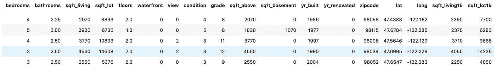
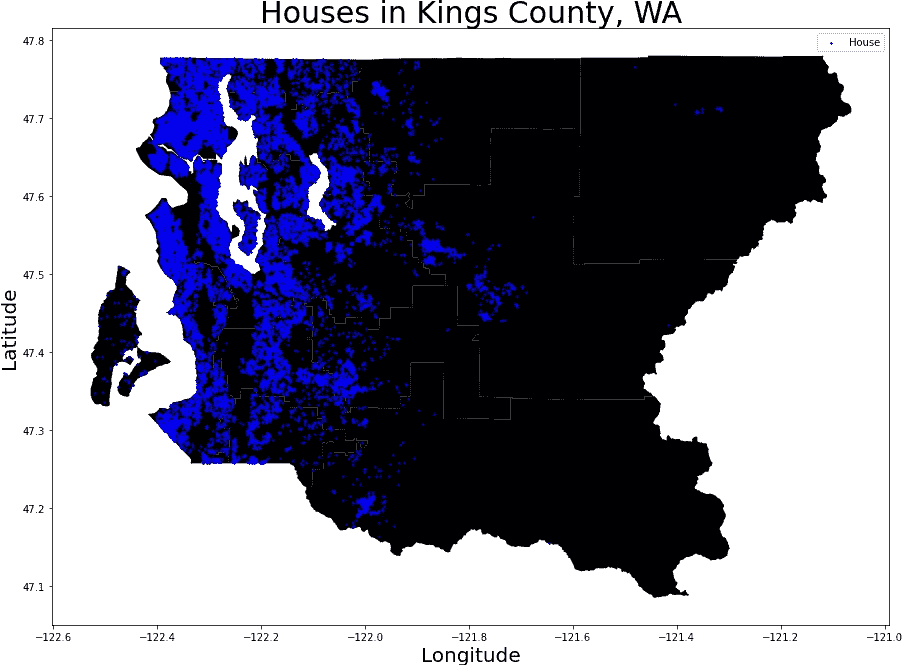
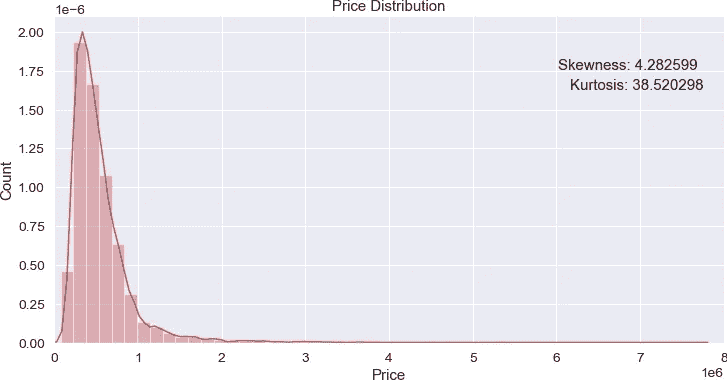
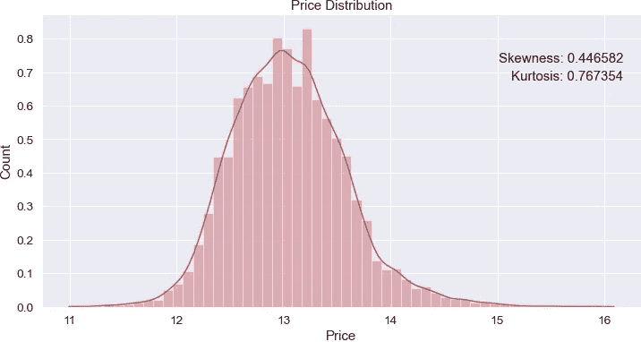
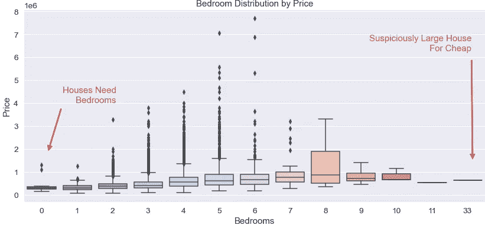
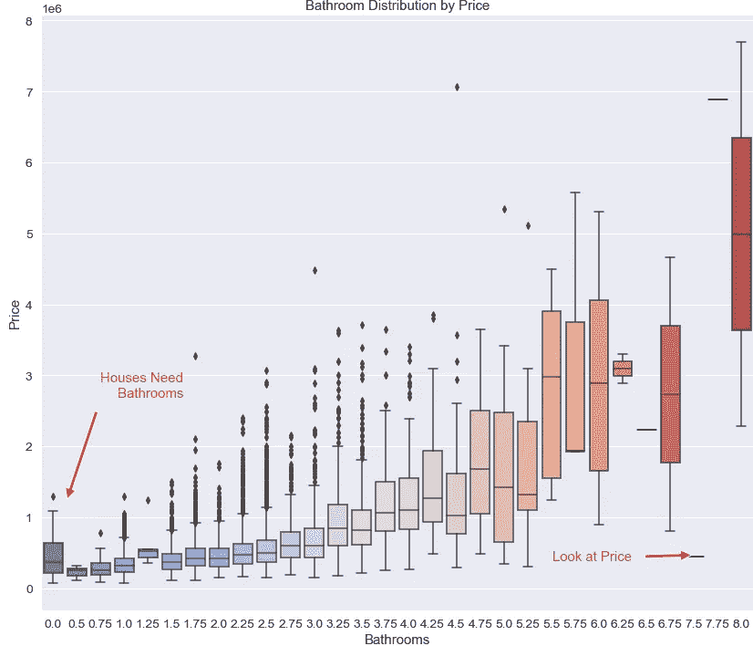
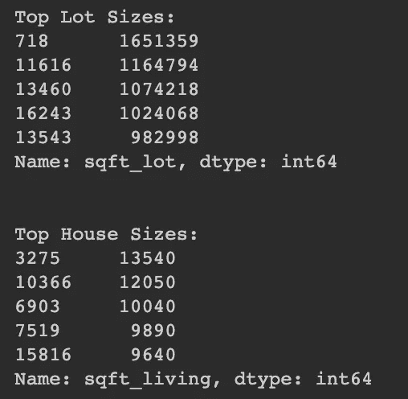
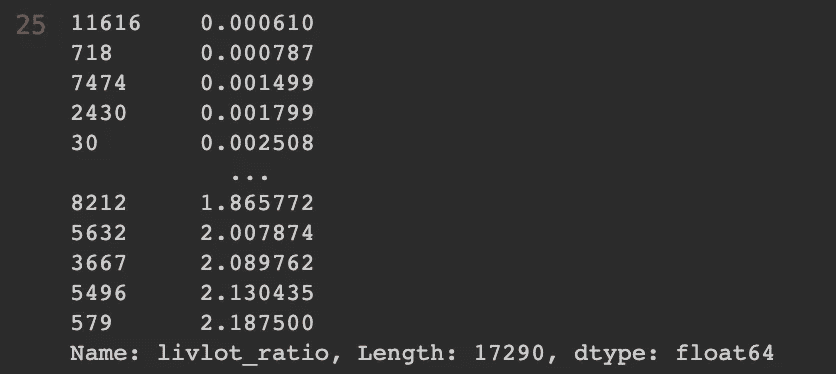

# 线性回归建模过程

> 原文：<https://towardsdatascience.com/linear-regression-modeling-process-d0a92d2d14b?source=collection_archive---------26----------------------->

## 预测金县房地产市场

Sabine Ojeil 在 [Unsplash](https://unsplash.com/s/photos/seattle?utm_source=unsplash&utm_medium=referral&utm_content=creditCopyText) 上拍摄的照片

不久前，我的任务是建立一个可以用来预测连续变量的模型。我们将通过考察华盛顿州的金县来了解这一点——普吉特湾周围和西雅图东部的地区。我们将尝试使用数据集中包含的大量参数来预测价格。这篇文章将是我建模过程的一步一步的指导。我们的流程是:

1.  了解数据
2.  电子设计自动化(Electronic Design Automation)
3.  数据清理
4.  特征工程
5.  建模
6.  结果

## 了解数据

我们应该做的第一件事是检查数据帧的一部分，它给出了下面的输出。

数据集中包含的原始要素-不包括价格。

从现在开始，我们将把数据帧的列称为“特征”。房屋的特征包括浴室和卧室的数量、房屋占地面积、二楼和地下室(如果适用)的大小、地块的大小以及各种年龄和位置的衡量标准。

查看数据的一个好方法是把它绘制出来。下面是一个国王县的所有房屋的地块。当数据允许的时候，这是获得你的观察的感觉的一个令人惊奇的方法。

空间图形是用高亮显示的代码完成的[这里](/using-geopandas-for-spatial-visualization-21e78984dc37)。

## 探索性数据分析— (EDA)

我们的下一步是深入研究数据——主要是，我们将关注价格的分布，并留意异常值。下面的代码设置了价格的分布，并告知查看者分布的偏斜度和峰度。

不是正态分布

从图中可以看出，分布是不正态的。它聚集在标尺的左端，许多观察发生在远离峰值的地方。我还把曲线的偏斜度和峰度编码进了图中。有关偏斜度和峰度的更多信息，请阅读此处包含的[信息。](https://www.itl.nist.gov/div898/handbook/eda/section3/eda35b.htm#:~:text=Skewness%20is%20a%20measure%20of,relative%20to%20a%20normal%20distribution.)

这个分布不起作用，所以现在我们可以看看正态分布的自然对数形式。

这些观察值呈正态分布，偏度和峰度都在正常范围内。我们将保持价格在日志形式的其余 EDA 的视觉目的。最后，我们将把价格转换回我们结果的原始形式。

接下来，我们对数据中的任何趋势、异常、异常值和可能的错误取一个峰值。这需要关于找房子的领域知识。任何人在查看一栋房子时，都会查看它有多少卧室和浴室，房子的占地面积，以及房子周围有多少土地——所以这是我们要开始的地方。

首先，我们看看卧室。

异常存在于卧室数量的两个极端

马上就能看出数据中有一些异常。我们有很多房子没有便宜的卧室。这违背了房子的主要功能，所以我们必须进一步调查。在另一个极端，我们有一个价格合理的家，有一个数据集导致 33 间卧室。在我们做了更多的 EDA 之后，我们会回来交叉引用这些房子。

接下来，我们去浴室。

反常现象存在于两个极端。

这里同样清楚的是，数据有错误。一栋房子需要一个卫生间才能被认为是可居住的，一个低于 50 万美元的 7.5 卫生间的房子是可疑的。我们将不得不清理条目，但是一个接一个地清理效率太低。我们将在下一节的数据清理中这样做。

## 数据清理

数据清理可能是我们在建模中最重要的任务——比特征工程更重要。您可以创建所有您想要的功能，编写最复杂的模型，甚至进行所有您可以进行的数据分析——如果您的数据仍然是脏的，这些都没有任何意义。

这并不是说你会得到完全干净的数据。你将不得不做出可能影响某些观点的判断，但重点是用你受过最好教育的猜测来填补空白。

首先，我们试着清理卧室的异常。

使用矢量化技术 *np.select()* ，我们尝试概括卧室的清理。这是针对零卧室的条目，应该得到更多。

我最终拒绝修理卧室，因为它将基于浴室。输入一次数据是可以接受的，但是用输入的数据来输入数据是一个大禁忌。

## 特征工程

创建特征将有助于模型确定价格。特性越有价值，模型就越好。我将仔细检查我创建的每个特性——给你每个特性的推理和代码。

首先，我着手确定一个列表是否是一个住所。当我加载上面的数据时，你可以看到其中两个特性是 **sqft_living** 和 **sqft_lot** 。这是房子的大小和它所在的土地的大小。

地段的大小使房子的大小相形见绌

在上面的读数中，您可以看到地块大小比房屋大得多——这是意料之中的，但没有一个顶级地块大小被列为顶级房屋大小。所以我们进一步调查。

现在，我们把居住空间和地段大小做一个比例。

一个简单的比率来更好地理解

我只是使用了。head()方法来调用下面的读数。正如你所看到的，有些房产的比率非常小——这意味着与房子的大小相比，他们有很多土地。

接下来，我们继续讨论房子的年龄。大多数房屋的翻修率为零。我认为这意味着它们从未翻修过。其余的都是一年期的。所以我想弄清楚这栋房子现在的布局有多古老，有一个*古老的*特征。

使用上面的代码，很容易看出，对于任何翻新的房子，我都从数据收集的年份中减去该年( **2015** )。如果它从未翻修过，我就从收集数据的年份中减去它建造的年份。

最后，我很早就注意到有些观察根本不是家。那里有谷仓、公寓楼，甚至还有一个小型机场。所以，后来我决定创建一个名为 *residence* 的二元特征。

这给了所有我认为应该被归类为单一家庭住宅的房子一个值——所有其他的都给了零个值。

**领域知识**

任何数据科学项目的一个重要方面是给定主题的领域知识。领域知识是关于你正在探索的主题的信息量。在这种情况下，领域知识将包括关于房屋市场、西雅图及其周边郊区以及华盛顿州中部的信息。

我使用的一个方面是我对西雅图市区的领域知识。使用派克市场作为西雅图市中心的中心点，我计算了从每个观察点到派克市场的距离。我从未说过我的领域知识包罗万象。

*geopy* 包附带了一个叫做*测地线*的方便的子包。众所周知，使用坐标来确定距离是很棘手的，因为我们生活在一个半球上。这意味着越靠近赤道，经度线之间的距离就越大。然而，这个软件包考虑到了这一点，并提供了两点之间的距离。

在上面的代码中，为了运行*测地线*函数，我使用了纬度和经度的元组。我选择公里是因为我更喜欢国际单位制，但这是你可以选择的。在我们有了到 Pike Place Market 的距离的新列之后，我们从该列中去掉了 *km* ，并将其更改为 float，这样它就可以在模型中使用了。

## 建模

让我们进入项目的建模阶段。我们的衡量标准是均方根误差(RMSE)。想了解更多关于 RMSE 的信息，请看这里。首先，我们必须加载所有的包。

然后，我们将数据分为特征和目标。

现在，我们准备运行一些模型。我选择为这个项目运行三个模型:

*   线性回归
*   [弹力电视](https://www.kite.com/python/docs/sklearn.linear_model.ElasticNetCV)
*   [梯度推进回归器](https://scikit-learn.org/stable/modules/generated/sklearn.ensemble.GradientBoostingRegressor.html)

线性回归旨在最小化数据集中观察到的目标与通过线性近似预测的目标之间的残差平方和。

ElasticNetCV 是一种沿着正则化路径通过迭代拟合查看数据的模型。然后通过交叉验证选择最佳模型。

梯度推进回归器是一种用于回归和分类问题的机器学习技术，它以弱预测模型(通常是决策树)的集合的形式产生预测模型。

引入多项式是为了看看特征的组合是否有助于建模。

## 结果

一些模型比其他模型做得更好。总的来说，多项式数据帧的表现比普通数据帧差。

对于线性回归，多项式数据框架在测试数据上运行时经历了我只能描述为致命的故障——除了 ElasticNetCV 的情况。这是训练模型和测试模型之间最一致的分数。

然而，在我们所遵循的指标上做得最好的模型是在正常数据框架上工作的梯度推进回归器。使用 3000 个估计量，该模型能够在测试数据上降低 RMSE。但有趣的是，训练数据的 RMSE 要低得多，这表明该模型对于训练数据来说是过拟合的。

**如果你想多谈谈这个**，你可以在 [LinkedIn](https://www.linkedin.com/in/pntorres/) 上联系我。

**或者如果你想在 Github 上看到这个回购**，点击这个[链接](https://github.com/ptorres001/kc_housing_model)。

## 链接:

*   看看这个方便的包: [*Geopy*](https://geopy.readthedocs.io/en/stable/)
*   如果你想浏览地图，请阅读下面的文章。

 [## 使用 GeoPandas 进行空间可视化

### 将您的数据带入现实世界

towardsdatascience.com](/using-geopandas-for-spatial-visualization-21e78984dc37)