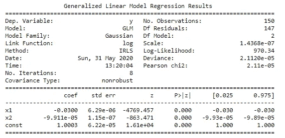

# 线性回归还是广义线性模型？

> 原文：<https://towardsdatascience.com/linear-regression-or-generalized-linear-model-1636e29803d0?source=collection_archive---------16----------------------->

## 为机器学习应用选择正确的算法

照片由[在](https://unsplash.com/@retrosupply?utm_source=medium&utm_medium=referral) [Unsplash](https://unsplash.com?utm_source=medium&utm_medium=referral) 上反推

在机器学习中，应用线性回归来预测结果(称为因变量)，作为一个或多个与结果相关的预测因子(称为自变量)的函数。例如，班级学生的体重可以用两个变量来预测——年龄、身高——这两个变量与体重相关。在线性函数中，这种关系可以表示为:

> 体重= c+B1 *年龄+B2 *身高

c、b1、b2 是从训练数据中估计的参数。

在这种回归中，有两个重要的假设:a)结果是一个连续变量，b)它是正态分布的。

然而，现实中并非一直如此。结果并不总是正态分布，也不总是连续变量。

以下是违反这些假设的许多例子中的几个:

1.  结果变量是二元的，有两类；在泰坦尼克号灾难中幸存/未幸存
2.  结果是一个分类变量，多类；例如通过卫星图像预测的土地覆盖类别
3.  结果是计数数据；例如每年的交通事故数量
4.  结果是一个连续变量，但有偏差，不是正态分布；美国的收入分配向右倾斜

既然普通的线性回归不适合这些情况，那么有什么替代方法呢？以下是一些选项:

在上述#1 和#2 的情况下，如果结果/因变量是二元或分类的，机器学习分类模型应该工作良好。L **针对二元的逻辑回归**和针对多类分类的**随机森林**是机器学习领域中两种常用的算法。

这给我们留下了以下两种情况，普通的线性回归和分类算法都不起作用:

1)计数结果

2)持续但有偏差的结果

这就是广义线性模型(GLM)派上用场的地方(旁白:它是广义线性模型，而不是广义线性模型，广义线性模型是指传统的 OLS 回归)。glm 是一类模型，适用于线性回归不适用或无法做出适当预测的情况。

GLM 由三部分组成:

*   随机分量:概率分布的指数族:
*   系统成分:线性预测器:和
*   链接函数:推广线性回归。

R 和 Python 中有几个很棒的包可以实现 GLM，但下面是一个使用 Python 中的`statmodels`库的实现。

GLM 模型输出

注意，如果你对 R 编程语言感兴趣，一定要看看这个来自普林斯顿大学研究员 T2 的例子。

## 摘要

总之，在本文中，我们已经讨论了如果结果是一个连续变量并且是正态分布，则应用普通线性回归。然而，也有这两个假设不成立的情况。在这些情况下，应用一套*广义线性模型*。GLM 有三个要素:随机、系统和链接功能，需要在每个模型实现中指定。

希望这是有用的，你可以关注我的 [Twitter](https://twitter.com/DataEnthus) 更新和新文章提醒。