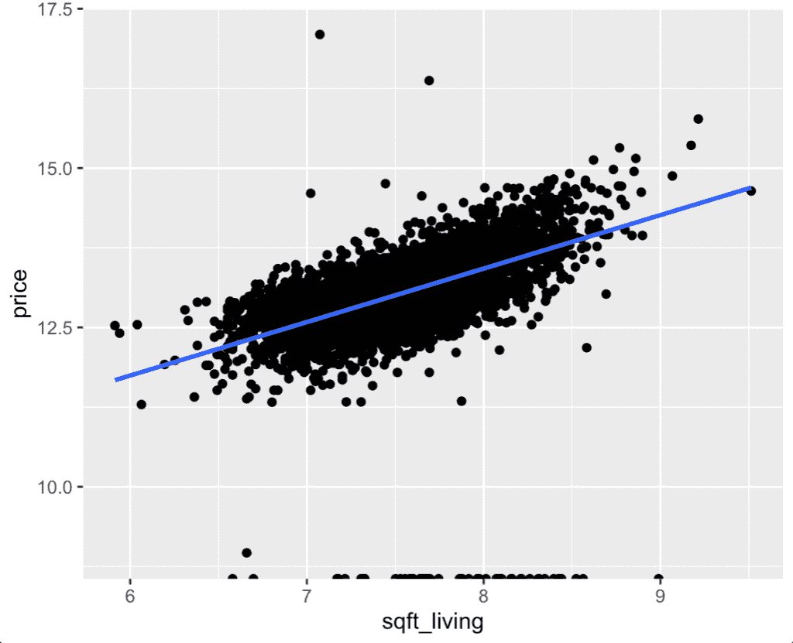
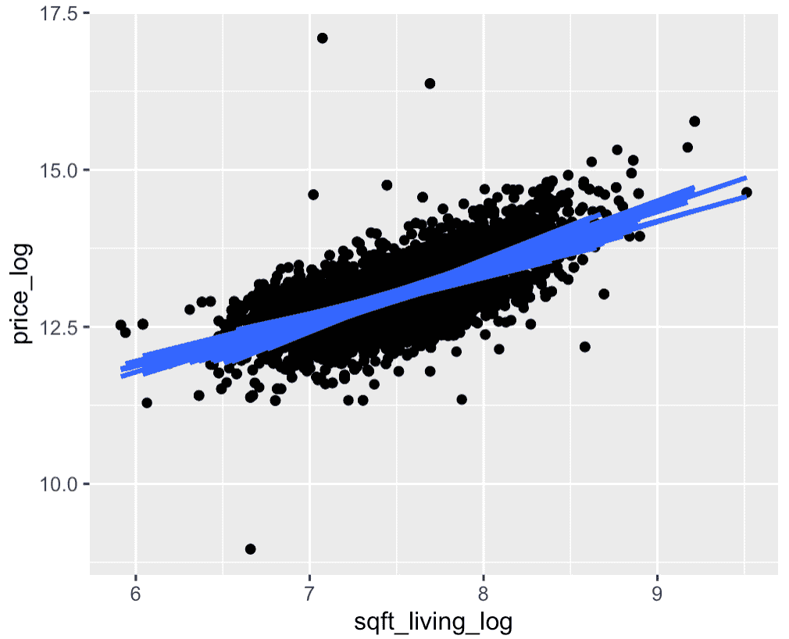
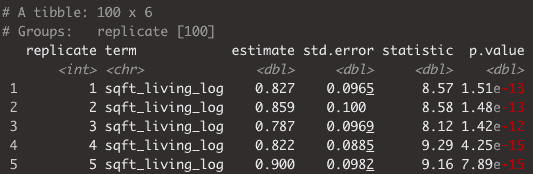
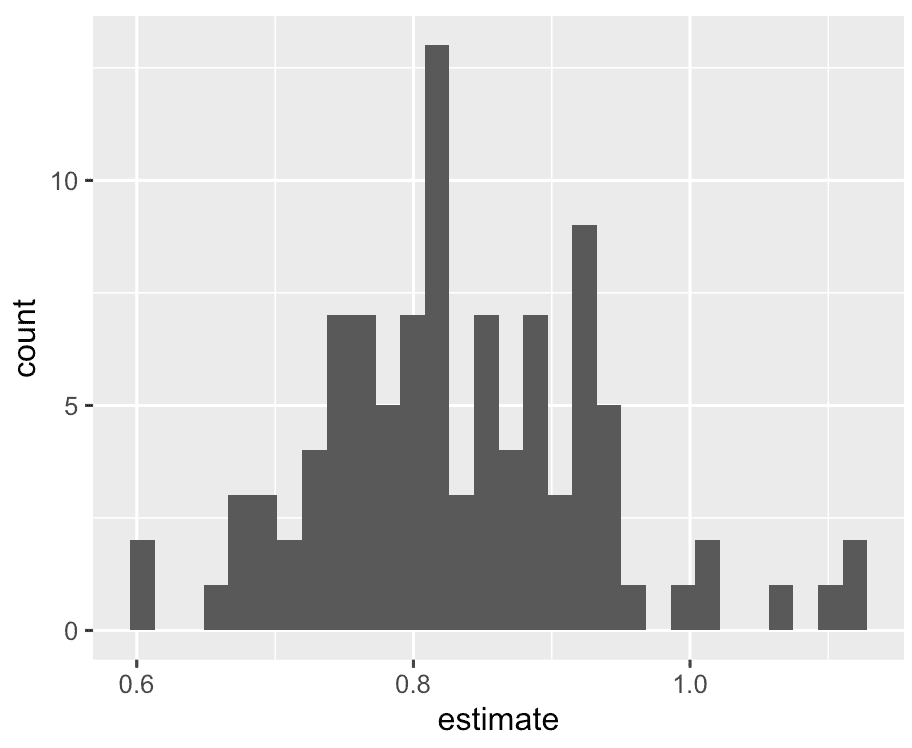

# 了解斜率敏感性的线性回归模拟

> 原文：<https://towardsdatascience.com/linear-regression-simulation-to-understand-slope-sensitivity-ab6887d45fe1?source=collection_archive---------49----------------------->

## 您的回归输出如何因样本而异


图片来自 [Pixabay](https://pixabay.com/?utm_source=link-attribution&utm_medium=referral&utm_campaign=image&utm_content=1835917) 的 [Pexels](https://pixabay.com/users/Pexels-2286921/?utm_source=link-attribution&utm_medium=referral&utm_campaign=image&utm_content=1835917)

# 介绍

在接下来的几分钟里，我将带你走上利用线性回归的道路，而不仅仅是解释或预测，而是为了推断而利用它们。

我们将以三种方式利用模拟进行推理:

*   了解模型敏感度
*   p 值
*   置信区间

在本帖中，我们将主要探讨第一个问题。这将是我下一篇使用模拟来确定 p 值和置信区间的基础。

# 传统回归

如果你不熟悉线性回归一般是如何工作的，请跳到[这篇文章](/build-evaluate-and-interpret-your-own-linear-regression-model-in-minutes-e6a3e8253501?source=your_stories_page---------------------------)。

你可以跳过[这里](https://medium.com/@datasciencelessons)找到关于线性回归不同变化的各种帖子，从创建它们，到理解和解释它们。

# 增强信心

传统上，我们使用线性回归对各种变量进行评估。除了评估之外，我们在这里要学习的是如何调整各种回归模型的输入，以加深对解释变量和响应变量之间关系的敏感性或可变性的理解。

那么，我们如何确定两个变量之间关系的可变性呢？

这样想吧…

线性回归的关键输出是什么？如果你猜对了一行，那你就猜对了！回归输出实际上是一条直线的方程，该方程的斜率作为`X` & `Y`关系的指示。在寻求理解我们的变异反应时&解释变量之间的关系...我们要找的是斜坡。假设您对不同的样本进行了线性回归...我们的问题是，我们的斜率会变化吗？或者变化有多大？是不是有时积极，有时消极？等等。

# 我们追求的笑点

我们已经做了一些解释，以达到这里的妙处，但希望这能给你一个坚实的基础，真正理解和使用这是实践。

总结我们的介绍，它归结为这一点:

*当我们改变样本* *驱动模型*时，我们希望了解两个变量之间关系的可变性和对可变性的敏感性

# 让我们得到我们的第一个斜坡！

我们正在处理的数据集是西雅图房价数据集。我以前多次使用过这个数据集，发现它在演示时特别灵活。数据集的记录级别是按房屋和详细价格、平方英尺数、床位数、浴室数等。

在这篇文章中，我们将尝试通过其他平方英尺的函数来解释价格。

在进入这一部分之前，肯定有很多探索性的数据分析工作需要你去做。您还需要确认某些数据先决条件，但是为了便于说明，让我们深入了解一下。

```
fit <- lm(price_log ~ sqft_living_log
          data = housing)
summary(fit)
```

完美！我们已经有了一个线性模型，让我们来想象一下。还要记住，我已经记录了两个变量的日志，以清理和标准化它们的分布。

```
housing %>%
  mutate(sqft_living_log = log(sqft_living),
         price_log = log(price))%>%
ggplot(aes(x = sqft_living_log, y = price_log)) + 
  geom_point() + 
  geom_smooth(method = "lm", se = FALSE)
```



在这个数据集中，我们只是处理了 4600 个家庭的样本。这不是一个详尽的群体。因此，我们将使用某种采样技术来生成许多“视角”。上述观点将推动我们如何理解我们的反应和解释变量的敏感性。

当试图对潜在人群得出结论时，抽样可变性造成了困难。我们所拥有的这些多角度的数据或样本是我们如何消除抽样可变性的潜在不利影响的。

所以上面我们有一行……但是我们需要的是许多行，用于许多情况。

我们下一步要做的是在更小的组中抽样我们的住房数据，给每个组一个回归模型。

首先，我们将使用`rep_sample_n`函数随机选择一组 100 个家庭...我们将重复这个过程总共 100 次。

```
samples <- housing %>%
  rep_sample_n(size = 100, reps = 100)
```

现在我们已经有了样本数据集，让我们像以前一样可视化它们。只有在这种情况下，我们将通过复制对我们的可视化进行分组。这一点之所以相关，是因为我们可以点对点地进行区分；它们属于哪个副本。正如您在上面的代码中看到的，将有 100 个记录的 100 个副本。

```
ggplot(samples, aes(x = sqft_living_log, y = price_log, group = replicate)) + 
  geom_point() + 
  geom_smooth(method = 'lm', se = FALSE)
```



你将在上面看到的是适合 100 个不同样本的各种回归线。如你所见，有些情况下斜率更大或更小。这是我们能够理解适用于底层人群的“斜率”范围的基础。

正如你所想象的，与我们的样本互动会改变斜率的变化量。下面我运行了相同的代码，但是每次复制只抽取 10 个随机样本。


这里你有可视化，但是你还没有线性回归本身的实际细节。

我们需要为每个复制运行一个单独的回归。

由于我们已经生成了模拟数据集，我们只需要通过复制进行分组，在这种情况下，这不是为了聚合，而是为了在组级别建模。一旦我们声明了我们的`group_by`，我们将利用`do`函数来指示我们的组动作。对于群体行动，我们希望为他们每个人运行单独的模型。

现在我们有 100 个回归输出。

虽然输出中有许多相关部分，但我们将术语作为解释变量。

看看下面的代码吧！

```
coefs <- samples %>% 
  group_by(replicate) %>% 
  do(lm(price_log ~ sqft_living_log, data = .) %>%
       tidy()) %>%
  filter(term == 'sqft_living_log')
```

现在，我们有了一个数据框架，其中包含了我们感兴趣的项的每个重复和相应的系数。



让我们来看看我们的斜坡分布。

```
ggplot(coefs, aes(x = estimate)) +
  geom_histogram()
```



我们可以看到一个正态分布。在我们用更多的重复运行它的情况下，它看起来会更平滑。

你要记住一件事。我并不是说每次运行线性回归时，你都需要对不同的数据样本任意运行 100 次。对于许多业务应用程序，您的数据可能代表整个群体。但是即使在没有全部人口的情况下，这两种方法的目的也是不同的。在这里，我们利用模拟和许多线性回归模型，最终对潜在人群做出推断。对于像解释/描述建模或预测这样的事情，利用不同格式的线性回归仍然是有意义的。

# 斜率的变化

当我们试图理解斜率系数的分布时，改变最终支持所述分布的数据会非常有帮助。如上所示，改变每个重复的样本大小将有助于更好地理解不同样本斜率变化的减少。

另一个导致斜率变化更大的因素是解释变量变化的减少。这可能有点令人惊讶，但由于解释性数据点的范围更广，我们的模型有更多的信息来解释关系。

# 结论

我们在这么短的时间内做了很多事情。在剖析推断这样的统计学概念时，很容易迷失。我希望对模拟的需求和相应的执行有一个很强的基础理解，以便更好地理解我们的反应和解释变量之间的关系。

如果这有帮助，请随时查看我在 datasciencelessons.com[的其他帖子。祝数据科学快乐！](http://datasciencelessons.com/)