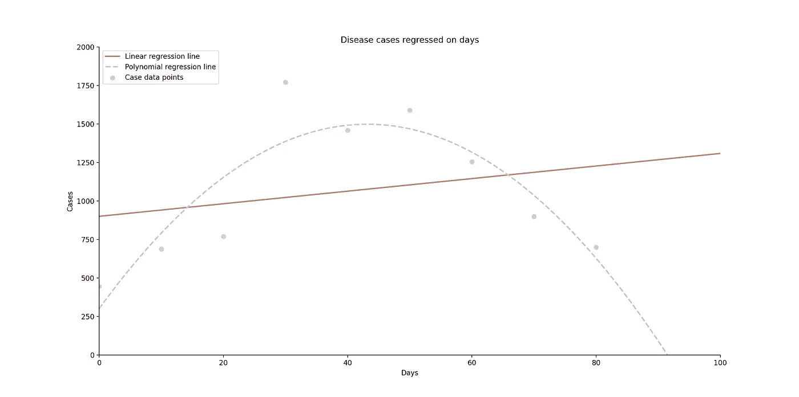
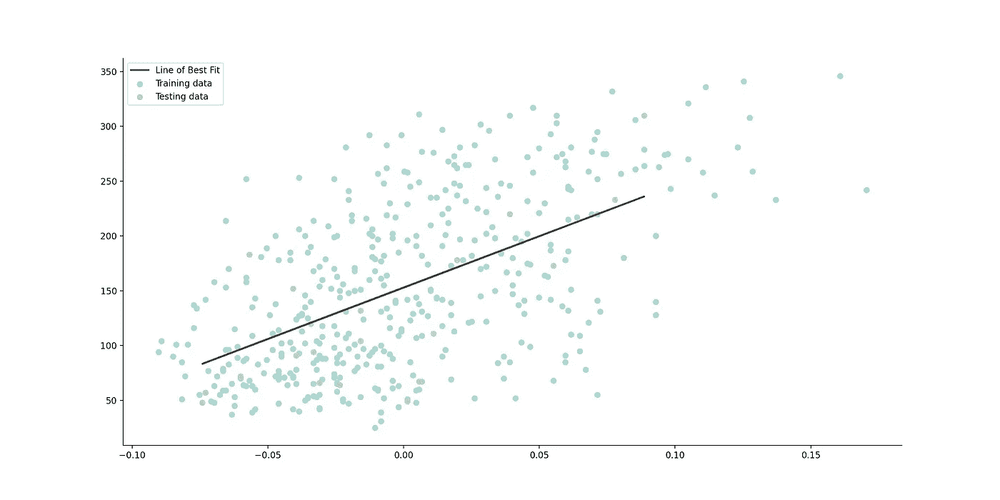
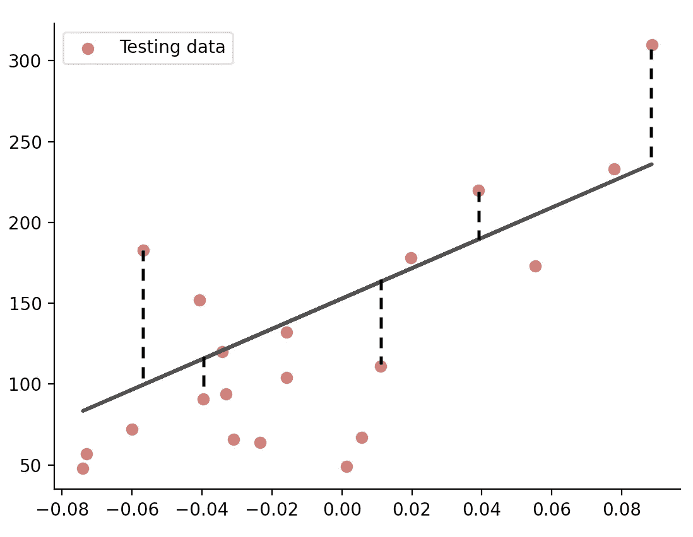
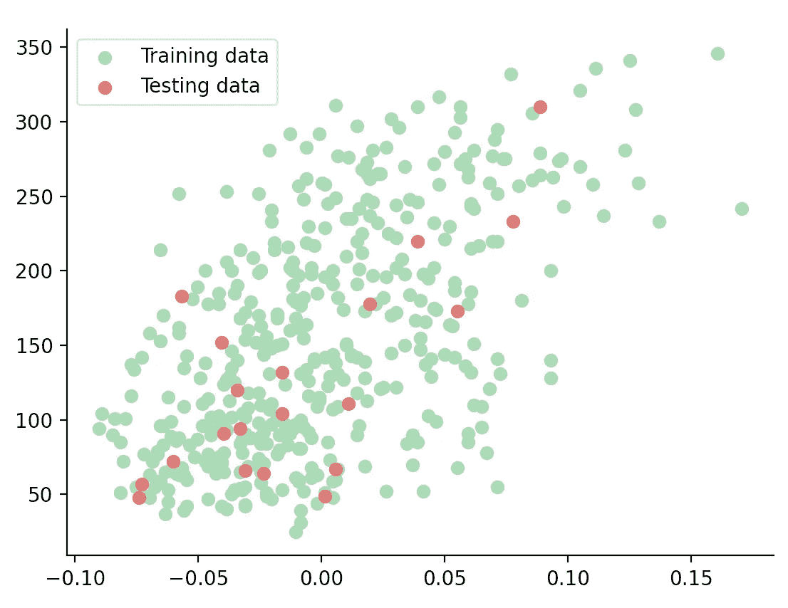
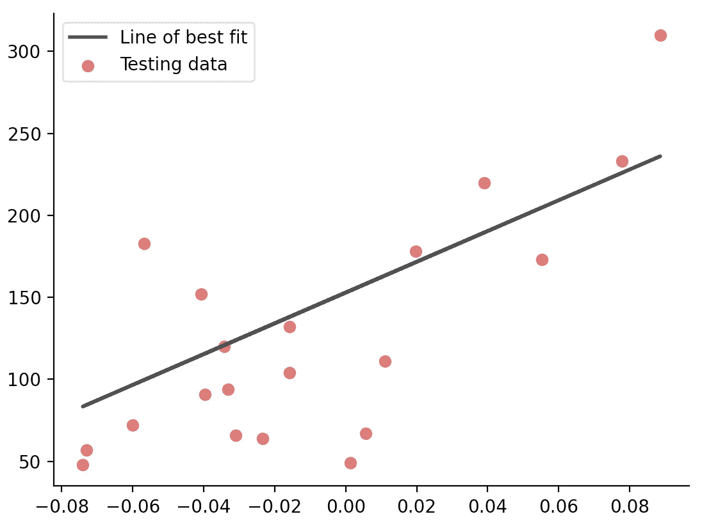

# 线性回归:(实际上)完全介绍

> 原文：<https://towardsdatascience.com/linear-regression-the-actually-complete-introduction-67152323fcf2?source=collection_archive---------38----------------------->

## 一位同学用 Python 对这个简单的机器学习算法进行了全面、深入的解释


Python 线性回归代码(所有照片由作者提供)

# I 简介

我记得我第一次钻研机器学习领域时是多么兴奋。炒作是可以理解的，有哪个软件工程专业的学生不想投身到当今最激动人心的相关技术中呢？

但是随着我兴趣的增长，我开始在这个问题上自学，我经常被我读到的一些文章的技术性吓到。精彩的文章，毫无疑问，但写得太超前了，即使是那些针对初学者的文章。另一方面，许多人过于务实，忽略了理论解释，而倾向于让新的学习者尽快上手。虽然两者都很有价值，但我觉得，作为一名学生，我可以在这里填补一个空白。

**我的目标是整合我希望在开始时就能掌握的所有信息，概述这个简单的机器学习算法背后的理论，然后以一种可理解但全面的方式给出一个解释透彻的实际例子。** *一个学生对另一个学生。*

> **因此，欢迎阅读我希望在构建第一个线性回归模型时能够读到的文章。**

# 一些理论

R 回归分析是一套统计过程，我们通过它来估计一个或多个给定自变量*【x】*的因变量*【y】*之间的关系。在机器学习的背景下，它是监督学习的一个子领域。

回归有几种类型，每一种描述自变量和因变量之间不同的数学关系。一些常见的例子包括多项式，逻辑和，本文的主题，线性。

[](/polynomial-regression-the-only-introduction-youll-need-49a6fb2b86de) [## 多项式回归:你需要的唯一介绍

### 一名学生对 Python 中机器学习算法背后的理论和应用的深入探究

towardsdatascience.com](/polynomial-regression-the-only-introduction-youll-need-49a6fb2b86de) 

但是你如何选择呢？有什么区别？嗯，就像我上面说的，要看数据。举个例子:比方说，我们希望预测一种疾病在人群中蔓延并逐渐消失的过程。自然地，随着天数的增加，病例数也会增加——直到它们开始下降，形成抛物线形状。如下图所示，最佳拟合直线无法准确预测第 100 天的病例数。但是多项式回归可以。但是我们将在下一篇文章中深入探讨这个问题。



线性回归不适用的例子

相反，当我们有如下图所示的趋势变化的数据时，一条直线就相当准确。这是一个线性回归:



线性回归适用的例子

> 因此，当因变量和自变量之间的关系可以相当准确地建模为直线时，就使用线性回归。

这将是我们的*最佳拟合线，*你可能还记得高中时的等式:

```
The way I learnt it in high school:   y = mx + c
Machine Learning convention:          h(X) = W0 + W1.X
```

其中:

1.  *y* 或 *h(x)* =因变量(也就是我们试图估计的)
2.  *m* 或 *W1* =坡度
3.  *x* 或 *X* =因变量(又名输入值)
4.  *c* 或*W0*= y 轴上的截距

# 术语

我们如何找到最佳拟合直线的方程？通过调整一组参数(W0 和 W1)直到我们找到它们各自的值，使得模型的残差平方和(实际值和预测值之间的差)*尽可能小。*



线性回归的一些残差

在继续之前，让我们复习一些重要的术语。很容易混淆这些术语，但是理解这些指标对于确定模型的可靠性至关重要。

## 差异

本质上，方差是对我们的最佳拟合线有多不准确的一种度量，并通过 *R* 分数来量化。我们的目标是使方差尽可能小，所以我们的 *R* 得分越高越好。

## 稀有

有时称为*成本*函数，用于将方差表示为预测的*决定系数 R* ，其范围从 0 到 1，1 为最佳拟合。

## 均方误差

误差平方的平均值(我们将它们平方，因此没有负值)。数字越大，误差越大。我们的目标是尽量减少这种情况。

# 该算法

我们将使用 ***普通最小二乘法*** 方法，这是一种简单的解析的非迭代解法。如果我们想要应用更复杂的机器学习算法，比如支持向量机，那么我们需要使用 ***梯度下降*，**，这将给我们一个迭代完成的 OLS 解的近似值。但是这是另一篇文章的主题。

因此，使用上述函数，我们训练我们的模型，直到它学习到最小化残差平方和的最佳系数。一旦我们在一些数据(比如说，数据集的前 80%)上训练了我们的模型，我们将在其余的数据(另外的 20%)上测试它。

# 这个例子

让我们从头开始，进口:

1.  matplotlib(py plot & RC params)——创建我们的数据可视化
2.  sci kit-Learn(load _ diabetes & linear _ model)—执行机器学习
3.  NumPy——做科学计算

```
import matplotlib.pyplot as plt
from matplotlib import rcParams
from sklearn.datasets import load_diabetes
from sklearn import linear_model
import numpy as np
```

接下来，我们加载数据集并创建一个对象 *dx。*糖尿病数据集来自 Scikit-Learn，由 10 个生理变量(年龄、性别、体重、血压等)组成。)和一年后疾病进展的指标。目标是从生理变量预测疾病进展。

现在，Scikit-Learn 数据集返回一个叫做 *Bunch* 的东西，它类似于一个字典。这一堆有各种属性，其中之一是*数据。*这是我们希望使用的数据矩阵。另一个是*目标*，我们很快就会谈到。但是我们不需要所有的数据，所以我们选择我们想要的特性，并使用 numpy.newaxis 将数组维数从 1 增加到 2。我们现在已经把数组变成了一个列向量。

```
d =​ ​load_diabetes​()
dx = d.data[:, np.newaxis, 2]
```

如果这一步有点混乱，没关系。重点是，我们现在有了一个包含数据的 2D 数组，这是必要的格式。您真的可以用任何数据集(自定义列表或. csv 文件)来实现这一点，其中您有带有 x 和 y 值的数据点。所以现在我们的看起来像这样:

```
[[ 0.06169621]
 [-0.05147406]
 [ 0.04445121]
 [-0.01159501]
 [-0.03638469]
 [-0.04069594]
 [-0.04716281]
 [...        ]]
```

接下来，我们将数据集分成训练集和测试集——这是机器学习的基本部分。你会注意到。我前面提到的*目标*属性。这些基本上是正确的值，或*响应变量*。

```
dx_train = dx[:-20]
dy_train = d.target[:-20]
dx_test = dx[-20:]
dy_test = d.target[-20:]
```

此时，散点图会有所帮助。仅仅通过观察，我们就可以推断出线性回归是否会提供一个准确的模型。我将使用 rcParams 添加一些样式，使它看起来更有吸引力，但不要担心这一点。

```
rcParams['axes.spines.top'] = False
rcParams['axes.spines.right'] = False
rcParams['lines.linewidth'] = 2plt.scatter(dx_train, dy_train, c='#9dd4a7', label='Training data')
plt.scatter(dx_test, dy_test, c='#d66565', label='Testing data')plt.legend(loc="upper left")
```



散点图上我们的训练和测试数据

你可能知道，看起来好像一条直线可以或多或少地预测这一趋势的走向。

现在有趣的部分来了。我们将为线性回归创建一个对象 *lr* ，并将数据拟合到其中。

```
lr = linear_model.LinearRegression()
lr.fit(dx_train, dy_train)
```

我们剩下要做的就是在散点图上绘制最佳拟合线:

```
plt.plot(dx_test, lr.predict(dx_test), c='#404040', label='Line of best fit')
```



我们的最佳拟合和测试数据系列

> **恭喜你！**您已经成功训练并测试了一个线性回归模型。

但是我们现在还不能沾沾自喜…

# 潜得更深

在这个阶段，我觉得我们应该更深入。我们必须了解到底发生了什么。

LinearRegression()类是好事发生的地方。这就是线性模型 *lr* 适合最小化预测值和目标值之间的残差平方和的系数的地方，正如我前面提到的。

这个类包含了*。fit()* 函数，我们可以看到它被应用于线性回归对象 *lr* 。我们将训练数据(x 和 y 值)作为参数传入，函数返回对象的一个实例，现在该实例已与数据相匹配。

最后，我们看到。 *predict()，*linear regression()类的另一个函数。这是通过计算最佳拟合直线的方程返回预测值的函数。

**理解这些函数的最好方法是*重写没有它们的程序。***

这是普通最小二乘算法的起点。我们需要做的第一件事是找到最佳拟合线*的梯度 *m* 和 y 轴截距 *c* 。*以下是各自的公式:

*   *m*=(μ(*x*)*μ(*y*)—μ(*x***y*)/((μ(*x*))2μ(*x*2))
*   *c*=μ(*y*)—*m**μ(*x*)

我们用 numpy.mean 来求平均值 *μ* 。我将这两个公式实现为一个函数:

```
def find_gradient_and_y_intercept(): m = (np.mean(dx_train) * np.mean(dy_train)
   - np.mean(dx_train *  dy_train)) / ((np.mean(dx_train)) **
   2 -  np.mean(dx_train ** 2)) c = np.mean(dy_train) - m * np.mean(dx_train) return m, c
```

请注意，现在我们不必像以前一样将数组更改为 2D，因为我们没有使用。 *fit()* 功能了。因此，将我们之前使用 *numpy.newaxis* 的那一行修改成这样:

```
dx = d.data[:, 2]
```

现在，当我们绘制最佳拟合线时，不使用。 *predict()* 函数，我们实际上输入了我们对于最佳拟合线的方程， *mx + c，*作为 *y* 值。

```
plt.plot(dx_test, ((m * dx_test) + b), c='0.2', label="Line of Best Fit")
```


一条与之前完全相同的最佳拟合线

> **这次真的恭喜你了！**你刚刚从零开始写了一个线性回归算法。希望您现在已经对算法及其相关功能有了透彻的理解。

作为奖励，让我们计算我们模型的*均方误差*和*得分*(前面定义的预测的决定系数 *R、*)。

使用 LinearRegression()类:

```
mse = np.mean((lr.predict(dx_test)-dy_test)**2)
score = lr.score(dx_test, dy_test)
```

不使用类:系数 *R* 定义为 *(1 — u/v)* ，其中 u 为残差平方和 *((y_true — y_pred) ** 2)。sum()* 和 *v* 是平方和的总和 *((y_true — y_true.mean()) ** 2)。sum():*

```
mse = np.mean((((m * dx_test) + b) - dy_test) ** 2)
score = (1 - ((dy_test - ((m * dx_test) + b)) ** 2).sum() / ((dy_test - dy_test.mean()) ** 2).sum())
```

答案得出 *mse* = 2548.07 和 *R* = 0.47。

# 结论

这就是对机器学习最简单的算法——线性回归的全面介绍。我希望，作为一名学生，我能够以一种相关和全面的方式解释这些概念。

**简单回顾一下我们讲过的内容:**

1.  线性回归的定义
2.  一些重要术语
3.  对算法的解释
4.  Python 中的一个实际例子
5.  对示例中函数的详细检查

如果您觉得这篇文章有帮助，我很乐意与您合作！关注我 [Instagram](https://www.instagram.com/adenhaus/) 了解更多机器学习、软件工程和创业内容。

编码快乐！

[**订阅**](https://medium.com/subscribe/@adenhaus) 📚为了不错过我的一篇新文章，如果你还不是中等会员， [**加入**](https://medium.com/@adenhaus/membership) 🚀去读我所有的，还有成千上万的其他故事！

# 资源

**Scikit 学习** *线性 _ 模型。LinearRegression()文档:*[https://sci kit-learn . org/stable/modules/generated/sk learn . linear _ model。linear regression . html # sk learn . linear _ model。线性回归.预测](https://scikit-learn.org/stable/modules/generated/sklearn.linear_model.LinearRegression.html#sklearn.linear_model.LinearRegression.predict)

**Scikit Learn** *线性回归示例:*[https://Scikit-Learn . org/stable/auto _ examples/Linear _ model/plot _ ols . html](https://scikit-learn.org/stable/auto_examples/linear_model/plot_ols.html)

**sci kit Learn***load _ diabetes 文档:*[https://sci kit-Learn . org/stable/modules/generated/sk Learn . datasets . load _ diabetes . html # sk Learn . datasets . load _ diabetes](https://scikit-learn.org/stable/modules/generated/sklearn.datasets.load_diabetes.html#sklearn.datasets.load_diabetes)

**Scikit Learn** *机器学习简介:*[https://Scikit-Learn . org/stable/tutorial/basic/tutorial . html](https://scikit-learn.org/stable/tutorial/basic/tutorial.html)

**真实 Python** *线性回归:*[https://Real Python . com/Linear-Regression-in-Python/# simple-Linear-Regression](https://realpython.com/linear-regression-in-python/#simple-linear-regression)

**Statisticsbyjim** *解读 R:*[https://Statisticsbyjim . com/regression/interpret-R-squared-regression/](https://statisticsbyjim.com/regression/interpret-r-squared-regression/)

**BMC** *均方差&R:*[https://www . BMC . com/blogs/Mean-squared-error-R2-and-variance-in-regression-analysis/](https://www.bmc.com/blogs/mean-squared-error-r2-and-variance-in-regression-analysis/)