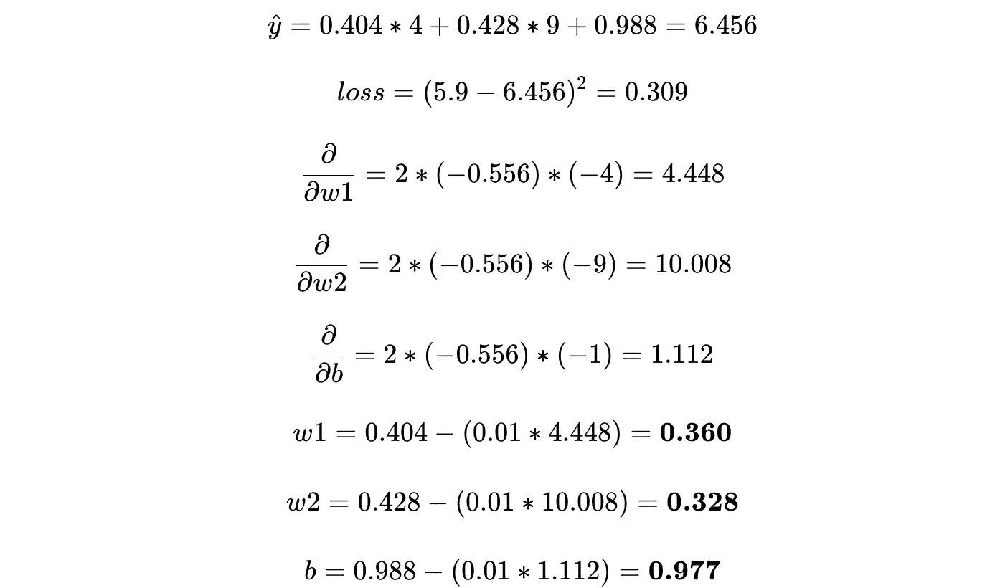
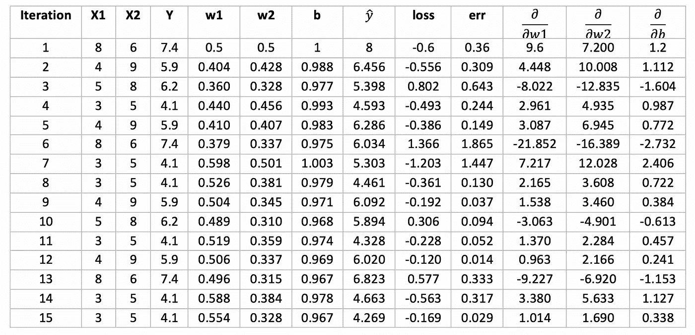

# 引擎盖下——线性回归

> 原文：<https://towardsdatascience.com/linear-regression-under-the-hood-583003d0bf38?source=collection_archive---------45----------------------->

照片由 [**马尔特卢克**发自](https://www.pexels.com/@maltelu?utm_content=attributionCopyText&utm_medium=referral&utm_source=pexels)[像素 ](https://www.pexels.com/photo/man-fixing-vehicle-engine-2244746/?utm_content=attributionCopyText&utm_medium=referral&utm_source=pexels)

这是一系列文章中的第一篇，在这一系列文章中，我们将使用各种 ML 算法的基本数学方程来理解它们的“幕后”工作。

1.  [引擎盖下—线性回归](/linear-regression-under-the-hood-583003d0bf38)
2.  [引擎盖下——逻辑回归](/under-the-hood-logistic-regression-407c0276c0b4)
3.  [引擎盖下—决策树](/under-the-hood-decision-tree-454f8581684e)

有这么多优化的实现，我们有时太关注库和它提供的抽象，而太少关注进入模型的底层计算。理解这些计算往往是一个好模型和一个伟大模型的区别。

在本系列中，我将重点放在手工实现算法上，以理解其背后的数学原理，这将有望帮助我们训练和部署更好的模型。

注意——本系列假设您了解机器学习的基础知识以及我们为什么需要它。如果没有，请阅读这篇文章，以了解我们为什么以及如何利用 ML。

# **线性回归**

线性回归是机器学习的支柱，它基于简单的曲线拟合概念

> **曲线拟合**是构建一条曲线或数学函数的过程，该曲线或数学函数与一系列数据点最佳拟合，可能受到约束。

本质上，“模型”产生了一个将输入特征(X)与目标变量(Y)联系起来的线性方程。

考虑以下具有两个输入变量— ***X1、X2*** 和一个目标变量 ***Y*** 的数据。

包含 5 行的示例数据

线性回归将试图找到 *w1、w2* 和 *b* 的最佳值，这样对于每一行数据—

这里， *w1* 和 *w2* 是输入变量的系数，而 *b* 是偏置项。这被称为数据的“最佳拟合线”，算法使用以下步骤反复尝试找到最佳拟合线—

1.  给参数 *w1* 、 *w2* 和 *b* 分配随机值。
2.  在数据中选取一个实例并计算

3.计算损失——我们的产量与实际产量相差多少？

4.计算 *w1* 、 *w2* 和 *b* 的梯度—我们应该如何改变权重以更接近实际输出？

5.更新 *w1* 、 *w2* 和 *b* 。

6.重复步骤 2–5，直到收敛。

以下一组图像传达了单个变量的步骤—

0.从一组 n 个变量开始

1.给参数分配随机值并绘制假设曲线

2.使用一个数据实例计算ŷ

3.计算损失

4 & 5.计算损失并更新参数

6.对另一个数据实例重复步骤 2–5

## **1。将随机值分配给 *w1* ，w2 和 b**

让我们从我们的假设开始——

## 2.从数据中选择一个实例并计算ŷ

让我们从数据的第一行开始

输入我们假设的参数值，我们计算一个估计的输出

我们的目标是更新参数，使我们的估计输出(ŷ)等于实际输出(y)。

## 3.计算损失——计算的产量与实际产量相差多少？

这就是事情变得有趣的地方。

我们计算我们的假设离实际值有多远，并更新我们的参数以更接近实际输出。

为了使用梯度来计算和更新我们的参数假设，我们需要使用可微分的函数来计算损失。

我们将使用平方误差作为损失函数。它衡量的是我们的假设(ŷ)和实际产出(y)之间的平方差。平方误差具有独特的优势，因为它确保了微小误差变化的小值，但当模型假设与实际值相差甚远时，误差就会爆炸。
“为什么”此损失值对算法至关重要，将在下一步中清除。

让我们根据我们的假设来计算损失—

## 4.**计算梯度**

这是算法中最重要的一步，因为这是我们迭代学习和改进假设以接近实际输出的地方。

我们首先把我们的损失写成模型参数的函数—

为了确定如何改变参数以更接近实际输出，我们计算了每个系数的梯度(偏导数)和偏置项与损耗的关系

这为我们提供了梯度，它测量每个参数对预测输出的影响，本质上告诉我们需要改变每个参数多少才能更接近实际输出。

## 5.**更新 *w1* 、 *w2* 和*b***

哇！看起来我们的假设差了一大截！

这看起来不对。让我们使用一个缩放变量来缩放我们的更新— **学习率(η)** 。学习率确保我们的权重不会在每次更新时发生巨大的变化(并开始波动)。

考虑到η= 0.01，我们的更新看起来更合理——

那看起来更合理。

这完成了算法的一次迭代。现在我们重复这些步骤，直到**收敛** *，即*，直到我们的权重变化不大和/或我们的损失接近于 0。

让我们用更新后的参数对其他数据行进行另一次迭代。

将相同的过程再重复几次*，从前四行数据中随机取样一行(我们保留最后一行来验证我们的模型)，我们得到以下参数值—

使用这些，让我们看看验证样本(最后一行)上的错误是什么样子的。

我们的损失几乎为 0。我们可以说模型已经找到了这个数据的最佳参数。

仅此而已。本质上，这就是线性回归的作用。

# 这真的是线性回归的全部功能吗？

“引擎盖下”是本系列的焦点，我们看了一下线性回归的基础(更具体地说——随机梯度下降)，一次取一个样本，并更新我们的参数以适应数据。

虽然这确实是线性回归的核心，但是创建一个好的线性回归模型还有很多工作要做，比如—

1.正规化——L1 和 L2

2.学习率调度

3.正态方程

4.随机与小批量与批量梯度下降

5.提前停止

我将在一个平行系列中讨论这些概念，重点是算法之间的公共优化点。

# 下一步是什么？

在本系列的下一篇文章中，我们将挑选一个二进制分类数据，并深入了解 [**逻辑回归**](/under-the-hood-logistic-regression-407c0276c0b4) 算法。它与线性回归并没有太大的不同，但是它有一些自己的怪癖，需要在线性回归之外提及。

* *经过 15 次迭代，这是我们的损失、梯度和参数值的变化方式—*

15 次迭代后的参数更新