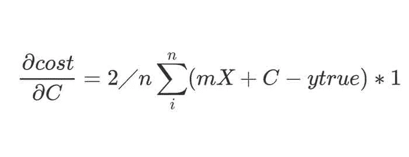
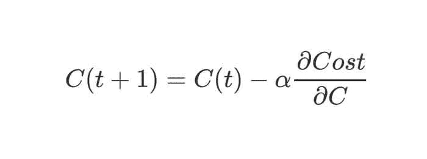
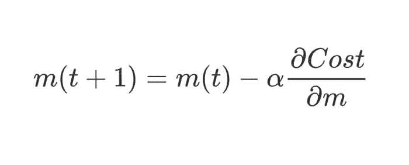
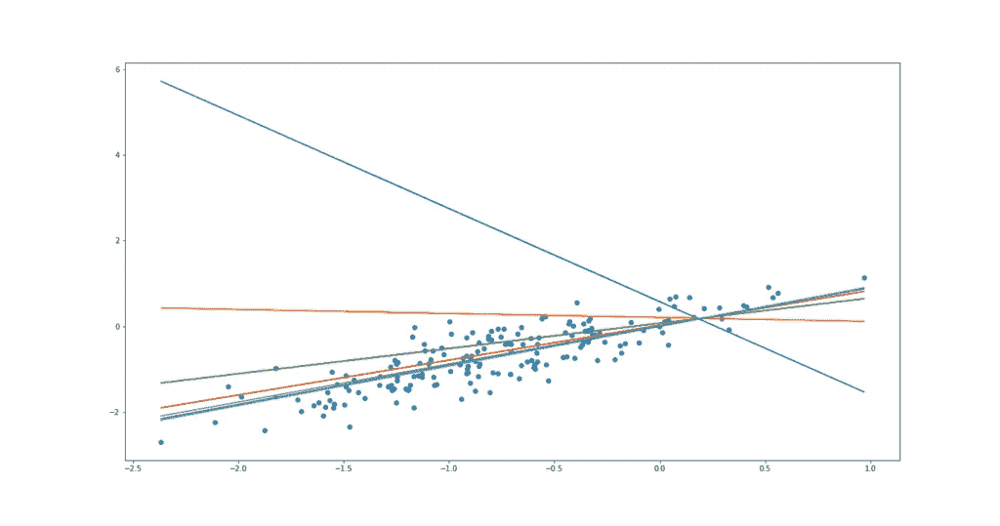

# 仅使用 Python 和 Numpy 的线性回归

> 原文：<https://towardsdatascience.com/linear-regression-with-python-and-numpy-25d0e1dd220d?source=collection_archive---------11----------------------->

## 用 Numpy 和 Python 写一个机器学习模型

在这篇文章中，我们将看到如何在不使用任何机器学习库的情况下用 Python 实现线性回归。在[的另一篇文章](https://hackerstreak.com/linear-regression/)中，我们看到了线性回归算法在理论上是如何工作的。随着机器学习库的流行，任何人都可以通过一些 API 调用来实现 ML 算法。但只有少数人深入了解算法是如何工作的。我们将使用 Python 编写线性回归程序，并对其进行训练！

# Python 代码中的线性回归

我们将对线性回归算法进行编码，并用 Python 语言对其进行训练。如果你已经有编程经验，但不熟悉 Python，这绝对是轻而易举的事。然而，如果你没有任何编程经验，我建议你浏览 Python 的文档。只是为了对编程和语言语法有一个基本的了解。此外，Python 非常直观，您可以很快上手并运行。谷歌的 Colab 是运行你的程序的好方法，因为它在安装库时没有麻烦。但是如果你已经有了 Python IDE，欢迎你跳过。那好吧。事不宜迟，让我们直接跳到代码。

## 导入 Python 库

```
**import numpy as np
import matplotlib.pyplot as plt
import pandas as pd
import time**
```

首先我们导入最需要的矩阵运算库 Numpy。然后，‘matplotlib’是用来画草图和图形的。这是为了可视化我们的模型的拟合和性能。pandas 有助于将数据集(csv、excel 文件)轻松加载到 Pandas 数据框中。我们将使用这些来加载数据集，初始化线性回归模型并对其进行训练。

```
**df = pd.read_csv(“https://raw.githubusercontent.com/Baakchsu/LinearRegression/master/weight-height.csv”)**
```

这一行从我的 Github repo 中提取“根据体重预测身高”数据集，并将其读入数据框。

接下来，我们将为线性回归模型创建一个类，就像 scikit 的模型一样。它的模型可以用“sklearn.linear_model”调用。线性回归”方法。但是，我们将把它作为仅仅**线性回归**。让我们看看它是如何出现的。

## 创建线性回归类

```
**class LinearRegression:
 def fit(self,X,Y):
 X=np.array(X).reshape(-1,1)
 Y=np.array(Y).reshape(-1,1)
 x_shape = X.shape
 self.parameter_cache = []
 num_var = x_shape[1]       #the shape corresponds to number of input variable dimensions. There’s only one for this dataset i.e weight of person
 self.weight_matrix = np.random.normal(-1,1,(num_var,1))
 self.intercept = np.random.rand(1)
 for i in range(50):
 self.dcostdm = np.sum(np.multiply(((np.matmul(X,self.weight_matrix)+self.intercept)-Y),X))*2/x_shape[0] #w.r.t to the weight
 self.dcostdc = np.sum(((np.matmul(X,self.weight_matrix)+self.intercept)-Y))*2/x_shape[0]          #partial derivative of cost w.r.t the intercept
 self.weight_matrix -= 0.1*self.dcostdm                                                                  #updating the weights with the calculated gradients
 self.intercept -= 0.1*self.dcostdc                                                                      #updating the weights with the calculated gradients
 self.parameter_cache.append(np.array((self.weight_matrix,self.intercept)))                             #the parameters are cached just to track the progress
 return self.weight_matrix,self.intercept,self.parameter_cache
 def predict(self,X):
 product = np.matmul(np.array(X).reshape(-1,1),self.weight_matrix)+self.intercept
 return product**
```

结果很简单，对吧？让我们通过代码来更详细地理解一下。这里，我们用两个方法“拟合”和“预测”定义了 **LinearRegression** 类。是的，他们顾名思义。拟合方法接受输入特征向量(人的体重)和输出变量(人的身高),并训练线性模型以获得完美拟合。

```
**X=np.array(X).reshape(-1,1)
Y=np.array(Y).reshape(-1,1)
x_shape = X.shape
num_var = x_shape[1]**
```

我们将参数 X 和 Y 转换为 numpy 数组，并将它们重新整形为形状(数据的数量，特征变量的数量)。因为我们只是用体重来预测身高，所以变量的数量只有一个(num_var)。我们对输出目标变量 y 做同样的事情。

## 使用 Numpy 进行参数初始化

```
**self.weight_matrix = np.random.normal(-1,1,(num_var,1))
self.intercept = np.random.rand(1)
self.parameter_cache = [ ]**
```

之后，我们初始化权重矩阵和截距变量。权重矩阵将有一个形状(num_var，要预测的输出变量的数量)。因此，对于我们的问题，结果是(1，1)。因为输入和输出变量的数量都是一个(体重和身高都是一个变量)。如果我们用输入的体重和性别来预测一个人的身高，我们将有两个输入变量和一个输出变量。因此，权重矩阵将具有形状(2，1)。

截距只是一个表示线性回归模型的 Y 截距的数字。如果你对什么是权重和截距感到困惑，查看一下详细解释的[前一篇文章](https://hackerstreak.com/linear-regression/)。我们在训练时使用 parameter_cache 来缓存模型参数。

## 训练线性回归模型

```
**for i in range(50):
 self.dcostdm =  np.sum(np.multiply(((np.matmul(X,self.weight_matrix)+self.intercept)-Y),X))*2/x_shape[0] #partial derivative of cost w.r.t the weights
 self.dcostdc = np.sum(((np.matmul(X,self.weight_matrix)+self.intercept)-Y))*2/x_shape[0]                #partial derivative of cost w.r.t the intercept
 self.weight_matrix -= 0.1*self.dcostdm                                                                  #updating the weights with the calculated gradients
 self.intercept -= 0.1*self.dcostdc                                                                      #updating the weights with the calculated gradients
 self.parameter_cache.append(np.array((self.weight_matrix,self.intercept)))****return self.weight_matrix,self.intercept,self.parameter_cache**
```

最后，我们用反向传播训练我们的模型。这是成本相对于(w.r.t)上一篇文章中的模型参数的偏导数方程。



**成本 w.r.t 'm '(权重矩阵)的偏导数和成本函数相对于' C '的偏导数**

我们在前两行(dcostdm 和 dcostdc)中实现上述等式。



接下来，我们使用上面的等式用计算出的梯度更新参数“权重矩阵”和“截距”。然后，我们将模型参数追加到缓存中。训练循环结束后，我们从 fit 函数返回参数和缓存。

## 该预测方法

```
**def predict(self,X):
 product =  np.matmul(np.array(X).reshape(-1,1),self.weight_matrix)+self.intercept
 return product**
```

预测方法采用输入要素，并使用线性回归类的训练参数预测输出。“self.weight_matrix”和“self.intercept”表示我们在拟合方法中看到的模型参数。同样，我们返回预测值。

## 我们如何使用模型类？

```
**reg = LinearRegression()**
```

到目前为止，我们只是创建了模型类和训练代码。现在，我们将使用上面的代码行创建一个线性回归类的实例。

```
**x = (df[‘Weight’]-df[‘Weight’].mean())/df[‘Weight’].std() #standardization of the dataset
y = (df[“Height”]-df[‘Height’].mean())/df[“Height”].std() #standardization of the dataset**
```

这两行将使用数学公式 X-u/std 对数据集进行标准化。其中，X 是我们想要标准化的变量，“u”是该变量的平均值，“std”是标准偏差。这有助于模型更快地学习，因为所有变量都在(-1 到 1)的范围内。它将平均值居中到 0 和单位标准偏差(std=1)。

```
**params = reg.fit(x[:-180],y[:-180])**
```

通过调用类实例‘reg’的 fit 方法并传递 X 和 Y 值，我们开始训练。这里，我们传递数据集，留下最后 180 个数据点进行测试。

## 模型可视化

```
**pred = reg.predict(np.array(x[-180:]))****plt.scatter(x[-180:],y[-180:])****plt.plot(x[-180:],pred)**
```

一旦我们完成训练，我们就可以使用训练好的回归模型进行预测。我们使用“reg.predict”方法来完成这项工作，并传入测试数据(最后 180 个数据点)。现在,“pred”变量将具有测试数据的预测输出。为了直观地显示模型是如何拟合的，我们首先用测试数据点创建一个图。然后，我们用“plt.plot”函数绘制模型拟合线。


对于用 Numpy 从头开始构建的线性回归模型，这提供了足够好的拟合。值得注意的是，从图中，我们可以看到它在数据集上概括得很好。这只是一个线性模型。但是知道它的工作原理有助于更好地应用它。

```
**plt.figure(figsize=(19, 10))
plt.scatter(x[-180:],y[-180:])
for i in list(np.arange(0,50,5)):

 value = params[2][i]
 prediction = np.matmul(np.array(x[-180:]).reshape(-1,1),value[0])+value[1]
 plt.plot(x[-180:],prediction)**
```

从“fit”方法返回的参数缓存中，我们在训练过程中绘制出模型的拟合度。顶部的蓝线是训练前随机参数的初始拟合。如您所见，该模型在训练过程中提高了其预测性能。您可以修改代码，改变初始化条件，看看模型拟合如何变化。为此，可以在 GitHub [库](https://github.com/Baakchsu/LinearRegression)上找到代码



**展示模型如何改进拟合的历史**