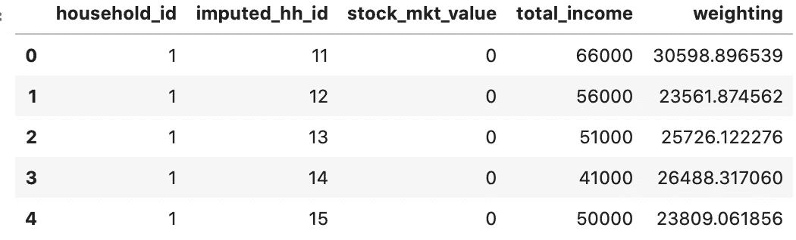
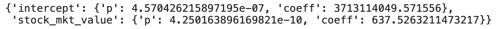

# 消费者金融新调查的线性回归

> 原文：<https://towardsdatascience.com/linear-regressions-for-the-survey-of-consumer-finances-ed2c10b2670c?source=collection_archive---------24----------------------->

## 如何处理 SCF 的多个数据集


致谢:[迈克尔·朗米尔](https://unsplash.com/@f7photo)

上个月，美联储发布了 2019 年美国家庭财务状况三年一度的调查:消费者财务调查(SCF)。尽管他们对 2016 年以来发生的变化做了很好的[总结](https://www.federalreserve.gov/publications/files/scf20.pdf)，但现在每个人都在想新冠肺炎对经济的影响，而美联储的总结只是一个脚注。

尽管如此，SCF 可以为未来分析 COVID 对我们财务状况的影响提供一个良好的前期基线。为 2019 年 SCF 进行的调查中，超过 90%发生在今年 2 月之前。任何分析中唯一真正的难题是理解如何准确地分析 SCF 最独特的特性之一:它有五个完整的数据集可以用于分析。

## **SCF 中的插补**

为什么 SCF 会提供五个数据集？这主要是因为当人们接受调查采访时，他们没有提供完整的答案。

为了处理这些缺失的值，SCF 不是简单地根据一个家庭对其他问题的回答来猜测值，而是对他们的答案进行五次猜测。通过这种方式，研究人员可以更好地了解可能答案的分布情况。

尽管这种解决方案有助于解决丢失值的问题，但在对数据进行统计测试时，它会引入一个难题。这就好比你的新宜家书桌少了一个零件，而不是收到一个替换零件，而是收到了五套相同的新书桌。你会如何处理所有这些大公司？

当您试图对这些数据进行回归时，也会出现同样的问题。你只是用一套，用所有的，把它们叠起来吗？即使是训练有素的研究人员在试图分析数据时也会遇到问题。对 SAS 和 Stata 之类的统计包进行一些更新后，事情变得更容易了，但是 Python 需要做一些工作。让我们快速看一下 SCF 显示了什么。

## 检查数据

在这一部分的底部，您可以看到我用来将 SCF 数据下载到 Pandas 数据框中的代码要点。为了举例，让我们看看一个家庭的一些收入数据和股票所有权的市场价值及其所有的影响。

下面是 gist 中定义的函数如何工作及其输出的一个例子。

```
import pandas as pd
import dataloading as dltargetdir = “data/extracted/”df = dl.SCF_load_data(targetdir, 
year=2019, 
series=[‘yy1’, ‘y1’, ‘x3915’, ‘x5729’, ‘x42001’]
)df.head()
```



输出

正如你所看到的，2019 年数据集的前五行是第一个家庭的五个含义。看来这个家庭肯定没有任何股票，其收入以五种不同的方式估算。

这里需要注意的另一件事是[权重](https://www.federalreserve.gov/econres/files/codebk2019.txt)。对于每一个牵连因素，权重代表该家庭在总人口中所代表的家庭数量。所以，如果你把五个数据集中的一个的所有家庭的权重加起来，你会得到一个接近 1.286 亿的数字，这是美国家庭的大概数量。

## 做出推论

有了这些数据，仍然有可能做出推论，但是你可能不得不偏离传统的方法。SCF [密码本](https://www.federalreserve.gov/econres/files/codebk2019.txt)指出[蒙塔尔托和宋](https://papers.ssrn.com/sol3/papers.cfm?abstract_id=2466498) (1996)提供了一个用户友好的介绍，介绍了如何利用具有多重含义的数据集进行推理。

首先，在这种情况发生之前，需要进行一些运算，以便进行我们的重复插补推断(RII)。需要做的一件事是创建一个新列来标识每一行属于哪个数据集。值得庆幸的是，估算数据的 id 是从家庭 id 构建的，并且可以成为一个新的列。此外，权重需要除以 5，以说明我们在所有数据集上为美国人口创建推断的事实。

```
# Add Implicate Numberdf[‘implicate’] = [x — y*10 for x, y in zip(df[‘imputed_hh_id’], df[‘household_id’])]# weighting dividing by 5 since data implicates being combined for  regressiondf[‘across_imp_weighting’] = [x/5 for x in df[‘weighting’]]
```

下面是基于蒙塔尔托和宋(2006)描述的方法实现的代码示例。本质上，它采用系数和方差-协方差矩阵对每个影响进行回归，并生成独立变量的 p 值。举例来说，一个基于家庭所有股票资产的市场价值预测家庭总收入的模型显示 p 值接近于零，这是可以预料的。另一方面，过大的具有统计显著性的截距需要进一步研究。

```
dl.RII(df,
 Xseries=[‘stock_mkt_value’],
 y=’total_income’)
```



输出

## 进一步阅读

这篇文章将帮助你对 SCF 数据进行回归，但是如果你想进行一些其他类型的计算，我建议你阅读一下那里的学术文献。蒙塔尔托和宋(2006)肯定会提供一个很好的基础，在此基础上你可以建立更多的统计工具，以你需要的方式分析 SCF。