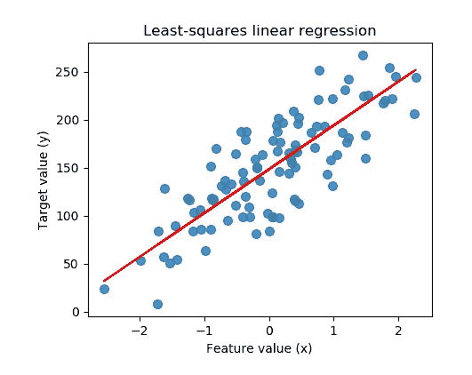
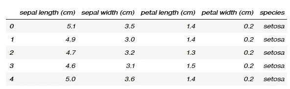
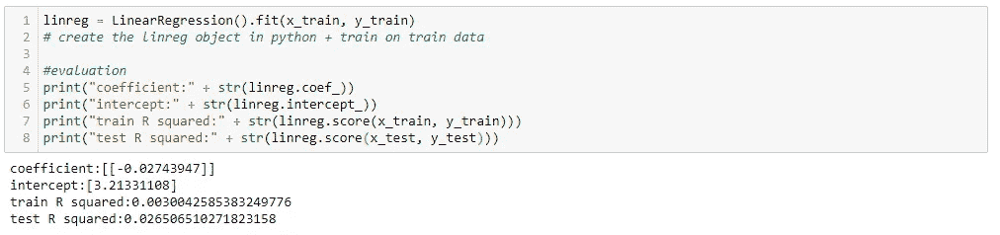
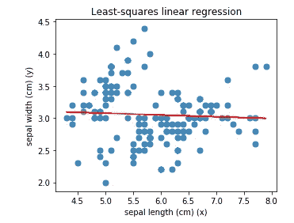
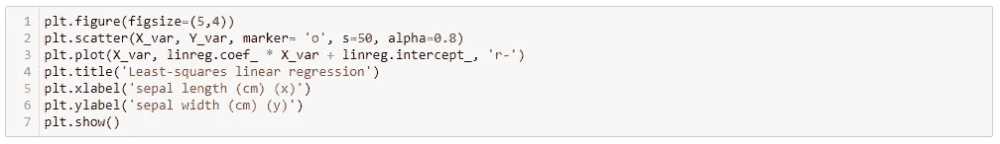
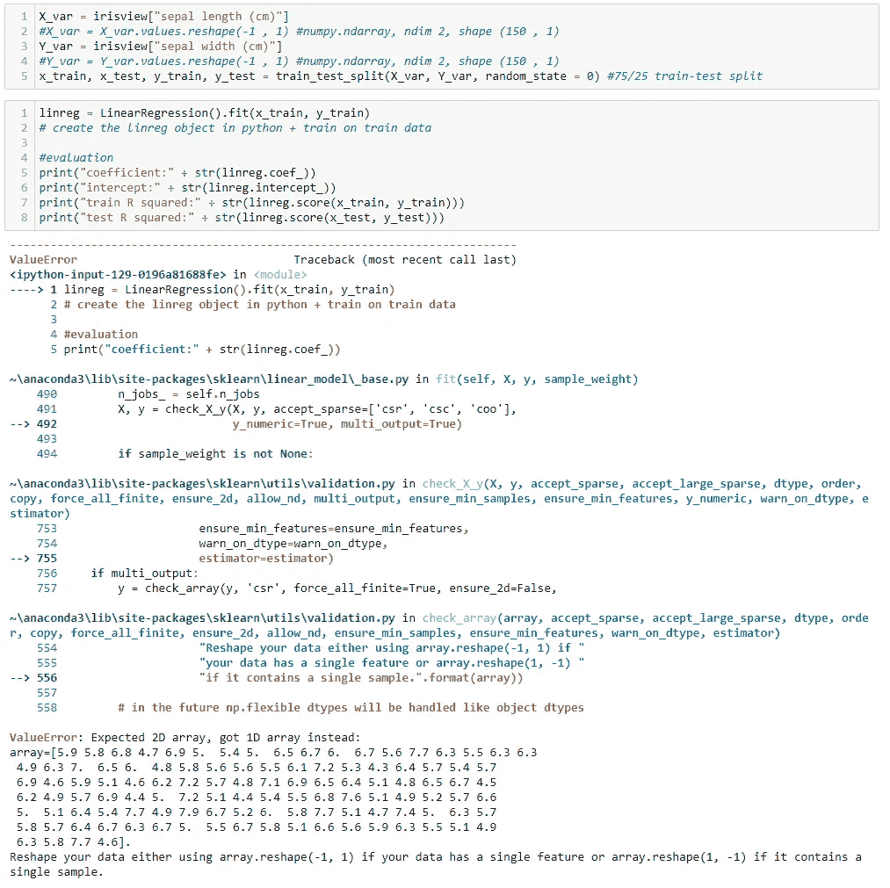

# Python 中的简单线性回归

> 原文：<https://towardsdatascience.com/linear-regressions-with-scikitlearn-a5d54efe898f?source=collection_archive---------41----------------------->

## scikit 入门-学习和 Python

本文应该足以涵盖如何在 Python 中运行构造一个简单的线性回归。它也将包含一些我面对的错误和如何克服它们！

在 [Unsplash](https://unsplash.com?utm_source=medium&utm_medium=referral) 上由[zdenk macha ek](https://unsplash.com/@zmachacek?utm_source=medium&utm_medium=referral)拍摄的照片

# 这个概念

简单线性回归

简而言之，线性回归是关于**通过一组数据点找到一条最佳拟合线性线**(通常由 R 平方度量来判断)。对于给定的 X 数据点，通过最小化实际和预测的 Y 数据点之间的差异(残差),该线将实现更好的拟合。在下面的例子中，蓝色点代表*实际的* Y 值，而红色线代表*预测的* Y 值的向量。

令人兴奋的是，简单的线性回归是监督机器学习最简单的形式之一！

# **数据**

首先，我将使用 iris 数据集，它是数据空间中覆盖面非常广的数据集，可以很容易地在网上找到。它包含 5 个属性下的一组 150 个记录— **花瓣长度、花瓣宽度、萼片长度、萼片宽度和类(种)**。

这里有一个快速的 *iris_df.head()* :

快速浏览数据集

# 包裹

1.  *sklearn* 模块(train_test_split、LinearRegression、make_regression、load _ iris)——这些模块在加载 iris 数据集、准备数据和拟合模型时是必需的。
2.  *matplotlib pyploy* 模块—需要绘制结果。
3.  *熊猫*和 *numpy* 包——需要操纵数据帧及其组成值

# 该过程

我们将尝试解决的问题陈述是:

> **萼片长度**和萼片宽度之间有线性关系吗？

代码块 1

1.  我们首先从**开始设置萼片长度为 *X_var* ，萼片宽度为 *Y_var。***
2.  此外，有必要使用*的**。对两个变量整形(-1，1)*** 方法；这将在后面的部分详细阐述。
3.  **设置一个 75/25 列车测试分割。监督机器学习的一个关键思想是能够在未接触的数据上测试你的模型的能力。训练-测试分割实际上使用 75%来生成最佳拟合线，并使用剩余的 25%来评估模型对新数据(假设这些数据来自与训练数据集相同的分布)的性能。75/25 是 *scikit learn，*使用的默认比例，必要时可以更改。**

代码块 2

4.**创建线性回归对象，并使其符合训练数据。** *LinearRegression()* 可以认为是建立一个不含参数的‘空白’线性回归模型。呼唤着*。线性回归对象上的 fit(x_train，y_train)* 方法使用训练数据集和标签来为对象生成参数。

5.**获取线性回归模型的参数。**这是通过调用方法*完成的。coef_* 和*。在拟合的模型对象*上截取 _* 。*末尾的下划线表示由模型生成。

6.**评估模型在训练和测试数据集上的表现。**在这种情况下，模型在训练数据上输出 0.0030 的 R 平方，在测试数据集上输出 0.0265 的 R 平方。在这种情况下，得出弱到不存在线性相关性的结论是合理的。

# 测绘

我们可以使用来自 *matplotlib 库*的 *pyplot* 模块进一步可视化数据。对于给定的萼片长度，似乎最佳拟合线提供了对萼片宽度的非常不准确的预测。这与低 R 平方分数相一致。

> 因此，我们可以得出结论，在这些花的萼片宽度和萼片长度之间存在微弱或不存在的线性回归。

代码块 3

# 可能的问题

错误消息！

如上所述，我称之为*。在继续建模之前，对变量进行整形(-1，1)* 方法。下面不用*重塑*的方法来试试吧。线性回归模型抛出了一个令人生畏的错误，但是需要重点关注的是最后几行:

*应为 2D 数组，却得到了 1D 数组，*和*要么使用 array . shape(-1，1)对数据进行整形(如果数据只有一个要素),要么使用 array . shape(1，-1)对数据进行整形(如果数据只有一个样本)。*

基本上，*。fit* 方法期望 x 和 y 变量是二维数组，但它们最终是原始形式的一维数组。为了确认，我们可以打电话给*。shape* 方法，它们都将返回各自 numpy *(150，)*的形状。这可以解释为第一维度具有 150 个值，而第二维度包含 0，从而产生一维对象。进一步调用*。ndim* 方法对变量将返回维数，1。

**这个。 *reshape(-1，1)* 方法用于创建原始数组的一个实例，该实例添加了一个额外的 numpy 数组维度。**该方法的参数具有以下含义:

1.  -1:保持尺寸不变。
2.  1:添加新尺寸。

**这样一来，X_var 和 Y_var 现在就转化成了带*的变量。2 的 ndim* ，和*。(150，1)的形状*。**在此过程中，变量也从类型*pandas . core . series . series*变为类型 *numpy.ndarray.*

# 代码

请在这里找到我的 GitHub 上的代码:

 [## dehan 97/虚构-嘉年华

### GitHub 是超过 5000 万开发者的家园，他们一起工作来托管和审查代码，管理…

github.com](https://github.com/dehan97/fictional-fiesta/blob/master/scikit%20linear%20regs.ipynb) 

我希望我能够以这样或那样的方式帮助您学习数据科学方法——如果有，请留下评论！

如果你有问题或者想讨论在后新冠肺炎时代应用数据科学技术的想法，请随时联系我。

这是另一篇数据科学文章！

 [## 简易模式下的岭回归

### 了解岭回归模型背后的理论，如何通过 python 和 scikit-learn 对其进行编码和调优。

medium.com](https://medium.com/python-in-plain-english/ridge-regressions-on-easy-mode-9e7353a0e3f9)