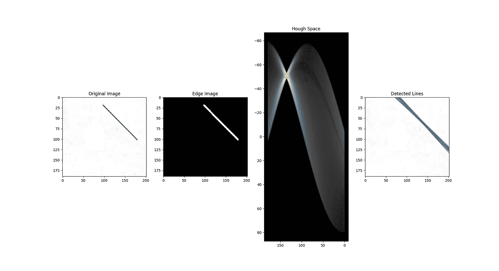
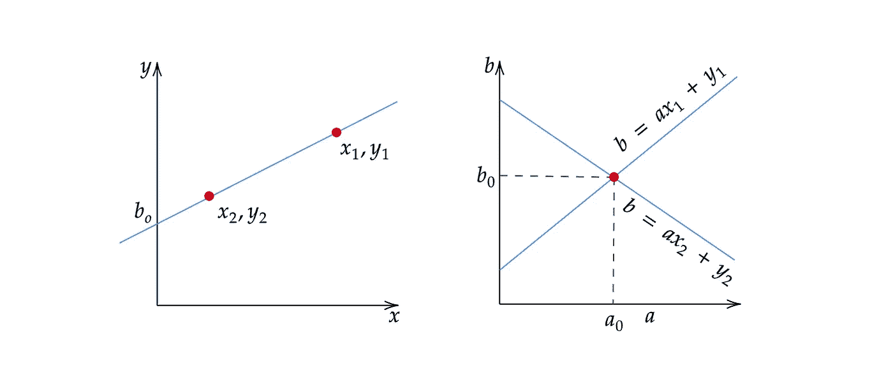
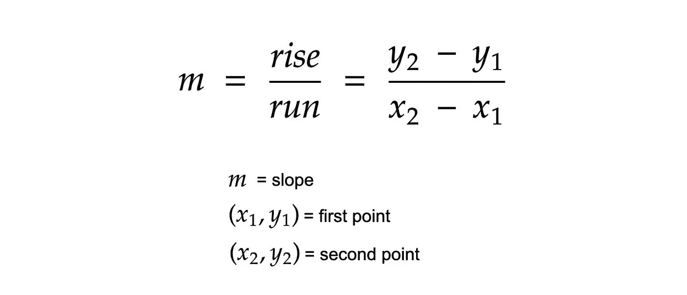
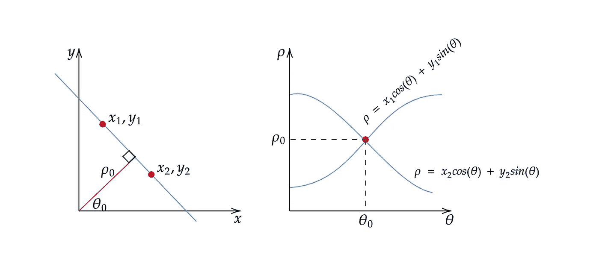
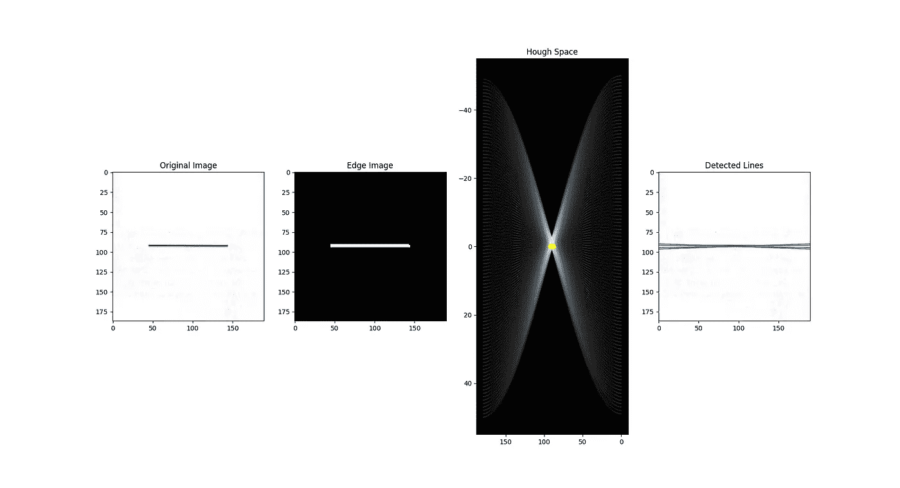

# 基于霍夫变换的直线检测

> 原文：<https://towardsdatascience.com/lines-detection-with-hough-transform-84020b3b1549?source=collection_archive---------0----------------------->

## 一种在图像中寻找直线的算法

使用霍夫变换算法的直线检测

> **注:**你可以在这里阅读[这篇文章的中文版。](https://www.infoq.cn/article/3KfCkf67yZQHuiFp0x3Q)

# 一.动机

最近，我发现自己不得不将文档扫描仪功能整合到一个应用程序中。在做了一些研究后，我看到了 Dropbox 机器学习团队成员熊英写的一篇文章。[的文章](https://dropbox.tech/machine-learning/fast-and-accurate-document-detection-for-scanning)解释了 Dropbox 的机器学习团队如何通过强调他们经历的步骤以及每个步骤中使用的算法来实现他们的文档扫描仪(熊，2016)。通过那篇文章，我了解了一种叫做霍夫变换的方法，以及如何用它来检测图像中的线条。因此，在本文中，我将解释霍夫变换算法，并提供该算法在 Python 中的“从头”实现。

# 二。霍夫变换

霍夫变换是一种由 Paul V. C. Hough 申请专利的算法，最初被发明用于识别照片中的复杂线条(Hough，1962)。自开始以来，该算法已经被修改和增强，以便能够识别其他形状，例如特定类型的圆形和四边形。为了理解 Hough 变换算法如何工作，理解四个概念是很重要的:边缘图像、Hough 空间、边缘点到 Hough 空间的映射、表示线的另一种方法以及如何检测线。

## 边缘图像

Canny 边缘检测算法。来源:[艾窝棚](https://aishack.in/tutorials/canny-edge-detector/)

边缘图像是边缘检测算法的输出。边缘检测算法通过确定图像的亮度/强度发生剧烈变化的位置来检测图像中的边缘(“边缘检测-使用 Python 进行图像处理”，2020)。边缘检测算法的例子有: [Canny](https://en.wikipedia.org/wiki/Canny_edge_detector) 、 [Sobel](https://en.wikipedia.org/wiki/Sobel_operator) 、 [Laplacian](https://en.wikipedia.org/wiki/Laplace_operator) 等。边缘图像被二值化是很常见的，这意味着它的所有像素值不是 1 就是 0。根据您的情况，1 或 0 可以表示边缘像素。对于霍夫变换算法，首先执行边缘检测以产生边缘图像是至关重要的，该边缘图像随后将被用作算法的输入。

## 霍夫空间和边缘点到霍夫空间的映射

从边缘点到霍夫空间的映射。

霍夫空间是 2D 平面，其水平轴代表斜率，垂直轴代表边缘图像上的线的截距。边缘图像上的一条线用 *y = ax + b* 的形式表示(Hough，1962)。边缘图像上的一条线在霍夫空间上产生一个点，因为一条线由其斜率 *a* 和截距 *b* 来表征。另一方面，边缘图像上的边缘点( *xᵢ* 、 *yᵢ* )可以有无限多条线穿过。因此，一个边缘点在霍夫空间产生一条直线，其形式为*b =axᵢ+yᵢ*(leaves，1992)。在霍夫变换算法中，霍夫空间用于确定边缘图像中是否存在直线。

## 表示线条的另一种方式

计算直线斜率的方程式。

以*y = ax+b**的形式表示线条以及带有斜率和截距的霍夫空间有一个缺陷。在这种形式下，该算法将无法检测垂直线，因为斜率 *a* 对于垂直线是未定义的/无穷大(Leavers，1992)。从程序上来说，这意味着计算机需要无限的内存来表示一个的所有可能值。为了避免这个问题，直线由一条称为法线的线来表示，该线穿过原点并垂直于该直线。法线的形式为ρ*= x cos(*θ*)+y sin(*θ*)*其中ρ 为法线的长度，θ为法线与 x 轴的夹角。*

**

*直线及其对应霍夫空间的替代表示。*

*使用这个，代替用斜率 *a* 和截距 *b* 表示霍夫空间，现在用ρ和θ表示霍夫空间，其中横轴表示θ值，纵轴表示ρ值。边缘点到霍夫空间的映射以类似的方式工作，除了边缘点( *x* ᵢ， *y* ᵢ)现在在霍夫空间中产生余弦曲线而不是直线(leavers，1992)。线的这种正常表示消除了处理垂直线时出现的 *a* 的无界值的问题。*

## *线检测*

**

*检测图像中线的过程。霍夫空间中的黄点表示存在直线，由θ和ρ对表示。*

*如上所述，边缘点在霍夫空间中产生余弦曲线。由此，如果我们将边缘图像中的所有边缘点映射到霍夫空间，将会生成大量的余弦曲线。如果两个边缘点位于同一直线上，它们对应的余弦曲线将在特定的(ρ，θ)对上相交。因此，霍夫变换算法通过找到具有大于某个阈值的相交数的(ρ，θ)对来检测直线。值得注意的是，如果不进行一些预处理，如霍夫空间上的邻域抑制，以去除边缘图像中的相似线，这种阈值方法可能不总是产生最佳结果。*

# *三。该算法*

1.  *决定ρ和θ的范围。通常，θ的范围是[ 0，180 ]度， *ρ* 是[ - *d* ， *d* ，其中 *d* 是边缘图像对角线的长度。量化ρ和θ的范围很重要，这意味着应该有有限数量的可能值。*
2.  *创建一个名为累加器的 2D 数组，表示维数为( *num_rhos* ， *num_thetas* )的霍夫空间，并将其所有值初始化为零。*
3.  *对原始图像执行边缘检测。这可以用你选择的任何边缘检测算法来完成。*
4.  *对于边缘图像上的每个像素，检查该像素是否是边缘像素。如果是边缘像素，则遍历θ的所有可能值，计算相应的ρ，在累加器中找到θ和ρ索引，并基于这些索引对递增累加器。*
5.  *遍历累加器中的所有值。如果该值大于某个阈值，则获取ρ和θ指数，从指数对中获取ρ和θ的值，然后可以将其转换回形式 *y = ax + b* 。*

# *四。代码*

## *非矢量化解决方案*

*使用霍夫变换的直线检测(非矢量化)*

## *矢量化解决方案*

*使用霍夫变换的直线检测(矢量化)*

# *动词 （verb 的缩写）结论*

*总之，本文以最简单的形式展示了霍夫变换算法。如上所述，该算法可以扩展到检测直线之外。多年来，对该算法进行了许多改进，使其能够检测其他形状，如圆形、三角形，甚至特定形状的四边形。这导致了许多有用的现实世界应用，从文件扫描到自动驾驶汽车的车道检测。我相信，在可预见的未来，这种算法将推动更多令人惊叹的技术。*

**喜欢这篇文章并想表示支持？跟着我或者给我买咖啡**

**

# *参考*

*边缘检测—使用 Python 进行图像处理。(2020 年 2 月 16 日)。检索自[https://data uniform . org/image-processing/08-edge-detection/](https://datacarpentry.org/image-processing/08-edge-detection/)*

*霍夫公司(1962 年)。*识别复杂图案的方法和手段*(美国专利 3069654)。检索自[https://patent images . storage . Google APIs . com/9f/9f/F3/87610 dec 32390/us 3069654 . pdf](https://patentimages.storage.googleapis.com/9f/9f/f3/87610ddec32390/US3069654.pdf)*

*离开者，V. F. (1992)。预处理，*使用霍夫变换在计算机视觉中进行形状检测*(第 39–64 页)。doi:10.1007/978–1–4471–1940–1*

*林，c .(2018 . 12 . 17)。*教程:搭建车道检测器*。走向数据科学。检索自[https://towardsdatascience . com/tutorial-build-a-lane-detector-679 FD 8953132](/tutorial-build-a-lane-detector-679fd8953132)*

*Mukhopadhyay，p .和 Chaudhuria，B. B. (2015 年)。霍夫变换综述。*模式识别*。 *48* (3)，993–1010。从 https://doi.org/10.1016/j.patcog.2014.08.027[取回](https://doi.org/10.1016/j.patcog.2014.08.027)*

*史密斯，B. (2018 年 9 月 21 日)。*霍夫圆变换*。ImageJ。从 https://imagej.net/Hough_Circle_Transform[取回](https://imagej.net/Hough_Circle_Transform)*

*索达，S. (2017 年)。*索贝尔边缘检测的实现*。projectrhea.org。检索自[https://www . project Rhea . org/Rhea/index . PHP/An _ Implementation _ of _ Sobel _ Edge _ Detection](https://www.projectrhea.org/rhea/index.php/An_Implementation_of_Sobel_Edge_Detection)*

*霍夫变换。(未注明)。从 https://aishack.in/tutorials/hough-transform-basics/[取回](https://aishack.in/tutorials/hough-transform-basics/)*

*熊，于(2016)。*快速准确的扫描文件检测*。检索自[https://Dropbox . tech/machine-learning/fast-and-accurate-document-detection-for-scanning](https://dropbox.tech/machine-learning/fast-and-accurate-document-detection-for-scanning)*