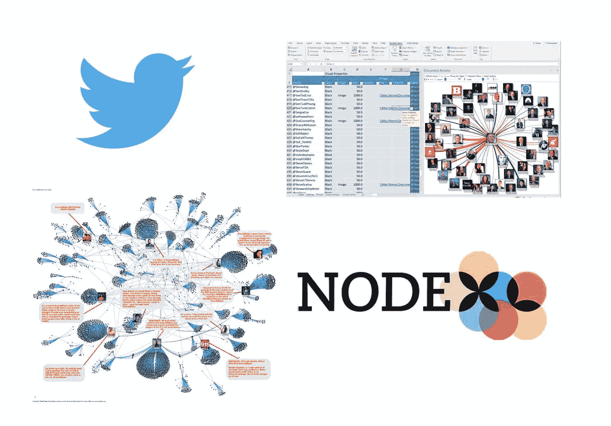
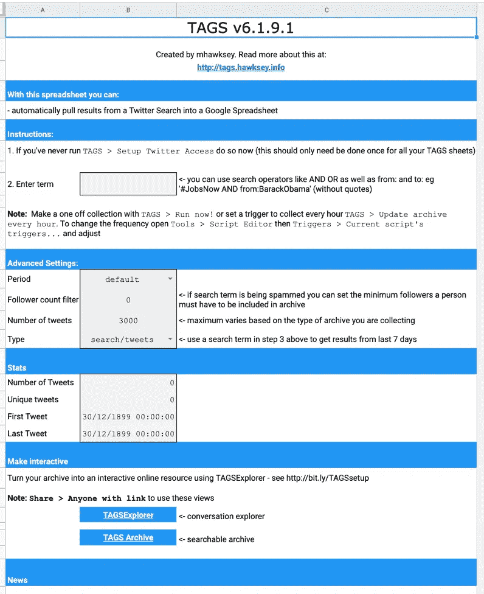
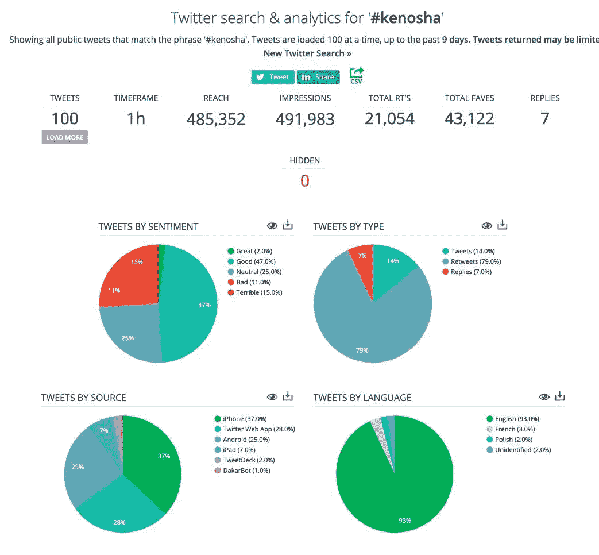
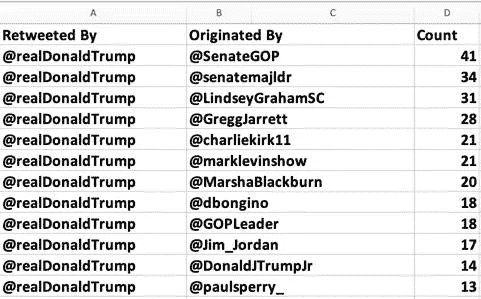
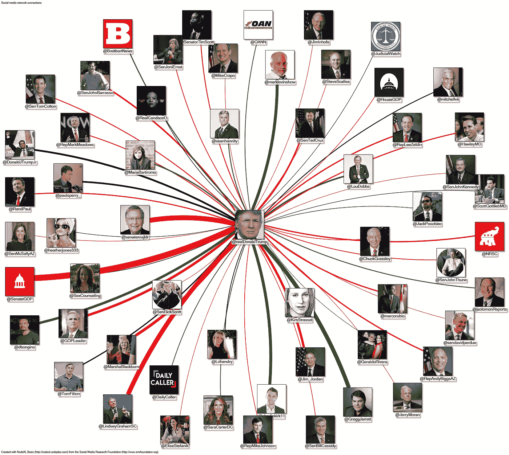
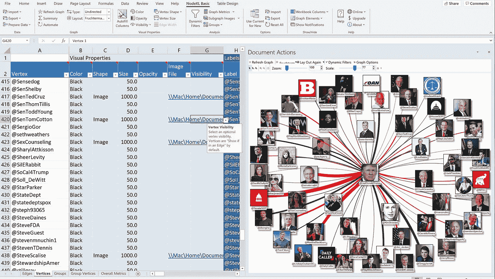
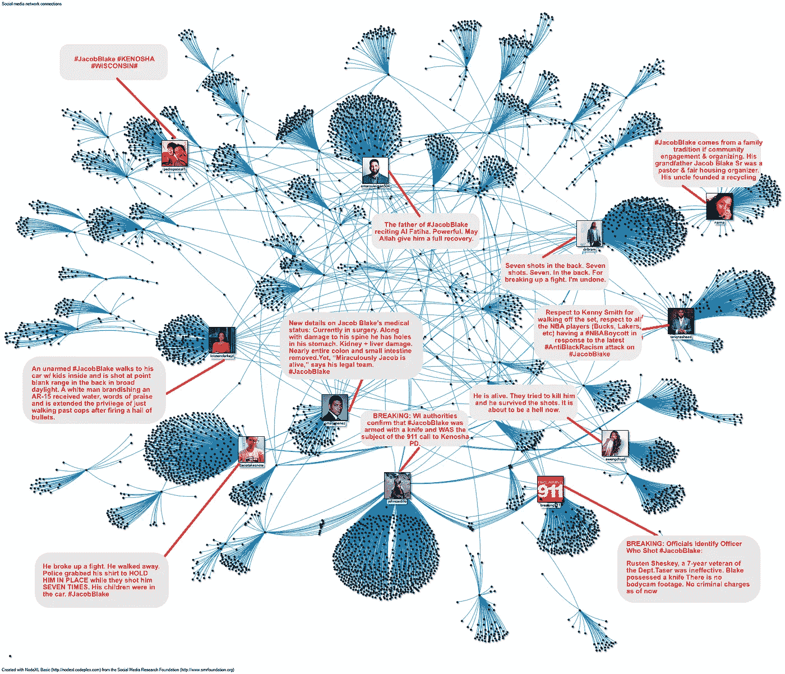

# Twitter 上的链接分析

> 原文：<https://towardsdatascience.com/link-analysis-on-twitter-260fc2f5e009?source=collection_archive---------45----------------------->

## **在混乱中寻找秩序**

(来源:推特和 NodeXL。作者的合成图像)

如果你是一个经常使用 Twitter 的用户，你会习惯于政治咆哮、糟糕的笑话、动物视频和阴谋论的混乱混乱，这已经成为我们日常生活的一部分。

但是当你深入挖掘时，会发现一组结构良好的数据，可以挖掘出对塑造 Twitterverse 的关系的有意义的见解。据估计，每天有 5 亿条推文在 Twitter 上发送。这相当于每秒 5787 次。但是如果你把注意力集中在大量数据中有意义的子集上，你就能理解它。

在这篇文章中，我将介绍一些可用于获取、分析和可视化数据的工具和技术，以区分 Twitter 影响者和那些只是在空白空间大喊大叫的人。我还将介绍 [NodeXL](https://www.smrfoundation.org/nodexl/) ，这是一个网络可视化工具，可以让您更轻松地分析数据。

我将使用图形数据库技术，它将您的数据构建为节点和节点间连接的网络，而不是传统的行和列。我在之前的两篇文章中写过关于图形数据库技术的使用:'[我如何学会不再担心并爱上图形数据库](/how-i-learned-to-stop-worrying-and-love-the-graph-database-ef8af4ac7a8)和'[布加洛黑社会](https://medium.com/@robinsray/the-boogaloo-underworld-dd0a325f8307)'。

**获取数据**

与脸书和其他社交媒体平台相比，Twitter 对开发者和数据分析师要友好得多。 [Twitter API](https://developer.twitter.com/en/docs/twitter-api) 为开发人员提供了进行我将要演示的网络图分析所需的所有数据。在大多数情况下，无论你使用的是 API 还是我下面概述的工具，Twitter 都会将你对历史数据的访问限制在不超过 7 天之前。

但是如果你想要比 Twitter API 更快更简单的东西，只需看看[标签](https://tags.hawksey.info/)(即“Twitter 存档谷歌表”)。TAGS 是由 Martin Hawksey (@mhawksey)开发的一个“爱好”项目，是一个免费的谷歌表单模板，允许您通过用户名、标签和其他参数检索推文。

标签用户界面。(来源:TAGS)

如果您想要实时收集数据，您可以在 TAGS 中设置您的作业，并让它运行几天。您的数据将被存储在 Google sheet 中，并可以下载到. csv 或 Excel 文件中以供进一步分析。关于设置和使用标签的完整说明可在[标签网站](https://tags.hawksey.info/get-tags/)上找到。

另一个获取数据的简单方法是 Socialbearing.com 的[，它允许你通过用户名、标签和其他参数进行搜索。结果在仪表板中返回(见下文)。您可以下载. csv 格式的底层数据进行分析。虽然从 Socialbearing 获得基本数据是免费的，但更专业的报告，如超过通常 7 天 Twitter 限制的报告，是可以付费的。](https://socialbearing.com/)

Socialbearing.com 仪表板。(来源:Socialbearing.com)

对于下面的分析，只关注转发是很重要的。这是因为大多数专家认为，某人被转发的频率是衡量他们影响力的最佳指标。底线是你可以整天发微博。但其他人的转发是衡量其他人是否真的在关注的最佳标准。

**数据准备**

无论您使用什么方法来检索数据，您都会惊讶于它的结构有多好。但是在准备分析之前还有一点工作要做。首先，您需要从推文文本中提取关于谁被转发的信息。转发的文本以“RT @ <username>”开头，后面是原始推文的文本。</username>

如何提取将取决于您准备数据所使用的工具。在我的例子中，我首先将数据导入 Tableau，并使用下面的正则表达式从每条 tweet 的文本中提取转发信息:

LOWER(REGEXP_EXTRACT([text]，' \ @([a-zA-Z0–9 _]+)'))

如果您使用其他东西，正则表达式的逻辑如下:

它在名为“text”的列中搜索“@”符号，后跟任何大小写字母和数字以及“_”的字符串。“LOWER()”函数将提取的内容转换成小写，以避免相同的用户名根据大小写被计算两次。提取的任何内容都需要放入新的列中。

由于分析集中在转发上，您还需要一个显示推文类型的列。

如果你用 Socialbearing.com 下载你的数据，你会发现，对于每条推文，它已经有一个标签为“推文类型”的栏，你可以用它来过滤掉除了转发以外的任何内容。

如果你使用标签，你必须采取额外的步骤从推文文本中提取转发数据。使用 Tableau，我能够通过以下语句从 tweet 的文本中获得我需要的内容:

如果包含([Text]，" RT @ ")那么" retweet"
ELSEIF 包含([Text]，" @ ")那么" @ reference "
ELSE "原始推文"结束

这其中的逻辑很容易理解。如果这条推文的文本包含“RT @ ”,那它就是一条转发。如果它包含“@”而没有“RT”，则意味着提到了一个用户。这是另一个潜在的影响力衡量标准，但我不会在下面的分析中使用它。如果这两个条件都不适用，它就会被贴上“原创推特”的标签。

最后，您需要重组数据，以便在 NodeXL 这样的网络分析工具中使用。有两种主要的数据类型:

**节点**(node XL 中也称为“顶点”):网络中的数据点。例如，在下面的分析中，每个 Twitter 用户都是一个节点。

**边**:节点之间的关系。如果一个 Twitter 用户转发了另一个用户，那么图上他们之间的线就是一条边。

这里的一项分析研究了特朗普总统最有可能转发谁，下图显示了这种结构。它由一个“转发者”列和一个“发起者”列组成，前者针对发送转发的用户，后者针对推文的发起者。我还添加了一个“计数”列，显示每个发起人转发特朗普的次数。

在 NodeXL 中，每个 Twitter 用户或节点被称为“顶点”。而当与另一个用户配对在一起时，如下图所示，两者就成了一个“边”。包括计数是为了允许 NodeXL 在网络上运行一些基本的计算，并添加可视化增强。

为导入 NodeXL 而构造的数据。(来源:图片由作者提供)

**介绍 NodeXL**

NodeXL 是[社交媒体研究基金会](https://www.smrfoundation.org/)的一个项目。严格来说，它不是一个应用程序，而是一个下载并添加到 Microsoft Excel 中的模板。完成后，您就有了一套新的 Excel 工具来进行网络分析和可视化。

这是有代价的，尤其是对 Mac 用户和开源爱好者来说。NodeXL 只适用于 Microsoft Excel。而且还得有 Windows 版的 Excel。它不能在 Mac OS 版本上运行。

如果你不是 Windows 用户，NodeXL 建议运行基于云的 Windows 虚拟机，比如那些通过[亚马逊弹性计算云](https://www.smrfoundation.org/2018/01/02/using-nodexl-in-the-cloud/)提供的虚拟机。我在 Mac 上选择了本地 Windows 虚拟机，使用的是 Parallels 虚拟机。在我的测试中，NodeXL 在本地虚拟机上运行得很好，尽管有点慢。

NodeXL 可以处理的网络大小取决于系统 RAM。该产品的文档提供了以下估计:

*   4 GB 内存:只有不到几千条边的小型网络
*   8 GB 内存:小于 10–15 千条边的中型网络
*   16GB 内存:少于 8-10 万条边的大型网络
*   32 GB 内存:小于 20 万条边的超大型网络

下面两个例子中的一切都可以在 NodeXL 的基础版本上完成，这是免费的。高级功能，包括内容分析和高级网络度量，需要 NodeXL 的 Pro 版本，每年的费用从 39 美元到 799 美元不等，取决于你是学生，学术/非营利或商业用户。

要使用 NodeXL 的基础版本，你只需要在 SMRF 网站上注册，下载并安装它，就像任何其他 Windows 应用程序一样。它将在 Windows 开始菜单上显示为“NodeXL Excel 模板”。点击它，它将启动安装了 NodeXL 模板的 Excel。您将在 Excel 菜单功能区上看到一个“NodeXL Basic”项目，它展示了 NodeXL 的所有特性。

对 NodeXL 特性的全面解释超出了本文的范围。但是在 SMRF 网站上可以找到概述和文档。

**川普转发宇宙**

特朗普转发的 NodeXL 图。(来源:图片由作者提供)

上面的网络图是根据唐纳德·特朗普从 2020 年 1 月到 2020 年 4 月底的推文数据集创建的，共 3623 条推文，其中 1806 条是转发。

当放入网络分析所需的节点和边结构中时，总共有 497 条边，这显然是一个非常繁忙的图。一些过滤是适当的。我首先将数据限制在那些被特朗普转发五次或更多次的用户。然后，我删除了白宫工作人员和政治任命。最后，我删除了特朗普自己转发的那些内容，他已经这样做了 144 次。

我认为这给了我一个很好的画面，在他自己的小圈子之外，他倾向于发布得到特朗普认可的推文。

为了制作上图，我首先将节点和边数据导入 NodeXL 模板。下一步是为 NodeXL 图选择布局样式。我使用了 Fruchteman-Reingold 布局算法，这种算法可以避免边缘交叉带来的视觉混乱。Fruchteman-Reingold，加上特朗普与其他所有用户都有优势的数据集，产生了上面的圆形布局。

Fruchteman-Reingold 是一种被称为“[力导向](https://en.wikipedia.org/wiki/Force-directed_graph_drawing)的算法我不会在这里深入讨论它(部分原因是我对它的理解相当初级)，但是我发现在 NodeXL 中所有可用的算法中，它似乎最有可能产生一个整洁的、视觉上令人愉快的图形。

为了让图表更有趣，我使用 Twitter API 下载每个用户的个人资料图片，然后通过引用 NodeXL 模板中的文件名将图片放在图表上。我设置了每条边缘线的粗细，以对应每个用户发送的转发数量。

我根据用户类型设置了线条的颜色:红色代表共和党人，绿色代表媒体和名人，黑色代表其他人。这涉及到一些手工工作。对于特朗普的每一个转发收藏夹，我都检查了 Twitter 的个人资料，并在 NodeXL 模板中输入了适当的颜色。毫不奇怪，最有可能获得特朗普 8600 万粉丝转发的是众议院和参议院的共和党人。

NodeXL 用户界面。(来源:图片由作者提供)

**#雅各布·布莱克**

NodeXL #JacobBlake 转发图。(来源:图片由作者提供)

8 月 23 日下午，威斯康星州基诺沙市一名警察向 29 岁的黑人男子雅各布·布莱克(Jacob Blake)背部开了 7 枪。枪击事件如何发生的问题引发了两项调查:一项由地方、州和联邦当局进行；另一个在 Twitter 上，事情进展得更快。

上图显示了谁在 Twitter 上最成功地影响了公众对布莱克枪击案的看法。它基于枪击事件发生后三天内使用#JacobBlake 标签的转发，这一期间还包括一名亲警察抗议者用突击步枪杀害两名示威者。

这个图表有它的局限性。它只涵盖三天。特朗普图关注的是一个人和那些寻求他青睐的人，而像基诺沙这样的活动是动态的，不断有新用户加入，新标签不断出现。

该图的开发方式与 Trump graph 非常相似:将 Twitter 数据重组为一组节点和边，将其导入 NodeXL，并使用 Fruchteman-Reingold 算法绘制。但是这和有一个像 Trump 图这样的中心节点的区别是显而易见的。

有 1，156 名用户发送了#JacobBlake 推文，这些推文被转发。因此，再次需要一些过滤来创建一个可读的图表。在这种情况下，我使用 NodeXL 来计算一个称为“度中心性”的图度量，它基于到给定节点的连接数。我保留了图上的所有节点，但是只给那些中心度大于等于 100 的节点添加了标签和 tweet 内容。

NodeXL 的付费版本包括进行更复杂计算的能力，包括“特征向量中心性”,它根据节点与其他节点的连接程度来确定节点的得分。谷歌的“页面排名”算法，根据链接到一个给定网站的页面的良好连接程度对搜索结果进行排名，是同一想法的变体。

**结论**

总的来说，NodeXL 比我在以前的文章中提到的一些工具更容易使用，比如 [Gephi](https://gephi.org/) 和 [Neo4J](https://neo4j.com/) 。NodeXL 没有那么强大，功能也不全。但是对于需要快速网络分析的有限数据集，我发现它是一个非常有用和通用的工具。它没有 Gephi 的怪癖，也不需要你像 NodeXL 一样建立一个成熟的图形数据库。如果你愿意走 Windows/Excel 路线，我强烈推荐。

最后，您可能会发现一些有用的资源:

如果你想深入了解 NodeXL，我找到的最佳资源是《T4》一书,“用 NodeXL 分析社交媒体网络”。Derek L. Hanson、Ben Shneiderman、Marc A. Smith 和 Itai Himelboim 撰写的《互联世界的洞见》。

关于分析社交网络的概述，你应该看看昆士兰(澳大利亚)科技大学提供的在线课程“[社交媒体分析:使用数据理解公共对话](https://www.futurelearn.com/courses/social-media-analytics)”。

为了获得一些可以用 NodeXL 完成的工作的惊人例子，请看一下 NodeXL [图库](http://nodexlgraphgallery.org/Pages/Default.aspx)。