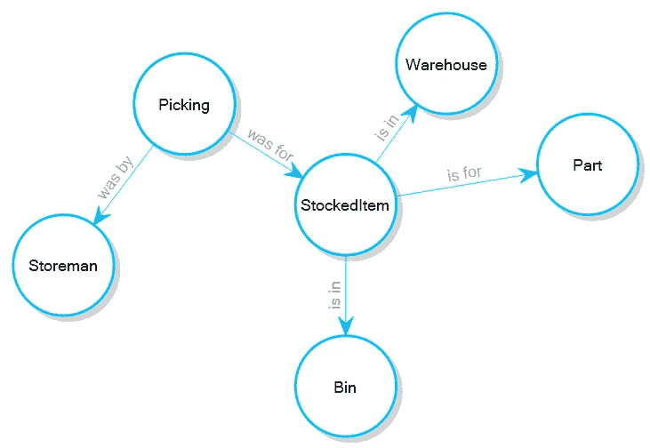
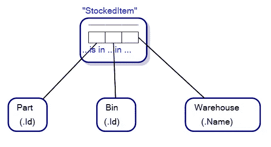
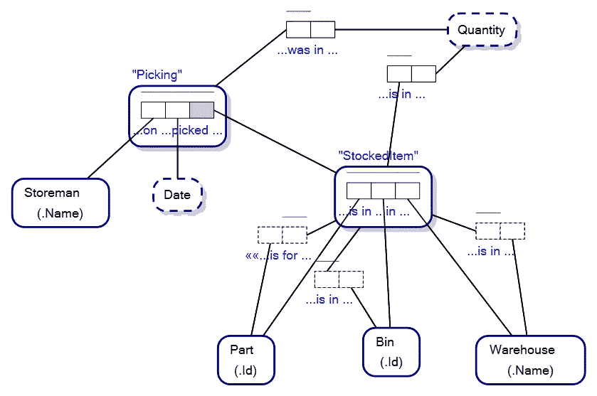
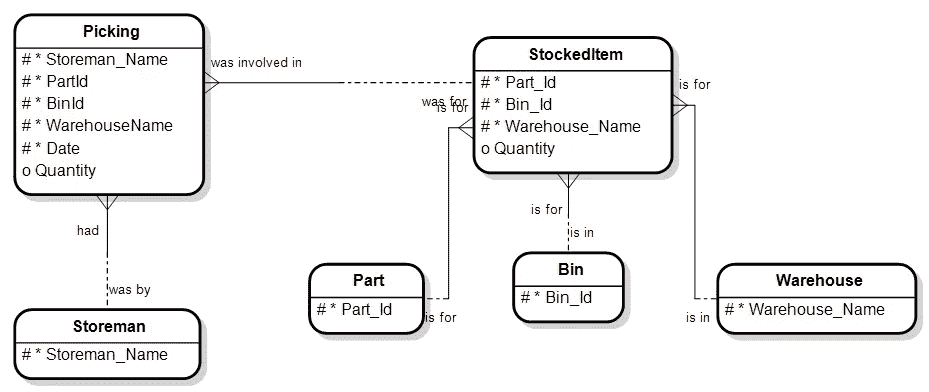

# 对象-角色建模中的链接事实类型

> 原文：<https://towardsdatascience.com/link-fact-types-in-object-role-modeling-3c68c15eec92?source=collection_archive---------53----------------------->

## [对象-角色建模概念建模语言](/why-learn-object-role-modelling-4eebd93dcda2#:~:text=The%20reasons%20for%20that%20are,to%20go%20the%20other%20way.)鲜为人知和理解的特性之一是链接事实类型。

为了理解链接事实类型，让我们看一个在哪里以及如何使用它们的例子。

想象一下下面的属性图模式，您正在为一个[图数据库](https://en.wikipedia.org/wiki/Graph_database)创建一个概念模型，该数据库存储库存软件解决方案的仓库中存储的零件信息:

库存图数据库的属性图模式

每个 StockedItem 代表一个零件，存放在仓库的一个箱中。注意被命名的边，*代表*，*在*中，*在*中。属性图模式的一个显著特征是命名边。因此，我们可以说“is for”边，StockedItem 和它表示为*的部分之间的关系是 StockedItem 用于部分*。

如果我们想象一个真实世界的场景，一个仓库保管员在仓库的箱子里拿一个零件，我们就会明白我们在说什么。

一名仓库保管员在仓库的箱子里寻找零件。*图片经由*[*Dreamstime.com*](https://www.dreamstime.com/side-view-portrait-young-shop-assistant-inspecting-stock-doing-inventory-industrial-tools-store-man-doing-stock-image102810076)*授权给维克多·摩根特*。ID 102810076 七十四张图片| Dreamstime.com

现在检查下面的对象-角色模型，它也代表仓库中箱柜中零件的概念模型:

对象-角色模型

请注意，从表面上看，每个 StockedItem 与事实类型读数没有关系，即， *StockedItem 用于零件* , *StockedItem 在仓位*中，*库存商品在仓库*中。我们说，*“从表面上看”*，因为在 ORM 模型的这个视图中，我们没有显示每个对象化事实类型所隐含的链接事实类型，其中 StockedItem 是一个对象化事实类型。

*Part is in Bin in Warehouse* 是 ORM 中的一个事实类型，当被对象化时，我们可以把事实类型/关系看作是我们属性图模式中的一个表面节点。

现在让我们看看在我们的对象-角色模型中 StockedItem 的隐含链接事实类型。链接事实类型是带有虚线轮廓的事实类型:

具有链接事实类型的对象-角色模型

现在，我们有了事实类型读数，即，*库存商品用于零件* , *库存商品在仓库*中，*库存商品在仓库*中。

链接事实类型就是这么简单。对于每个对象化事实类型，都有一组隐含的事实类型，它们连接到在对象化事实类型中扮演角色的相应模型元素。

当然，对象-角色建模的美妙之处在于，一旦创建了 ORM 图，就可以将其转换为属性图模式*或*和[实体关系图](https://en.wikipedia.org/wiki/Entity%E2%80%93relationship_model)，如下所示:

实体关系图

请注意谓词部分“is for”、“is in”和“is in”，因为它们各自的关系也延续到我们的实体关系图中。

作为对象-角色建模的一个额外收获，您还可以捕获谓词“零件在仓库的箱子里”，进一步增加您正在创建的概念模型的语义。

感谢您的阅读。我希望这有助于理解链接事实类型以及它们在对象-角色建模中扮演的角色。

图片来源:ID 102810076 74 images | Dreamstime.com

=======================================