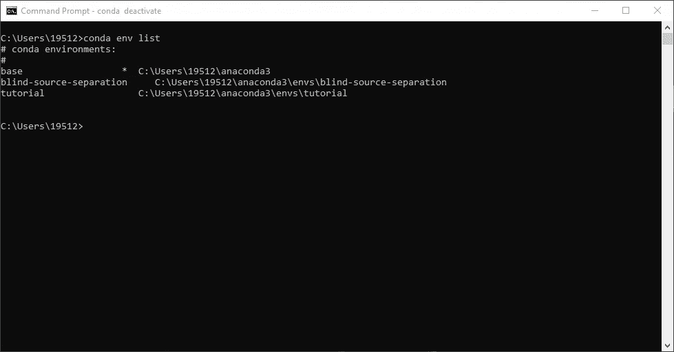

# 使用内核将您的虚拟环境链接到 Jupyter

> 原文：<https://towardsdatascience.com/link-your-virtual-environment-to-jupyter-with-kernels-a69bc61728df?source=collection_archive---------2----------------------->


照片由[田口孝宏](https://unsplash.com/@tak_tag?utm_source=medium&utm_medium=referral)在 [Unsplash](https://unsplash.com?utm_source=medium&utm_medium=referral) 上拍摄

## 立即开始原型制作。

# **简介:**

当我第一次开始使用 Python 时，虚拟环境的概念对我来说非常难以理解。我经常花几个小时的时间来寻找和尝试创造一个，结果却比开始时更加困惑。

这篇文章旨在成为理解虚拟环境到底做什么，如何创建它们，以及将它们链接到你的 Jupyter 笔记本的一站式商店。

## 目录:

*   什么是虚拟环境？
*   使用 Anaconda 创建一个环境
*   将软件包安装到环境中
*   使用 Jupyter 中的虚拟环境作为内核
*   删除环境和内核

# 什么是虚拟环境？

我们先从鲍勃的故事说起。

Bob 在一家大型金融公司担任数据科学家。Bob 和他的团队都使用 Python，并定期在某些项目上相互协作。然而，由于这家金融公司规模很大，他们都有大量的个人项目。因此，需要一种通用的方法来将这些项目相互分离，以确保它们可以在任何安装了 Python 的计算机上运行。这就是虚拟环境发挥作用的地方。

你可以把一个虚拟环境想象成你电脑中 Python 的 ***特定副本，你可以指定自己*。这个副本可以是安装了任何*包的任何版本的 Python。使用虚拟环境可以确保项目之间存在一定的障碍。这些障碍确保任何人都可以运行您的 Python 版本，不管他们的计算机上有什么。***

# *使用 Anaconda 创建一个环境*

*我将在本教程中使用 Anaconda，因为它使得创建和维护虚拟环境变得极其容易。如果你没有下载，你可以在 Anaconda 的网站上设置[个人版。完全下载可能需要一些时间。](https://www.anaconda.com/products/individual)*

*如果您允许 Anaconda 设置一个路径变量，那么您可以在您的命令提示符下执行我的操作。如果没有，您仍然可以在下载文件附带的 Anaconda 提示符下遵循这些步骤。*

*让我们首先从创建一个新环境开始。我将把它命名为`tutorial`，但是你可以随便叫它:*

```
*$ conda create -n tutorial python=3.7*
```

*注意事项:*

*   *`-n`表示虚拟环境的名称*
*   *`python=3.7`是可选的，可以改成任何版本。我更喜欢在创建环境时设置一个特定的版本，因为它会给你一个“基本的”Python 环境。*
*   *您将被要求继续安装一组软件包。键入`y`并按回车键。*

**

*作者图片*

# *将软件包安装到环境中*

*现在我们的环境已经创建好了，Anaconda 给了我们一个提示。*

```
*#
# To activate this environment, use
#
#     $ conda activate tutorial
#
# To deactivate an active environment, use
#
#     $ conda deactivate*
```

*所以我们会这样做。激活我们的环境:*

```
*$ conda activate tutorial*
```

*这是我们应该期待看到的:*

**

*作者图片*

*请注意，当我们激活虚拟环境时，括号中的虚拟环境名称是如何出现的。这就是我们如何知道我们在环境中。*

*要安装软件包，我们可以像安装其他软件包一样使用`pip`。由于本文的目的是让我们也能使用 Jupyter 中的虚拟环境，我们将安装`ipykernel`来为我们完成这项工作。但是，您可以在这个阶段为您的项目安装任何需要的包。*

```
*$ pip install ipykernel*
```

*让提示符运行并安装`ipykernel`。我们现在可以为 Jupyter 创建 Python 内核。*

# *使用 Jupyter 中的虚拟环境作为内核*

*使用 Jupyter 笔记本时，您可以使用纯文本或代码。我们使用的代码块是内核。我们可以用`ipykernel`创建新的内核。*

*当我们创建内核时，我们可以将它链接到我们的虚拟环境。当您正在创建一个新项目并且不确定您需要的必要包时，这将变得非常有用。无论您删除三分之二的已安装软件包还是再安装一个，内核将始终镜像我们创建的虚拟环境。*

*为此:*

```
*$ python -m ipykernel install --user --name=tutorial*
```

**

*作者图片*

*现在要验证内核是否在我们的 Jupyter 笔记本中:*

**

*作者图片*

*如你所见，`tutorial`现在是我们的一个内核了。我们现在可以利用这种环境创建新的笔记本电脑，或者利用现有的采用这种新内核的笔记本电脑。*

# *删除环境和内核*

*出于管理目的，我还将向您展示如何逆转我们在本文中已经完成的内容。首先，停用您的虚拟环境。*

```
*$ conda deactivate*
```

*你应该看到`(tutorial)`走开。*

## *移除内核:*

*首先，查看计算机上的内核列表。如果您在阅读本文之前从未这样做过，那么您应该会看到两个内核的列表:Python 3 和我们刚刚创建的内核。*

```
*$ jupyter kernelspec list*
```

**

*作者图片*

*现在我们知道我们有什么，我们知道要删除什么。要删除内核，请使用下面的命令。您将被要求再次与`y`确认。*

```
*$ jupyter kernelspec remove tutorial*
```

*一旦完成，用`jupyter kernelspec list`再次确认它已被移除。*

**

*作者图片*

## *删除环境:*

*删除虚拟环境基本上遵循与删除内核相同的过程。首先，查看我们拥有的环境列表:*

```
*$ conda env list*
```

**

*作者图片*

*如果您的列表中没有`blind-source-separation`，请不要担心。这是我亲自参与的项目之一。你应该期待看到`base`和`tutorial`。要移除`tutorial`:*

```
*$ conda env remove -n tutorial*
```

*删除后，查看环境列表进行验证。*

**

*作者图片*

# *结论:*

*我希望这篇教程能帮助你理解如何创建虚拟环境，并把它们链接到你的 Jupyter 笔记本上。请随意保存这篇文章，以节省您一次又一次搜索这些程序的时间。*

> *感谢您的阅读。*