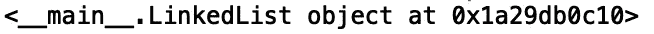
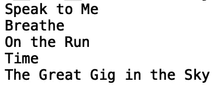

# Python 中的链表

> 原文：<https://towardsdatascience.com/linked-lists-in-python-91906f22a282?source=collection_archive---------12----------------------->

## Python 中的链表数据结构


[来源](https://www.pexels.com/photo/cyclone-fence-in-shallow-photography-951408/)

数据结构提供了组织数据的方法，这样我们就可以有效地对数据进行操作。一个重要的数据结构是链表。链表是节点的线性集合，其中每个节点包含一个数据值和对列表中下一个节点的引用。在这篇文章中，我们将讨论如何在 python 中实现链表。

我们开始吧！

我们首先创建两个类，一个“Node”类和一个“LinkedList”类。对于节点类，我们有:

```
class Node: 
    def __init__(self, data): 
        self.data = data 
        self.next = None
```

这里我们分配数据值，并将下一个节点初始化为 null。对于“LinkedList”类，我们将头节点初始化为 null:

```
class LinkedList: 
    def __init__(self):  
        self.head = None
```

链表类将包含节点类类型的引用，用于初始化链表对象。我们现在可以编写一个链表的实例并打印结果:

```
if __name__=='__main__':
    linkedlist = LinkedList()
    print(linked list)
```



我们看到在指定的地址有一个链表对象。接下来我们可以定义几个节点。让我们来举一个现实生活中的例子。音乐播放器通常具有包含链接到上一首和下一首歌曲的歌曲的双向链表。为了简单起见，让我们考虑歌曲的单向链表，其中每首歌曲将只链接到下一首歌曲。

让我们创建一个由平克·弗洛伊德创作的专辑*前半部分的歌曲的链接列表。首先，我们定义每个节点的值:*

```
if __name__=='__main__':
    linkedlist = LinkedList()
    linkedlist.head = Node('Speak to Me') 
    second = Node('Breathe') 
    third = Node('On the Run') 
    fourth = Node('Time') 
    fifth  = Node('The Great Gig in the Sky')
```

现在我们需要连接所有的节点。首先，我们定义头节点的“下一个”值:

```
linkedlist.head.next **=** second
```

然后是“第二个”节点的“下一个”值:

```
second.next **=** third
```

以此类推:

```
third.next **=** fourth
fourth.next **=** fifth
```

现在我们的链表已经定义好了，我们可以遍历链表了。让我们在“LinkedList”类中定义一个允许我们这样做的方法:

```
def printLinkedList(self): 
        value = self.head 
        while (value): 
            print(value.data) 
            value = value.next
```

我们现在可以遍历列表:

```
if __name__=='__main__':
    #initialize linked list object
    linkedlist = LinkedList()
    print(linkedlist)

    #assign values to nodes 
    linkedlist.head = Node('Speak to Me') 
    second = Node('Breathe') 
    third = Node('On the Run') 
    fourth = Node('Time') 
    fifth  = Node('The Great Gig in the Sky') 

    #link nodes
    linkedlist.head.next = second
    second.next = third
    third.next = fourth
    fourth.next = fifth

    linkedlist.printLinkedList()
```



总之，在这篇文章中，我们讨论了如何在 python 中实现一个单链表。我们为音乐播放器开发了一个单链表，其中每首歌曲都链接到列表中的下一首歌曲。实际上，音乐播放器中的歌曲链接到上一首和下一首歌曲(双向链表实现)。我鼓励你修改这篇文章中的代码，为我们使用的歌曲实现一个双向链表。这篇文章中的代码可以在 [GitHub](https://github.com/spierre91/medium_data_structures_and_algorithms/blob/master/python_linked_list.py) 上找到。感谢您的阅读！