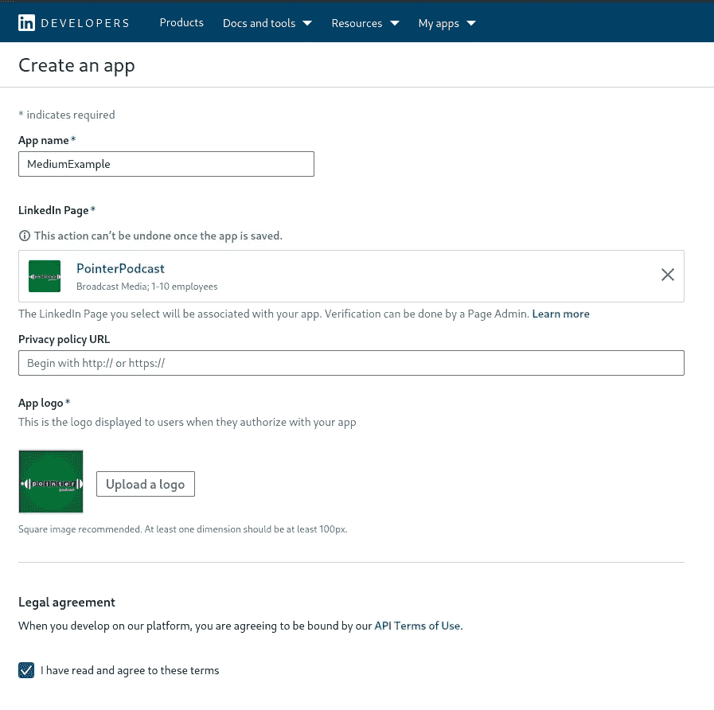
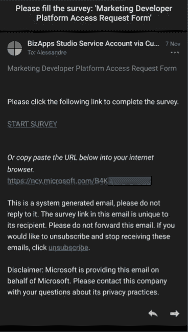
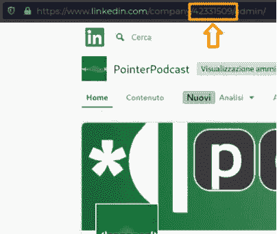

# LinkedIn API + Python =编程发布

> 原文：<https://towardsdatascience.com/linkedin-api-python-programmatically-publishing-d88a03f08ff1?source=collection_archive---------5----------------------->

## 如何通过 LinkedIn API 和 Python 发布帖子


费伦茨·霍瓦特在 [Unsplash](https://unsplash.com?utm_source=medium&utm_medium=referral) 上的照片

# **pointerpodcast . it 问题**

我和我的另外两个朋友有一个播客，每次我们发布新的一集，我们都需要在社交网站上传播它(也就是垃圾邮件)。

在不同的社交网站上复制粘贴同一篇文章的重复动作让我们很烦恼。因此，我们决定开发我们的网络应用程序，让我们可以一次在多个平台上发布一篇帖子！


作者截图

我们成功整合了脸书、Instagram、Twitter 和我们的电报频道。

> 我们非常开心。

gif via GIPHY[[https://media.giphy.com/media/wrzf9P70YWLJK/giphy.gif]](https://media.giphy.com/media/wrzf9P70YWLJK/giphy.gif)

> 然后，LinkedIn 来了。

gif via GIPHY[[https://media.giphy.com/media/2m0n9crL33MDLASKnj/giphy.gif]](https://media.giphy.com/media/2m0n9crL33MDLASKnj/giphy.gif)

# 任务

当您编程时，您希望以最快的方式开发您的应用程序。一旦成功了，你就可以开始修改代码了。

然而，这种匆忙必然导致文档中隐藏的一些重要细节*的丢失。你猜怎么着？你的代码不会工作，你会发疯的。*

几天后，你会发现它不起作用的“原因”。您的反应类型可以分为两类:

*   你觉得自己很蠢。“这很明显！我怎么会没注意到呢？”
*   你对 LinkedIn 很生气，因为不提供“现成的”文档是不允许的！

> 你属于哪一种？

gif via GIPHY[[https://media.giphy.com/media/lI0Qg3f4o1IS4/giphy.gif]](https://media.giphy.com/media/lI0Qg3f4o1IS4/giphy.gif)

因此，我的任务是提出一个超级实用的分步指南来通过 Python 与 LinkedIn API 交互。就是这样。

我在这里！—Gif via GIPHY[[https://media.giphy.com/media/z0mMFvI7U27V6/giphy.gif]](https://media.giphy.com/media/z0mMFvI7U27V6/giphy.gif)

# **掌握 LinkedIn API 的超级实用指南**

1.  在 [LinkedIn 开发者平台](https://www.linkedin.com/developers/)上创建你的 LinkedIn 应用。
2.  获取您需要整合到 Python 应用程序中的访问令牌。
3.  开发剧本，让它发挥作用！

> 你准备好了吗？

gif via GIPHY[【https://media.giphy.com/media/CjmvTCZf2U3p09Cn0h/giphy.gif】T2]

# **1。创建你的 LinkedIn 应用程序**

去 *LinkedIn 开发者*平台。

 [## 开发者| Linkedin

### 编辑描述

www.linkedin.com](https://www.linkedin.com/developers/) 

> **然后点击*创建 app***


作者截图

> **提供要求的数据**



作者截图

> **点击“验证”来验证您的 LinkedIn 页面**


作者截图

> **点击“生成 URL ”,按照 LinkedIn 要求的几个步骤进行操作**


作者截图

> **完成后，如果一切正常，你会在你的应用主页上看到“已验证”**


作者截图

> **转到“产品”并启用“LinkedIn 上的共享”和“营销开发人员平台”产品**

*   “LinkedIn 上的共享”授权您通过 LinkedIn API 管理您的个人资料(在我的情况下，即 [**Alessandro Berti 账户**](https://www.linkedin.com/in/aleberti/) )
*   “营销开发者平台”授权您通过 LinkedIn API 管理您的页面(即，在我的情况下，[**PointerPodcast page**](https://www.linkedin.com/company/pointerpodcast))


作者截图

> ⚠️:点击“*市场开发人员平台*，您将在您的主邮箱中收到以下申请表。⚠️



作者截图

> ⚠️:你需要填写它，否则，LinkedIn 不会授权你管理你的页面！⚠️

## 现在，LinkedIn 将审核你的请求。

耐心点，等答案。LinkedIn 会通过邮件联系你。

> *我的请求已在 2 天内获得批准*

gif via GIPHY[[https://media.giphy.com/media/xA1PKCt00IDew/giphy.gif]](https://media.giphy.com/media/xA1PKCt00IDew/giphy.gif)

> 您已成功创建并验证了您的应用程序！
> 
> 很简单，不是吗？

gif via GIPHY[[http://gph.is/2giD4LN]](http://gph.is/2giD4LN)

在我们等待回应之前，让我们继续做其他的事情吧！

# 2.获取访问令牌

> **现在点击“认证”。在这里你可以找到你的客户 ID 和客户密码。**
> 
> 目前，只要记住他们在哪里。


作者截图

> **设置您的“应用程序的授权重定向 URL”。**

注意下面的语法！`/auth/linkedin/callback`是强制的！

```
https://example.com**/auth/linkedin/callback**
```


作者截图

> ***是时候用一些代码弄脏自己的手了！***

gif via GIPHY[[https://media.giphy.com/media/l2SqhXKKs7HJHFkDS/giphy.gif]](https://media.giphy.com/media/l2SqhXKKs7HJHFkDS/giphy.gif)

要获得您的 ***访问令牌*** ，您需要两个 REST 调用:

1.  一个 **GET** 会把你重定向到一个新的网址。从这个 URL，您需要推断参数`code`中的值。
2.  一个**帖子**将返回您全新的访问令牌。

让我们一步一步来！

# 1.得到

看看下面的网址就知道了。**等待*复制&粘贴*之前！**

```
**https://www.linkedin.com/oauth/v2/authorization?** 
**response_type**=code&  
**client_id**=YOUR_CLIENT_ID&  
**redirect_uri**=https://example.com/auth/linkedin/callback&  **state**=RandomString&
**scope**=w_member_social,r_liteprofile
```

⚠️→我说“等等”！←⚠️gif via giphy[[https://media.giphy.com/media/xT1XGOSpbtYvl9HlGE/giphy.gif]](https://media.giphy.com/media/xT1XGOSpbtYvl9HlGE/giphy.gif)

***参数***

`response_type=code` *。*已经好了，复制就好。

`cliend_id=*YOUR_CLIENT_ID*` *。*插入您在 LinkedIn 应用程序的 **Auth** 部分指定的客户 ID。

`*redirect_uri=https://example.com/auth/linkedin/callback*`T40。插入您在 LinkedIn 应用程序的**授权**部分指定的授权重定向 URL。

`state=RandomString` *。*随机选择您偏好的“RandomString”(即 *ILovePointerPodcast* )。

`scope=w_member_social,r_liteprofile` *。*范围很重要！它指定了您需要的权限。

> ***让我们简单点:***
> 
> 如果你计划在“阅读模式”下只与你自己的个人资料互动，那么`r_liteprofile`权限就足够了。
> 
> 如果您计划利用 LinkedIn API 在您自己的个人资料中发布帖子，您需要“写权限”(即`w_member_social)`)。

不过你可以像例子中的`scope=w_member_social,r_liteprofile` *一样，合成*权限*。*

> 如果你打算使用 LinkedIn API 与你的页面进行交互，请继续阅读，直到⚠️⚠️ **阿奇通** ⚠️⚠️段落。

权限会根据您的需要而变化。如果您想进一步调查:

[](https://docs.microsoft.com/en-us/linkedin/shared/authentication/permissions?context=linkedin/context) [## 权限- LinkedIn

### 权限是对访问 LinkedIn 资源的授权同意。LinkedIn 平台使用权限来保护…

docs.microsoft.com](https://docs.microsoft.com/en-us/linkedin/shared/authentication/permissions?context=linkedin/context) 

**现在，你可以复制&粘贴下面的 GET url。**

> 谢谢你的耐心。

```
https://www.linkedin.com/oauth/v2/authorization?response_type=code&client_id=YOUR_CLIENT_ID&redirect_uri=https://example.com/auth/linkedin/callback&state=RandomString&scope=w_member_social,r_liteprofile
```

把上面的链接( ***)贴上你正确的数据*** )在你的浏览器里就行了。

> 如果你在正确的道路上，你会被重定向到这里:


作者截图

一旦点击中的*标志，您将再次被重定向到一个*空页面*！*

⚠️ **→现在，看看这个空页面的新网址！←** ⚠️

将其复制到便笺中。是这样吗？

```
[https://example.com/auth/linkedin/callback?**code=YOUR_CODE**&state=RandomString](https://62.171.188.29/auth/linkedin/callback?code=AQSGDHgqjQzx1igbzzI1DozOQjG6ulM3ykDQpte7UjI1Wvco27eOiMlPnGmTuY9gl7ckj1CN7N_ezI4GsT92GQiLyz6aX_2vLyPkHeX_zCD26A6p7j7XIS_BYOBdvf65q3nSi68twNd3SKbWVZ3v3otmf3qeX3jIjbPK8UyD1cPnePQf42wPbU_Lusrnlg&state=Piper2342)
```

复制`code`参数的值(即`YOUR_CODE`)；我们需要它来正确地调用 POST。

# ⚠️⚠️ACHTUNG⚠️⚠️

gif via GIPHY[[https://media.giphy.com/media/WZj3l2HIRubde/giphy.gif]](https://media.giphy.com/media/WZj3l2HIRubde/giphy.gif)

之前描述的**获取**只允许你管理**你自己的**个人资料账户，**不能管理**你的页面。要管理您的页面，您需要:

*   等待 LinkedIn 关于“**营销开发者平台**”的批准。
*   包含在**的`*scope*`中得到**、`w_organization_social`的许可！(*如果你打算“读取”你的页面上的数据，还需要添加* `*r_organization_social*`权限)。

⚠️如果你试图用`w_organization_social`权限**调用下面的 GET，但是**你还没有收到对**市场开发者平台**的批准，那么 GET ***将会失败*** ！⚠️

```
https://www.linkedin.com/oauth/v2/authorization?response_type=code&client_id=YOUR_CLIENT_ID&redirect_uri=https://example.com/auth/linkedin/callback&state=RandomString&scope=w_member_social,r_liteprofile,**w_organization_social**
```

> 因此，你必须等待 LinkedIn 的批准。

# 2.邮政

现在，是后通话时间！我们通过 bash 来做吧！

```
curl -d "grant_type=authorization_code&**code=YOUR_CODE**&redirect_uri=https://example.com/auth/linkedin/callback&**client_id=YOUR_CLIENT_ID**&**client_secret=YOUR_SECRET_ID**" -H "application/x-www-form-urlencoded" -X POST "www.linkedin.com/oauth/v2/accessToken"
```

> 你已经知道该怎么做了。对吗？

插入从 GET 获得的 **YOUR_CODE** 作为`code`参数的值。

另外，插入**您的客户 ID** 和**您的客户秘密**。*只是重复一句:“你可以在你的领英 App 的“****Auth****”页面中找到它们……”*

跟随 POST 响应以及 ***访问令牌*** ！


作者截图

> *如果您请求了访问令牌和* `*w_organization_social*` *权限，那么上面的响应还将包含一个* `*refresh_token*` *字段。*
> 
> 复制`access_token`字段(不要弄丢了！)

gif via GIPHY[[https://media.giphy.com/media/ie8I61aEWnJCM/giphy.gif]](https://media.giphy.com/media/ie8I61aEWnJCM/giphy.gif)

## **让我们检查一下你的全新代币！**

> 从你的 LinkedIn 应用程序中，点击“ **Auth** ”，然后点击“ **token inspector** ”。


作者截图

> 在表格中复制您的**访问令牌**，然后点击**检查**。


作者截图

> 检查权限是否与您在 GET 调用中指定的权限相对应。
> 
> 如果是那样，你就完了！


作者截图

# 3.代码时间

## 与您自己的个人资料互动

为了能够与您的个人资料进行交互，您需要:

*   访问令牌(*谁能想到*？)
*   您的**个人资料 ID**

> 如何获取我的**个人资料 ID** ？让我们狂欢吧！

```
curl -H "Authorization: Bearer YOUR_ACCESS_TOKEN" -X GET "https://api.linkedin.com/v2/me"
```

输出:


`id`字段是… *猜猜是什么*？您的**个人资料 ID** ！在我的情况下是: idBfR6bf7d

由作者在您自己的个人资料/代码上发布

## [*更多 API:*](http://underline)

 [## 个人资料 API — LinkedIn

### 请注意，该 API 的使用仅限于 LinkedIn 批准的开发人员，并受适用数据的限制…

docs.microsoft.com](https://docs.microsoft.com/en-us/linkedin/shared/integrations/people/profile-api) [](https://docs.microsoft.com/en-us/linkedin/consumer/integrations/self-serve/share-on-linkedin?context=linkedin/consumer/context#overview) [## LinkedIn 上的共享— LinkedIn

### LinkedIn 是一个与你的社交网络分享内容的强大平台。确保您的内容收到…

docs.microsoft.com](https://docs.microsoft.com/en-us/linkedin/consumer/integrations/self-serve/share-on-linkedin?context=linkedin/consumer/context#overview) 

## 与您的页面互动(组织/公司)

为了能够与您的页面进行交互，您需要:

*   访问令牌(连同`w_organization_social`
*   您的**页面 ID**

> 我怎样才能得到我的**页面 ID** ？在“**管理员视图**中进入您的页面即可



作者截图

在我的情况下是:42331509

在您的页面上发布(组织/公司)/作者代码

## [***更多 API:***](http://underline)

[](https://docs.microsoft.com/en-us/linkedin/marketing/integrations/community-management/shares) [## 股票概述- LinkedIn

### LinkedIn 提供了一个分享和社交流 API 平台，会员可以通过它与他们的…

docs.microsoft.com](https://docs.microsoft.com/en-us/linkedin/marketing/integrations/community-management/shares) 

# 但是等等！

> 一旦 LinkedIn **和**接受了对“**营销开发人员平台**的审查，并且您已经重新生成了一个具有`**w_organization_social**` **权限的新访问令牌**，这最后一个脚本将立即生效！

gif via GIPHY[[https://media.giphy.com/media/PkoJsjUUCwQBpRHEo3/giphy.gif]](https://media.giphy.com/media/PkoJsjUUCwQBpRHEo3/giphy.gif)

# 那都是乡亲们！

我已经展示了一个非常简单的案例，但是既然它有效，您可以开始破解它，并基于所提供的 python 代码尝试任何其他更具体的 LinkedIn API！

希望这个**超级实用的分步指南**有用！

任何建议都超级欢迎！:)

[](https://www.linkedin.com/in/aleberti/) [## Alessandro Berti 播客-pointer 播客| LinkedIn

### 查看 Alessandro Berti 在全球最大的职业社区 LinkedIn 上的个人资料。Alessandro 列出了 4 项工作…

www.linkedin.com](https://www.linkedin.com/in/aleberti/) 

再见！:)—Gif via GIPHY[[https://media.giphy.com/media/SH4bekOUGi5CE/giphy.gif]](https://media.giphy.com/media/SH4bekOUGi5CE/giphy.gif)