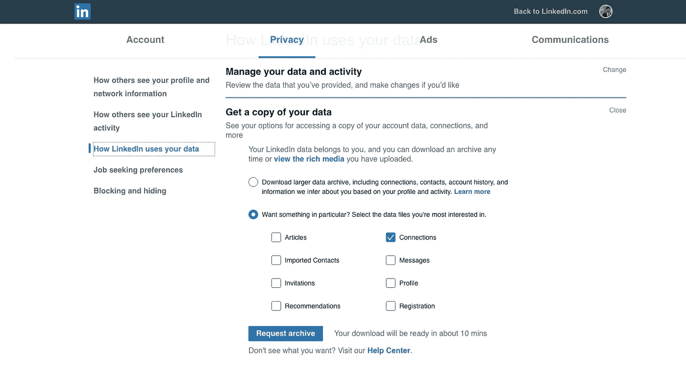
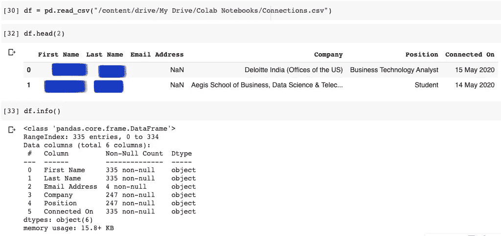
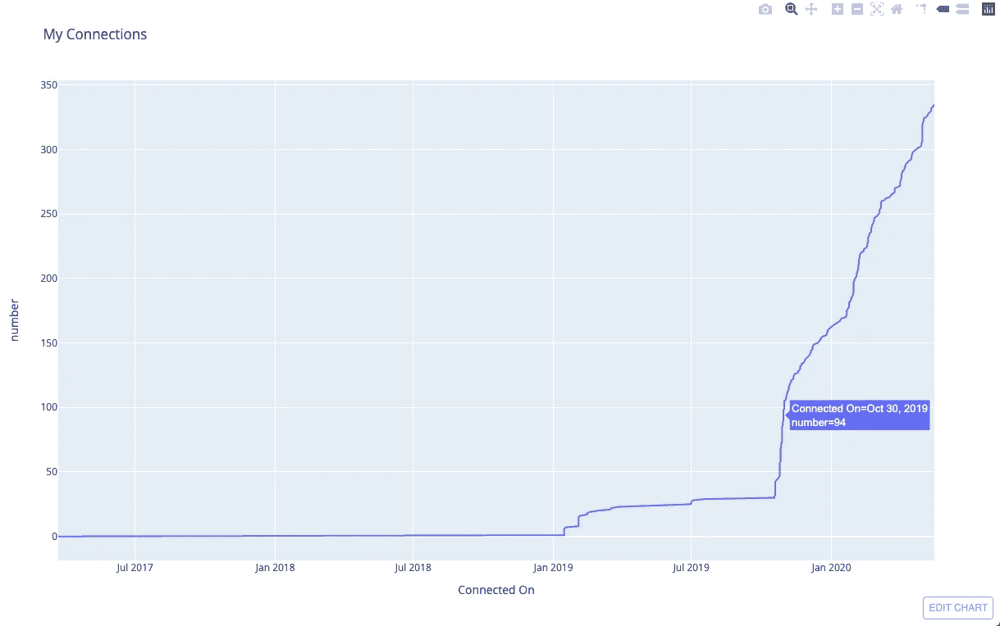
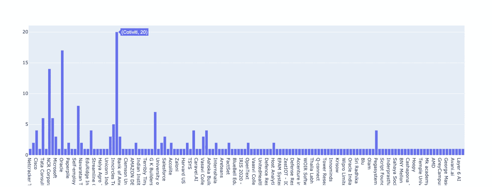
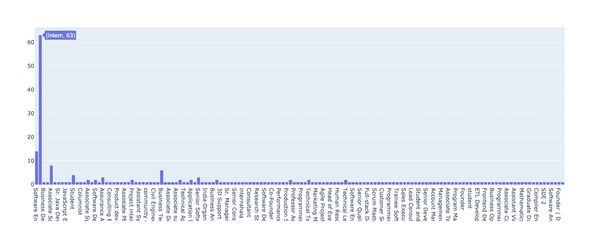
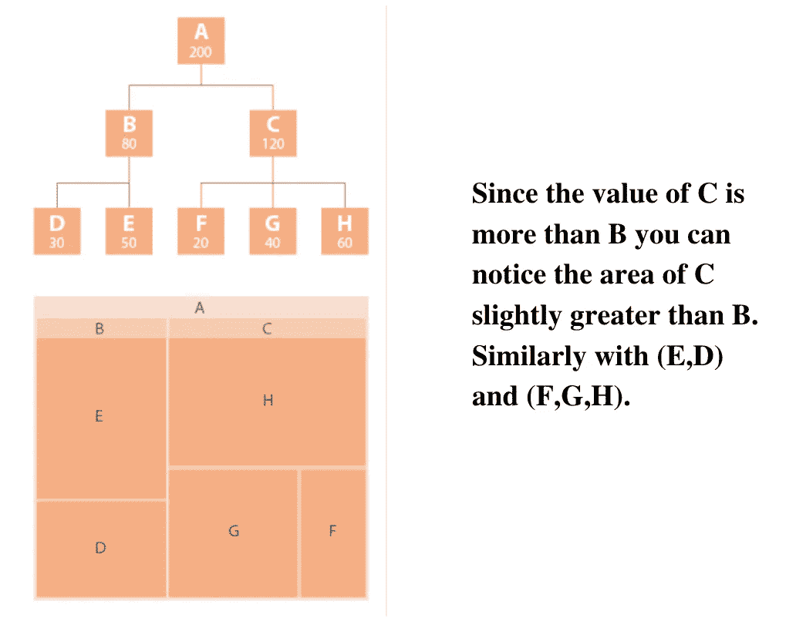

# 使用 Plotly 实现 Linkedin 网络可视化

> 原文：<https://towardsdatascience.com/linkedin-network-visualisation-using-plotly-9e1962247859?source=collection_archive---------60----------------------->

## 让我们想象一下我们的 Linkedin 联系，了解一下树形图。


使用 Canva 设计。

多年来，Linkedin 一直是建立人际网络和高端求职的首选平台。人们通过在这个平台上建立联系来获得他们梦想的工作和实习机会。我们大多数人在 Linkedin 上都有很多人脉。让我们试着想象这些联系。

我还认为 Linkedin 连接可视化是说明树形图用法的最佳案例。我们将使用 Pandas 库进行数据提取，使用 Plotly 库进行数据可视化。我发现 Plotly 是 Python 中最有用和最具交互性的绘图库之一。此外，Plotly 与 Dash Framework(用于构建网络应用)的集成能力使其更加独特。我们甚至可以在网上分享情节。

> **注意:本文中的树状图是交互式的。请查看 GIPHY 以了解交互性。**

# **导入数据**

Linkedin 连接数据的提取有两种方式。一个是 Linkedin API，它需要多个权限来访问数据，并且它的使用并不简单。另一种是直接下载。Linkedin 设置页面中的 csv 文件。



转到设置/隐私

让我们先来导入熊猫和 Plotly 库。

```
import pandas as pd
import plotly.express as px
import plotly.graph_objects as go
```

现在，让我们阅读从 LinkedIn 下载的连接文件，并尝试理解它的结构。



如上图所示，每一行都列出了名字、姓氏、电子邮件地址、公司、职位和入职日期。您还可以注意到总共有 335 行，这表明我有 335 个连接。可以注意到的一个异常是连接在列上的**的类型是一个对象，而不是类型日期。数据的排列方式也是最近的连接放在最前面，依此类推。**

现在让我们试着画一个曲线图来说明连接数的增长。时间。但是我们需要将数据框按日期升序排序，并绘制一个线图。

首先，让我们将连接在列上的**转换为日期类型，并通过按日期排序数据框来绘制一个线图。**

```
import datetimedef convert(date):
return datetime.datetime.strptime(date, "%d %b %Y").strftime("%Y-%m-%d")df["Connected On"] = df["Connected On"].apply(convert)
```

apply 函数对列上连接的**中的每个日期值应用函数 **convert** 。**

```
df=df.sort_values(by="Connected On")
```

让我们使用 Plotly 库绘制线图。

**注意——在绘制图之前，需要对数据框进行一些修改。一定要检查我的 GitHub 代码。本文末尾给出了链接。**

```
connections_line = px.line(df, x="Connected On", y="number", title='My Connections')connections_line.show()
```



正如我提到的，Plotly 以其交互特性而闻名，我们可以在上面的图中看到，当我们悬停在线上时，可以看到当天的确切日期和连接数。

# 公司和职位分析

现在，我们将从两个方面分析我们的联系。一个是描绘按公司分离的联系细节的公司方面的分析，另一个是描绘按职位分离的联系细节的职位方面的分析。

让我们绘制直方图来说明我们的关系在公司和职位方面的分布。

```
# Company wise histogram
fig = go.Figure()
fig.add_trace(go.Histogram(histfunc="count",  x=df["Company"]))
fig.show()# Position wise histogram
fig = go.Figure()
fig.add_trace(go.Histogram(histfunc="count",  x=df["Position"]))
fig.show()
```

`histfunc`参数将聚合函数作为参数。这里我们将`count`作为参数来计算 wrt 的行数。每个公司(确定每个独特价值的频率)。



当悬停在条形上时，我们可以注意到公司/职位名称及其相应的值被提及。

直方图的一个缺点是，我们无法在一个图中获得公司和职位的完整信息。因此，树状图出现了。

## 什么是树形图？

树形图用于描述层次结构。树形图由矩形组成，矩形的大小和顺序由一个量化变量决定。

每个类别被分配一个矩形，该类别中的子类别被表示为嵌套的矩形。每个矩形的大小与数量成正比。数量越多，矩形越大。例如，在上面的直方图中，我们看到 Cotiviti 在公司直方图中占据第一位，而 Intern 在职位直方图中占据第一位。因此，我们可以预期这两个值在树形图中具有最大的矩形。这里有另一个例子来清楚地理解一个树形图。



现在让我们根据公司和位置绘制一个树形图。由于 Plotly 是一个交互式库，我们也可以放大树状图的某些部分。

## **公司树形图**

我们将树层次传递给`px.treemap()`函数中的路径参数。

```
company_tree_map = px.treemap(df, path=['My Network', 'Company', 'Position'], width=1000, height=1000)company_tree_map.show()
```

我们可以注意到公司 **Cotiviti** 在树形图中占据了最大的面积(Cotiviti 在直方图中也有最高的值！).Plotly 中的 TreeMaps 的特点是，我们可以放大到某个子树，以便清楚地看到子矩形。在这个树形图中，子矩形是每个公司中的各种角色(仅在我的连接中)。我们还可以注意到，每当我们悬停时，我们可以看到两个属性。
1。`Parent` —表示相应矩形
2 的父矩形。`Id`——表示该矩形的层次结构。

## 位置树形图

```
position_tree_map = px.treemap(df, path=['My Network', 'Position', 'Company'], width=1000, height=1000)position_tree_map.show()
```

我们可以注意到**实习生**的位置在树形图中占据了最大的面积(实习生在直方图中也有最高的值！).这里的子矩形代表与每个职位相对应的各个公司。

完整的代码可以在 Github [这里](https://github.com/kurasaiteja/LinkedIn-Visualisaion-using-Plotly)找到。

# 结论

我使用 Plotly 库可视化了 Linkedin 网络，也觉得这是说明树形图用法的最佳用例。我希望你今天带回家一些概念。请随时分享反馈。呆在家里，注意安全！