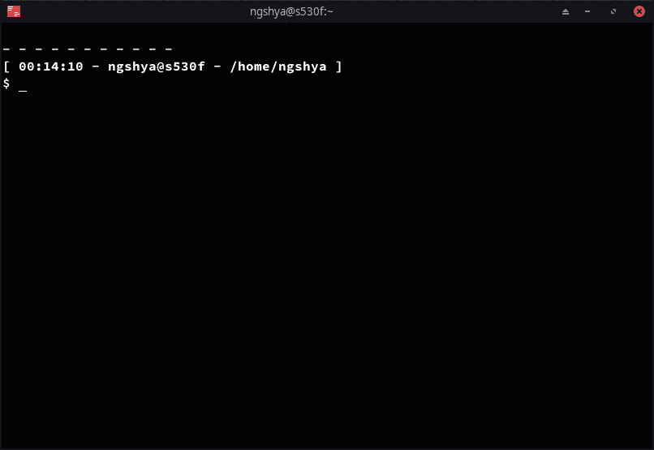

# 每个数据科学家都应该知道的基本 Linux 控制台命令

> 原文：<https://towardsdatascience.com/linux-console-commands-data-scientist-566744ef1fb0?source=collection_archive---------55----------------------->

## 对数据科学家最有用的终端命令列表:文件管理、系统管理和文本文件操作。

ata 科学家通常在安装了桌面环境、图形文件管理器和 IDE 的 Linux 机器上进行开发。然而，在许多情况下，终端命令更有效，或者可能发生图形界面不可用的情况:例如，当使用 SSH 连接到远程机器时，或者当通过 SSH 使用 [Colab GPU 实例时](/colab-free-gpu-ssh-visual-studio-code-server-36fe1d3c5243)。


图片作者。从 CMatrix 创建的矩阵屏幕。

在本文中，我们将为数据科学家列出**最有用的 Linux 控制台命令。这个列表还远未完成，但它是一个很好的起点！我们将列表分为三个部分:文件管理、系统监控和文本文件操作。**

开始之前，Linux 命令行的一些基础知识:

*   几乎每个 Linux 命令都有选项 **- help** ，它提供了对其功能的快速概述。
*   您可以使用 **CTRL+C** 和 **CTRL+Z** 来停止任何正在运行的命令。
*   用**历史**命令，可以得到过去命令的列表。
*   如果你想得到一个干净的窗口，只需使用**清除**。
*   当输入长文件名/文件夹名时，可以按**键**自动完成！
*   您可以运行多个命令，用“**分隔它们；**或同 **& &** 。如果使用了"& &"，那么只有左边的命令成功，才会执行右边的命令。

```
command1; command2; command3
command1 && command2 && command3
```

*   如果需要在后台留下一个进程，在命令的末尾加上“ **&** ”。当 shell 会话关闭时，后台进程将被终止。如果您需要一个长时间运行的进程，请在您的命令前面加上 **nohup** :

```
nohup python train_model.py &
```

*   您总是可以将命令的输出重定向到文本文件。如果要追加，使用 **> >** ，如果要覆盖文本文件的内容，使用 **>** :

```
command1 >> log.txt
command1 > log.txt
```

记住:**谷歌是你的朋友！**

## 数据科学家的基本 Linux 命令:文件管理

在本节中，我们将介绍文件管理最常用的终端命令。

找出当前工作目录的**绝对路径:**

```
**pwd**
```

要列出文件夹的内容:

```
**ls** path/of/the/folder
```

如果没有提供路径，那么将返回当前工作目录的内容。如果您需要更多信息(例如，权限、大小、所有者、隐藏文件)，您可以使用

```
**ls -al** path/of/the/folder
```

要更改当前工作目录:

```
**cd** new/folder/path
```

如果您想上移一个目录，只需使用:

```
**cd ..**
```

要创建新文件夹:

```
**mkdir** my_new_folder_name
```

要创建新的空文件:

```
**touch** my_new_file_name
```

要将文件从源路径复制到目标路径:

```
**cp** path/of/the/file destination/folder/path
```

移动文件的语法与 copy 命令的语法非常相似:

```
**mv** path/of/the/file destination/folder/path
```

要删除文件:

```
**rm** file_to_be_removed
```

如果你想删除一个文件夹，使用 **-r** 参数:

```
**rm -r** folder_to_be_removed
```

要创建压缩的归档文件:

```
**tar -zcvf** archive_name.tar.gz folder_to_be_compressed
```

并提取归档文件的内容:

```
**tar -zxvf** archive_name.tar.gz
```

从互联网下载文件:

```
**wget** [https://people.sc.fsu.edu/~jburkardt/data/csv/addresses.csv](https://people.sc.fsu.edu/~jburkardt/data/csv/addresses.csv)
```

## 数据科学家的基本 Linux 命令:系统管理

在本节中，我们提供了一些用于系统管理的有用的命令行工具。

要打开任务管理器，只需键入:

```
**top**
```

不是很花哨吧？你也可以使用更丰富多彩的版本:

```
**htop**
```


图片作者。htop 在行动！

一旦进入 htop，您可以使用箭头选择一个进程，然后按 F9 键终止它。您也可以通过键入以下命令仅列出特定用户的进程:

```
**htop -u** username
```

要退出 htop，只需键入 **q** 或**按下 **CTRL+C** 。**

如果我们只想知道内存使用情况呢？在这种情况下，我们可以使用:

```
**free -h**
```

要获取已挂载分区的使用情况:

```
**df -h**
```

要在不使用 htop 的情况下终止程序:

```
**pkill** program_name
```

并终止特定用户的每个进程:

```
**pkill -u** username
```

要了解 NVIDIA GPU 的使用情况:

```
**nvidia-smi**
```

或者，对于 GPU 使用的持续更新:

```
**watch -n 1 nvidia-smi**
```



图片作者。终端命令来监控您的 NVIDIA GPU。

注意 **watch -n 1** 每 1 秒运行 **nvidia-smi** 命令并显示输出，但是我们可以用我们想要的任何东西替换 nvidia-smi！举个例子，

```
watch -n 1 ls
```

通过每 1 秒钟打印一次内容来监控当前工作目录。要退出手表，使用 **CRTL+C** 。

获取工作目录中文件和文件夹(包括子文件夹)的大小:

```
**du -sch .[!.]* * | sort -h**
```

## 数据科学家的基本 Linux 命令:文本文件操作

在本节中，我们列出了一些基本的文本文件操作命令。

要打印文本文件的内容:

```
**cat** example.csv
```

然而，大多数时候我们只想得到一个文本文件的前 *n* 行，在这种情况下，我们可以使用

```
**head -n 10** example.csv 
```

获取 example.csv 文件的前 10 行。同样，我们也可以获取最后 10 行:

```
**tail -n 10** example.csv
```

假设各列由逗号分隔，那么我们可以用以下公式提取第一列和第三列:

```
**cut -d"," -f1,3** example.csv
```

当然，我们可以连接两个命令！例如，与

```
head -n 2 example.csv | cut -d"," -f1,3
```

我们打印 example.csv 文件的前 2 行和第 1、3 列。符号“|”执行**管道**操作:它将左边命令的输出作为输入传递给右边的命令。使用管道操作的另一个例子是，当我们想要过滤带有特定字符串的命令输出时。例如，我们可能对名称中包含字符串“TRAIN_SET”的文件感兴趣，那么我们可以键入:

```
**ls -al** | **grep** TRAIN_SET
```

如果我们使用 **cat** 而不是 **ls** ，我们基本上是在过滤文本文件的行:

```
**cat** example.csv | **grep** TRAIN_SET
```

如果文本文件很大，我们可以用以下方法计算行数:

```
**wc -l** example.csv 
```

我们也可以使用以下命令逐行阅读:

```
**less** example.csv
```

如果你需要编辑一个文本文件，那么编辑[**纳米**](https://www.nano-editor.org/)**就是你的朋友:**

```
**nano** addresses.csv
```

****

**图片作者。用 nano 编辑器编辑文本文件。**

**要比较两个不同的文件:**

```
**diff** first_file.py second_file.py
```

## **奖金**

**在 Linux 终端观看**星球大战**:**

```
telnet towel.blinkenlights.nl
```

****

**图片作者。从终端观看星球大战。**

**联系人: [LinkedIn](https://www.linkedin.com/in/shuyiyang/) | [Twitter](https://twitter.com/deltarule)**