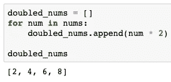
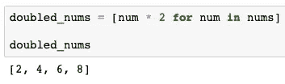

# 为数据科学家列出理解

> 原文：<https://towardsdatascience.com/list-comprehensions-for-data-scientists-1055d1121685?source=collection_archive---------57----------------------->

## 5 分钟指南，列出 python 中的理解以及为什么应该使用它们。


图片由来自[皮克斯拜](https://pixabay.com/?utm_source=link-attribution&utm_medium=referral&utm_campaign=image&utm_content=540812)的[弗兰克·温克勒](https://pixabay.com/users/FrankWinkler-64960/?utm_source=link-attribution&utm_medium=referral&utm_campaign=image&utm_content=540812)拍摄

**简介**

如果你是一个 python 程序员，你可能喜欢列表理解，并且在你的代码中经常使用它们。然而，我注意到许多初级数据科学家不知道什么是列表理解，或者对如何正确使用它们感到困惑。

> 这篇文章旨在解释什么是列表理解以及为什么你应该使用它们。
> 
> 它还会给你一些实际的例子，在这些例子中可以使用列表理解。

什么是列表理解，为什么你应该使用它们？

**列表理解**是一行代码，允许你从可重复项中创建列表(例如列表)。

你还记得你创建的遍历列表的循环吗？在某些情况下，它们可以被列表理解所代替，让我们来看一个例子。

假设您有一个数字列表，并且您想将列表中的每个元素乘以数字 2。下面你会看到两种不同的操作方式。

```
nums = [1, 2, 3, 4]
```



传统 for 循环



列表理解

第一段代码使用传统的 for 循环编写，第二段代码使用 list comprehension 编写。

> 那么你更喜欢传统循环还是列表理解版本呢？

我认为很明显，第二段代码更干净，看起来更优雅，也像有些人说的那样更 pythonic 化’。这些应该是使用列表理解而不是传统 for 循环的足够理由。

此外，列表理解通常会执行得更快，使用的内存更少！

**列表理解语法**

让我们更仔细地看看一个基本的列表理解语法。


1.  首先，注意整个表达式在方括号[ ]中。
2.  在方括号([)之后，我们有一个应用于列表中每个元素的表达式:num * 2。
3.  接下来是写在同一行的循环:for num in nums。
4.  有一个括号结束整个表达式(])。
5.  仅此而已！

> 简单，不是吗？

这就是为什么列表理解如此受程序员欢迎，优雅，简单，简洁。

**用条件列出理解**

您已经学习了基本的列表理解语法，但是还有一些额外的语法可以用来过滤正在创建的列表。您可以在 for 循环之后添加 if 语句，以包含新列表元素必须满足的条件。

让我们看一些例子:

*   **一个条件**

```
nums = [1, 2, 3, 4]doubled_nums = [num * 2 for num in nums if num % 2 == 0][4, 8]
```

这里我们有我们以前的例子，但它略有修改。我们在 for 循环后添加了一个条件，规定我们从初始列表中取出的数字必须能被 2 整除。

这是通过添加以下条件实现的:num % 2 == 0。

如你所见，结果列表中只有两个元素，因为我们只保留了初始列表中的偶数。

*   **双条件**

你可以有一个以上的条件。在这种情况下，可以使用*和*运算符组合多个条件。

```
nums = [1, 2, 3, 4]doubled_nums = [num * 2 for num in nums if num % 2 == 0 and num > 3][8]
```

这里我们过滤我们的列表，只包括能被 2 整除且大于 3 的数字。

过滤的结果只有一个数字:4。然后这个数字乘以 2，我们得到一个元素列表:[8]。

**用嵌套循环列出理解**

现在你已经学习了基本的语法，你知道如何过滤列表，我们将学习如何使用一个额外的循环。这将允许我们使用嵌套列表。

> 是的，列表理解可以通过使用嵌套循环来处理嵌套列表！！！

假设您有一个列表列表:

```
nested_list = [[1,2], [3,4], [4,5]]
```

现在你想把所有的元素都取出来放在一个列表中。这被称为展平列表。

```
flattened_list = [item for sublist in nested_list for item in sublist][1, 2, 3, 4, 4, 5]
```

你能看到我们是如何嵌套循环的吗？顺序与传统循环相同。下面是用传统 for 循环语法编写的相同代码:

```
flattened_list = []
for sublist in nested_list:
    for item in sublist:
        flattened_list.append(item)[1, 2, 3, 4, 4, 5]
```

**用其他可重复项列出理解**

到目前为止，你一直在使用基于一些初始列表的列表理解。好消息是，与传统循环一样，底层数据不需要是列表。它实际上可以是任何可迭代的 python 对象。

这就是列表理解如此强大的原因。让我们看看例子:

*   **用字符串列出理解**

```
string = 'boat'
letters = [letter for letter in string]letters['b', 'o', 'a', 't']
```

上面的代码列出了字符串“boat”中的所有字母。

*   **用字典列出理解**

```
numbers_dictionary = {1: 'one', 2: 'two', 3: 'three'}multiplied_keys = [k * 2 for (k,v) in numbers_dictionary.items()]multiplied_keys
[2, 4, 6]
```

上面的代码创建了一个列表，其中包含所有乘以系数 2 的字典键。

什么时候不使用列表理解？

我们已经谈了很多关于列表理解的优点，但是有没有什么时候你不应该使用它们呢？

答案是:可以。

如果代码太复杂，把所有东西都放在一行代码中并不是最好的选择，即使这样做是可行的。

你应该追求可读性，如果有太多的操作要做，列表的理解会看起来很混乱，很难阅读。在这种情况下，您应该使用传统的循环。

**总结和行动要求**

现在你知道列表理解的力量了。是时候采取行动挑战自己了。

从现在起，每当你要使用和老式的循环，停止，并使用列表理解代替！

*最初发表于 aboutdatablog.com:* [数据科学家清单理解](https://www.aboutdatablog.com/post/list-comprehensions-for-data-scientists)，*2020 年 7 月 8 日。*

*PS:我正在 Medium 和*[***aboutdatablog.com***](https://www.aboutdatablog.com/)*上撰写以简单易懂的方式解释基本数据科学概念的文章。你可以订阅我的* [***邮件列表***](https://medium.com/subscribe/@konkiewicz.m) *在我每次写新文章的时候得到通知。如果你还不是中等会员，你可以在这里加入*[](https://medium.com/@konkiewicz.m/membership)**。**

*下面还有一些你可能喜欢的帖子*

*[](/pandas-data-manipulation-functions-7b3519fc1370) [## Pandas 数据操作函数:apply()、map()和 applymap()

### 以及如何在熊猫身上正确使用它们…

towardsdatascience.com](/pandas-data-manipulation-functions-7b3519fc1370) [](/9-pandas-visualizations-techniques-for-effective-data-analysis-fc17feb651db) [## 9 熊猫有效数据分析的可视化技术

### 学习如何使用折线图、散点图、直方图、箱线图和其他一些可视化技术

towardsdatascience.com](/9-pandas-visualizations-techniques-for-effective-data-analysis-fc17feb651db) [](/jupyter-notebook-autocompletion-f291008c66c) [## Jupyter 笔记本自动完成

### 数据科学家的最佳生产力工具，如果您还没有使用它，您应该使用它…

towardsdatascience.com](/jupyter-notebook-autocompletion-f291008c66c) [](/top-9-jupyter-notebook-extensions-7a5d30269bc8) [## 9 大 Jupyter 笔记本扩展

### 改进笔记本电脑功能，提高您的工作效率

towardsdatascience.com](/top-9-jupyter-notebook-extensions-7a5d30269bc8)*